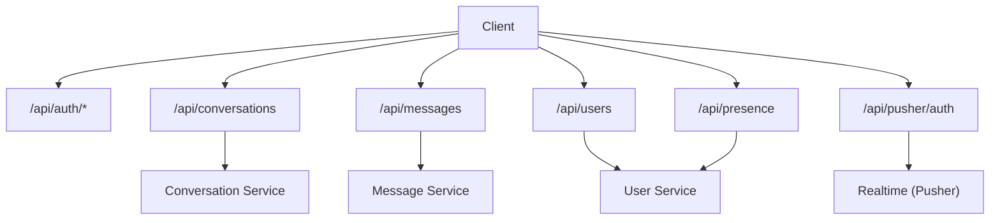
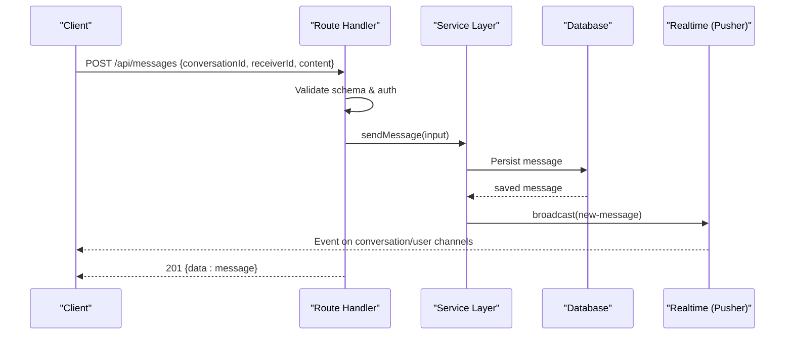
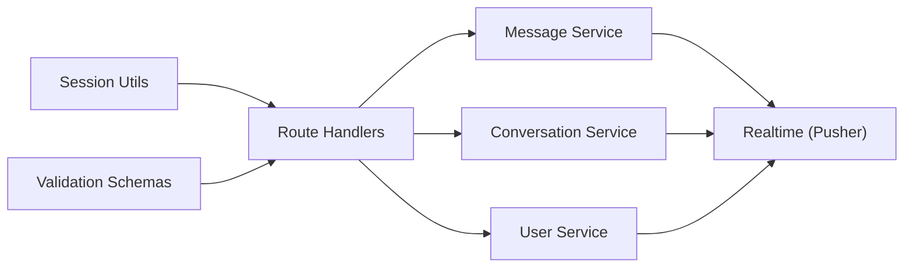

# API Reference

<cite>
**Referenced Files in This Document**
- [route.ts](file://app\api\auth\[...all]\route.ts)
- [route.ts](file://app\api\conversations\route.ts)
- [route.ts](file://app\api\conversations\[id]\messages\route.ts)
- [route.ts](file://app\api\conversations\[id]\read\route.ts)
- [route.ts](file://app\api\conversations\[id]\typing\route.ts)
- [route.ts](file://app\api\messages\route.ts)
- [route.ts](file://app\api\presence\route.ts)
- [route.ts](file://app\api\users\route.ts)
- [route.ts](file://app\api\pusher\auth\route.ts)
- [message.ts](file://lib\validations\message.ts)
- [auth-utils.ts](file://lib\auth-utils.ts)
- [conversation.service.ts](file://lib\services\conversation.service.ts)
- [message.service.ts](file://lib\services\message.service.ts)
- [user.service.ts](file://lib\services\user.service.ts)
- [index.ts](file://lib\realtime\index.ts)
- [index.ts](file://types\index.ts)
</cite>

## Table of Contents
1. Introduction
2. Project Structure
3. Core Components
4. Architecture Overview
5. Detailed Component Analysis
6. Dependency Analysis
7. Performance Considerations
8. Troubleshooting Guide
9. Conclusion
10. Appendices

## Introduction
This document provides a comprehensive API reference for SecureChat’s REST endpoints. It covers authentication, conversation management, message operations, user management, presence updates, and Pusher channel authorization. For each endpoint you will find HTTP methods, URL patterns, request/response schemas, authentication requirements, status codes, error handling, and usage guidance. Realtime behavior via Pusher is also documented where it impacts API semantics.

## Project Structure
SecureChat exposes Next.js Route Handlers under app/api that implement the REST API. Authentication is handled by a unified handler. Business logic lives in service modules under lib/services, with validation schemas in lib/validations and realtime transport in lib/realtime. Shared data models are defined in types/index.ts.

**Diagram sources**
- [route.ts:1-5](file://app\api\auth\[...all]\route.ts#L1-L5)
- [route.ts:1-81](file://app\api\conversations\route.ts#L1-L81)
- [route.ts:1-51](file://app\api\messages\route.ts#L1-L51)
- [route.ts:1-62](file://app\api\users\route.ts#L1-L62)
- [route.ts:1-51](file://app\api\presence\route.ts#L1-L51)
- [route.ts:1-63](file://app\api\pusher\auth\route.ts#L1-L63)
- [conversation.service.ts:1-236](file://lib\services\conversation.service.ts#L1-L236)
- [message.service.ts:1-165](file://lib\services\message.service.ts#L1-L165)
- [user.service.ts:1-108](file://lib\services\user.service.ts#L1-L108)
- [index.ts:1-79](file://lib\realtime\index.ts#L1-L79)

**Section sources**
- [route.ts:1-5](file://app\api\auth\[...all]\route.ts#L1-L5)
- [route.ts:1-81](file://app\api\conversations\route.ts#L1-L81)
- [route.ts:1-51](file://app\api\messages\route.ts#L1-L51)
- [route.ts:1-62](file://app\api\users\route.ts#L1-L62)
- [route.ts:1-51](file://app\api\presence\route.ts#L1-L51)
- [route.ts:1-63](file://app\api\pusher\auth\route.ts#L1-L63)

## Core Components
- Authentication: A catch-all route delegates to the auth provider; all other routes require an authenticated session.
- Conversations: Create/find one-to-one conversations and list them for the current user.
- Messages: Send messages, fetch history, and mark as read.
- Users: Search users and update profile fields.
- Presence: Heartbeat to update online status and notify relevant users.
- Realtime: Pusher-based event delivery for new messages, read receipts, typing indicators, and presence changes.

Authentication is enforced server-side using session utilities; client code must maintain a valid session when calling any protected endpoint.

**Section sources**
- [auth-utils.ts:1-21](file://lib\auth-utils.ts#L1-L21)
- [route.ts:1-81](file://app\api\conversations\route.ts#L1-L81)
- [route.ts:1-51](file://app\api\messages\route.ts#L1-L51)
- [route.ts:1-62](file://app\api\users\route.ts#L1-L62)
- [route.ts:1-51](file://app\api\presence\route.ts#L1-L51)
- [index.ts:1-79](file://lib\realtime\index.ts#L1-L79)

## Architecture Overview
The API follows a layered design:
- Routes validate input and enforce permissions.
- Services encapsulate business logic and database access.
- Realtime layer publishes events to Pusher channels.

**Diagram sources**
- [route.ts:1-51](file://app\api\messages\route.ts#L1-L51)
- [message.service.ts:1-165](file://lib\services\message.service.ts#L1-L165)
- [index.ts:1-79](file://lib\realtime\index.ts#L1-L79)

## Detailed Component Analysis

### Authentication
- Endpoint: GET/POST /api/auth/*
- Purpose: Unified authentication flow delegated to the auth provider.
- Notes: All other endpoints rely on a valid session obtained through this flow.

**Section sources**
- [route.ts:1-5](file://app\api\auth\[...all]\route.ts#L1-L5)

### Conversations
- List conversations
  - Method: GET
  - Path: /api/conversations
  - Auth: Required
  - Response: Array of conversations including otherUser, lastMessage, unreadCount
  - Errors: 401 Unauthorized, 500 Internal server error

- Create/find conversation
  - Method: POST
  - Path: /api/conversations
  - Auth: Required
  - Request body: { otherUserId: string }
  - Validation: otherUserId required
  - Behavior: Ensures exactly one conversation per user pair; returns full conversation object
  - Status codes: 201 Created, 400 Bad Request (invalid or self-conversation), 404 Not Found (other user not found), 401 Unauthorized, 500 Internal server error

- Get messages in a conversation
  - Method: GET
  - Path: /api/conversations/{id}/messages
  - Query: ?markRead=true|false (default true)
  - Auth: Required
  - Authorization: Must be a participant
  - Response: Array of messages
  - Side effect: When markRead is true, marks unread messages as read for the current user
  - Status codes: 200 OK, 401 Unauthorized, 403 Forbidden, 500 Internal server error

- Mark messages as read
  - Method: POST
  - Path: /api/conversations/{id}/read
  - Auth: Required
  - Authorization: Must be a participant
  - Response: { data: { messageIds: string[] } }
  - Status codes: 200 OK, 401 Unauthorized, 403 Forbidden, 500 Internal server error

- Typing indicator
  - Method: GET
    - Path: /api/conversations/{id}/typing
    - Auth: Required
    - Authorization: Must be a participant
    - Response: { data: { typing: boolean } }
    - Status codes: 200 OK, 401 Unauthorized, 403 Forbidden, 500 Internal server error
  - Method: POST
    - Path: /api/conversations/{id}/typing
    - Auth: Required
    - Authorization: Must be a participant
    - Request body: { typing: boolean }
    - Behavior: Persists typing state and broadcasts typing/stop-typing event to the conversation channel
    - Response: { data: { typing: boolean } }
    - Status codes: 200 OK, 401 Unauthorized, 403 Forbidden, 500 Internal server error

Request/Response Schemas
- Conversation list item: id, createdAt, updatedAt, otherUser, lastMessage, unreadCount
- Message: id, conversationId, senderId, receiverId, content, isRead, readAt, createdAt, sender (optional)
- PublicUser: id, name, username, email, image, isOnline, lastSeen

Error Handling
- 400: Invalid request payload or invalid parameters
- 401: Missing or invalid session
- 403: Not a participant
- 404: Resource not found
- 500: Server errors

Best Practices
- Always pass the authenticated session cookie/token from your client.
- Use ?markRead=false when polling to avoid rewriting rows repeatedly.
- Respect rate limits if configured at the platform level.

**Section sources**
- [route.ts:1-81](file://app\api\conversations\route.ts#L1-L81)
- [route.ts:1-43](file://app\api\conversations\[id]\messages\route.ts#L1-L43)
- [route.ts:1-33](file://app\api\conversations\[id]\read\route.ts#L1-L33)
- [route.ts:1-83](file://app\api\conversations\[id]\typing\route.ts#L1-L83)
- [conversation.service.ts:1-236](file://lib\services\conversation.service.ts#L1-L236)
- [message.service.ts:1-165](file://lib\services\message.service.ts#L1-L165)
- [message.ts:1-40](file://lib\validations\message.ts#L1-L40)
- [index.ts:1-118](file://types\index.ts#L1-L118)

### Messages
- Send message
  - Method: POST
  - Path: /api/messages
  - Auth: Required
  - Request body: { conversationId: string, receiverId: string, content: string }
  - Validation: conversationId, receiverId, content required; content length limited
  - Security: Sender identity is derived from session; client-provided senderId is ignored
  - Authorization: Must be a participant in the conversation
  - Response: { data: message }
  - Status codes: 201 Created, 400 Bad Request, 401 Unauthorized, 403 Forbidden, 500 Internal server error
  - Realtime: Broadcasts new-message to conversation and user channels

Error Scenarios
- Empty or too long content
- Invalid IDs
- Not a participant
- Database or realtime delivery failures (logged, non-fatal for persistence)

Integration Notes
- After sending, clients should listen for new-message events to update UI in real time.
- If realtime is disabled, clients can poll /api/conversations/{id}/messages with ?markRead=false.

**Section sources**
- [route.ts:1-51](file://app\api\messages\route.ts#L1-L51)
- [message.service.ts:1-165](file://lib\services\message.service.ts#L1-L165)
- [message.ts:1-40](file://lib\validations\message.ts#L1-L40)
- [index.ts:1-79](file://lib\realtime\index.ts#L1-L79)

### Users
- Search users
  - Method: GET
  - Path: /api/users?q={query}
  - Auth: Required
  - Query: q (required, max length)
  - Response: Array of public user profiles
  - Status codes: 200 OK, 400 Bad Request, 401 Unauthorized, 500 Internal server error

- Update profile
  - Method: PATCH
  - Path: /api/users
  - Auth: Required
  - Request body: { name?: string, username?: string }
  - Validation: name optional, min/max lengths; username optional, alphanumeric + underscore, min/max lengths
  - Response: Updated public user profile
  - Status codes: 200 OK, 400 Bad Request, 404 Not Found, 401 Unauthorized, 500 Internal server error

Best Practices
- Sanitize inputs on the client side but always rely on server validation.
- Avoid frequent profile updates; batch changes if possible.

**Section sources**
- [route.ts:1-62](file://app\api\users\route.ts#L1-L62)
- [user.service.ts:1-108](file://lib\services\user.service.ts#L1-L108)
- [message.ts:1-40](file://lib\validations\message.ts#L1-L40)

### Presence
- Update presence
  - Method: POST
  - Path: /api/presence
  - Auth: Required
  - Request body: { isOnline?: boolean } (defaults to true if omitted)
  - Behavior: Updates online status and lastSeen; notifies conversation partners via realtime
  - Response: { data: { isOnline: boolean } }
  - Status codes: 200 OK, 401 Unauthorized, 500 Internal server error

Notes
- The server throttles notifications based on recent online status to reduce churn.
- Clients should send periodic heartbeats to keep presence accurate.

**Section sources**
- [route.ts:1-51](file://app\api\presence\route.ts#L1-L51)
- [user.service.ts:1-108](file://lib\services\user.service.ts#L1-L108)
- [conversation.service.ts:1-236](file://lib\services\conversation.service.ts#L1-L236)

### Realtime Channel Authorization
- Authorize private channel subscription
  - Method: POST
  - Path: /api/pusher/auth
  - Auth: Required
  - Request: socket_id and channel_name (JSON or form)
  - Behavior: Validates channel type and user permissions; returns Pusher authorization response
  - Status codes: 200 OK, 400 Bad Request, 401 Unauthorized, 403 Forbidden, 503 Service Unavailable (realtime not configured), 500 Internal server error

Channel Rules
- user-{userId}: Only authorized if userId matches the current user
- conversation-{conversationId}: Authorized only if the current user is a participant

**Section sources**
- [route.ts:1-63](file://app\api\pusher\auth\route.ts#L1-L63)
- [index.ts:1-79](file://lib\realtime\index.ts#L1-L79)

## Dependency Analysis
The API depends on:
- Session utilities for authentication
- Validation schemas for input correctness
- Services for business logic and data access
- Realtime module for event broadcasting

**Diagram sources**
- [auth-utils.ts:1-21](file://lib\auth-utils.ts#L1-L21)
- [message.ts:1-40](file://lib\validations\message.ts#L1-L40)
- [conversation.service.ts:1-236](file://lib\services\conversation.service.ts#L1-L236)
- [message.service.ts:1-165](file://lib\services\message.service.ts#L1-L165)
- [user.service.ts:1-108](file://lib\services\user.service.ts#L1-L108)
- [index.ts:1-79](file://lib\realtime\index.ts#L1-L79)

**Section sources**
- [auth-utils.ts:1-21](file://lib\auth-utils.ts#L1-L21)
- [message.ts:1-40](file://lib\validations\message.ts#L1-L40)
- [conversation.service.ts:1-236](file://lib\services\conversation.service.ts#L1-L236)
- [message.service.ts:1-165](file://lib\services\message.service.ts#L1-L165)
- [user.service.ts:1-108](file://lib\services\user.service.ts#L1-L108)
- [index.ts:1-79](file://lib\realtime\index.ts#L1-L79)

## Performance Considerations
- Pagination/Limits: Message retrieval uses a default limit; tune as needed for large histories.
- Read marking: Use ?markRead=false during polling to avoid unnecessary writes.
- Presence heartbeat: Implement reasonable intervals to balance accuracy and load.
- Realtime fallback: If Pusher is unavailable, clients should fall back to polling without breaking core functionality.
- Rate limiting: Apply platform-level rate limiting to protect endpoints under heavy load.

[No sources needed since this section provides general guidance]

## Troubleshooting Guide
Common issues and resolutions:
- 401 Unauthorized: Ensure a valid session exists before calling protected endpoints.
- 403 Forbidden: Verify the caller is a participant in the conversation or owns the user channel.
- 400 Bad Request: Check request payloads against validation schemas (e.g., required fields, lengths).
- 503 Service Unavailable: Realtime features require Pusher configuration; otherwise, use polling.
- 500 Internal server error: Review server logs for stack traces and database connectivity issues.

Operational tips:
- Log failed realtime broadcasts without failing requests.
- Use search params like ?markRead=false to reduce write amplification.
- Monitor presence heartbeats and adjust intervals based on traffic.

**Section sources**
- [route.ts:1-81](file://app\api\conversations\route.ts#L1-L81)
- [route.ts:1-51](file://app\api\messages\route.ts#L1-L51)
- [route.ts:1-62](file://app\api\users\route.ts#L1-L62)
- [route.ts:1-51](file://app\api\presence\route.ts#L1-L51)
- [route.ts:1-63](file://app\api\pusher\auth\route.ts#L1-L63)

## Conclusion
SecureChat’s API provides a secure, validated, and extensible foundation for chat applications. Endpoints cover the full lifecycle of conversations, messages, users, and presence, with robust error handling and optional realtime enhancements via Pusher. Follow the authentication and authorization rules, respect validation constraints, and leverage realtime events for responsive UX while maintaining reliable fallbacks.

[No sources needed since this section summarizes without analyzing specific files]

## Appendices

### Authentication Requirements
- All protected endpoints require a valid session established via /api/auth/*.
- Session resolution is performed server-side; do not trust client-supplied identities.

**Section sources**
- [auth-utils.ts:1-21](file://lib\auth-utils.ts#L1-L21)
- [route.ts:1-5](file://app\api\auth\[...all]\route.ts#L1-L5)

### Data Models
- PublicUser: id, name, username, email, image, isOnline, lastSeen
- Message: id, conversationId, senderId, receiverId, content, isRead, readAt, createdAt, sender (optional)
- Conversation: id, createdAt, updatedAt, otherUser, lastMessage, unreadCount

**Section sources**
- [index.ts:1-118](file://types\index.ts#L1-L118)

### Error Codes Summary
- 200 OK: Successful operation
- 201 Created: Resource created successfully
- 400 Bad Request: Invalid input or parameters
- 401 Unauthorized: Missing or invalid session
- 403 Forbidden: Insufficient permissions
- 404 Not Found: Resource does not exist
- 500 Internal server error: Unexpected server failure
- 503 Service Unavailable: Realtime not configured

**Section sources**
- [route.ts:1-81](file://app\api\conversations\route.ts#L1-L81)
- [route.ts:1-51](file://app\api\messages\route.ts#L1-L51)
- [route.ts:1-62](file://app\api\users\route.ts#L1-L62)
- [route.ts:1-51](file://app\api\presence\route.ts#L1-L51)
- [route.ts:1-63](file://app\api\pusher\auth\route.ts#L1-L63)

### Integration Examples

Server-side usage pattern
- Authenticate via /api/auth/* to obtain a session.
- Call /api/conversations to list or create conversations.
- Send messages via /api/messages and listen for realtime events.
- Update presence periodically via /api/presence.
- Authorize Pusher channels via /api/pusher/auth before subscribing.

Client-side usage pattern
- Maintain session cookies/tokens across requests.
- On message send, handle 201 and update UI optimistically; reconcile with realtime events.
- Poll /api/conversations/{id}/messages?markRead=false for fallback when realtime is unavailable.
- Subscribe to Pusher channels after authorizing via /api/pusher/auth.

[No sources needed since this section provides general guidance]