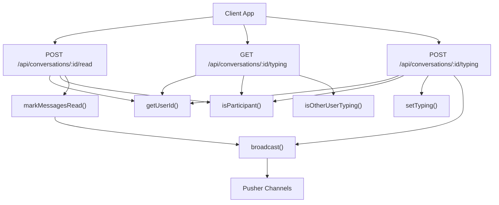
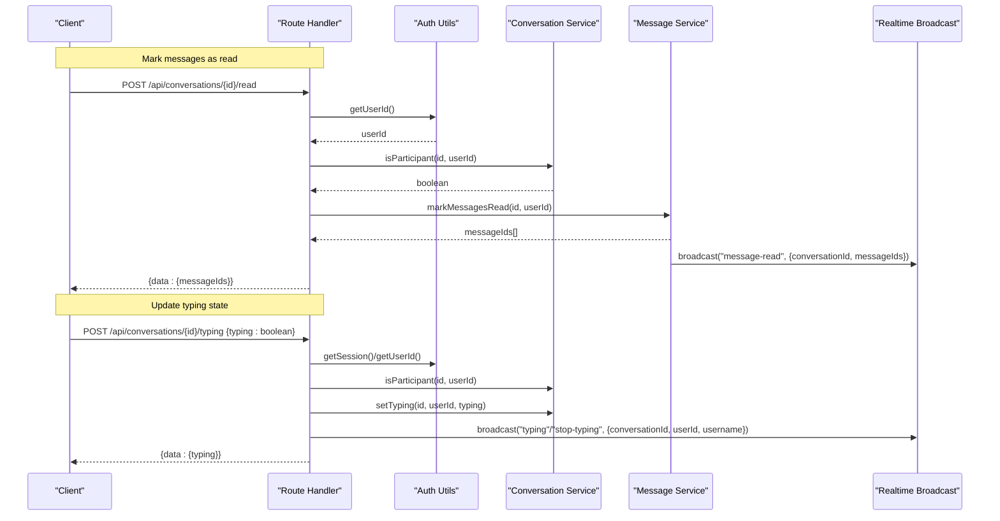
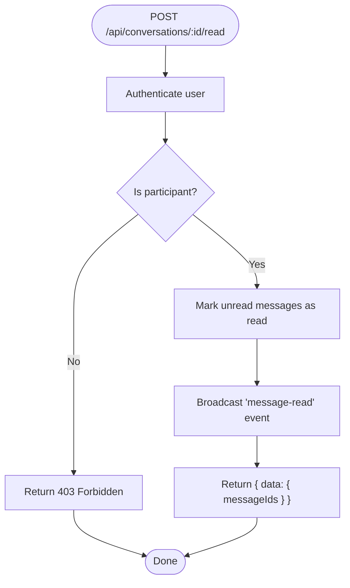
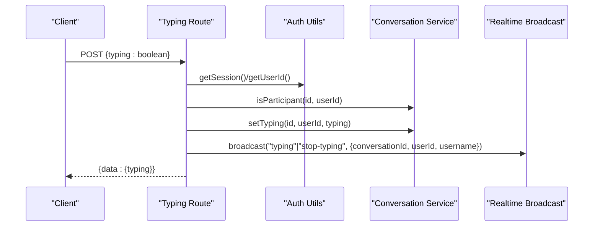
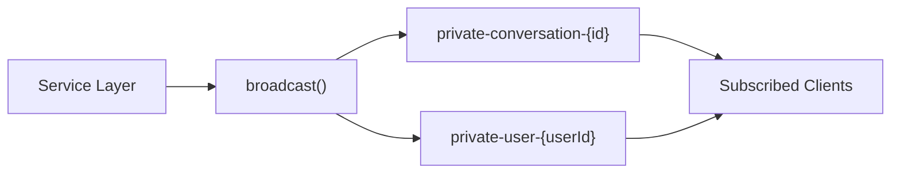
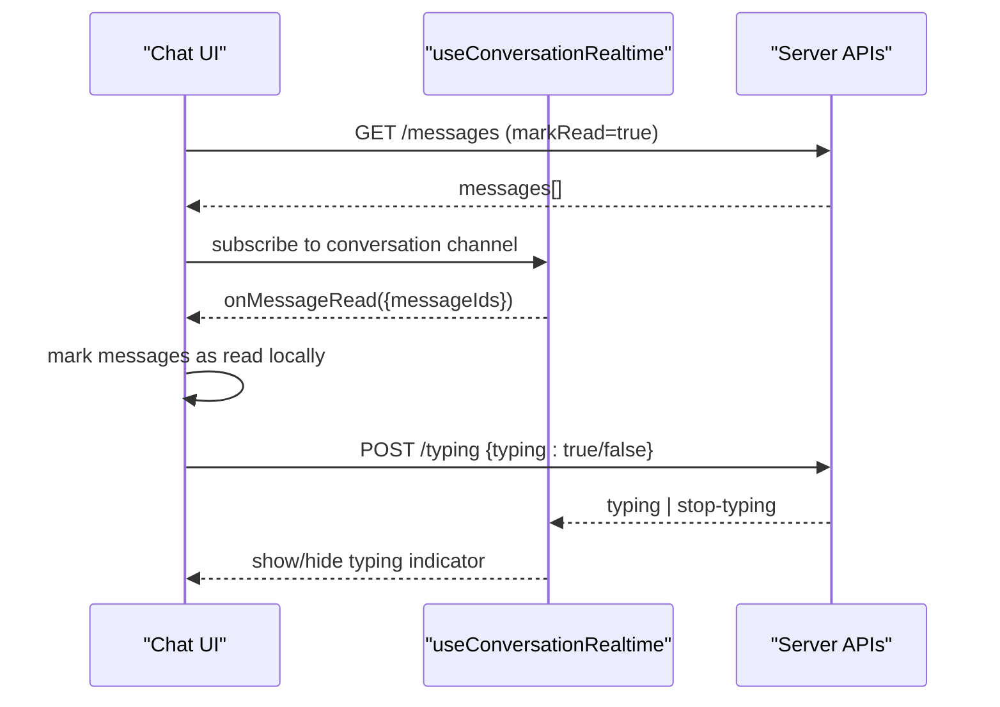
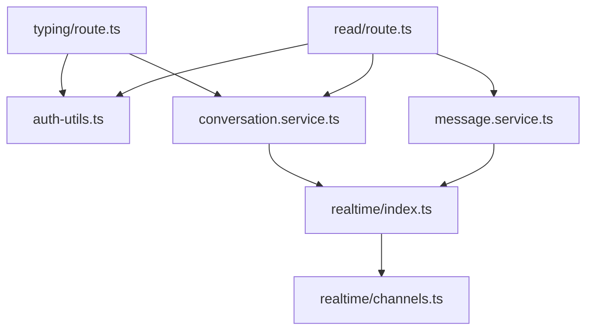

# Conversation Management API

<cite>
**Referenced Files in This Document**
- [route.ts](file://app/api/conversations/[id]/read/route.ts)
- [route.ts](file://app/api/conversations/[id]/typing/route.ts)
- [message.service.ts](file://lib/services/message.service.ts)
- [conversation.service.ts](file://lib/services/conversation.service.ts)
- [index.ts](file://lib/realtime/index.ts)
- [channels.ts](file://lib/realtime/channels.ts)
- [auth-utils.ts](file://lib/auth-utils.ts)
- [auth.ts](file://lib/auth.ts)
- [index.ts](file://types/index.ts)
- [useRealtime.ts](file://hooks/useRealtime.ts)
- [ChatArea.tsx](file://components/chat/ChatArea.tsx)
</cite>

## Table of Contents
1. Introduction
2. Project Structure
3. Core Components
4. Architecture Overview
5. Detailed Component Analysis
6. Dependency Analysis
7. Performance Considerations
8. Troubleshooting Guide
9. Conclusion
10. Appendices

## Introduction
This document provides detailed API documentation for conversation state management endpoints focused on read receipts and typing indicators. It covers:
- Marking messages as read within a conversation
- Tracking and broadcasting typing events
- Authentication and authorization requirements
- Real-time synchronization via Pusher Channels with polling fallbacks
- Error handling and performance considerations for high-frequency typing updates

## Project Structure
The relevant endpoints are implemented as Next.js Route Handlers under the conversations resource, backed by service functions and real-time broadcasting utilities.

**Diagram sources**
- [route.ts:10-31](file://app/api/conversations/[id]/read/route.ts#L10-L31)
- [route.ts:14-35](file://app/api/conversations/[id]/typing/route.ts#L14-L35)
- [route.ts:42-81](file://app/api/conversations/[id]/typing/route.ts#L42-L81)
- [message.service.ts:139-164](file://lib/services/message.service.ts#L139-L164)
- [conversation.service.ts:157-170](file://lib/services/conversation.service.ts#L157-L170)
- [conversation.service.ts:202-235](file://lib/services/conversation.service.ts#L202-L235)
- [index.ts:63-78](file://lib/realtime/index.ts#L63-L78)

**Section sources**
- [route.ts:10-31](file://app/api/conversations/[id]/read/route.ts#L10-L31)
- [route.ts:14-35](file://app/api/conversations/[id]/typing/route.ts#L14-L35)
- [route.ts:42-81](file://app/api/conversations/[id]/typing/route.ts#L42-L81)
- [message.service.ts:139-164](file://lib/services/message.service.ts#L139-L164)
- [conversation.service.ts:157-170](file://lib/services/conversation.service.ts#L157-L170)
- [conversation.service.ts:202-235](file://lib/services/conversation.service.ts#L202-L235)
- [index.ts:63-78](file://lib/realtime/index.ts#L63-L78)

## Core Components
- Authentication and session retrieval:
  - Session-based authentication using Better Auth; server-side helpers extract the current user id or throw Unauthorized when missing.
- Authorization:
  - Each endpoint validates that the caller is a participant in the target conversation before performing any operation.
- Read receipts:
  - Batch mark unread messages as read for the current user and broadcast a message-read event to update senders’ UI in real time.
- Typing indicators:
  - Store transient typing state per participant with a TTL and expose both GET (polling fallback) and POST (update + broadcast) endpoints.

**Section sources**
- [auth-utils.ts:7-20](file://lib/auth-utils.ts#L7-L20)
- [auth.ts:1-65](file://lib/auth.ts#L1-L65)
- [conversation.service.ts:157-170](file://lib/services/conversation.service.ts#L157-L170)
- [message.service.ts:139-164](file://lib/services/message.service.ts#L139-L164)
- [conversation.service.ts:202-235](file://lib/services/conversation.service.ts#L202-L235)
- [index.ts:63-78](file://lib/realtime/index.ts#L63-L78)

## Architecture Overview
The endpoints follow a consistent flow: authenticate, authorize, perform state changes, then optionally broadcast real-time events.

**Diagram sources**
- [route.ts:10-31](file://app/api/conversations/[id]/read/route.ts#L10-L31)
- [route.ts:42-81](file://app/api/conversations/[id]/typing/route.ts#L42-L81)
- [message.service.ts:139-164](file://lib/services/message.service.ts#L139-L164)
- [conversation.service.ts:157-170](file://lib/services/conversation.service.ts#L157-L170)
- [conversation.service.ts:202-235](file://lib/services/conversation.service.ts#L202-L235)
- [index.ts:63-78](file://lib/realtime/index.ts#L63-L78)

## Detailed Component Analysis

### Endpoint: Mark Messages as Read
- Method and path: POST /api/conversations/[id]/read
- Authentication: Required (session-based). Unauthenticated requests return 401.
- Authorization: The caller must be a participant in the conversation; otherwise returns 403.
- Request body: None required by the route handler. The service marks all unread messages received by the current user in the given conversation.
- Response:
  - Success: 200 with { data: { messageIds: string[] } }
  - Errors:
    - 401 Unauthorized if no session
    - 403 Forbidden if not a participant
    - 500 Internal server error for unexpected failures
- Real-time behavior:
  - On successful update, a message-read event is broadcast to the conversation channel and to each sender’s private channel so their UI can update read status live.
- Notes:
  - The route does not accept a messageId array; it marks all unread messages for the current user in the conversation. If you need selective marking, extend the service layer accordingly.

**Diagram sources**
- [route.ts:10-31](file://app/api/conversations/[id]/read/route.ts#L10-L31)
- [message.service.ts:139-164](file://lib/services/message.service.ts#L139-L164)

**Section sources**
- [route.ts:10-31](file://app/api/conversations/[id]/read/route.ts#L10-L31)
- [message.service.ts:139-164](file://lib/services/message.service.ts#L139-L164)
- [conversation.service.ts:157-170](file://lib/services/conversation.service.ts#L157-L170)
- [auth-utils.ts:7-20](file://lib/auth-utils.ts#L7-L20)

### Endpoint: Typing Indicator — Get
- Method and path: GET /api/conversations/[id]/typing
- Authentication: Required (session-based). Unauthenticated requests return 401.
- Authorization: The caller must be a participant; otherwise returns 403.
- Purpose: Polling fallback to check whether the other participant is currently typing.
- Response:
  - Success: 200 with { data: { typing: boolean } }
  - Errors:
    - 401 Unauthorized if no session
    - 403 Forbidden if not a participant
    - 500 Internal server error for unexpected failures
- Behavior:
  - Returns true only if the other participant has a recent typing timestamp within the configured TTL window.

**Section sources**
- [route.ts:14-35](file://app/api/conversations/[id]/typing/route.ts#L14-L35)
- [conversation.service.ts:218-235](file://lib/services/conversation.service.ts#L218-L235)
- [auth-utils.ts:7-20](file://lib/auth-utils.ts#L7-L20)

### Endpoint: Typing Indicator — Post
- Method and path: POST /api/conversations/[id]/typing
- Authentication: Required (session-based). Unauthenticated requests return 401.
- Authorization: The caller must be a participant; otherwise returns 403.
- Request body:
  - { typing: boolean }
- Response:
  - Success: 200 with { data: { typing: boolean } }
  - Errors:
    - 401 Unauthorized if no session
    - 403 Forbidden if not a participant
    - 500 Internal server error for unexpected failures
- Real-time behavior:
  - Persists typing state with a TTL and broadcasts either a typing or stop-typing event to the conversation channel.
  - Event payload includes conversationId, userId, and username.

**Diagram sources**
- [route.ts:42-81](file://app/api/conversations/[id]/typing/route.ts#L42-L81)
- [conversation.service.ts:202-216](file://lib/services/conversation.service.ts#L202-L216)
- [index.ts:63-78](file://lib/realtime/index.ts#L63-L78)

**Section sources**
- [route.ts:42-81](file://app/api/conversations/[id]/typing/route.ts#L42-L81)
- [conversation.service.ts:202-216](file://lib/services/conversation.service.ts#L202-L216)
- [index.ts:63-78](file://lib/realtime/index.ts#L63-L78)

### Real-Time Synchronization
- Transport: Pusher Channels with server-side broadcasting. When Pusher is not configured, broadcasting becomes a no-op and clients fall back to polling.
- Channels:
  - Private conversation channel: private-conversation-{conversationId}
  - Private user channel: private-user-{userId}
- Events:
  - message-read: { type: "message-read", conversationId, messageIds }
  - typing: { type: "typing", conversationId, userId, username }
  - stop-typing: { type: "stop-typing", conversationId, userId, username }

**Diagram sources**
- [index.ts:63-78](file://lib/realtime/index.ts#L63-L78)
- [channels.ts:6-12](file://lib/realtime/channels.ts#L6-L12)

**Section sources**
- [index.ts:63-78](file://lib/realtime/index.ts#L63-L78)
- [channels.ts:6-12](file://lib/realtime/channels.ts#L6-L12)

### Client Integration Examples
- Read receipts:
  - On opening a chat, fetch messages and allow the server to mark them as read.
  - Subscribe to the conversation channel and handle message-read events to update local message states (e.g., double ticks).
- Typing indicators:
  - While composing, periodically POST typing:true; when idle or sending, POST typing:false.
  - Handle typing and stop-typing events to show/hide the indicator.
  - Use polling fallback when realtime is disabled.

**Diagram sources**
- [useRealtime.ts:75-119](file://hooks/useRealtime.ts#L75-L119)
- [ChatArea.tsx:134-176](file://components/chat/ChatArea.tsx#L134-L176)
- [ChatArea.tsx:57-89](file://components/chat/ChatArea.tsx#L57-L89)
- [ChatArea.tsx:91-132](file://components/chat/ChatArea.tsx#L91-L132)

**Section sources**
- [useRealtime.ts:75-119](file://hooks/useRealtime.ts#L75-L119)
- [ChatArea.tsx:57-89](file://components/chat/ChatArea.tsx#L57-L89)
- [ChatArea.tsx:91-132](file://components/chat/ChatArea.tsx#L91-L132)
- [ChatArea.tsx:134-176](file://components/chat/ChatArea.tsx#L134-L176)

## Dependency Analysis
- Route handlers depend on:
  - Authentication utilities for session/user resolution
  - Conversation service for participant checks and typing state
  - Message service for batch read updates
  - Realtime module for broadcasting events
- Channel naming is centralized to ensure consistency between server and client.

**Diagram sources**
- [route.ts:10-31](file://app/api/conversations/[id]/read/route.ts#L10-L31)
- [route.ts:42-81](file://app/api/conversations/[id]/typing/route.ts#L42-L81)
- [message.service.ts:139-164](file://lib/services/message.service.ts#L139-L164)
- [conversation.service.ts:157-170](file://lib/services/conversation.service.ts#L157-L170)
- [conversation.service.ts:202-235](file://lib/services/conversation.service.ts#L202-L235)
- [index.ts:63-78](file://lib/realtime/index.ts#L63-L78)
- [channels.ts:6-12](file://lib/realtime/channels.ts#L6-L12)

**Section sources**
- [route.ts:10-31](file://app/api/conversations/[id]/read/route.ts#L10-L31)
- [route.ts:42-81](file://app/api/conversations/[id]/typing/route.ts#L42-L81)
- [message.service.ts:139-164](file://lib/services/message.service.ts#L139-L164)
- [conversation.service.ts:157-170](file://lib/services/conversation.service.ts#L157-L170)
- [conversation.service.ts:202-235](file://lib/services/conversation.service.ts#L202-L235)
- [index.ts:63-78](file://lib/realtime/index.ts#L63-L78)
- [channels.ts:6-12](file://lib/realtime/channels.ts#L6-L12)

## Performance Considerations
- Typing events:
  - Keep POST frequency low (e.g., debounce while typing) to reduce server load and network overhead.
  - Server enforces a TTL for typing state; stale entries expire automatically.
- Read receipts:
  - Batch marking updates all unread messages at once; avoid per-message calls.
  - Broadcasting occurs only when there are updated messages, minimizing unnecessary events.
- Realtime vs polling:
  - When Pusher is enabled, use WebSocket events for instant updates.
  - When disabled, clients poll at intervals; tune polling frequency to balance freshness and load.

[No sources needed since this section provides general guidance]

## Troubleshooting Guide
- 401 Unauthorized:
  - Ensure the request includes a valid session cookie from an authenticated user.
- 403 Forbidden:
  - Verify the user is a participant in the conversation before calling these endpoints.
- 500 Internal server error:
  - Check server logs for unexpected errors in route handlers or services.
- No typing indicator:
  - Confirm the client posts typing:true while composing and typing:false when idle or sending.
  - Validate that the server’s TTL logic is working and that the client handles stop-typing events.
- Read receipts not updating:
  - Ensure the client subscribes to the conversation channel and handles message-read events.
  - Confirm that the service successfully updates messages and broadcasts events.

**Section sources**
- [route.ts:10-31](file://app/api/conversations/[id]/read/route.ts#L10-L31)
- [route.ts:14-35](file://app/api/conversations/[id]/typing/route.ts#L14-L35)
- [route.ts:42-81](file://app/api/conversations/[id]/typing/route.ts#L42-L81)
- [message.service.ts:139-164](file://lib/services/message.service.ts#L139-L164)
- [conversation.service.ts:218-235](file://lib/services/conversation.service.ts#L218-L235)

## Conclusion
The conversation state management endpoints provide secure, participant-scoped operations for marking messages as read and tracking typing indicators. They integrate real-time updates via Pusher Channels with robust polling fallbacks, ensuring a responsive chat experience across environments. Proper debouncing of typing events and leveraging batch read updates will help maintain performance at scale.

[No sources needed since this section summarizes without analyzing specific files]

## Appendices

### API Reference Summary

- Mark Messages as Read
  - Method: POST
  - Path: /api/conversations/[id]/read
  - Auth: Required
  - Body: None required by route
  - Success: 200 { data: { messageIds: string[] } }
  - Errors: 401, 403, 500

- Typing Indicator — Get
  - Method: GET
  - Path: /api/conversations/[id]/typing
  - Auth: Required
  - Success: 200 { data: { typing: boolean } }
  - Errors: 401, 403, 500

- Typing Indicator — Post
  - Method: POST
  - Path: /api/conversations/[id]/typing
  - Auth: Required
  - Body: { typing: boolean }
  - Success: 200 { data: { typing: boolean } }
  - Errors: 401, 403, 500

**Section sources**
- [route.ts:10-31](file://app/api/conversations/[id]/read/route.ts#L10-L31)
- [route.ts:14-35](file://app/api/conversations/[id]/typing/route.ts#L14-L35)
- [route.ts:42-81](file://app/api/conversations/[id]/typing/route.ts#L42-L81)