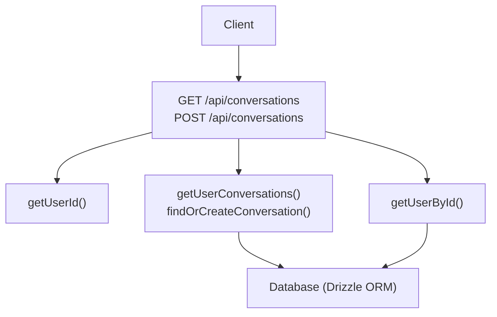
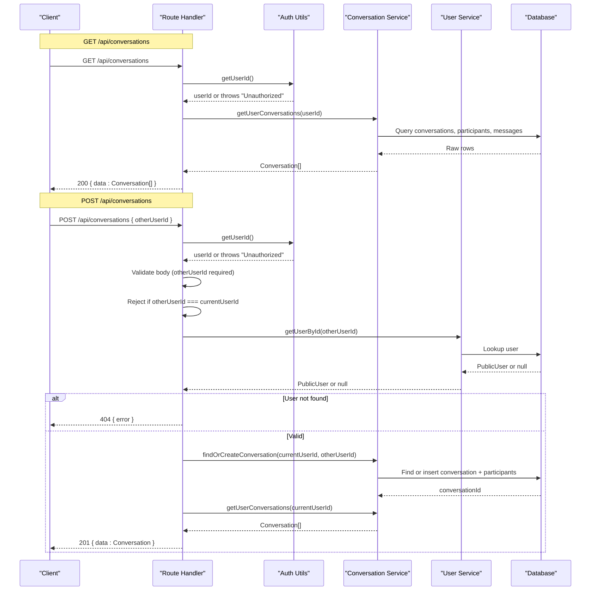
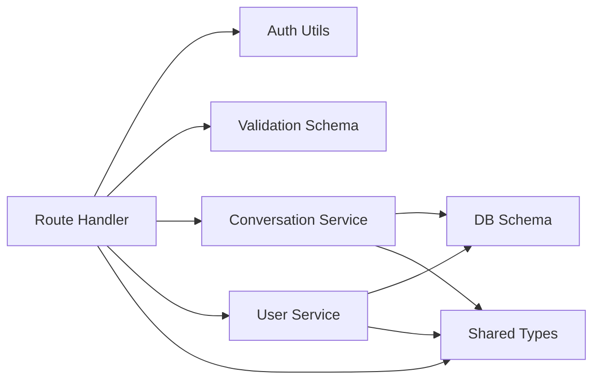

# Conversations API

<cite>
**Referenced Files in This Document**
- [route.ts](file://app/api/conversations/route.ts)
- [auth-utils.ts](file://lib/auth-utils.ts)
- [auth.ts](file://lib/auth.ts)
- [message.ts](file://lib/validations/message.ts)
- [conversation.service.ts](file://lib/services/conversation.service.ts)
- [user.service.ts](file://lib/services/user.service.ts)
- [schema.ts](file://lib/db/schema.ts)
- [index.ts](file://types/index.ts)
</cite>

## Table of Contents
1. [Introduction](#introduction)
2. [Project Structure](#project-structure)
3. [Core Components](#core-components)
4. [Architecture Overview](#architecture-overview)
5. [Detailed Component Analysis](#detailed-component-analysis)
6. [Dependency Analysis](#dependency-analysis)
7. [Performance Considerations](#performance-considerations)
8. [Troubleshooting Guide](#troubleshooting-guide)
9. [Conclusion](#conclusion)
10. [Appendices](#appendices)

## Introduction
This document provides detailed API documentation for conversation management endpoints that enable authenticated users to retrieve their conversations and create or find one-to-one conversations with other users. It covers authentication requirements, request/response schemas, status codes, error handling, and practical usage examples.

## Project Structure
The conversation endpoints are implemented as Next.js App Router handlers under the API routes. Authentication is handled via a session-based mechanism, and business logic is delegated to service functions that interact with the database schema.

**Diagram sources**
- [route.ts:14-80](file://app/api/conversations/route.ts#L14-L80)
- [auth-utils.ts:16-20](file://lib/auth-utils.ts#L16-L20)
- [conversation.service.ts:25-151](file://lib/services/conversation.service.ts#L25-L151)
- [user.service.ts:52-68](file://lib/services/user.service.ts#L52-L68)

**Section sources**
- [route.ts:14-80](file://app/api/conversations/route.ts#L14-L80)
- [auth-utils.ts:16-20](file://lib/auth-utils.ts#L16-L20)
- [conversation.service.ts:25-151](file://lib/services/conversation.service.ts#L25-L151)
- [user.service.ts:52-68](file://lib/services/user.service.ts#L52-L68)

## Core Components
- GET /api/conversations: Returns all conversations for the authenticated user, including last message and unread count.
- POST /api/conversations: Creates or finds an existing one-to-one conversation between the authenticated user and another user identified by otherUserId.

Key implementation files:
- Endpoint handlers: [route.ts](file://app/api/conversations/route.ts)
- Validation schema: [message.ts](file://lib/validations/message.ts)
- Conversation service: [conversation.service.ts](file://lib/services/conversation.service.ts)
- User service: [user.service.ts](file://lib/services/user.service.ts)
- Authentication utilities: [auth-utils.ts](file://lib/auth-utils.ts), [auth.ts](file://lib/auth.ts)
- Data types: [index.ts](file://types/index.ts)
- Database schema: [schema.ts](file://lib/db/schema.ts)

**Section sources**
- [route.ts:14-80](file://app/api/conversations/route.ts#L14-L80)
- [message.ts:14-16](file://lib/validations/message.ts#L14-L16)
- [conversation.service.ts:25-151](file://lib/services/conversation.service.ts#L25-L151)
- [user.service.ts:52-68](file://lib/services/user.service.ts#L52-L68)
- [auth-utils.ts:16-20](file://lib/auth-utils.ts#L16-L20)
- [auth.ts:5-64](file://lib/auth.ts#L5-L64)
- [index.ts:43-53](file://types/index.ts#L43-L53)
- [schema.ts:66-87](file://lib/db/schema.ts#L66-L87)

## Architecture Overview
The endpoints enforce authentication using session cookies managed by Better Auth. On each request, the handler retrieves the current user ID; if no valid session exists, it returns 401 Unauthorized. The GET endpoint fetches all conversations for the user, while the POST endpoint validates input, prevents self-conversations, verifies the target user exists, and then creates or reuses a conversation.

**Diagram sources**
- [route.ts:14-80](file://app/api/conversations/route.ts#L14-L80)
- [auth-utils.ts:16-20](file://lib/auth-utils.ts#L16-L20)
- [conversation.service.ts:25-151](file://lib/services/conversation.service.ts#L25-L151)
- [user.service.ts:52-68](file://lib/services/user.service.ts#L52-L68)

## Detailed Component Analysis

### Authentication Requirements
- All endpoints require an authenticated session. If no session is present, the handler throws an unauthorized error which is caught and returned as 401 Unauthorized.
- Session configuration and cookie behavior are defined in the auth module.

**Section sources**
- [route.ts:14-25](file://app/api/conversations/route.ts#L14-L25)
- [route.ts:33-79](file://app/api/conversations/route.ts#L33-L79)
- [auth-utils.ts:16-20](file://lib/auth-utils.ts#L16-L20)
- [auth.ts:5-64](file://lib/auth.ts#L5-L64)

### GET /api/conversations
Retrieves all conversations for the authenticated user. Each conversation includes:
- id: string
- createdAt: Date | string
- updatedAt: Date | string
- otherUser: PublicUser object containing id, name, username, email, image, isOnline, lastSeen
- lastMessage: Message | null
- unreadCount: number

Response:
- Success: 200 OK with JSON { data: Conversation[] }
- Unauthorized: 401 Unauthorized with JSON { error: "Unauthorized" }
- Server Error: 500 Internal Server Error with JSON { error: "Internal server error" }

Request example (curl):
- curl -X GET https://your-domain.com/api/conversations -H "Cookie: session=..."

JavaScript fetch example:
- fetch("/api/conversations", { credentials: "include" })
  .then(res => res.json())
  .then(data => console.log(data));

**Section sources**
- [route.ts:14-25](file://app/api/conversations/route.ts#L14-L25)
- [conversation.service.ts:75-151](file://lib/services/conversation.service.ts#L75-L151)
- [index.ts:43-53](file://types/index.ts#L43-L53)

### POST /api/conversations
Creates or finds a one-to-one conversation between the authenticated user and another user specified by otherUserId.

Request body validation:
- otherUserId: required string (validated via schema). Missing or invalid values return 400 Bad Request.

Business rules:
- Self-conversation prevention: If otherUserId equals the current user’s ID, returns 400 Bad Request.
- User existence check: If the other user does not exist, returns 404 Not Found.

Response:
- Created: 201 Created with JSON { data: Conversation }
- Validation error: 400 Bad Request with JSON { error: "Invalid request: otherUserId is required" }
- Self-conversation: 400 Bad Request with JSON { error: "You cannot start a conversation with yourself" }
- User not found: 404 Not Found with JSON { error: "User not found" }
- Unauthorized: 401 Unauthorized with JSON { error: "Unauthorized" }
- Server Error: 500 Internal Server Error with JSON { error: "Internal server error" }

Request example (curl):
- curl -X POST https://your-domain.com/api/conversations -H "Content-Type: application/json" -H "Cookie: session=..." -d '{"otherUserId":"target-user-id"}'

JavaScript fetch example:
- fetch("/api/conversations", {
    method: "POST",
    headers: { "Content-Type": "application/json" },
    credentials: "include",
    body: JSON.stringify({ otherUserId: "target-user-id" })
  })
  .then(res => res.json())
  .then(data => console.log(data));

**Section sources**
- [route.ts:33-80](file://app/api/conversations/route.ts#L33-L80)
- [message.ts:14-16](file://lib/validations/message.ts#L14-L16)
- [user.service.ts:52-68](file://lib/services/user.service.ts#L52-L68)
- [conversation.service.ts:25-69](file://lib/services/conversation.service.ts#L25-L69)

### Data Models
Conversation object fields:
- id: string
- createdAt: Date | string
- updatedAt: Date | string
- otherUser: PublicUser (id, name, username, email, image, isOnline, lastSeen)
- lastMessage: Message | null
- unreadCount: number

Message object fields:
- id: string
- conversationId: string
- senderId: string
- receiverId: string
- content: string
- isRead: boolean
- readAt: Date | string | null
- createdAt: Date | string
- sender?: PublicUser (populated via JOIN when fetching messages)

**Section sources**
- [index.ts:25-53](file://types/index.ts#L25-L53)

### Database Schema Notes
- Conversations are stored in a conversation table with timestamps.
- Participants are tracked in a conversation_participant join table with a unique constraint on (conversationId, userId) to prevent duplicate members.
- Messages reference conversationId, senderId, receiverId, and include read state and timestamps.

**Section sources**
- [schema.ts:66-100](file://lib/db/schema.ts#L66-L100)

## Dependency Analysis
The endpoints depend on:
- Authentication utilities to extract the current user from the session.
- Validation schema to ensure correct request payloads.
- Services to perform business logic and database queries.
- Types to define shared contracts across layers.

**Diagram sources**
- [route.ts:14-80](file://app/api/conversations/route.ts#L14-L80)
- [auth-utils.ts:16-20](file://lib/auth-utils.ts#L16-L20)
- [message.ts:14-16](file://lib/validations/message.ts#L14-L16)
- [conversation.service.ts:25-151](file://lib/services/conversation.service.ts#L25-L151)
- [user.service.ts:52-68](file://lib/services/user.service.ts#L52-L68)
- [index.ts:43-53](file://types/index.ts#L43-L53)
- [schema.ts:66-100](file://lib/db/schema.ts#L66-L100)

**Section sources**
- [route.ts:14-80](file://app/api/conversations/route.ts#L14-L80)
- [auth-utils.ts:16-20](file://lib/auth-utils.ts#L16-L20)
- [message.ts:14-16](file://lib/validations/message.ts#L14-L16)
- [conversation.service.ts:25-151](file://lib/services/conversation.service.ts#L25-L151)
- [user.service.ts:52-68](file://lib/services/user.service.ts#L52-L68)
- [index.ts:43-53](file://types/index.ts#L43-L53)
- [schema.ts:66-100](file://lib/db/schema.ts#L66-L100)

## Performance Considerations
- GET /api/conversations performs multiple queries per conversation (participants, last message, unread count). For large datasets, consider batching or optimizing joins at the service layer.
- POST /api/conversations ensures uniqueness by checking existing participants before creating new records, preventing duplicates and reducing redundant writes.
- Use pagination or filtering on the client side if the conversation list grows significantly.

[No sources needed since this section provides general guidance]

## Troubleshooting Guide
Common errors and resolutions:
- 401 Unauthorized: Ensure the request includes a valid session cookie. Check browser storage and domain settings.
- 400 Invalid request: Verify that the request body contains a non-empty otherUserId string.
- 400 Self-conversation: Ensure otherUserId differs from the authenticated user’s ID.
- 404 User not found: Confirm that the target user exists and the ID is correct.
- 500 Internal server error: Review server logs for unexpected exceptions during conversation retrieval or creation.

**Section sources**
- [route.ts:14-25](file://app/api/conversations/route.ts#L14-L25)
- [route.ts:33-80](file://app/api/conversations/route.ts#L33-L80)

## Conclusion
The Conversations API provides secure, validated endpoints for retrieving and creating one-to-one conversations. Authentication is enforced via sessions, requests are validated against a strict schema, and business rules prevent invalid operations such as self-conversations. Responses follow consistent shapes, enabling predictable client integration.

[No sources needed since this section summarizes without analyzing specific files]

## Appendices

### Status Codes Summary
- 200 OK: Successful retrieval of conversations (GET)
- 201 Created: Successful creation or finding of a conversation (POST)
- 400 Bad Request: Validation errors or self-conversation attempts
- 401 Unauthorized: Missing or invalid session
- 404 Not Found: Target user does not exist
- 500 Internal Server Error: Unexpected server-side failures

**Section sources**
- [route.ts:14-25](file://app/api/conversations/route.ts#L14-L25)
- [route.ts:33-80](file://app/api/conversations/route.ts#L33-L80)