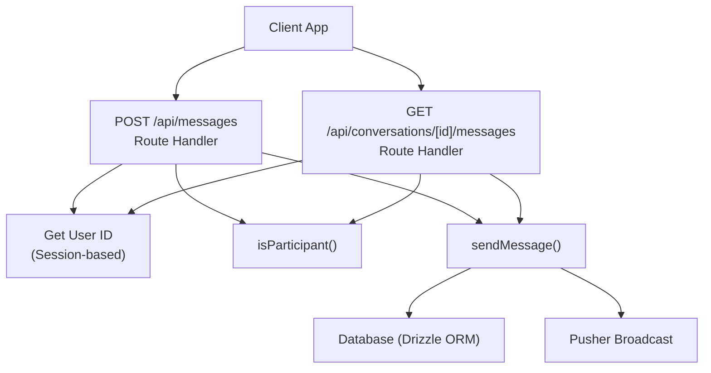
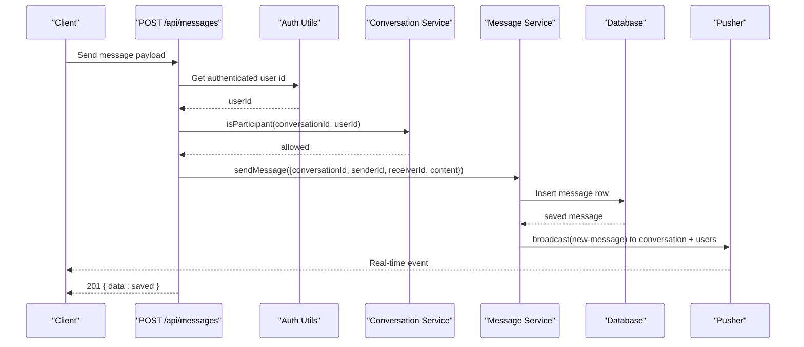
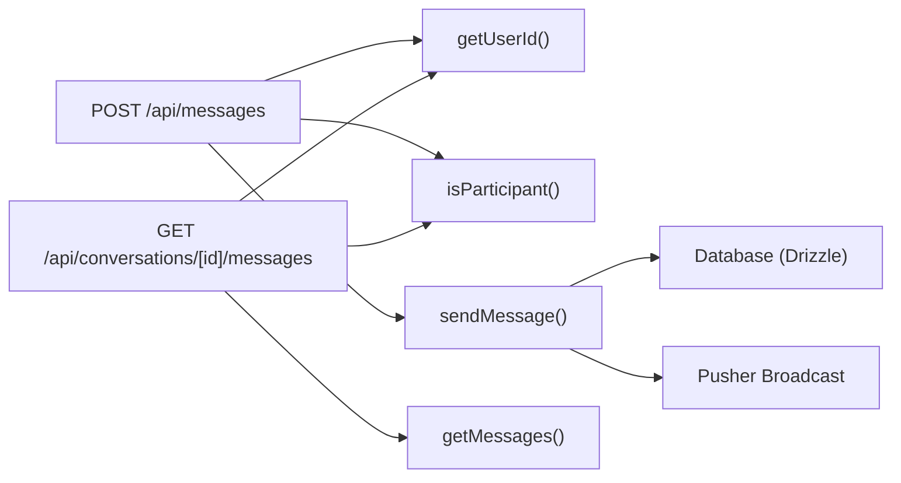
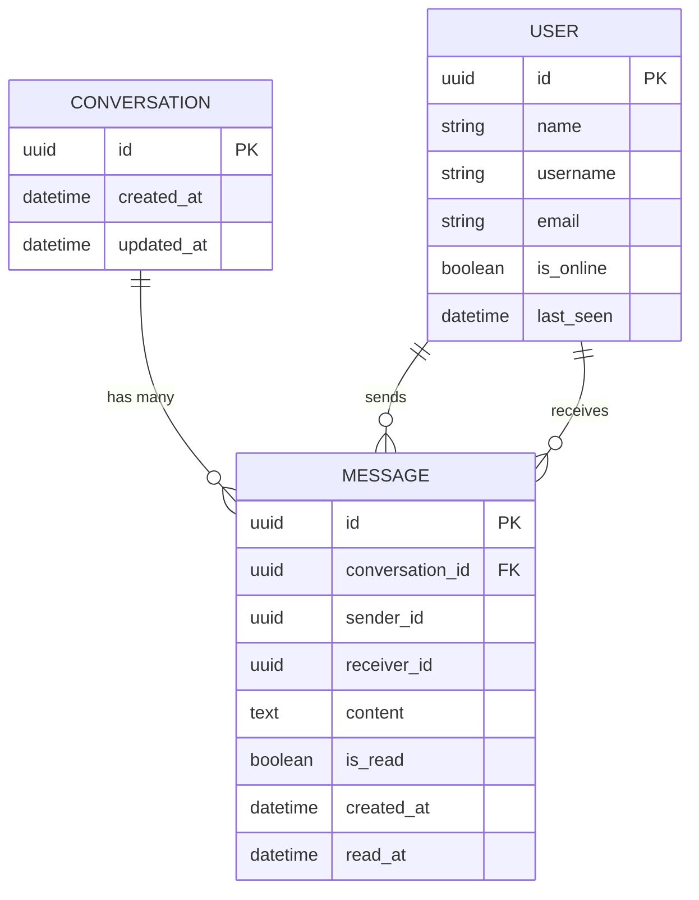

# Messages API

<cite>
**Referenced Files in This Document**
- [route.ts](file://app/api/messages/route.ts)
- [route.ts](file://app/api/conversations/[id]/messages/route.ts)
- [message.service.ts](file://lib/services/message.service.ts)
- [conversation.service.ts](file://lib/services/conversation.service.ts)
- [auth-utils.ts](file://lib/auth-utils.ts)
- [auth.ts](file://lib/auth.ts)
- [middleware.ts](file://middleware.ts)
</cite>

## Table of Contents
1. [Introduction](#introduction)
2. [Project Structure](#project-structure)
3. [Core Components](#core-components)
4. [Architecture Overview](#architecture-overview)
5. [Detailed Component Analysis](#detailed-component-analysis)
6. [Dependency Analysis](#dependency-analysis)
7. [Performance Considerations](#performance-considerations)
8. [Troubleshooting Guide](#troubleshooting-guide)
9. [Conclusion](#conclusion)
10. [Appendices](#appendices)

## Introduction
This document provides comprehensive API documentation for message operations in the secure-chat application. It covers:
- POST /api/messages to send a new message with validation, authorization, persistence, and real-time broadcasting via Pusher.
- GET /api/conversations/[id]/messages to retrieve conversation-specific messages with sorting by timestamp and optional read marking.
- Authentication requirements, error handling, and integration examples for server-side and client-side usage.

Note: The repository does not include a GET /api/messages endpoint for retrieving all messages with pagination and filtering by conversationId, limit, and offset. Only the conversation-scoped retrieval is implemented.

## Project Structure
Message-related endpoints are implemented as Next.js API routes under app/api, backed by service functions in lib/services that handle persistence and real-time delivery.

**Diagram sources**
- [route.ts:12-49](file://app/api/messages/route.ts#L12-L49)
- [route.ts:11-42](file://app/api/conversations/[id]/messages/route.ts#L11-L42)
- [message.service.ts:113-118](file://lib/services/message.service.ts#L113-L118)
- [message.service.ts:124-133](file://lib/services/message.service.ts#L124-L133)
- [conversation.service.ts:157-170](file://lib/services/conversation.service.ts#L157-L170)
- [auth-utils.ts:16-20](file://lib/auth-utils.ts#L16-L20)

**Section sources**
- [route.ts:12-49](file://app/api/messages/route.ts#L12-L49)
- [route.ts:11-42](file://app/api/conversations/[id]/messages/route.ts#L11-L42)
- [message.service.ts:113-118](file://lib/services/message.service.ts#L113-L118)
- [message.service.ts:124-133](file://lib/services/message.service.ts#L124-L133)
- [conversation.service.ts:157-170](file://lib/services/conversation.service.ts#L157-L170)
- [auth-utils.ts:16-20](file://lib/auth-utils.ts#L16-L20)

## Core Components
- Route handlers enforce authentication and authorization before delegating to services.
- Message service centralizes processing, persistence, and real-time delivery.
- Conversation service enforces participant checks and manages conversation state.
- Auth utilities extract the authenticated user from the session.

Key responsibilities:
- POST /api/messages: validate payload, verify sender participation, persist message, broadcast to channels.
- GET /api/conversations/[id]/messages: verify participation, fetch messages sorted by timestamp, optionally mark unread as read.

**Section sources**
- [route.ts:12-49](file://app/api/messages/route.ts#L12-L49)
- [route.ts:11-42](file://app/api/conversations/[id]/messages/route.ts#L11-L42)
- [message.service.ts:113-118](file://lib/services/message.service.ts#L113-L118)
- [message.service.ts:124-133](file://lib/services/message.service.ts#L124-L133)
- [conversation.service.ts:157-170](file://lib/services/conversation.service.ts#L157-L170)
- [auth-utils.ts:16-20](file://lib/auth-utils.ts#L16-L20)

## Architecture Overview
The message flow uses a layered approach:
- Route layer: request parsing, validation, authN/authZ.
- Service layer: business logic, database access, and real-time events.
- Persistence: Drizzle ORM against the database schema.
- Real-time: Pusher broadcast to conversation and user channels.

**Diagram sources**
- [route.ts:12-49](file://app/api/messages/route.ts#L12-L49)
- [message.service.ts:113-118](file://lib/services/message.service.ts#L113-L118)
- [message.service.ts:59-86](file://lib/services/message.service.ts#L59-L86)
- [message.service.ts:90-105](file://lib/services/message.service.ts#L90-L105)
- [conversation.service.ts:157-170](file://lib/services/conversation.service.ts#L157-L170)
- [auth-utils.ts:16-20](file://lib/auth-utils.ts#L16-L20)

## Detailed Component Analysis

### POST /api/messages
Purpose:
- Accept a new message, validate it, ensure the sender is authorized to post to the conversation, persist it, and broadcast it in real time.

Authentication:
- Requires an active session; the route extracts the authenticated user id using session-based auth.

Authorization:
- Verifies the current user is a participant of the target conversation before allowing the write.

Request body schema:
- Fields:
  - conversationId: string — identifier of the conversation to post into.
  - receiverId: string — identifier of the intended recipient.
  - content: string — message text; trimmed on the server.
- Validation:
  - Payload is validated against a schema; invalid payloads return 400 with an error message.

Processing pipeline:
- processMessage: currently a passthrough placeholder for future analysis layers.
- saveMessage: persists the message and updates conversation updatedAt.
- deliverMessage: broadcasts a new-message event to:
  - The conversation channel.
  - The receiver’s user channel.
  - The sender’s user channel.

Response:
- On success: 201 Created with JSON body containing the saved message object under a data field.

Error handling:
- 400 Bad Request: invalid or missing fields per validation schema.
- 401 Unauthorized: no valid session.
- 403 Forbidden: sender is not a participant of the conversation.
- 500 Internal Server Error: unexpected errors during processing.

Real-time behavior:
- Clients subscribed to the conversation channel and user channels receive a new-message event immediately after persistence.

Integration example (client-side):
- Validate and send a POST request with conversationId, receiverId, and content.
- Handle 201 response to append the returned message to the UI.
- Subscribe to the conversation channel and user channels to render incoming messages in real time.

Integration example (server-side):
- Use the same service function sendMessage to enqueue messages from other server flows (e.g., imports, bots), ensuring consistent processing and delivery.

**Section sources**
- [route.ts:12-49](file://app/api/messages/route.ts#L12-L49)
- [message.service.ts:49-55](file://lib/services/message.service.ts#L49-L55)
- [message.service.ts:59-86](file://lib/services/message.service.ts#L59-L86)
- [message.service.ts:90-105](file://lib/services/message.service.ts#L90-L105)
- [conversation.service.ts:157-170](file://lib/services/conversation.service.ts#L157-L170)
- [auth-utils.ts:16-20](file://lib/auth-utils.ts#L16-L20)

### GET /api/conversations/[id]/messages
Purpose:
- Retrieve message history for a specific conversation, ordered by timestamp, and optionally mark unread messages as read for the current user.

Authentication:
- Requires an active session; the route extracts the authenticated user id.

Authorization:
- Verifies the current user is a participant of the conversation; otherwise returns 403 Forbidden.

Query parameters:
- markRead: boolean flag (default true). When true, marks all unread messages for the current user in this conversation as read upon retrieval. Set to false to avoid rewriting rows during polling scenarios.

Response:
- Returns a JSON object with a data array of messages sorted oldest-first for display.

Sorting:
- Messages are fetched ordered by createdAt descending and then reversed to present oldest-first.

Error handling:
- 401 Unauthorized: no valid session.
- 403 Forbidden: not a participant of the conversation.
- 500 Internal Server Error: unexpected errors during retrieval or marking read.

Real-time behavior:
- Marking messages as read triggers a message-read event broadcast to the conversation channel and to each sender’s user channel so senders can update read receipts live.

Integration example (client-side):
- Call GET /api/conversations/[id]/messages?markRead=true when opening a chat to load history and mark messages as read.
- For polling fallbacks, use ?markRead=false to avoid frequent writes while still receiving new messages via real-time events.

**Section sources**
- [route.ts:11-42](file://app/api/conversations/[id]/messages/route.ts#L11-L42)
- [message.service.ts:124-133](file://lib/services/message.service.ts#L124-L133)
- [message.service.ts:139-164](file://lib/services/message.service.ts#L139-L164)
- [conversation.service.ts:157-170](file://lib/services/conversation.service.ts#L157-L170)
- [auth-utils.ts:16-20](file://lib/auth-utils.ts#L16-L20)

### GET /api/messages (Not Implemented)
Status:
- Not implemented in this repository. There is no endpoint to retrieve all messages with pagination and filtering by conversationId, limit, and offset.

Recommendation:
- If needed, implement a new route handler that:
  - Validates query parameters (conversationId, limit, offset).
  - Enforces authentication and authorization (participant check).
  - Uses getMessages with limit and applies offset at the service or query layer.
  - Returns paginated results with metadata (total, page, limit).

[No sources needed since this section describes a non-implemented feature]

## Dependency Analysis
High-level dependencies between components involved in message operations:

**Diagram sources**
- [route.ts:12-49](file://app/api/messages/route.ts#L12-L49)
- [route.ts:11-42](file://app/api/conversations/[id]/messages/route.ts#L11-L42)
- [message.service.ts:113-118](file://lib/services/message.service.ts#L113-L118)
- [message.service.ts:124-133](file://lib/services/message.service.ts#L124-L133)
- [conversation.service.ts:157-170](file://lib/services/conversation.service.ts#L157-L170)
- [auth-utils.ts:16-20](file://lib/auth-utils.ts#L16-L20)

**Section sources**
- [route.ts:12-49](file://app/api/messages/route.ts#L12-L49)
- [route.ts:11-42](file://app/api/conversations/[id]/messages/route.ts#L11-L42)
- [message.service.ts:113-118](file://lib/services/message.service.ts#L113-L118)
- [message.service.ts:124-133](file://lib/services/message.service.ts#L124-L133)
- [conversation.service.ts:157-170](file://lib/services/conversation.service.ts#L157-L170)
- [auth-utils.ts:16-20](file://lib/auth-utils.ts#L16-L20)

## Performance Considerations
- Default message retrieval limit:
  - getMessages defaults to a limit of 50 messages per call to reduce payload size and database load.
- Read marking optimization:
  - markRead defaults to true but can be set to false for polling patterns to avoid frequent writes.
- Real-time delivery:
  - Broadcasting occurs only after successful persistence, minimizing redundant network traffic.
- Database updates:
  - Each new message updates the conversation updatedAt to keep lists sorted efficiently.

[No sources needed since this section provides general guidance based on observed implementation details]

## Troubleshooting Guide
Common issues and resolutions:
- 401 Unauthorized:
  - Ensure the client includes a valid session cookie or token as configured by Better Auth.
  - Verify middleware configuration and trusted origins if running across domains.
- 403 Forbidden:
  - Confirm the authenticated user is a participant of the requested conversation.
- 400 Bad Request:
  - Validate the request body contains required fields (conversationId, receiverId, content) and conforms to expected types.
- 500 Internal Server Error:
  - Check server logs for unexpected exceptions during message processing or database operations.

Real-time troubleshooting:
- If clients do not receive new messages, verify:
  - Correct subscription to conversation and user channels.
  - Pusher credentials and channel names match server broadcasts.

**Section sources**
- [route.ts:12-49](file://app/api/messages/route.ts#L12-L49)
- [route.ts:11-42](file://app/api/conversations/[id]/messages/route.ts#L11-L42)
- [auth.ts:5-64](file://lib/auth.ts#L5-L64)
- [middleware.ts:1-42](file://middleware.ts#L1-L42)

## Conclusion
The messaging system provides secure, session-authenticated endpoints for sending and retrieving messages within conversations. It enforces participant-only access, persists messages reliably, and delivers real-time updates via Pusher. While a global GET /api/messages with pagination and filtering is not implemented, the conversation-scoped endpoint supports efficient retrieval and optional read marking suitable for most chat interfaces.

[No sources needed since this section summarizes without analyzing specific files]

## Appendices

### Authentication and Session Flow
- Better Auth configures sessions and trusted origins.
- Middleware protects certain pages and redirects unauthenticated users.
- Route handlers use getUserId to enforce per-request authorization.

**Section sources**
- [auth.ts:5-64](file://lib/auth.ts#L5-L64)
- [middleware.ts:1-42](file://middleware.ts#L1-L42)
- [auth-utils.ts:16-20](file://lib/auth-utils.ts#L16-L20)

### Data Models and Relationships
Conceptual model relevant to messages:

[No sources needed since this diagram shows conceptual relationships]