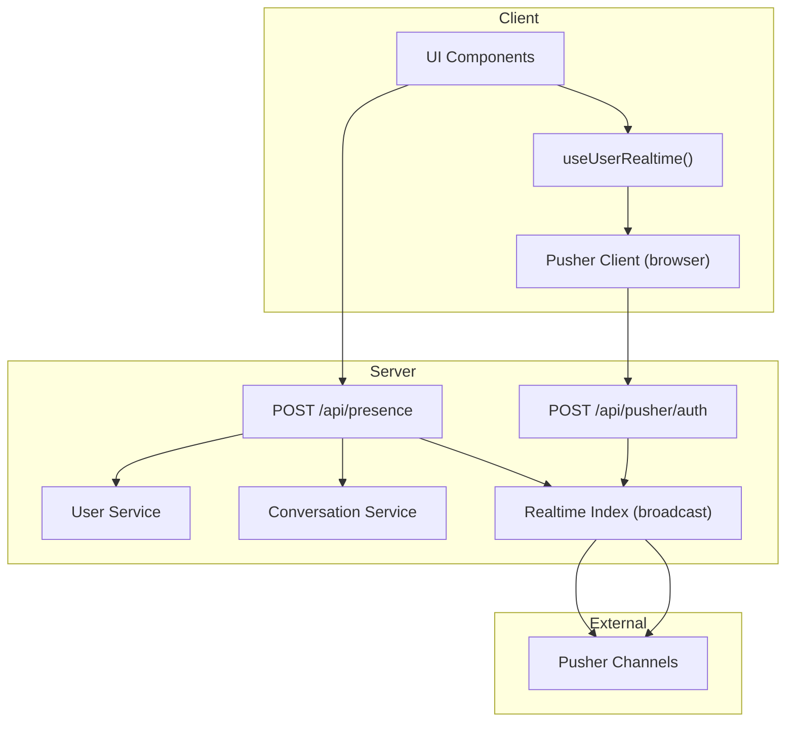
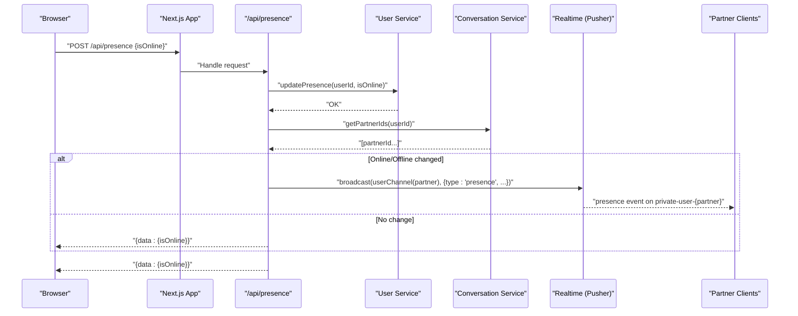
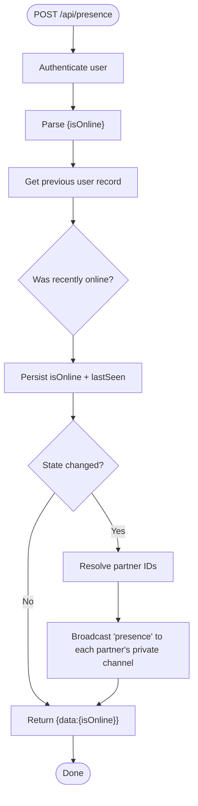
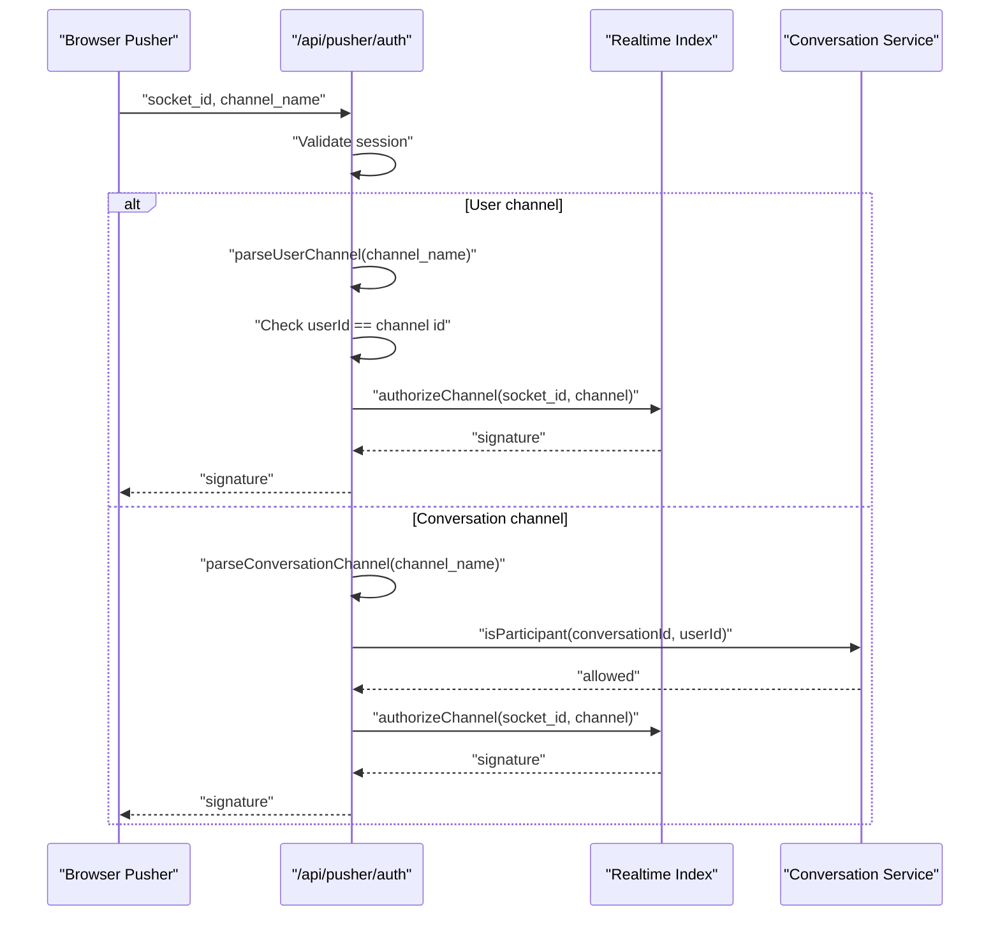
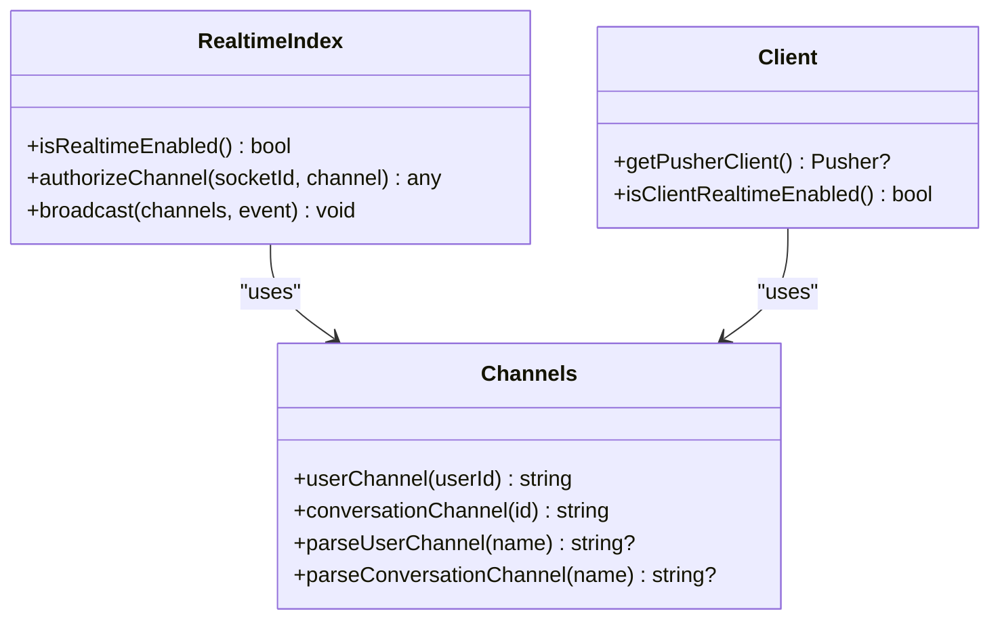
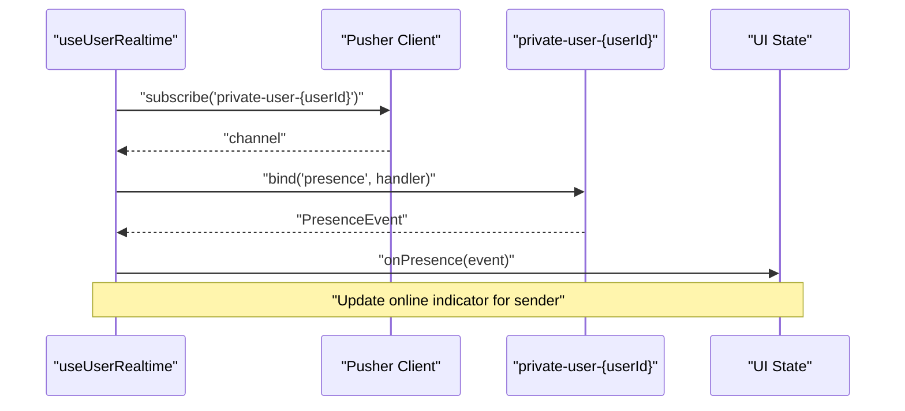
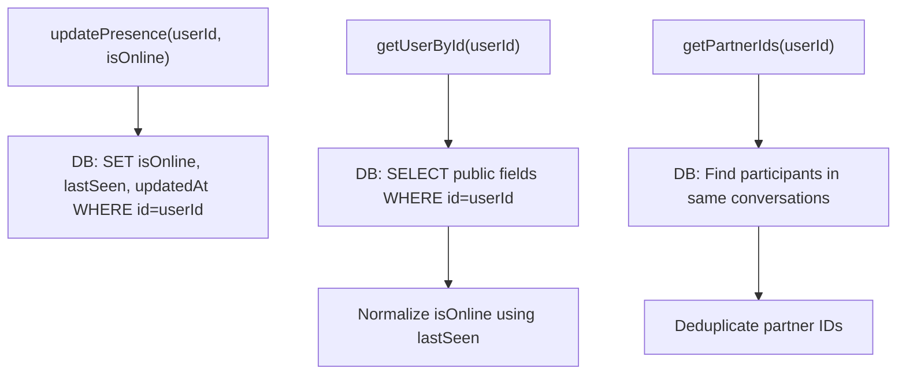
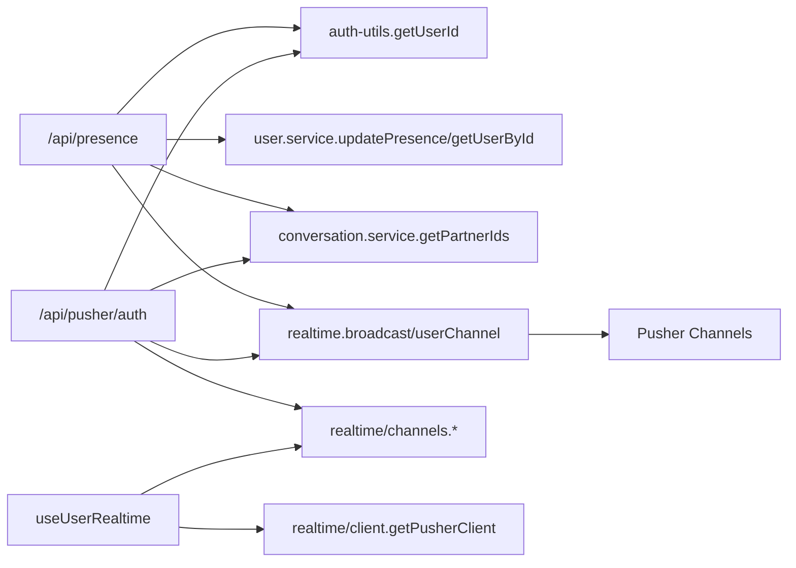

# Presence API

<cite>
**Referenced Files in This Document**
- [route.ts](file://app/api/presence/route.ts)
- [route.ts](file://app/api/pusher/auth/route.ts)
- [index.ts](file://lib/realtime/index.ts)
- [client.ts](file://lib/realtime/client.ts)
- [channels.ts](file://lib/realtime/channels.ts)
- [user.service.ts](file://lib/services/user.service.ts)
- [conversation.service.ts](file://lib/services/conversation.service.ts)
- [auth-utils.ts](file://lib/auth-utils.ts)
- [utils.ts](file://lib/utils.ts)
- [useRealtime.ts](file://hooks/useRealtime.ts)
- [index.ts](file://types/index.ts)
</cite>

## Table of Contents
1. Introduction
2. Project Structure
3. Core Components
4. Architecture Overview
5. Detailed Component Analysis
6. Dependency Analysis
7. Performance Considerations
8. Troubleshooting Guide
9. Conclusion
10. Appendices

## Introduction
This document provides detailed API documentation for user presence management in the application. It explains how online/offline status is tracked, updated, and broadcast to other users in real-time using Pusher Channels. It covers the HTTP endpoint structure, request/response schemas, WebSocket integration, connection lifecycle, data storage and retrieval, authentication requirements, error handling, UI implementation guidance, and scalability considerations.

## Project Structure
Presence functionality spans server routes, services, realtime transport, client hooks, and shared types:
- Server endpoints:
  - POST /api/presence — update presence heartbeat or explicit online/offline
  - POST /api/pusher/auth — authorize private channel subscriptions
- Services:
  - User service updates presence and retrieves user profiles
  - Conversation service resolves partner IDs for fan-out
- Realtime transport:
  - Server-side Pusher client for broadcasting events
  - Client-side Pusher singleton with authorization endpoint
  - Channel naming helpers for private channels
- Client hooks:
  - React hook to subscribe to a user’s private channel and handle presence events
- Types:
  - Shared event payloads including PresenceEvent

**Diagram sources**
- [route.ts:14-50](file://app/api/presence/route.ts#L14-L50)
- [route.ts:11-62](file://app/api/pusher/auth/route.ts#L11-L62)
- [index.ts:24-78](file://lib/realtime/index.ts#L24-L78)
- [client.ts:17-29](file://lib/realtime/client.ts#L17-L29)
- [user.service.ts:52-83](file://lib/services/user.service.ts#L52-L83)
- [conversation.service.ts:178-200](file://lib/services/conversation.service.ts#L178-L200)

**Section sources**
- [route.ts:14-50](file://app/api/presence/route.ts#L14-L50)
- [route.ts:11-62](file://app/api/pusher/auth/route.ts#L11-L62)
- [index.ts:24-78](file://lib/realtime/index.ts#L24-L78)
- [client.ts:17-29](file://lib/realtime/client.ts#L17-L29)
- [user.service.ts:52-83](file://lib/services/user.service.ts#L52-L83)
- [conversation.service.ts:178-200](file://lib/services/conversation.service.ts#L178-L200)

## Core Components
- Presence update endpoint:
  - Authenticates the current user
  - Persists online/offline state and last seen timestamp
  - Broadcasts presence changes to conversation partners via Pusher
- Pusher authorization endpoint:
  - Validates channel access for private channels
  - Signs authorization responses for user and conversation channels
- Realtime transport:
  - Server-side Pusher client for broadcasting
  - Client-side Pusher configuration with authorization endpoint
  - Channel name helpers for consistent addressing
- Data layer:
  - Update presence and retrieve user profile
  - Resolve partner IDs for targeted broadcasts
- Client integration:
  - React hook subscribes to user private channel and handles presence events

**Section sources**
- [route.ts:14-50](file://app/api/presence/route.ts#L14-L50)
- [route.ts:11-62](file://app/api/pusher/auth/route.ts#L11-L62)
- [index.ts:24-78](file://lib/realtime/index.ts#L24-L78)
- [client.ts:17-29](file://lib/realtime/client.ts#L17-L29)
- [channels.ts:6-26](file://lib/realtime/channels.ts#L6-L26)
- [user.service.ts:52-83](file://lib/services/user.service.ts#L52-L83)
- [conversation.service.ts:178-200](file://lib/services/conversation.service.ts#L178-L200)
- [useRealtime.ts:26-61](file://hooks/useRealtime.ts#L26-L61)

## Architecture Overview
The presence system uses a hybrid approach:
- Heartbeat-driven persistence: clients periodically call POST /api/presence to mark themselves online and update lastSeen.
- Event-driven updates: when a user transitions between online and offline states, the server broadcasts a presence event to each partner’s private channel.
- Private channels: clients subscribe to private-user-{userId} to receive presence and direct messages; presence events are delivered on this channel.

**Diagram sources**
- [route.ts:14-50](file://app/api/presence/route.ts#L14-L50)
- [user.service.ts:74-83](file://lib/services/user.service.ts#L74-L83)
- [conversation.service.ts:178-200](file://lib/services/conversation.service.ts#L178-L200)
- [index.ts:63-78](file://lib/realtime/index.ts#L63-L78)

## Detailed Component Analysis

### Endpoint: POST /api/presence
- Purpose: Update a user’s presence (heartbeat or explicit online/offline).
- Authentication: Requires an authenticated session; throws Unauthorized if missing.
- Request body:
  - isOnline: boolean (optional; defaults to true if omitted or not false)
- Response:
  - Success: { data: { isOnline: boolean } }
  - Error: { error: string } with appropriate status codes
- Behavior:
  - Retrieves previous presence state using lastSeen and isRecentlyOnline logic
  - Persists new state and lastSeen timestamp
  - If transition occurred, computes partner IDs and broadcasts presence event to each partner’s private channel
  - Uses batching by channel limit to avoid large payloads

**Diagram sources**
- [route.ts:14-50](file://app/api/presence/route.ts#L14-L50)
- [user.service.ts:74-83](file://lib/services/user.service.ts#L74-L83)
- [conversation.service.ts:178-200](file://lib/services/conversation.service.ts#L178-L200)
- [utils.ts:48-56](file://lib/utils.ts#L48-L56)

**Section sources**
- [route.ts:14-50](file://app/api/presence/route.ts#L14-L50)
- [auth-utils.ts:16-20](file://lib/auth-utils.ts#L16-L20)
- [user.service.ts:74-83](file://lib/services/user.service.ts#L74-L83)
- [conversation.service.ts:178-200](file://lib/services/conversation.service.ts#L178-L200)
- [utils.ts:48-56](file://lib/utils.ts#L48-L56)

### Endpoint: POST /api/pusher/auth
- Purpose: Authorize private channel subscriptions for Pusher.
- Authentication: Requires an authenticated session; returns 401 if missing.
- Request:
  - JSON or form-encoded fields: socket_id, channel_name
- Authorization rules:
  - For private-user-{userId}: allow only if userId matches the authenticated user
  - For private-conversation-{conversationId}: allow only if the user is a participant
- Response:
  - Authorized: Pusher signature object
  - Errors: Invalid request (400), Forbidden (403), Realtime not configured (503), Authorization failed (500)

**Diagram sources**
- [route.ts:11-62](file://app/api/pusher/auth/route.ts#L11-L62)
- [channels.ts:6-26](file://lib/realtime/channels.ts#L6-L26)
- [index.ts:51-57](file://lib/realtime/index.ts#L51-L57)
- [conversation.service.ts:164-170](file://lib/services/conversation.service.ts#L164-L170)

**Section sources**
- [route.ts:11-62](file://app/api/pusher/auth/route.ts#L11-L62)
- [channels.ts:6-26](file://lib/realtime/channels.ts#L6-L26)
- [index.ts:51-57](file://lib/realtime/index.ts#L51-L57)
- [conversation.service.ts:164-170](file://lib/services/conversation.service.ts#L164-L170)

### Realtime Transport and Channels
- Server-side:
  - Pusher client initialized from environment variables
  - broadcast() publishes events to one or more channels; failures are logged but do not throw
  - authorizeChannel() signs private channel subscriptions
- Client-side:
  - getPusherClient() creates a singleton Pusher instance with channelAuthorization set to /api/pusher/auth
  - Subscriptions use channel names generated by helpers
- Channel naming:
  - private-user-{userId} for direct user channel
  - private-conversation-{conversationId} for conversation channel

**Diagram sources**
- [index.ts:24-78](file://lib/realtime/index.ts#L24-L78)
- [channels.ts:6-26](file://lib/realtime/channels.ts#L6-L26)
- [client.ts:17-29](file://lib/realtime/client.ts#L17-L29)

**Section sources**
- [index.ts:24-78](file://lib/realtime/index.ts#L24-L78)
- [channels.ts:6-26](file://lib/realtime/channels.ts#L6-L26)
- [client.ts:17-29](file://lib/realtime/client.ts#L17-L29)

### Client Integration: useUserRealtime
- Subscribes to private-user-{userId} when a userId is provided
- Binds to "new-message" and "presence" events
- Unbinds and unsubscribes on cleanup
- Integrates with presence indicators by updating UI state on presence events

**Diagram sources**
- [useRealtime.ts:26-61](file://hooks/useRealtime.ts#L26-L61)
- [channels.ts:10-12](file://lib/realtime/channels.ts#L10-L12)

**Section sources**
- [useRealtime.ts:26-61](file://hooks/useRealtime.ts#L26-L61)
- [channels.ts:10-12](file://lib/realtime/channels.ts#L10-L12)

### Data Storage and Retrieval
- Persistence:
  - updatePresence sets isOnline, lastSeen, updatedAt for the user
- Retrieval:
  - getUserById returns public user fields, normalizing isOnline based on lastSeen
- Partner resolution:
  - getPartnerIds finds all users sharing conversations with the current user for targeted broadcasts

**Diagram sources**
- [user.service.ts:52-83](file://lib/services/user.service.ts#L52-L83)
- [conversation.service.ts:178-200](file://lib/services/conversation.service.ts#L178-L200)
- [utils.ts:48-56](file://lib/utils.ts#L48-L56)

**Section sources**
- [user.service.ts:52-83](file://lib/services/user.service.ts#L52-L83)
- [conversation.service.ts:178-200](file://lib/services/conversation.service.ts#L178-L200)
- [utils.ts:48-56](file://lib/utils.ts#L48-L56)

### Event Schemas
- PresenceEvent:
  - type: "presence"
  - userId: string
  - isOnline: boolean
  - lastSeen: string (ISO timestamp)

These types ensure consistent event payloads across server and client.

**Section sources**
- [index.ts:110-115](file://types/index.ts#L110-L115)

## Dependency Analysis
- Presence route depends on:
  - Authentication utility for user identity
  - User service for persistence
  - Conversation service for partner resolution
  - Realtime module for broadcasting
  - Utilities for presence TTL logic
- Pusher auth route depends on:
  - Authentication utility
  - Realtime module for signing
  - Channel parsers for validation
  - Conversation service for participant checks
- Client hook depends on:
  - Realtime client for Pusher instance
  - Channel helpers for subscription names
  - Types for event shapes

**Diagram sources**
- [route.ts:14-50](file://app/api/presence/route.ts#L14-L50)
- [route.ts:11-62](file://app/api/pusher/auth/route.ts#L11-L62)
- [index.ts:24-78](file://lib/realtime/index.ts#L24-L78)
- [client.ts:17-29](file://lib/realtime/client.ts#L17-L29)
- [channels.ts:6-26](file://lib/realtime/channels.ts#L6-L26)
- [user.service.ts:52-83](file://lib/services/user.service.ts#L52-L83)
- [conversation.service.ts:178-200](file://lib/services/conversation.service.ts#L178-L200)
- [auth-utils.ts:16-20](file://lib/auth-utils.ts#L16-L20)

**Section sources**
- [route.ts:14-50](file://app/api/presence/route.ts#L14-L50)
- [route.ts:11-62](file://app/api/pusher/auth/route.ts#L11-L62)
- [index.ts:24-78](file://lib/realtime/index.ts#L24-L78)
- [client.ts:17-29](file://lib/realtime/client.ts#L17-L29)
- [channels.ts:6-26](file://lib/realtime/channels.ts#L6-L26)
- [user.service.ts:52-83](file://lib/services/user.service.ts#L52-L83)
- [conversation.service.ts:178-200](file://lib/services/conversation.service.ts#L178-L200)
- [auth-utils.ts:16-20](file://lib/auth-utils.ts#L16-L20)

## Performance Considerations
- Heartbeat frequency:
  - The presence TTL is 45 seconds; clients should send heartbeats at or below this interval to keep status accurate without excessive load.
- Broadcast batching:
  - The presence route fans out events in slices of up to 10 partner channels per broadcast call to avoid large payloads and reduce overhead.
- Conditional broadcasting:
  - Events are only sent when there is a state change (online ↔ offline), minimizing unnecessary traffic.
- Fallback behavior:
  - If Pusher is not configured, broadcast becomes a no-op; clients can fall back to polling for presence updates.
- Database queries:
  - Partner resolution uses indexed lookups on conversation participants; ensure indexes exist on conversationParticipant.userId and conversationId for performance at scale.
- Connection limits:
  - Pusher Channels enforce per-app connection limits; monitor usage and consider scaling plan adjustments for high concurrency.

[No sources needed since this section provides general guidance]

## Troubleshooting Guide
- Unauthorized errors:
  - Ensure a valid session exists before calling /api/presence or subscribing to private channels.
  - The getUserId utility throws "Unauthorized" when no session is present; routes return 401 accordingly.
- Realtime not configured:
  - If Pusher environment variables are missing, /api/pusher/auth returns 503; verify NEXT_PUBLIC_PUSHER_KEY and NEXT_PUBLIC_PUSHER_CLUSTER on the client, and PUSHER_APP_ID, PUSHER_KEY, PUSHER_SECRET, PUSHER_CLUSTER on the server.
- Forbidden errors:
  - Private user channel requires matching userId; private conversation channel requires the user to be a participant.
- Broadcast failures:
  - broadcast() logs errors but does not throw; presence updates still persist even if delivery fails. Check Pusher dashboard for delivery issues.
- Stale presence:
  - If a user appears online too long, ensure heartbeats are being sent while the app is active; the 45-second TTL will eventually mark them offline if heartbeats stop.

**Section sources**
- [auth-utils.ts:16-20](file://lib/auth-utils.ts#L16-L20)
- [route.ts:43-49](file://app/api/presence/route.ts#L43-L49)
- [route.ts:13-15](file://app/api/pusher/auth/route.ts#L13-L15)
- [route.ts:33-54](file://app/api/pusher/auth/route.ts#L33-L54)
- [index.ts:75-78](file://lib/realtime/index.ts#L75-L78)
- [utils.ts:45-56](file://lib/utils.ts#L45-L56)

## Conclusion
The presence system combines periodic heartbeats with event-driven broadcasts to provide accurate, real-time online/offline indicators. It leverages private channels for secure delivery, persists minimal state, and scales through conditional broadcasting and batched fan-out. Proper authentication, robust error handling, and fallback strategies ensure reliability under varying conditions.

[No sources needed since this section summarizes without analyzing specific files]

## Appendices

### API Reference: POST /api/presence
- Method: POST
- Path: /api/presence
- Authentication: Required (session-based)
- Request schema:
  - isOnline: boolean (optional; defaults to true if omitted or not explicitly false)
- Response schema:
  - Success: { data: { isOnline: boolean } }
  - Error: { error: string }
- Status codes:
  - 200: Success
  - 401: Unauthorized
  - 500: Failed to update presence

**Section sources**
- [route.ts:14-50](file://app/api/presence/route.ts#L14-L50)

### API Reference: POST /api/pusher/auth
- Method: POST
- Path: /api/pusher/auth
- Authentication: Required (session-based)
- Request schema:
  - socket_id: string
  - channel_name: string
  - Content-Type: application/json or multipart/form-data
- Response schema:
  - Authorized: Pusher signature object
  - Error: { error: string }
- Status codes:
  - 200: Authorized
  - 400: Invalid request
  - 401: Unauthorized
  - 403: Forbidden
  - 503: Realtime is not configured
  - 500: Authorization failed

**Section sources**
- [route.ts:11-62](file://app/api/pusher/auth/route.ts#L11-L62)

### WebSocket Integration Notes
- Client initialization:
  - getPusherClient() configures Pusher with channelAuthorization set to /api/pusher/auth
  - Subscriptions use private-user-{userId} for presence and private-conversation-{conversationId} for chat events
- Event binding:
  - useUserRealtime binds to "presence" on the user channel to update UI indicators
- Fallback:
  - When realtime is disabled, clients may poll for presence updates instead of relying on WebSockets

**Section sources**
- [client.ts:17-29](file://lib/realtime/client.ts#L17-L29)
- [useRealtime.ts:26-61](file://hooks/useRealtime.ts#L26-L61)
- [channels.ts:6-12](file://lib/realtime/channels.ts#L6-L12)

### UI Implementation Guidance
- Displaying presence indicators:
  - Subscribe to presence events via useUserRealtime
  - On receiving a presence event, update the corresponding user’s isOnline and lastSeen in local state
  - Show online dot or “Last seen” text based on event data
- Heartbeat strategy:
  - Send periodic POST /api/presence with { isOnline: true } while the dashboard is visible
  - Stop sending when the tab is hidden to conserve resources; rely on TTL to mark offline

**Section sources**
- [useRealtime.ts:26-61](file://hooks/useRealtime.ts#L26-L61)
- [utils.ts:45-56](file://lib/utils.ts#L45-L56)