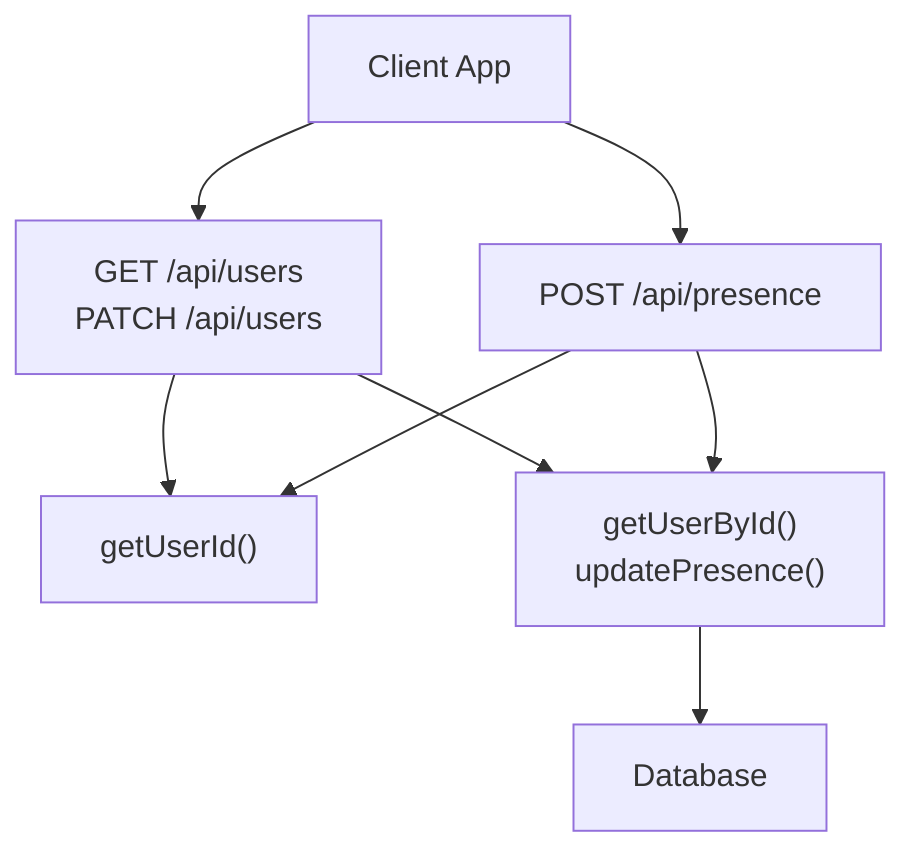
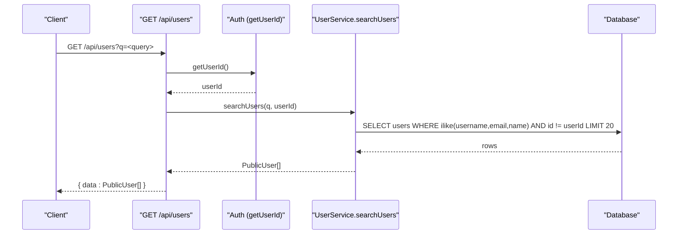
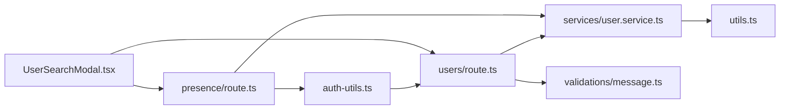

# Users API

<cite>
**Referenced Files in This Document**
- [route.ts](file://app/api/users/route.ts)
- [user.service.ts](file://lib/services/user.service.ts)
- [message.ts](file://lib/validations/message.ts)
- [auth-utils.ts](file://lib/auth-utils.ts)
- [index.ts](file://types/index.ts)
- [route.ts](file://app/api/presence/route.ts)
- [UserSearchModal.tsx](file://components/chat/UserSearchModal.tsx)
- [ProfileModal.tsx](file://components/chat/ProfileModal.tsx)
- [UserAvatar.tsx](file://components/chat/UserAvatar.tsx)
- [utils.ts](file://lib/utils.ts)
</cite>

## Table of Contents
1. [Introduction](#introduction)
2. [Project Structure](#project-structure)
3. [Core Components](#core-components)
4. [Architecture Overview](#architecture-overview)
5. [Detailed Component Analysis](#detailed-component-analysis)
6. [Dependency Analysis](#dependency-analysis)
7. [Performance Considerations](#performance-considerations)
8. [Troubleshooting Guide](#troubleshooting-guide)
9. [Conclusion](#conclusion)
10. [Appendices](#appendices)

## Introduction
This document provides comprehensive API documentation for user management endpoints in the SecureChat application. It covers:
- User search and discovery via GET /api/users?q=...
- Profile updates via PATCH /api/users
- Presence (online status) via POST /api/presence
- Request/response schemas for user objects, including profile data, avatar URLs, and online status
- Authentication and authorization requirements
- Privacy considerations for user data exposure
- Search performance optimization strategies
- Examples of search queries and integration patterns for selecting users in conversations

## Project Structure
The user management features are implemented across API routes, a service layer, validation schemas, types, and client components:
- API routes expose HTTP endpoints for user search, profile updates, and presence
- The service layer performs database operations and computes derived fields like online status
- Validation schemas enforce input constraints
- Types define shared contracts for user objects and API responses
- Client components demonstrate usage patterns for searching users and updating profiles

**Diagram sources**
- [route.ts:6-28](file://app/api/users/route.ts#L6-L28)
- [route.ts:34-61](file://app/api/users/route.ts#L34-L61)
- [route.ts:14-50](file://app/api/presence/route.ts#L14-L50)
- [user.service.ts:24-47](file://lib/services/user.service.ts#L24-L47)
- [user.service.ts:88-107](file://lib/services/user.service.ts#L88-L107)
- [user.service.ts:74-83](file://lib/services/user.service.ts#L74-L83)
- [auth-utils.ts:16-20](file://lib/auth-utils.ts#L16-L20)

**Section sources**
- [route.ts:6-28](file://app/api/users/route.ts#L6-L28)
- [route.ts:34-61](file://app/api/users/route.ts#L34-L61)
- [route.ts:14-50](file://app/api/presence/route.ts#L14-L50)
- [user.service.ts:24-47](file://lib/services/user.service.ts#L24-L47)
- [user.service.ts:88-107](file://lib/services/user.service.ts#L88-L107)
- [user.service.ts:74-83](file://lib/services/user.service.ts#L74-L83)
- [auth-utils.ts:16-20](file://lib/auth-utils.ts#L16-L20)

## Core Components
- GET /api/users: Searches users by username, email, or name with query parameter q; returns a list of public user profiles
- PATCH /api/users: Updates the authenticated user’s profile fields (name, username); returns updated public profile
- POST /api/presence: Updates current user’s online status and last seen timestamp; broadcasts presence changes to conversation partners

Key behaviors:
- All endpoints require authentication using session-based auth; unauthorized requests return 401
- Input validation is enforced via Zod schemas; invalid inputs return 400
- Public user objects exclude sensitive fields and compute isOnline based on lastSeen and a TTL window

**Section sources**
- [route.ts:6-28](file://app/api/users/route.ts#L6-L28)
- [route.ts:34-61](file://app/api/users/route.ts#L34-L61)
- [route.ts:14-50](file://app/api/presence/route.ts#L14-L50)
- [message.ts:18-34](file://lib/validations/message.ts#L18-L34)
- [index.ts:9-21](file://types/index.ts#L9-L21)
- [utils.ts:45-56](file://lib/utils.ts#L45-L56)

## Architecture Overview
The user management architecture separates concerns between API routes, service logic, and data access:
- API routes handle HTTP request parsing, authentication, validation, and response formatting
- Service functions encapsulate business logic and database queries
- Types ensure consistent contracts across layers
- Presence updates integrate with real-time broadcasting to notify conversation partners

**Diagram sources**
- [route.ts:6-28](file://app/api/users/route.ts#L6-L28)
- [user.service.ts:24-47](file://lib/services/user.service.ts#L24-L47)
- [auth-utils.ts:16-20](file://lib/auth-utils.ts#L16-L20)

## Detailed Component Analysis

### Endpoint: GET /api/users
Purpose:
- Discover users by partial match on username, email, or name
- Exclude the current user from results
- Return up to 20 matching public user profiles

Authentication:
- Requires an authenticated session; otherwise returns 401 Unauthorized

Request:
- Method: GET
- Path: /api/users
- Query parameters:
  - q: string (required, min 1, max 50)

Response:
- Success (200):
  - data: Array of PublicUser objects
- Error (400):
  - error: message indicating validation failure
- Error (401):
  - error: "Unauthorized"
- Error (500):
  - error: "Internal server error"

PublicUser object schema:
- id: string
- name: string
- username: string | null
- email: string
- image: string | null
- isOnline: boolean
- lastSeen: Date | string | null

Notes:
- isOnline is computed using lastSeen and a TTL window to reflect recent activity
- Results are limited to 20 entries for performance

Example usage in client:
- Debounced fetch to /api/users?q=... when typing in the search modal
- Displays results with avatars and online indicators

**Section sources**
- [route.ts:6-28](file://app/api/users/route.ts#L6-L28)
- [message.ts:18-20](file://lib/validations/message.ts#L18-L20)
- [user.service.ts:24-47](file://lib/services/user.service.ts#L24-L47)
- [index.ts:9-21](file://types/index.ts#L9-L21)
- [UserSearchModal.tsx:40-65](file://components/chat/UserSearchModal.tsx#L40-L65)

### Endpoint: PATCH /api/users
Purpose:
- Update the authenticated user’s profile fields (name and/or username)

Authentication:
- Requires an authenticated session; otherwise returns 401 Unauthorized

Request:
- Method: PATCH
- Path: /api/users
- Body:
  - name: string (optional, min 1, max 50)
  - username: string (optional, min 3, max 30, alphanumeric plus underscores)

Response:
- Success (200):
  - data: Updated PublicUser object
- Error (400):
  - error: validation message
- Error (404):
  - error: "User not found"
- Error (401):
  - error: "Unauthorized"
- Error (500):
  - error: "Failed to update profile"

Integration pattern:
- ProfileModal sends PATCH request with trimmed name and optional username
- On success, updates local state and closes modal after brief delay

**Section sources**
- [route.ts:34-61](file://app/api/users/route.ts#L34-L61)
- [message.ts:22-34](file://lib/validations/message.ts#L22-L34)
- [user.service.ts:88-107](file://lib/services/user.service.ts#L88-L107)
- [ProfileModal.tsx:36-61](file://components/chat/ProfileModal.tsx#L36-L61)

### Endpoint: POST /api/presence
Purpose:
- Update current user’s online status and last seen timestamp
- Broadcast presence changes to conversation partners if status changed

Authentication:
- Requires an authenticated session; otherwise returns 401 Unauthorized

Request:
- Method: POST
- Path: /api/presence
- Body:
  - isOnline: boolean (default true if omitted)

Response:
- Success (200):
  - data: { isOnline: boolean }
- Error (401):
  - error: "Unauthorized"
- Error (500):
  - error: "Failed to update presence"

Behavior:
- Reads previous presence via getUserById and computes whether the user was recently online
- Updates presence and lastSeen in the database
- If online status changed, broadcasts presence event to partner channels

Realtime integration:
- Uses broadcast to send presence events to relevant channels
- Partners receive presence updates reflecting isOnline and lastSeen

**Section sources**
- [route.ts:14-50](file://app/api/presence/route.ts#L14-L50)
- [user.service.ts:52-68](file://lib/services/user.service.ts#L52-L68)
- [user.service.ts:74-83](file://lib/services/user.service.ts#L74-L83)
- [utils.ts:45-56](file://lib/utils.ts#L45-L56)

### Data Models and Schemas
PublicUser:
- Represents safe, public-facing user data
- Includes identity, display info, avatar URL, and presence indicators

ApiSuccess and ApiError:
- Standardized response shapes used across endpoints

PresenceEvent:
- Realtime payload containing userId, isOnline, and lastSeen

**Section sources**
- [index.ts:9-21](file://types/index.ts#L9-L21)
- [index.ts:77-87](file://types/index.ts#L77-L87)
- [index.ts:110-115](file://types/index.ts#L110-L115)

### Client Integration Patterns
User search:
- Debounce input changes to avoid excessive requests
- Fetch /api/users?q=... and render results with avatars and online indicators
- Start a conversation by posting to /api/conversations with otherUserId

Profile editing:
- Send PATCH /api/users with name and optional username
- Handle success and error states; update UI accordingly

Avatars and online status:
- Use UserAvatar component to display images or initials
- Show online dot based on isOnline field

**Section sources**
- [UserSearchModal.tsx:40-65](file://components/chat/UserSearchModal.tsx#L40-L65)
- [UserSearchModal.tsx:67-88](file://components/chat/UserSearchModal.tsx#L67-L88)
- [ProfileModal.tsx:36-61](file://components/chat/ProfileModal.tsx#L36-L61)
- [UserAvatar.tsx:19-54](file://components/chat/UserAvatar.tsx#L19-L54)

## Dependency Analysis
The user management system has clear dependencies:
- API routes depend on authentication utilities and service functions
- Service functions depend on database models and utility functions for presence computation
- Client components depend on API routes and types for consistent data handling

**Diagram sources**
- [auth-utils.ts:16-20](file://lib/auth-utils.ts#L16-L20)
- [route.ts:6-28](file://app/api/users/route.ts#L6-L28)
- [route.ts:34-61](file://app/api/users/route.ts#L34-L61)
- [user.service.ts:24-47](file://lib/services/user.service.ts#L24-L47)
- [user.service.ts:74-83](file://lib/services/user.service.ts#L74-L83)
- [message.ts:18-34](file://lib/validations/message.ts#L18-L34)
- [route.ts:14-50](file://app/api/presence/route.ts#L14-L50)
- [UserSearchModal.tsx:40-65](file://components/chat/UserSearchModal.tsx#L40-L65)

**Section sources**
- [auth-utils.ts:16-20](file://lib/auth-utils.ts#L16-L20)
- [route.ts:6-28](file://app/api/users/route.ts#L6-L28)
- [route.ts:34-61](file://app/api/users/route.ts#L34-L61)
- [user.service.ts:24-47](file://lib/services/user.service.ts#L24-L47)
- [user.service.ts:74-83](file://lib/services/user.service.ts#L74-L83)
- [message.ts:18-34](file://lib/validations/message.ts#L18-L34)
- [route.ts:14-50](file://app/api/presence/route.ts#L14-L50)
- [UserSearchModal.tsx:40-65](file://components/chat/UserSearchModal.tsx#L40-L65)

## Performance Considerations
- Search query limit: Results are capped at 20 entries to prevent large payloads
- Database indexing: Ensure indexes on username, email, and name columns for efficient LIKE searches
- Debouncing: Client-side debouncing reduces unnecessary API calls during rapid typing
- Presence TTL: Online status uses a time-to-live window to avoid stale indicators
- Broadcasting limits: Presence updates are broadcast in chunks to manage channel load

Optimization recommendations:
- Add database indexes for frequently searched fields
- Implement pagination for search results if needed
- Cache frequent lookups where appropriate
- Monitor query performance and adjust limits based on usage patterns

[No sources needed since this section provides general guidance]

## Troubleshooting Guide
Common issues and resolutions:
- 401 Unauthorized: Ensure the user is authenticated before calling endpoints
- 400 Bad Request: Validate input against schemas; check required fields and constraints
- 404 Not Found: Verify user ID exists when updating profile
- Internal server errors: Check logs for unexpected exceptions in route handlers

Debugging tips:
- Log request payloads and responses in development
- Validate input early using Zod schemas
- Inspect database queries for performance bottlenecks
- Monitor presence updates and broadcasting for correctness

**Section sources**
- [route.ts:21-27](file://app/api/users/route.ts#L21-L27)
- [route.ts:54-60](file://app/api/users/route.ts#L54-L60)
- [route.ts:43-49](file://app/api/presence/route.ts#L43-L49)

## Conclusion
The Users API provides robust functionality for user search, profile updates, and presence management. It enforces authentication and validation, exposes a clean public user model, and integrates with real-time presence broadcasting. By following the documented schemas and integration patterns, clients can implement effective user discovery and selection workflows while maintaining privacy and performance.

[No sources needed since this section summarizes without analyzing specific files]

## Appendices

### Example Requests and Responses

GET /api/users?q=john
- Response:
  - data: Array of PublicUser objects matching username, email, or name containing "john"

PATCH /api/users
- Request body:
  - name: "John Doe"
  - username: "johndoe"
- Response:
  - data: Updated PublicUser object

POST /api/presence
- Request body:
  - isOnline: true
- Response:
  - data: { isOnline: true }

**Section sources**
- [route.ts:6-28](file://app/api/users/route.ts#L6-L28)
- [route.ts:34-61](file://app/api/users/route.ts#L34-L61)
- [route.ts:14-50](file://app/api/presence/route.ts#L14-L50)
- [index.ts:9-21](file://types/index.ts#L9-L21)