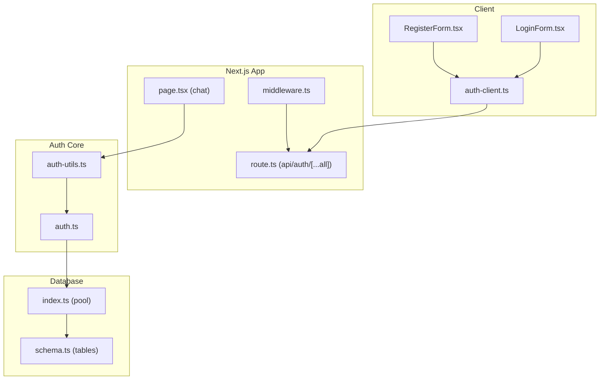
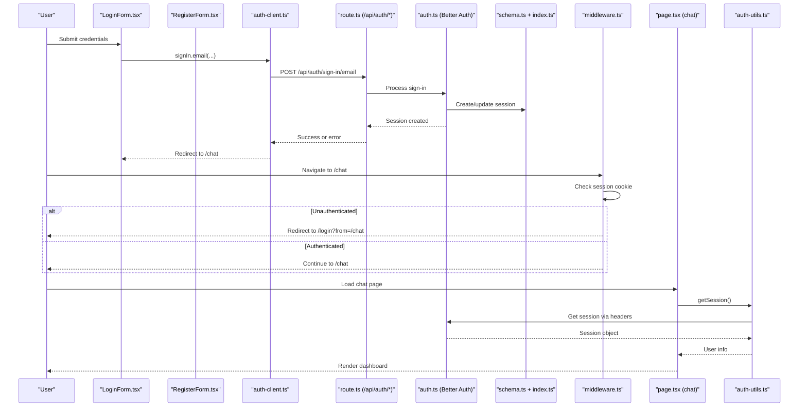
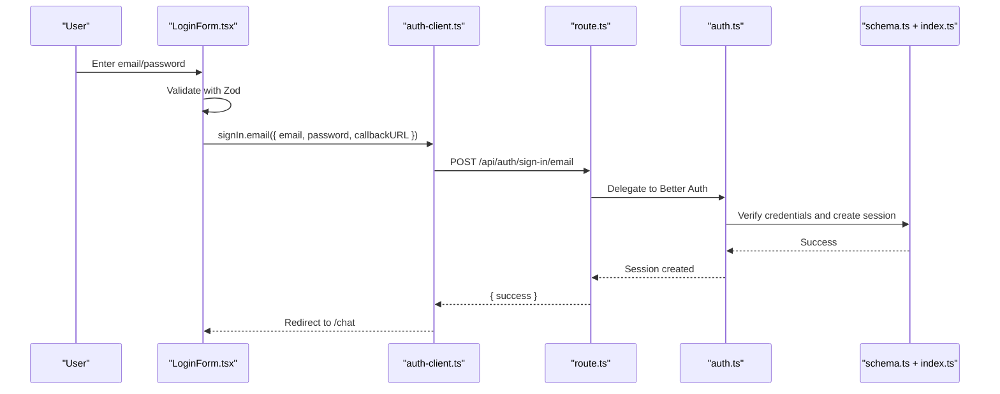
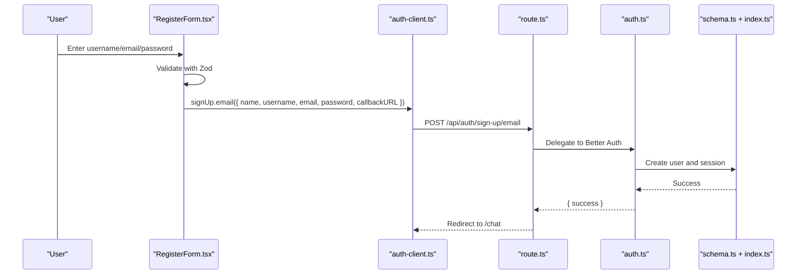
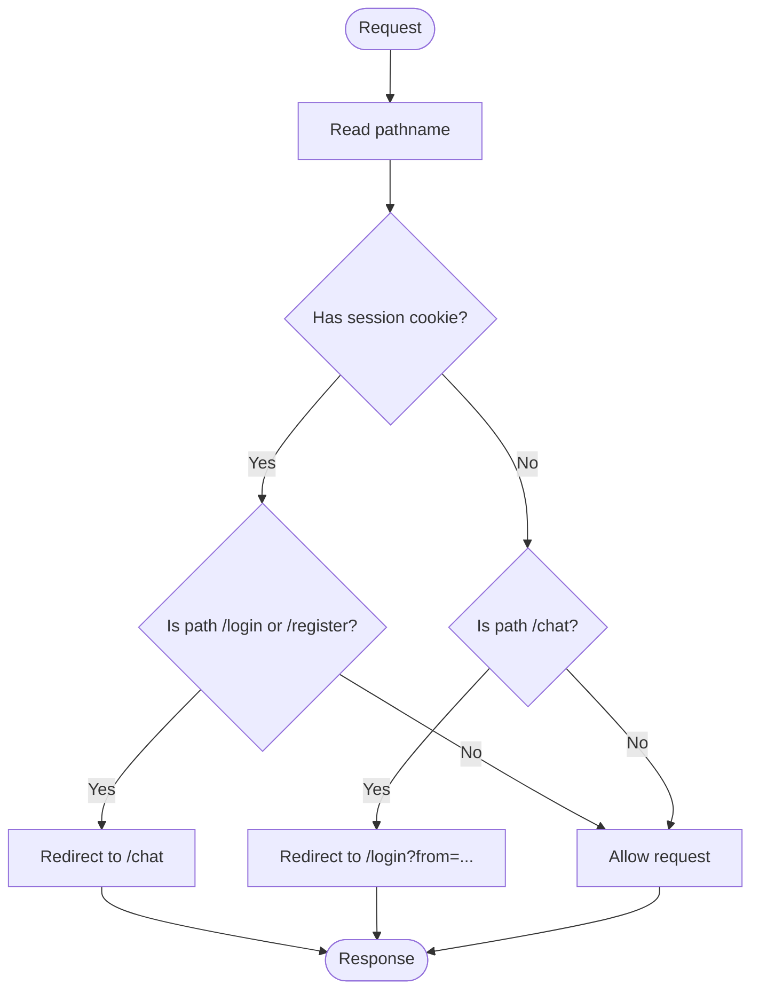
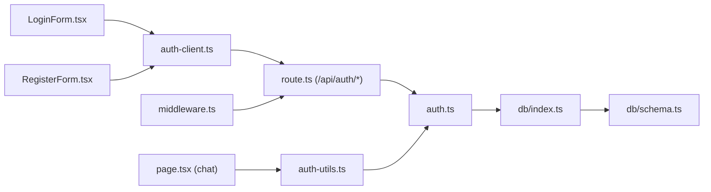

# Authentication System

<cite>
**Referenced Files in This Document**
- [auth.ts](file://lib/auth.ts)
- [auth-client.ts](file://lib/auth-client.ts)
- [route.ts](file://app/api/auth/[...all]/route.ts)
- [middleware.ts](file://middleware.ts)
- [LoginForm.tsx](file://components/auth/LoginForm.tsx)
- [RegisterForm.tsx](file://components/auth/RegisterForm.tsx)
- [schema.ts](file://lib/db/schema.ts)
- [index.ts](file://lib/db/index.ts)
- [auth-utils.ts](file://lib/auth-utils.ts)
- [page.tsx](file://app/(chat)/chat/page.tsx)
- [login page.tsx](file://app/(auth)/login/page.tsx)
- [register page.tsx](file://app/(auth)/register/page.tsx)
- [auth.ts (validations)](file://lib/validations/auth.ts)
</cite>

## Table of Contents
1. [Introduction](#introduction)
2. [Project Structure](#project-structure)
3. [Core Components](#core-components)
4. [Architecture Overview](#architecture-overview)
5. [Detailed Component Analysis](#detailed-component-analysis)
6. [Dependency Analysis](#dependency-analysis)
7. [Performance Considerations](#performance-considerations)
8. [Security Considerations](#security-considerations)
9. [Troubleshooting Guide](#troubleshooting-guide)
10. [Conclusion](#conclusion)

## Introduction
This document explains the authentication system built with Better Auth for a Next.js application. It covers user registration and login flows, session management, route protection via middleware, server-side session helpers, client-side state integration, form validation with Zod, error handling, and security considerations such as trusted origins, cookie attributes, and input validation. It also shows how protected routes are enforced on both the edge (middleware) and server components.

## Project Structure
The authentication system spans server configuration, API routing, middleware guards, database schema, and React UI components:

- Server configuration and API:
  - Better Auth instance and plugins
  - Next.js API handler for all auth endpoints
  - Middleware-based route protection
  - Database connection and schema
- Client integration:
  - Auth client exports for sign-in/sign-up/session
  - Validation schemas for forms
  - Login and Register pages with form components
  - Protected chat page using server-side session check

**Diagram sources**
- [auth.ts](file://lib/auth.ts)
- [auth-client.ts](file://lib/auth-client.ts)
- [route.ts](file://app/api/auth/[...all]/route.ts)
- [middleware.ts](file://middleware.ts)
- [auth-utils.ts](file://lib/auth-utils.ts)
- [index.ts](file://lib/db/index.ts)
- [schema.ts](file://lib/db/schema.ts)
- [page.tsx](file://app/(chat)/chat/page.tsx)

**Section sources**
- [auth.ts](file://lib/auth.ts)
- [auth-client.ts](file://lib/auth-client.ts)
- [route.ts](file://app/api/auth/[...all]/route.ts)
- [middleware.ts](file://middleware.ts)
- [schema.ts](file://lib/db/schema.ts)
- [index.ts](file://lib/db/index.ts)
- [page.tsx](file://app/(chat)/chat/page.tsx)

## Core Components
- Better Auth configuration:
  - Enables email/password with auto sign-in
  - Adds a required additional field username to users
  - Configures session lifetime and update age
  - Sets trusted origins per environment
  - Uses nextCookies plugin for cookie support
  - In development, sets secure cross-site cookies for preview environments
- API route:
  - Exposes all Better Auth endpoints under /api/auth via a catch-all route
- Middleware:
  - Protects /chat by redirecting unauthenticated users to /login
  - Redirects authenticated users away from /login and /register
- Client SDK:
  - Provides signIn, signUp, signOut, and useSession hooks
- Validation:
  - Zod schemas enforce constraints for register and login inputs
- Database:
  - Shared PostgreSQL pool used by Drizzle and Better Auth
  - Schema includes user, session, account, verification tables plus app-specific tables

**Section sources**
- [auth.ts](file://lib/auth.ts)
- [route.ts](file://app/api/auth/[...all]/route.ts)
- [middleware.ts](file://middleware.ts)
- [auth-client.ts](file://lib/auth-client.ts)
- [auth.ts (validations)](file://lib/validations/auth.ts)
- [index.ts](file://lib/db/index.ts)
- [schema.ts](file://lib/db/schema.ts)

## Architecture Overview
The flow integrates client forms, Better Auth client SDK, server API routes, middleware guards, and server-side session checks.

**Diagram sources**
- [LoginForm.tsx](file://components/auth/LoginForm.tsx)
- [RegisterForm.tsx](file://components/auth/RegisterForm.tsx)
- [auth-client.ts](file://lib/auth-client.ts)
- [route.ts](file://app/api/auth/[...all]/route.ts)
- [auth.ts](file://lib/auth.ts)
- [schema.ts](file://lib/db/schema.ts)
- [index.ts](file://lib/db/index.ts)
- [middleware.ts](file://middleware.ts)
- [page.tsx](file://app/(chat)/chat/page.tsx)
- [auth-utils.ts](file://lib/auth-utils.ts)

## Detailed Component Analysis

### Authentication Configuration (Server)
- Email/password enabled with automatic sign-in after successful registration/login
- Additional user field username is required and exposed to inputs
- Trusted origins configured per environment to allow proper cookie handling
- Session settings:
  - Token expiration set to 7 days
  - Update age set to 1 day to refresh sessions periodically
- Development-only cookie attributes force secure, cross-site cookies for preview iframes
- nextCookies plugin enables cookie usage in Next.js

**Section sources**
- [auth.ts](file://lib/auth.ts)

### API Route Handler
- A single catch-all route exposes all Better Auth endpoints under /api/auth
- Delegates all GET/POST requests to Better Auth’s Next.js adapter

**Section sources**
- [route.ts](file://app/api/auth/[...all]/route.ts)

### Middleware-Based Route Protection
- Defines protected paths and auth-only paths
- Reads session cookie without hitting the database
- Redirects:
  - Authenticated users away from login/register
  - Unauthenticated users to login with a “from” query parameter
- Matcher excludes static assets and the /api/auth prefix

**Section sources**
- [middleware.ts](file://middleware.ts)

### Client-Side Authentication State Management
- Creates an auth client that exports signIn, signUp, signOut, and useSession
- Forms call signIn.email and signUp.email with callbackURL to navigate post-auth
- Error states are handled by checking response.error and mapping messages

**Section sources**
- [auth-client.ts](file://lib/auth-client.ts)
- [LoginForm.tsx](file://components/auth/LoginForm.tsx)
- [RegisterForm.tsx](file://components/auth/RegisterForm.tsx)

### Form Validation with Zod
- Registration schema enforces:
  - Username format and length
  - Valid email
  - Password length limits
  - Confirm password matching
- Login schema enforces:
  - Valid email
  - Non-empty password
- Errors are mapped to fields and displayed inline; server errors are shown at the top

**Section sources**
- [auth.ts (validations)](file://lib/validations/auth.ts)
- [LoginForm.tsx](file://components/auth/LoginForm.tsx)
- [RegisterForm.tsx](file://components/auth/RegisterForm.tsx)

### Database Schema and Session Storage
- Shared PostgreSQL pool used by both Drizzle and Better Auth
- Required Better Auth tables:
  - user (includes username additional field)
  - session (with token, expiry, ip, user agent, userId)
  - account (provider details and password storage)
  - verification (email verification tokens)
- Application-specific tables for conversations and messages exist alongside auth tables

**Section sources**
- [index.ts](file://lib/db/index.ts)
- [schema.ts](file://lib/db/schema.ts)

### Protected Routes and Server-Side Checks
- The chat page performs a server-side session check and redirects to login if not authenticated
- Passes current user data to the client component for rendering

**Section sources**
- [page.tsx](file://app/(chat)/chat/page.tsx)
- [auth-utils.ts](file://lib/auth-utils.ts)

### Login Flow Sequence

**Diagram sources**
- [LoginForm.tsx](file://components/auth/LoginForm.tsx)
- [auth-client.ts](file://lib/auth-client.ts)
- [route.ts](file://app/api/auth/[...all]/route.ts)
- [auth.ts](file://lib/auth.ts)
- [schema.ts](file://lib/db/schema.ts)
- [index.ts](file://lib/db/index.ts)

### Registration Flow Sequence

**Diagram sources**
- [RegisterForm.tsx](file://components/auth/RegisterForm.tsx)
- [auth-client.ts](file://lib/auth-client.ts)
- [route.ts](file://app/api/auth/[...all]/route.ts)
- [auth.ts](file://lib/auth.ts)
- [schema.ts](file://lib/db/schema.ts)
- [index.ts](file://lib/db/index.ts)

### Protected Route Guard (Middleware)

**Diagram sources**
- [middleware.ts](file://middleware.ts)

## Dependency Analysis
- Client components depend on the auth client SDK for network calls and session hooks
- The auth client SDK depends on the server’s /api/auth endpoints
- The server API delegates to Better Auth, which depends on the database pool and schema
- Middleware depends on session cookies to protect routes
- Server components use auth-utils to fetch sessions via headers

**Diagram sources**
- [LoginForm.tsx](file://components/auth/LoginForm.tsx)
- [RegisterForm.tsx](file://components/auth/RegisterForm.tsx)
- [auth-client.ts](file://lib/auth-client.ts)
- [route.ts](file://app/api/auth/[...all]/route.ts)
- [auth.ts](file://lib/auth.ts)
- [index.ts](file://lib/db/index.ts)
- [schema.ts](file://lib/db/schema.ts)
- [middleware.ts](file://middleware.ts)
- [page.tsx](file://app/(chat)/chat/page.tsx)
- [auth-utils.ts](file://lib/auth-utils.ts)

**Section sources**
- [auth-client.ts](file://lib/auth-client.ts)
- [route.ts](file://app/api/auth/[...all]/route.ts)
- [auth.ts](file://lib/auth.ts)
- [index.ts](file://lib/db/index.ts)
- [schema.ts](file://lib/db/schema.ts)
- [middleware.ts](file://middleware.ts)
- [page.tsx](file://app/(chat)/chat/page.tsx)
- [auth-utils.ts](file://lib/auth-utils.ts)

## Performance Considerations
- Middleware uses session cookie inspection to avoid database calls for route protection
- Single shared database pool reduces connection overhead
- Short-lived sessions with periodic updates balance security and performance
- Client-side validation prevents unnecessary network requests

[No sources needed since this section provides general guidance]

## Security Considerations
- Input validation:
  - Zod schemas enforce strict rules for usernames, emails, and passwords
  - Confirm password ensures consistency before submission
- Session security:
  - Session expiration and update age configured to limit exposure
  - Trusted origins restrict where cookies are accepted
  - Development mode forces secure, cross-site cookies for iframe previews
- Route protection:
  - Middleware blocks access to protected routes without a valid session
  - Server components re-validate sessions before rendering sensitive data
- CSRF and cookies:
  - Cookies are managed by Better Auth and Next.js; ensure HTTPS in production
  - Avoid exposing sensitive data in logs or URLs
- Data integrity:
  - Unique constraints on email and username prevent duplicates
  - Foreign key relationships maintain referential integrity for sessions and accounts

**Section sources**
- [auth.ts (validations)](file://lib/validations/auth.ts)
- [auth.ts](file://lib/auth.ts)
- [middleware.ts](file://middleware.ts)
- [schema.ts](file://lib/db/schema.ts)

## Troubleshooting Guide
- Cannot access /chat:
  - Ensure you have a valid session cookie; middleware will redirect to /login if missing
  - Verify trusted origins include your frontend URL
- Sign-in fails:
  - Check Zod validation errors on the client
  - Inspect server error message returned by signIn and display to the user
- Registration conflicts:
  - If email or username exists, map the error to a user-friendly message
- Session not persisting in dev:
  - Confirm sameSite and secure cookie attributes are set for preview environments
- Server component cannot read session:
  - Use getSession via headers to retrieve the session in server components

**Section sources**
- [middleware.ts](file://middleware.ts)
- [LoginForm.tsx](file://components/auth/LoginForm.tsx)
- [RegisterForm.tsx](file://components/auth/RegisterForm.tsx)
- [auth.ts](file://lib/auth.ts)
- [auth-utils.ts](file://lib/auth-utils.ts)

## Conclusion
This authentication system leverages Better Auth for robust, standards-compliant identity management within a Next.js application. It combines middleware-based route protection, server-side session checks, strict input validation, and secure session configuration. The client integrates seamlessly through the Better Auth React SDK, enabling smooth login, registration, and navigation flows while maintaining strong security practices.