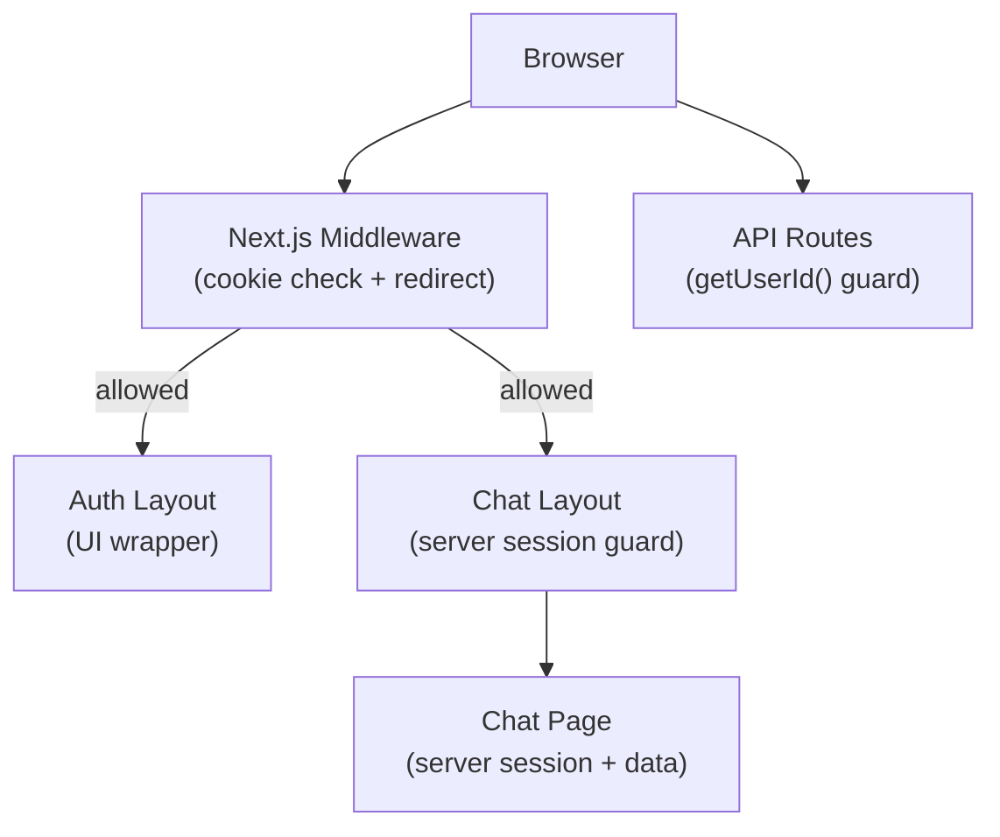
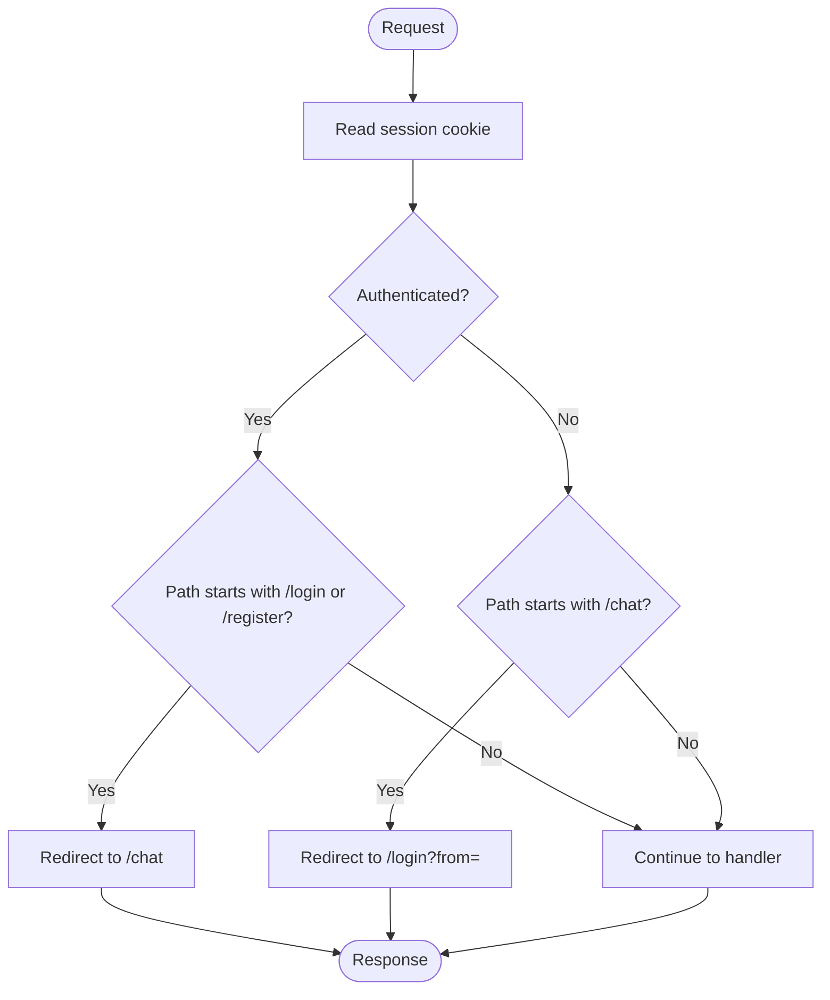
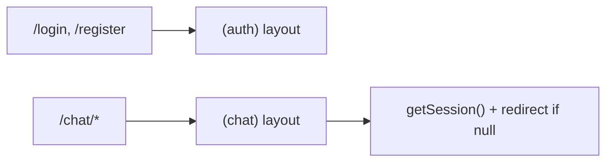
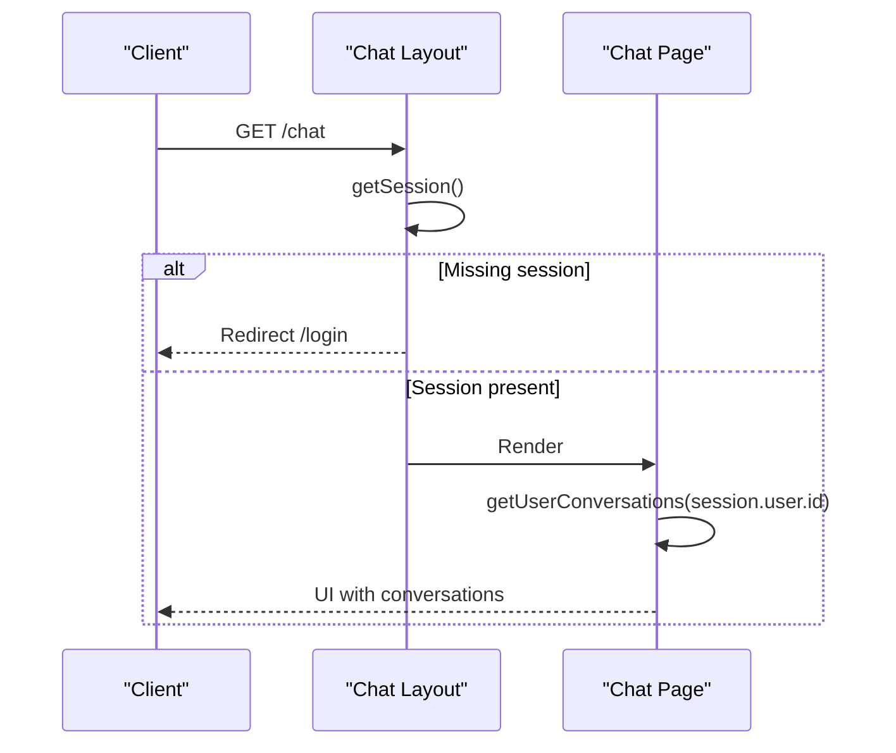
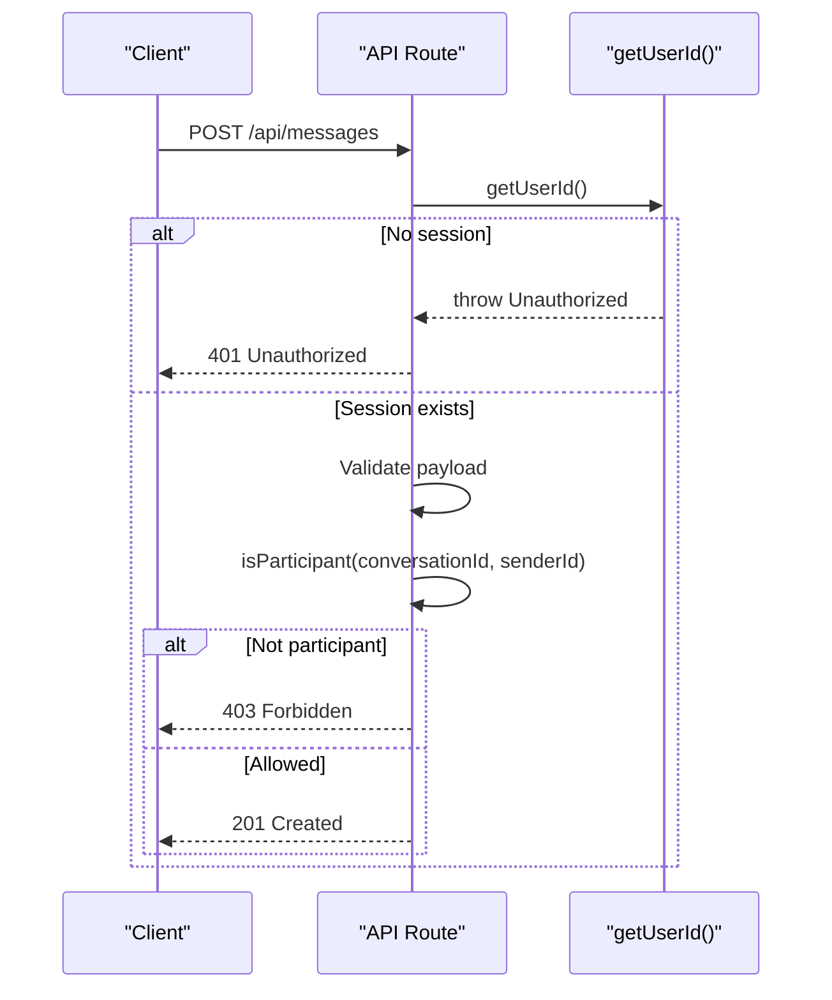
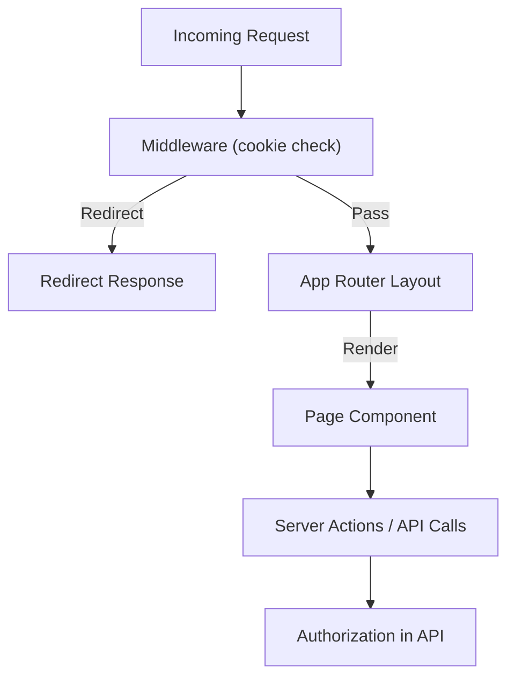
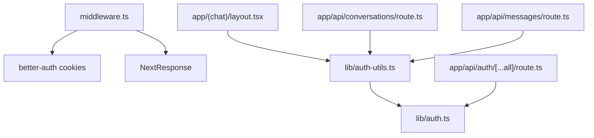

# Route Protection

<cite>
**Referenced Files in This Document**
- [middleware.ts](file://middleware.ts)
- [lib/auth.ts](file://lib/auth.ts)
- [lib/auth-utils.ts](file://lib/auth-utils.ts)
- [app/(auth)/layout.tsx](file://app/(auth)/layout.tsx)
- [app/(chat)/layout.tsx](file://app/(chat)/layout.tsx)
- [app/(auth)/login/page.tsx](file://app/(auth)/login/page.tsx)
- [app/(chat)/chat/page.tsx](file://app/(chat)/chat/page.tsx)
- [app/api/auth/[...all]/route.ts](file://app/api/auth/[...all]/route.ts)
- [app/api/conversations/route.ts](file://app/api/conversations/route.ts)
- [app/api/messages/route.ts](file://app/api/messages/route.ts)
- [lib/auth-client.ts](file://lib/auth-client.ts)
</cite>

## Table of Contents
1. [Introduction](#introduction)
2. [Project Structure](#project-structure)
3. [Core Components](#core-components)
4. [Architecture Overview](#architecture-overview)
5. [Detailed Component Analysis](#detailed-component-analysis)
6. [Dependency Analysis](#dependency-analysis)
7. [Performance Considerations](#performance-considerations)
8. [Troubleshooting Guide](#troubleshooting-guide)
9. [Conclusion](#conclusion)
10. [Appendices](#appendices)

## Introduction
This document explains how route protection and authentication guards are implemented in the application using Next.js App Router and Better Auth. It covers middleware-based redirects, layout-level server-side guards, protected route patterns, redirect logic for unauthenticated users, and server-side access control in API routes. It also outlines where role-based access control can be integrated and clarifies execution order with the Next.js App Router.

## Project Structure
Route protection spans three layers:
- Middleware: fast cookie-based checks to redirect unauthenticated or authenticated users at the edge.
- Layouts: server-side session checks that enforce access before rendering UI.
- API routes: server-side authorization utilities to protect data operations.



**Diagram sources**
- [middleware.ts:7-27](file://middleware.ts#L7-L27)
- [app/(chat)/layout.tsx:9-21](file://app/(chat)/layout.tsx#L9-L21)
- [app/(chat)/chat/page.tsx:6-26](file://app/(chat)/chat/page.tsx#L6-L26)
- [app/api/conversations/route.ts:14-26](file://app/api/conversations/route.ts#L14-L26)
- [app/api/messages/route.ts:12-49](file://app/api/messages/route.ts#L12-L49)

**Section sources**
- [middleware.ts:1-42](file://middleware.ts#L1-L42)
- [app/(chat)/layout.tsx:1-22](file://app/(chat)/layout.tsx#L1-L22)
- [app/(chat)/chat/page.tsx:1-27](file://app/(chat)/chat/page.tsx#L1-L27)
- [app/api/conversations/route.ts:1-81](file://app/api/conversations/route.ts#L1-L81)
- [app/api/messages/route.ts:1-51](file://app/api/messages/route.ts#L1-L51)

## Core Components
- Middleware: Reads the Better Auth session cookie and enforces redirects for protected and auth routes.
- Session utilities: Server-side helpers to fetch the current session and user ID, throwing on unauthorized access.
- Layout guards: The chat layout performs a server-side session check and redirects to login if missing.
- API guards: Each sensitive API route calls the user ID utility to ensure the caller is authenticated and authorized.

Key responsibilities:
- Fast path protection via middleware (no DB call).
- Stronger server-side protection in layouts and API handlers.
- Consistent redirect behavior for unauthenticated users.

**Section sources**
- [middleware.ts:7-27](file://middleware.ts#L7-L27)
- [lib/auth-utils.ts:7-20](file://lib/auth-utils.ts#L7-L20)
- [app/(chat)/layout.tsx:9-21](file://app/(chat)/layout.tsx#L9-L21)
- [app/api/conversations/route.ts:14-26](file://app/api/conversations/route.ts#L14-L26)
- [app/api/messages/route.ts:12-49](file://app/api/messages/route.ts#L12-L49)

## Architecture Overview
The system uses layered protection:
- Middleware intercepts requests early, checking only the presence of a session cookie to decide redirects.
- Layouts perform server-side session validation before rendering any content.
- API routes validate identity and permissions before accessing data.

```mermaid
sequenceDiagram
participant B as "Browser"
participant M as "Middleware"
participant L as "Chat Layout"
participant P as "Chat Page"
participant A as "API Route"
B->>M : Request /chat
M-->>B : Redirect to /login?from=/chat (if no session)
Note over M : Cookie-only check; fast path
B->>L : Request /chat (after login)
L->>L : getSession()
alt No session
L-->>B : Redirect /login
else Session exists
L->>P : Render page
end
B->>A : POST /api/messages
A->>A : getUserId() -> throws if no session
A-->>B : JSON response (success or error)
```

**Diagram sources**
- [middleware.ts:7-27](file://middleware.ts#L7-L27)
- [app/(chat)/layout.tsx:9-21](file://app/(chat)/layout.tsx#L9-L21)
- [app/(chat)/chat/page.tsx:6-26](file://app/(chat)/chat/page.tsx#L6-L26)
- [app/api/messages/route.ts:12-49](file://app/api/messages/route.ts#L12-L49)
- [lib/auth-utils.ts:7-20](file://lib/auth-utils.ts#L7-L20)

## Detailed Component Analysis

### Middleware: Fast Path Protection and Redirect Logic
- Protected routes list: Any path starting with /chat requires authentication.
- Auth routes list: /login and /register redirect authenticated users to /chat.
- Redirects:
  - Unauthenticated to /login with a from parameter preserving the intended destination.
  - Authenticated away from /login and /register to /chat.
- Matcher excludes static assets and the auth API endpoints so they are not intercepted.



**Diagram sources**
- [middleware.ts:7-27](file://middleware.ts#L7-L27)
- [middleware.ts:29-41](file://middleware.ts#L29-L41)

**Section sources**
- [middleware.ts:1-42](file://middleware.ts#L1-L42)

### Layout-Based Route Groups: Auth vs Chat
- Auth layout wraps sign-in/sign-up pages with consistent branding and form card styling.
- Chat layout enforces server-side authentication by fetching the session and redirecting to /login when missing.



**Diagram sources**
- [app/(auth)/layout.tsx:7-43](file://app/(auth)/layout.tsx#L7-L43)
- [app/(chat)/layout.tsx:9-21](file://app/(chat)/layout.tsx#L9-L21)

**Section sources**
- [app/(auth)/layout.tsx:1-44](file://app/(auth)/layout.tsx#L1-L44)
- [app/(chat)/layout.tsx:1-22](file://app/(chat)/layout.tsx#L1-L22)

### Server-Side Authentication Checks in Pages and Layouts
- Chat page re-validates session and loads user-specific data after confirming identity.
- Chat layout ensures all nested routes under /chat are protected even if middleware fails or is bypassed.



**Diagram sources**
- [app/(chat)/layout.tsx:9-21](file://app/(chat)/layout.tsx#L9-L21)
- [app/(chat)/chat/page.tsx:6-26](file://app/(chat)/chat/page.tsx#L6-L26)

**Section sources**
- [app/(chat)/layout.tsx:1-22](file://app/(chat)/layout.tsx#L1-L22)
- [app/(chat)/chat/page.tsx:1-27](file://app/(chat)/chat/page.tsx#L1-L27)

### API Route Access Control Patterns
- All sensitive API routes use a shared utility to obtain the current user ID from the session. If no session exists, it throws an error that is caught and returned as a 401 Unauthorized response.
- Additional authorization checks (e.g., verifying participation in a conversation) return 403 Forbidden when the user lacks permission.



**Diagram sources**
- [app/api/messages/route.ts:12-49](file://app/api/messages/route.ts#L12-L49)
- [lib/auth-utils.ts:7-20](file://lib/auth-utils.ts#L7-L20)
- [app/api/conversations/route.ts:14-26](file://app/api/conversations/route.ts#L14-L26)

**Section sources**
- [app/api/conversations/route.ts:1-81](file://app/api/conversations/route.ts#L1-L81)
- [app/api/messages/route.ts:1-51](file://app/api/messages/route.ts#L1-L51)
- [lib/auth-utils.ts:1-21](file://lib/auth-utils.ts#L1-L21)

### Integration with Next.js App Router and Middleware Execution Order
- Middleware runs first for matching paths, performing cookie-based checks and redirects before any route handler or layout executes.
- After middleware allows the request, Next.js renders the appropriate layout and page. Layouts can perform additional server-side session checks.
- API routes execute last and must independently verify identity and permissions.



[No sources needed since this diagram shows conceptual workflow, not actual code structure]

### Protecting Specific Routes and Handling Redirects
- Protecting /chat and its subpaths:
  - Middleware redirects unauthenticated users to /login with a from parameter.
  - Chat layout and page re-check the session server-side and redirect to /login if missing.
- Redirecting authenticated users away from /login and /register:
  - Middleware detects an existing session and redirects to /chat.

Examples of where these patterns are applied:
- Protected route group: [app/(chat)](file://app/(chat)/layout.tsx)
- Auth route group: [app/(auth)](file://app/(auth)/layout.tsx)
- Redirect logic: [middleware.ts](file://middleware.ts)

**Section sources**
- [middleware.ts:7-27](file://middleware.ts#L7-L27)
- [app/(chat)/layout.tsx:9-21](file://app/(chat)/layout.tsx#L9-L21)
- [app/(auth)/layout.tsx:7-43](file://app/(auth)/layout.tsx#L7-L43)

### Implementing Role-Based Access Control (RBAC)
Current implementation focuses on authentication (who you are). To add RBAC (what you can do):
- Extend session/user model to include roles and permissions.
- In middleware, optionally read role claims from the session cookie to enforce coarse-grained route groups (e.g., admin routes).
- In layouts/pages, after obtaining the session, check roles/permissions before rendering sensitive UI.
- In API routes, after getUserId(), check roles/permissions against resource ownership or explicit grants.

Where to integrate:
- Session retrieval: [lib/auth-utils.ts](file://lib/auth-utils.ts)
- API authorization points: [app/api/conversations/route.ts](file://app/api/conversations/route.ts), [app/api/messages/route.ts](file://app/api/messages/route.ts)
- Layout guards: [app/(chat)/layout.tsx](file://app/(chat)/layout.tsx)

[No sources needed since this section provides general guidance]

## Dependency Analysis
The following dependencies illustrate how components interact to enforce protection:



**Diagram sources**
- [middleware.ts:1-42](file://middleware.ts#L1-L42)
- [app/(chat)/layout.tsx:1-22](file://app/(chat)/layout.tsx#L1-L22)
- [lib/auth-utils.ts:1-21](file://lib/auth-utils.ts#L1-L21)
- [lib/auth.ts:1-65](file://lib/auth.ts#L1-L65)
- [app/api/conversations/route.ts:1-81](file://app/api/conversations/route.ts#L1-L81)
- [app/api/messages/route.ts:1-51](file://app/api/messages/route.ts#L1-L51)
- [app/api/auth/[...all]/route.ts:1-5](file://app/api/auth/[...all]/route.ts#L1-L5)

**Section sources**
- [middleware.ts:1-42](file://middleware.ts#L1-L42)
- [lib/auth-utils.ts:1-21](file://lib/auth-utils.ts#L1-L21)
- [lib/auth.ts:1-65](file://lib/auth.ts#L1-L65)
- [app/(chat)/layout.tsx:1-22](file://app/(chat)/layout.tsx#L1-L22)
- [app/api/conversations/route.ts:1-81](file://app/api/conversations/route.ts#L1-L81)
- [app/api/messages/route.ts:1-51](file://app/api/messages/route.ts#L1-L51)
- [app/api/auth/[...all]/route.ts:1-5](file://app/api/auth/[...all]/route.ts#L1-L5)

## Performance Considerations
- Middleware uses cookie inspection only, avoiding database calls for fast redirects.
- Layouts and pages perform minimal server-side checks; cache-friendly sessions reduce overhead.
- API routes centralize authorization via a single utility to avoid duplication and keep hot paths efficient.

[No sources needed since this section provides general guidance]

## Troubleshooting Guide
Common issues and resolutions:
- Infinite redirect loops:
  - Ensure the matcher excludes the auth API routes and static assets so they are not intercepted.
  - Verify that the from parameter is correctly set and handled by the login flow.
- Middleware not running:
  - Confirm the matcher includes your target paths and excludes necessary prefixes.
- Session not recognized:
  - Check environment configuration for trusted origins and cookie attributes, especially in development.
- API returns 401:
  - Ensure the client sends requests with credentials and that the session cookie is present.
  - Confirm that getUserId() is called in every sensitive API route.

**Section sources**
- [middleware.ts:29-41](file://middleware.ts#L29-L41)
- [lib/auth.ts:28-63](file://lib/auth.ts#L28-L63)
- [app/api/conversations/route.ts:14-26](file://app/api/conversations/route.ts#L14-L26)
- [app/api/messages/route.ts:12-49](file://app/api/messages/route.ts#L12-L49)

## Conclusion
The application implements robust route protection through a layered approach:
- Middleware provides fast, cookie-based redirects for protected and auth routes.
- Layouts enforce server-side session checks before rendering.
- API routes centralize authorization using a shared utility to ensure data safety.
To extend protection, integrate role-based checks into layouts and API routes, leveraging the same session utilities already in place.

[No sources needed since this section summarizes without analyzing specific files]

## Appendices

### Client-Side Authentication Helpers
- The client exposes Better Auth hooks and methods for sign-in, sign-up, sign-out, and session state.

**Section sources**
- [lib/auth-client.ts:1-8](file://lib/auth-client.ts#L1-L8)