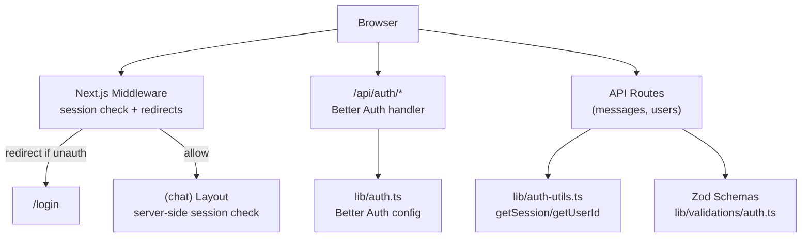
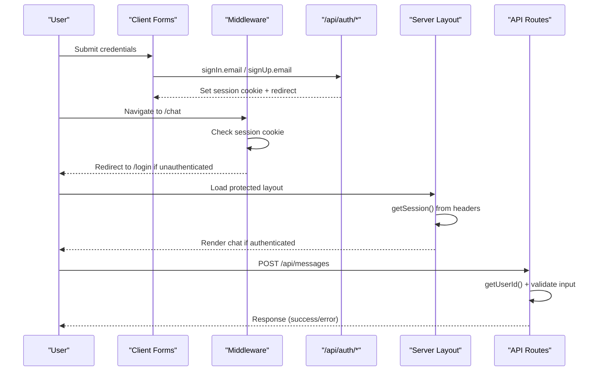
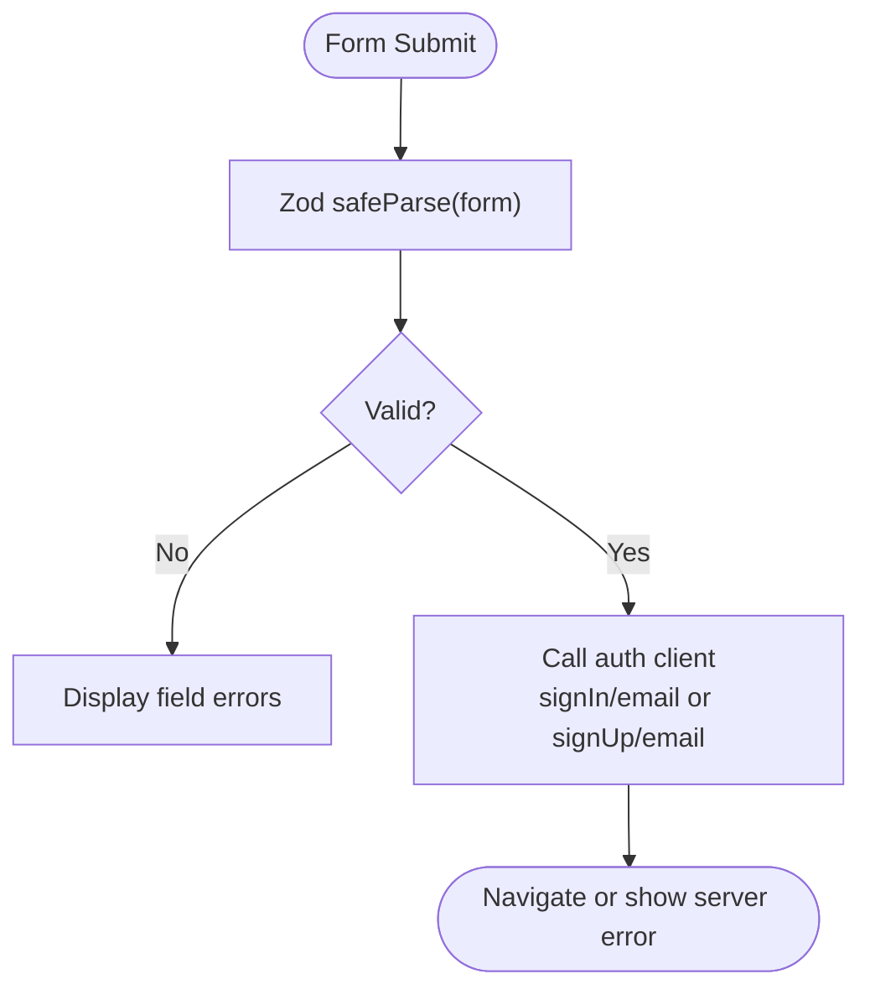
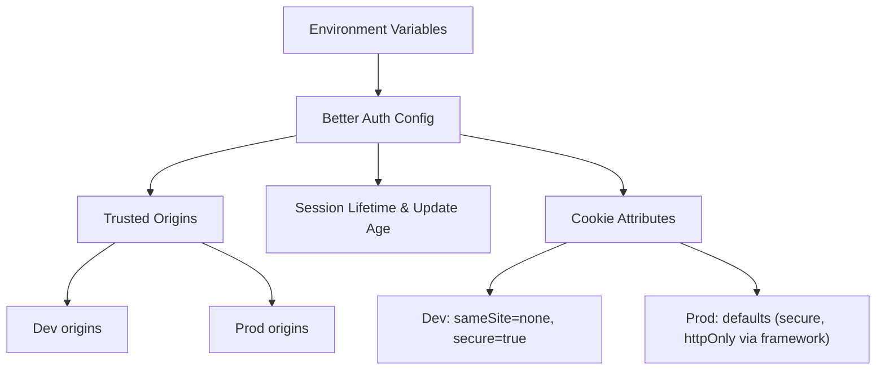
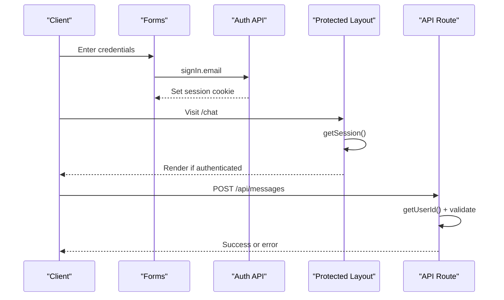
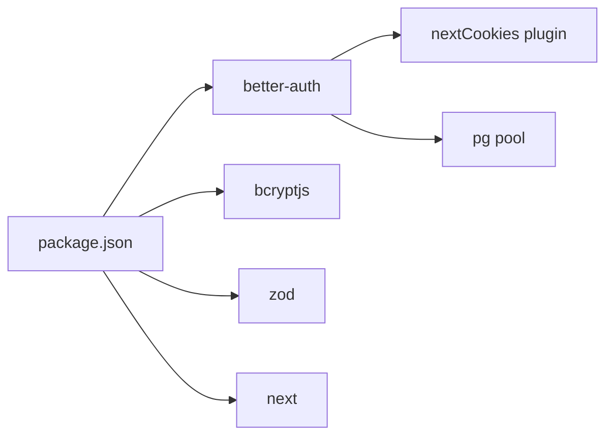

# Security Implementation

<cite>
**Referenced Files in This Document**
- [lib/auth.ts](file://lib/auth.ts)
- [lib/auth-utils.ts](file://lib/auth-utils.ts)
- [lib/auth-client.ts](file://lib/auth-client.ts)
- [middleware.ts](file://middleware.ts)
- [app/api/auth/[...all]/route.ts](file://app/api/auth/[...all]/route.ts)
- [lib/validations/auth.ts](file://lib/validations/auth.ts)
- [components/auth/LoginForm.tsx](file://components/auth/LoginForm.tsx)
- [components/auth/RegisterForm.tsx](file://components/auth/RegisterForm.tsx)
- [app/(chat)/layout.tsx](file://app/(chat)/layout.tsx)
- [app/api/messages/route.ts](file://app/api/messages/route.ts)
- [app/api/users/route.ts](file://app/api/users/route.ts)
- [package.json](file://package.json)
</cite>

## Table of Contents
1. Introduction
2. Project Structure
3. Core Components
4. Architecture Overview
5. Detailed Component Analysis
6. Dependency Analysis
7. Performance Considerations
8. Troubleshooting Guide
9. Conclusion

## Introduction
This document explains the security implementation for authentication and authorization in the application. It covers password hashing via bcryptjs (through Better Auth), input validation with Zod, CSRF considerations, secure cookie configuration, trusted origins setup, environment-specific security settings, and best practices for production deployment. It also includes examples of secure authentication flows, input sanitization, and error handling that avoids leaking sensitive information.

## Project Structure
Security-related code is primarily located under:
- Authentication configuration and session utilities: lib/auth.ts, lib/auth-utils.ts, lib/auth-client.ts
- Middleware and Next.js route handlers: middleware.ts, app/api/auth/[...all]/route.ts
- Input validation schemas: lib/validations/auth.ts
- UI forms using client-side validation: components/auth/LoginForm.tsx, components/auth/RegisterForm.tsx
- Protected layout guard: app/(chat)/layout.tsx
- API routes enforcing authorization and input validation: app/api/messages/route.ts, app/api/users/route.ts
- Dependencies: package.json

**Diagram sources**
- [middleware.ts:1-42](file://middleware.ts#L1-L42)
- [app/api/auth/[...all]/route.ts:1-5](file://app/api/auth/[...all]/route.ts#L1-L5)
- [lib/auth.ts:1-65](file://lib/auth.ts#L1-L65)
- [lib/auth-utils.ts:1-21](file://lib/auth-utils.ts#L1-L21)
- [lib/validations/auth.ts:1-29](file://lib/validations/auth.ts#L1-L29)
- [app/(chat)/layout.tsx:1-21](file://app/(chat)/layout.tsx#L1-L21)

**Section sources**
- [middleware.ts:1-42](file://middleware.ts#L1-L42)
- [lib/auth.ts:1-65](file://lib/auth.ts#L1-L65)
- [lib/auth-utils.ts:1-21](file://lib/auth-utils.ts#L1-L21)
- [lib/auth-client.ts:1-8](file://lib/auth-client.ts#L1-L8)
- [lib/validations/auth.ts:1-29](file://lib/validations/auth.ts#L1-L29)
- [app/(chat)/layout.tsx:1-21](file://app/(chat)/layout.tsx#L1-L21)
- [app/api/messages/route.ts:1-51](file://app/api/messages/route.ts#L1-L51)
- [app/api/users/route.ts:1-62](file://app/api/users/route.ts#L1-L62)
- [package.json:1-53](file://package.json#L1-L53)

## Core Components
- Better Auth configuration: centralizes database connection, base URL, email/password flow, user fields, trusted origins, session lifetime, and cookie attributes.
- Session helpers: server-only functions to retrieve session and authenticated user id.
- Client SDK: exposes signIn, signUp, signOut, and useSession for the frontend.
- Middleware: enforces access control by inspecting session cookies and redirecting appropriately.
- Validation: Zod schemas enforce input constraints on both registration and login forms.
- API routes: validate inputs, enforce authorization, and sanitize data before persistence or delivery.

**Section sources**
- [lib/auth.ts:1-65](file://lib/auth.ts#L1-L65)
- [lib/auth-utils.ts:1-21](file://lib/auth-utils.ts#L1-L21)
- [lib/auth-client.ts:1-8](file://lib/auth-client.ts#L1-L8)
- [middleware.ts:1-42](file://middleware.ts#L1-L42)
- [lib/validations/auth.ts:1-29](file://lib/validations/auth.ts#L1-L29)
- [app/api/messages/route.ts:1-51](file://app/api/messages/route.ts#L1-L51)
- [app/api/users/route.ts:1-62](file://app/api/users/route.ts#L1-L62)

## Architecture Overview
The authentication architecture combines a robust backend framework (Better Auth) with Next.js middleware and server-side guards to ensure only authenticated users access protected resources. Input validation is enforced at the boundary (client and server) using Zod. Cookies are configured securely per environment.

**Diagram sources**
- [components/auth/LoginForm.tsx:17-55](file://components/auth/LoginForm.tsx#L17-L55)
- [components/auth/RegisterForm.tsx:29-75](file://components/auth/RegisterForm.tsx#L29-L75)
- [middleware.ts:7-27](file://middleware.ts#L7-L27)
- [app/(chat)/layout.tsx:9-21](file://app/(chat)/layout.tsx#L9-L21)
- [app/api/messages/route.ts:12-50](file://app/api/messages/route.ts#L12-L50)
- [app/api/auth/[...all]/route.ts:1-5](file://app/api/auth/[...all]/route.ts#L1-L5)

## Detailed Component Analysis

### Password Hashing with bcryptjs
- The project depends on bcryptjs and uses Better Auth’s email/password provider. Better Auth handles password hashing internally; bcryptjs is present in dependencies and can be used directly if custom hashing logic is needed elsewhere.
- Best practice: rely on the framework’s built-in hashing and avoid implementing custom hashing unless necessary.

**Section sources**
- [package.json:13-34](file://package.json#L13-L34)
- [lib/auth.ts:14-17](file://lib/auth.ts#L14-L17)

### Input Validation with Zod
- Registration schema enforces username format, length limits, valid email, minimum password length, and password confirmation match.
- Login schema validates email presence and non-empty password.
- Client forms parse inputs before sending requests, providing immediate feedback and preventing invalid payloads from reaching the server.

**Diagram sources**
- [lib/validations/auth.ts:3-25](file://lib/validations/auth.ts#L3-L25)
- [components/auth/LoginForm.tsx:17-55](file://components/auth/LoginForm.tsx#L17-L55)
- [components/auth/RegisterForm.tsx:29-75](file://components/auth/RegisterForm.tsx#L29-L75)

**Section sources**
- [lib/validations/auth.ts:1-29](file://lib/validations/auth.ts#L1-L29)
- [components/auth/LoginForm.tsx:17-55](file://components/auth/LoginForm.tsx#L17-L55)
- [components/auth/RegisterForm.tsx:29-75](file://components/auth/RegisterForm.tsx#L29-L75)

### CSRF Protection
- The application uses Better Auth’s Next.js integration and sets cookies via the framework. In this pattern, CSRF tokens are typically managed by the library when using form-based submissions or token endpoints. For direct JSON APIs, state-changing operations should still be guarded by strong session checks and origin validation.
- Ensure all state-changing endpoints require a valid session and are served over HTTPS. Validate request origins where applicable.

[No sources needed since this section provides general guidance]

### Secure Cookie Configuration
- Base URL is derived from environment variables to ensure correct cookie domain/path behavior.
- Trusted origins are set per environment:
  - Development allows local and preview URLs.
  - Production restricts to Vercel domains.
- Session lifetime and update age are configured.
- In development, cookies are forced cross-site with secure flag to work inside iframes; in production, default secure flags apply.

**Diagram sources**
- [lib/auth.ts:5-64](file://lib/auth.ts#L5-L64)

**Section sources**
- [lib/auth.ts:5-64](file://lib/auth.ts#L5-L64)

### Trusted Origins Setup
- Development origins include localhost and optional v0 runtime/build/sandbox URLs.
- Production origins include Vercel URLs constructed from environment variables.
- This restricts which origins can interact with sensitive endpoints and helps prevent certain cross-origin attacks.

**Section sources**
- [lib/auth.ts:28-46](file://lib/auth.ts#L28-L46)

### Environment-Specific Security Configurations
- Base URL selection prioritizes explicit env vars and falls back to platform-provided URLs.
- Session duration and refresh behavior are defined centrally.
- Development-specific cookie attributes enable iframe compatibility while keeping secure flags.

**Section sources**
- [lib/auth.ts:7-13](file://lib/auth.ts#L7-L13)
- [lib/auth.ts:47-62](file://lib/auth.ts#L47-L62)

### Secure Authentication Flows
- Client-side validation ensures malformed inputs never reach the server.
- Server-side session retrieval and user ID extraction protect resource endpoints.
- Protected layouts perform an additional server-side session check to prevent rendering unauthorized content.

**Diagram sources**
- [components/auth/LoginForm.tsx:17-55](file://components/auth/LoginForm.tsx#L17-L55)
- [app/(chat)/layout.tsx:9-21](file://app/(chat)/layout.tsx#L9-L21)
- [app/api/messages/route.ts:12-50](file://app/api/messages/route.ts#L12-L50)
- [lib/auth-utils.ts:7-20](file://lib/auth-utils.ts#L7-L20)

**Section sources**
- [components/auth/LoginForm.tsx:17-55](file://components/auth/LoginForm.tsx#L17-L55)
- [components/auth/RegisterForm.tsx:29-75](file://components/auth/RegisterForm.tsx#L29-L75)
- [app/(chat)/layout.tsx:9-21](file://app/(chat)/layout.tsx#L9-L21)
- [lib/auth-utils.ts:7-20](file://lib/auth-utils.ts#L7-L20)
- [app/api/messages/route.ts:12-50](file://app/api/messages/route.ts#L12-L50)

### Input Sanitization
- Client forms trim and validate inputs before submission.
- API routes re-validate incoming payloads using Zod schemas and sanitize content (e.g., trimming message content).
- Authorization checks ensure operations are scoped to the authenticated user and permitted participants.

**Section sources**
- [components/auth/RegisterForm.tsx:29-75](file://components/auth/RegisterForm.tsx#L29-L75)
- [app/api/messages/route.ts:12-50](file://app/api/messages/route.ts#L12-L50)
- [app/api/users/route.ts:6-27](file://app/api/users/route.ts#L6-L27)

### Error Handling Without Leaking Sensitive Information
- API routes catch exceptions and return generic error messages with appropriate status codes.
- Unauthorized errors are mapped to 401 responses without exposing internals.
- Console logging captures detailed errors server-side only.

**Section sources**
- [app/api/messages/route.ts:43-50](file://app/api/messages/route.ts#L43-L50)
- [app/api/users/route.ts:21-27](file://app/api/users/route.ts#L21-L27)
- [app/api/users/route.ts:54-60](file://app/api/users/route.ts#L54-L60)

## Dependency Analysis
Key security-related dependencies:
- better-auth: authentication, sessions, and Next.js integration
- bcryptjs: cryptographic hashing (used by framework or available for custom needs)
- zod: runtime type validation
- next: framework-level middleware and routing

**Diagram sources**
- [package.json:13-34](file://package.json#L13-L34)
- [lib/auth.ts:1-3](file://lib/auth.ts#L1-L3)

**Section sources**
- [package.json:13-34](file://package.json#L13-L34)
- [lib/auth.ts:1-3](file://lib/auth.ts#L1-L3)

## Performance Considerations
- Middleware performs a fast cookie check without database calls for initial redirects.
- Session retrieval in protected layouts uses headers to avoid redundant network calls.
- Keep session lifetimes reasonable to balance security and performance.
- Avoid heavy computations in hot paths like message sending; keep validation minimal and efficient.

[No sources needed since this section provides general guidance]

## Troubleshooting Guide
- If users cannot access protected pages, verify middleware redirection logic and that session cookies are set correctly.
- If registration or login fails, check Zod validation errors and server error mapping to ensure user-friendly messages.
- If cookies do not persist in development, confirm environment-specific cookie attributes and trusted origins.

**Section sources**
- [middleware.ts:7-27](file://middleware.ts#L7-L27)
- [components/auth/LoginForm.tsx:17-55](file://components/auth/LoginForm.tsx#L17-L55)
- [components/auth/RegisterForm.tsx:29-75](file://components/auth/RegisterForm.tsx#L29-L75)
- [lib/auth.ts:28-62](file://lib/auth.ts#L28-L62)

## Conclusion
The application implements a layered security model:
- Strong password hashing via bcryptjs through Better Auth
- Rigorous input validation with Zod on both client and server
- Secure cookie configuration and trusted origins tailored per environment
- Middleware and server-side guards to enforce authentication
- Careful error handling that avoids leaking sensitive details

For production, ensure:
- HTTPS is enforced end-to-end
- Trusted origins strictly list production domains
- Session lifetimes are appropriate for your threat model
- Logging remains server-side only and does not expose secrets
- Regularly audit dependencies and update them to mitigate vulnerabilities

[No sources needed since this section summarizes without analyzing specific files]