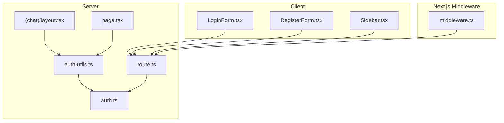
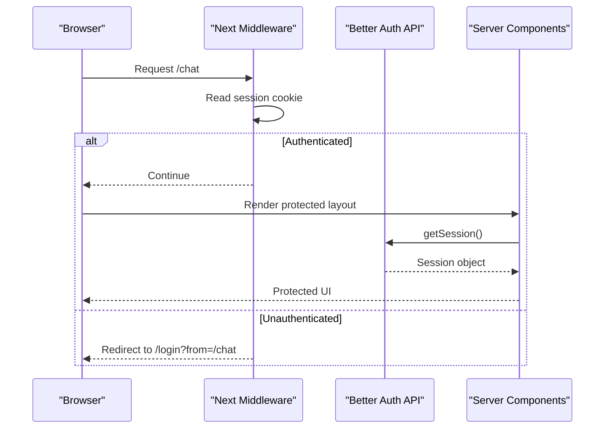
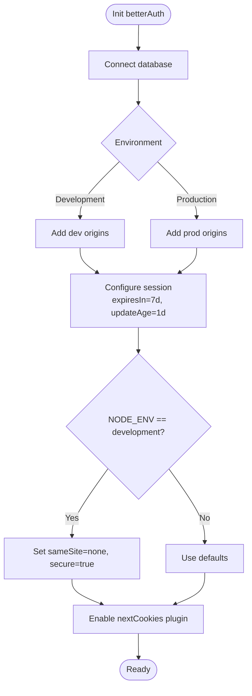
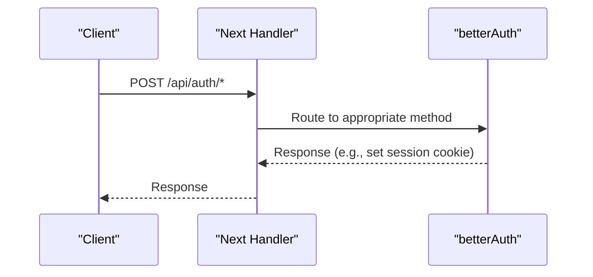
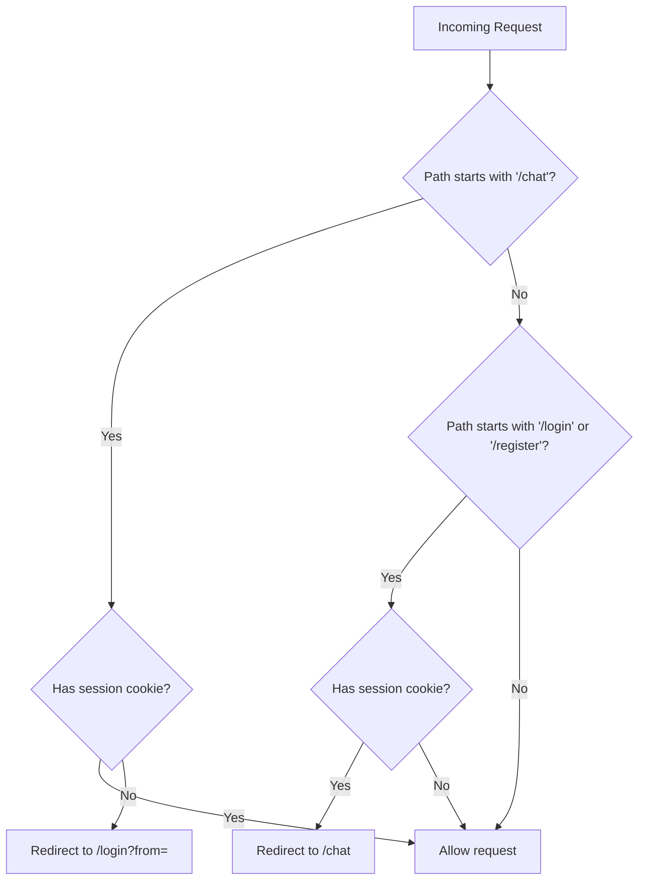
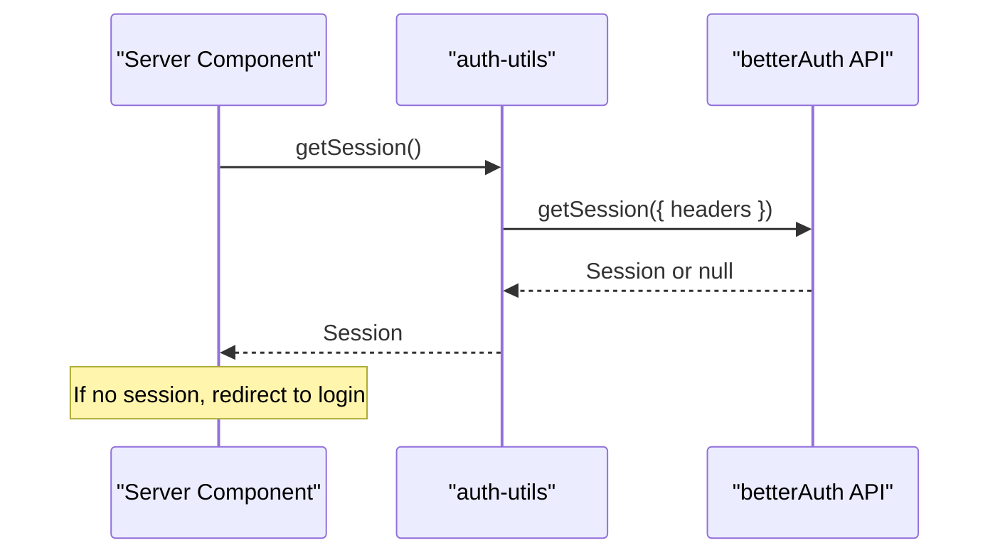
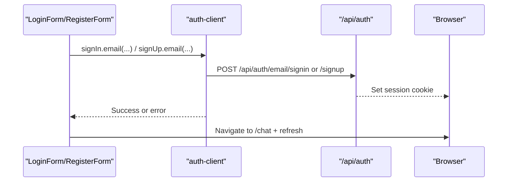
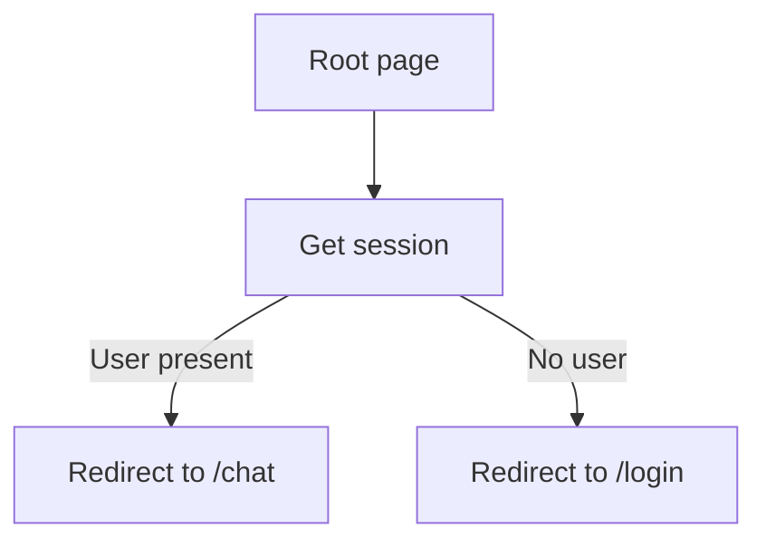
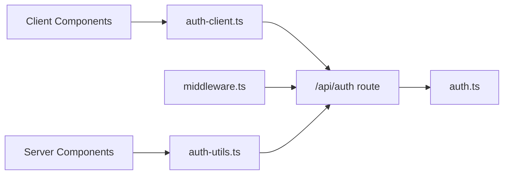

# Session Management

<cite>
**Referenced Files in This Document**
- [auth.ts](file://lib/auth.ts)
- [auth-client.ts](file://lib/auth-client.ts)
- [auth-utils.ts](file://lib/auth-utils.ts)
- [route.ts](file://app/api/auth/[...all]/route.ts)
- [middleware.ts](file://middleware.ts)
- [layout.tsx](file://app/(chat)/layout.tsx)
- [page.tsx](file://app/page.tsx)
- [LoginForm.tsx](file://components/auth/LoginForm.tsx)
- [RegisterForm.tsx](file://components/auth/RegisterForm.tsx)
- [Sidebar.tsx](file://components/chat/Sidebar.tsx)
</cite>

## Table of Contents
1. Introduction
2. Project Structure
3. Core Components
4. Architecture Overview
5. Detailed Component Analysis
6. Dependency Analysis
7. Performance Considerations
8. Troubleshooting Guide
9. Conclusion

## Introduction
This document explains how session management is implemented using Better Auth in the project. It covers configuration, expiration and update behavior, cookie attributes (including cross-site handling for development), trusted origins, server-side session retrieval, client-side session synchronization, and manual session operations such as sign-in and sign-out. It also provides diagrams to visualize request flows and state transitions across middleware, API routes, server components, and client components.

## Project Structure
Session-related code is organized into:
- Server-side configuration and API: auth setup, Next.js handler, and middleware
- Client-side SDK: React hooks and methods for sign-in/sign-out/session state
- Server utilities: helpers to read sessions on the server
- Pages/layouts: guards and redirects based on session presence
- UI components: forms that trigger authentication flows and a sidebar with sign-out

**Diagram sources**
- [auth.ts:1-64](file://lib/auth.ts#L1-L64)
- [route.ts:1-4](file://app/api/auth/[...all]/route.ts#L1-L4)
- [middleware.ts:1-42](file://middleware.ts#L1-L42)
- [auth-utils.ts:1-20](file://lib/auth-utils.ts#L1-L20)
- [layout.tsx:1-22](file://app/(chat)/layout.tsx#L1-L22)
- [page.tsx:1-22](file://app/page.tsx#L1-L22)
- [LoginForm.tsx:1-135](file://components/auth/LoginForm.tsx#L1-L135)
- [RegisterForm.tsx:1-161](file://components/auth/RegisterForm.tsx#L1-L161)
- [Sidebar.tsx:1-159](file://components/chat/Sidebar.tsx#L1-L159)

**Section sources**
- [auth.ts:1-64](file://lib/auth.ts#L1-L64)
- [route.ts:1-4](file://app/api/auth/[...all]/route.ts#L1-L4)
- [middleware.ts:1-42](file://middleware.ts#L1-L42)
- [auth-utils.ts:1-20](file://lib/auth-utils.ts#L1-L20)
- [layout.tsx:1-22](file://app/(chat)/layout.tsx#L1-L22)
- [page.tsx:1-22](file://app/page.tsx#L1-L22)
- [LoginForm.tsx:1-135](file://components/auth/LoginForm.tsx#L1-L135)
- [RegisterForm.tsx:1-161](file://components/auth/RegisterForm.tsx#L1-L161)
- [Sidebar.tsx:1-159](file://components/chat/Sidebar.tsx#L1-L159)

## Core Components
- Server configuration: Initializes Better Auth with database, base URL, email/password flow, user fields, trusted origins, session options, and Next.js plugin.
- API route: Exposes GET/POST handlers for all Better Auth endpoints via Next.js adapter.
- Middleware: Fast cookie-based guard to redirect authenticated users away from login/register and unauthenticated users to login when accessing protected routes.
- Server utilities: Helpers to fetch the current session and enforce authorization by extracting the user ID.
- Client SDK: React client exposing signIn, signUp, signOut, and useSession for client-side session state.
- UI components: Forms that call client methods; layout and root page that perform server-side redirects based on session.

Key responsibilities:
- Session lifecycle: creation on sign-in/sign-up, renewal on access via updateAge, expiration after expiresIn, invalidation on sign-out.
- Cookie attributes: default secure cookies; in development, cross-site cookies enabled for iframe previews.
- Trusted origins: environment-specific allowlists for CSRF protection.
- Server-side checks: middleware and server components ensure only authenticated users can access protected areas.

**Section sources**
- [auth.ts:1-64](file://lib/auth.ts#L1-L64)
- [route.ts:1-4](file://app/api/auth/[...all]/route.ts#L1-L4)
- [middleware.ts:1-42](file://middleware.ts#L1-L42)
- [auth-utils.ts:1-20](file://lib/auth-utils.ts#L1-L20)
- [auth-client.ts:1-7](file://lib/auth-client.ts#L1-L7)
- [layout.tsx:1-22](file://app/(chat)/layout.tsx#L1-L22)
- [page.tsx:1-22](file://app/page.tsx#L1-L22)
- [LoginForm.tsx:1-135](file://components/auth/LoginForm.tsx#L1-L135)
- [RegisterForm.tsx:1-161](file://components/auth/RegisterForm.tsx#L1-L161)
- [Sidebar.tsx:1-159](file://components/chat/Sidebar.tsx#L1-L159)

## Architecture Overview
The session architecture spans client actions, middleware, API routes, and server components. The client triggers authentication flows which set or clear cookies. Middleware performs fast cookie checks to enforce routing. Server components validate sessions before rendering protected content.

**Diagram sources**
- [middleware.ts:1-42](file://middleware.ts#L1-L42)
- [auth-utils.ts:1-20](file://lib/auth-utils.ts#L1-L20)
- [route.ts:1-4](file://app/api/auth/[...all]/route.ts#L1-L4)
- [layout.tsx:1-22](file://app/(chat)/layout.tsx#L1-L22)

## Detailed Component Analysis

### Server Configuration and Session Options
- Base URL resolution supports Vercel environments and fallbacks.
- Email and password are enabled with auto sign-in.
- User model includes an additional username field.
- Trusted origins are configured per environment to protect against CSRF.
- Session settings:
  - expiresIn: 7 days
  - updateAge: 1 day (session is renewed on requests within this window)
- Development-only advanced cookie attributes enable cross-site cookies for preview iframes.
- Next.js plugin integrates cookie handling with Next.js.

**Diagram sources**
- [auth.ts:1-64](file://lib/auth.ts#L1-L64)

**Section sources**
- [auth.ts:1-64](file://lib/auth.ts#L1-L64)

### API Route Integration
- All Better Auth endpoints are exposed under /api/auth via the Next.js adapter.
- This enables standard session operations (sign-in, sign-up, sign-out, session retrieval) through HTTP.

**Diagram sources**
- [route.ts:1-4](file://app/api/auth/[...all]/route.ts#L1-L4)
- [auth.ts:1-64](file://lib/auth.ts#L1-L64)

**Section sources**
- [route.ts:1-4](file://app/api/auth/[...all]/route.ts#L1-L4)
- [auth.ts:1-64](file://lib/auth.ts#L1-L64)

### Middleware-Based Access Control
- Reads the session cookie directly for fast decisions without DB calls.
- Redirects authenticated users away from login/register pages.
- Redirects unauthenticated users to login when accessing protected paths like /chat.
- Uses a matcher to exclude static assets and the auth API itself.

**Diagram sources**
- [middleware.ts:1-42](file://middleware.ts#L1-L42)

**Section sources**
- [middleware.ts:1-42](file://middleware.ts#L1-L42)

### Server-Side Session Retrieval and Authorization
- getSession reads the current session using the incoming headers.
- getUserId enforces authorization by throwing when no session exists; intended for server actions/route handlers that touch user data.

**Diagram sources**
- [auth-utils.ts:1-20](file://lib/auth-utils.ts#L1-L20)
- [route.ts:1-4](file://app/api/auth/[...all]/route.ts#L1-L4)

**Section sources**
- [auth-utils.ts:1-20](file://lib/auth-utils.ts#L1-L20)

### Client-Side Session Synchronization
- The React client exposes signIn, signUp, signOut, and useSession.
- Forms call these methods to perform authentication and navigate to protected areas.
- After sign-in/sign-up, the client navigates to /chat and refreshes to pick up server-side state.

**Diagram sources**
- [LoginForm.tsx:1-135](file://components/auth/LoginForm.tsx#L1-L135)
- [RegisterForm.tsx:1-161](file://components/auth/RegisterForm.tsx#L1-L161)
- [auth-client.ts:1-7](file://lib/auth-client.ts#L1-L7)
- [route.ts:1-4](file://app/api/auth/[...all]/route.ts#L1-L4)

**Section sources**
- [auth-client.ts:1-7](file://lib/auth-client.ts#L1-L7)
- [LoginForm.tsx:1-135](file://components/auth/LoginForm.tsx#L1-L135)
- [RegisterForm.tsx:1-161](file://components/auth/RegisterForm.tsx#L1-L161)

### Manual Session Management Examples
- Sign-in: Use the client’s signIn method with email and password, then navigate to a protected route.
- Sign-up: Use the client’s signUp method with email, password, name, and username, then navigate to a protected route.
- Sign-out: Call the client’s signOut method and redirect to login.

These patterns are demonstrated in the login form, registration form, and sidebar components.

**Section sources**
- [LoginForm.tsx:1-135](file://components/auth/LoginForm.tsx#L1-L135)
- [RegisterForm.tsx:1-161](file://components/auth/RegisterForm.tsx#L1-L161)
- [Sidebar.tsx:1-159](file://components/chat/Sidebar.tsx#L1-L159)

### Environment-Specific Configurations
- Trusted origins:
  - Development: includes localhost and optional v0 preview URLs.
  - Production: includes Vercel domains.
- Cross-site cookies in development:
  - When running in development, default cookie attributes are set to sameSite=none and secure=true to support iframe previews.
- Base URL:
  - Resolved from environment variables to ensure correct origin for cookies and callbacks.

**Section sources**
- [auth.ts:1-64](file://lib/auth.ts#L1-L64)

### Protected Routes and Redirects
- Root page:
  - Checks session and redirects to /chat if authenticated, otherwise to /login.
- Chat layout:
  - Server-side guard that redirects to /login if no session is present.

**Diagram sources**
- [page.tsx:1-22](file://app/page.tsx#L1-L22)
- [layout.tsx:1-22](file://app/(chat)/layout.tsx#L1-L22)

**Section sources**
- [page.tsx:1-22](file://app/page.tsx#L1-L22)
- [layout.tsx:1-22](file://app/(chat)/layout.tsx#L1-L22)

## Dependency Analysis
- Client components depend on the React client SDK to call Better Auth endpoints and manage session state.
- Middleware depends on cookie parsing to make fast routing decisions.
- Server components and route handlers depend on server utilities to retrieve sessions and enforce authorization.
- The API route adapts Better Auth to Next.js, centralizing session operations.

**Diagram sources**
- [auth-client.ts:1-7](file://lib/auth-client.ts#L1-L7)
- [route.ts:1-4](file://app/api/auth/[...all]/route.ts#L1-L4)
- [auth.ts:1-64](file://lib/auth.ts#L1-L64)
- [middleware.ts:1-42](file://middleware.ts#L1-L42)
- [auth-utils.ts:1-20](file://lib/auth-utils.ts#L1-L20)

**Section sources**
- [auth-client.ts:1-7](file://lib/auth-client.ts#L1-L7)
- [route.ts:1-4](file://app/api/auth/[...all]/route.ts#L1-L4)
- [auth.ts:1-64](file://lib/auth.ts#L1-L64)
- [middleware.ts:1-42](file://middleware.ts#L1-L42)
- [auth-utils.ts:1-20](file://lib/auth-utils.ts#L1-L20)

## Performance Considerations
- Middleware uses cookie inspection for fast path decisions without database queries.
- Session updateAge reduces unnecessary writes while keeping sessions fresh during active usage.
- Server-side session checks in layouts provide early exits for unauthenticated users.

[No sources needed since this section provides general guidance]

## Troubleshooting Guide
- Cross-site cookie issues in development:
  - Ensure development mode sets cross-site cookie attributes so cookies are stored in iframe previews.
- Redirect loops:
  - Verify middleware matcher excludes static assets and the auth API.
  - Confirm protected routes require a valid session and that login/register pages redirect authenticated users away.
- Unauthorized errors:
  - Ensure server components and route handlers call the session utility and handle missing sessions by redirecting to login.
- Base URL mismatches:
  - Confirm environment variables resolve to the correct origin so cookies and callbacks work as expected.

**Section sources**
- [auth.ts:1-64](file://lib/auth.ts#L1-L64)
- [middleware.ts:1-42](file://middleware.ts#L1-L42)
- [auth-utils.ts:1-20](file://lib/auth-utils.ts#L1-L20)

## Conclusion
This project implements robust session management with Better Auth:
- Clear separation between client and server concerns
- Secure defaults with environment-specific overrides
- Efficient middleware-based routing and server-side guards
- Simple client APIs for sign-in, sign-up, sign-out, and session state
By following the patterns shown here, you can extend authentication flows, adjust session policies, and maintain security across environments.