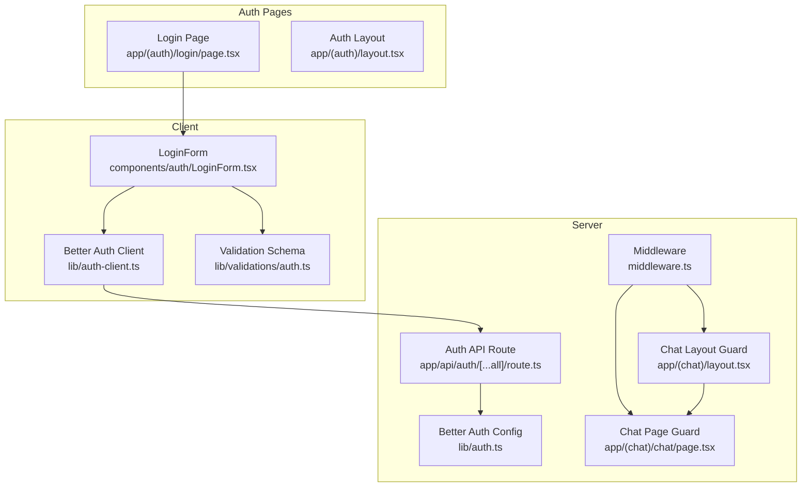
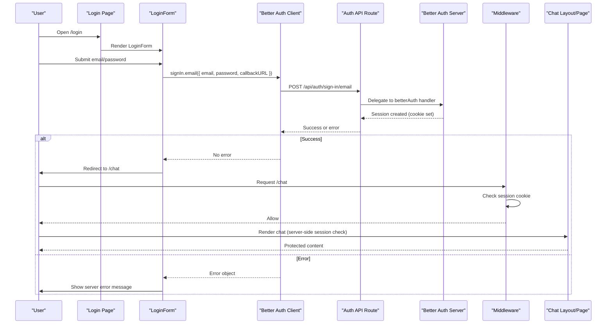
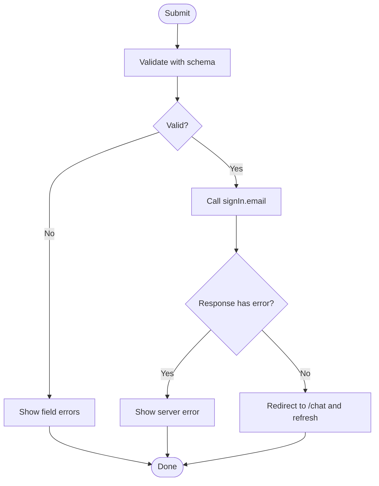
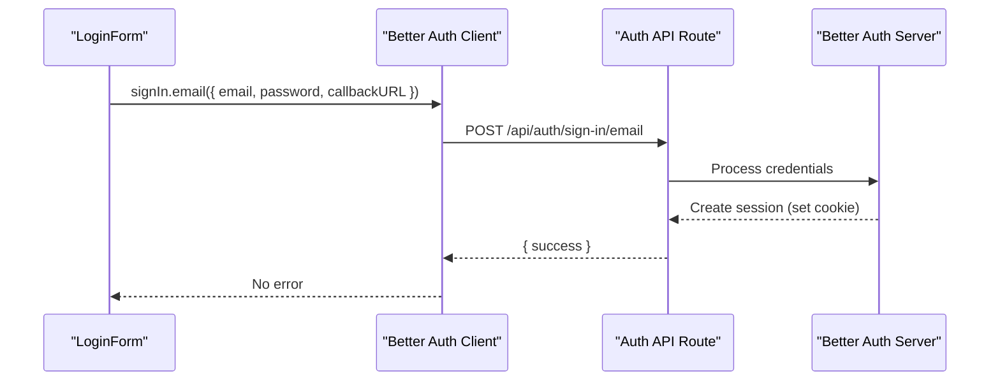
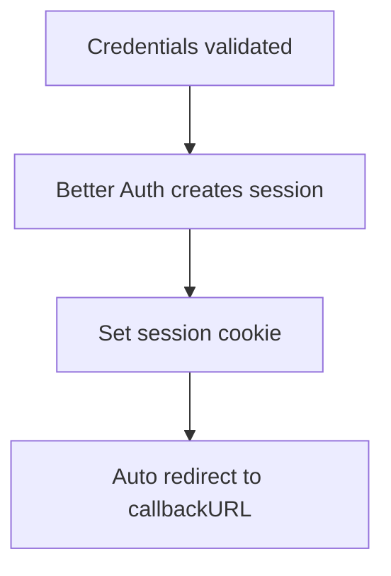
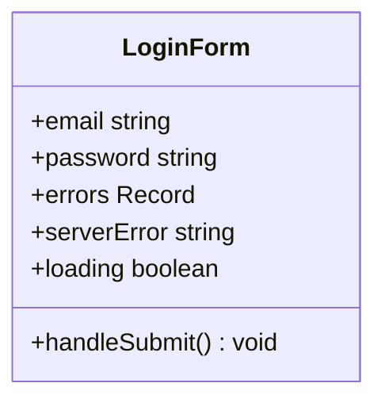
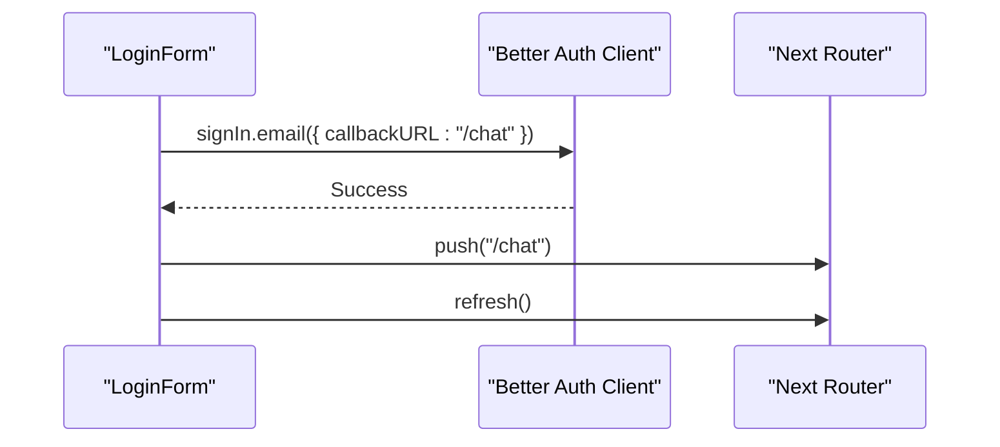
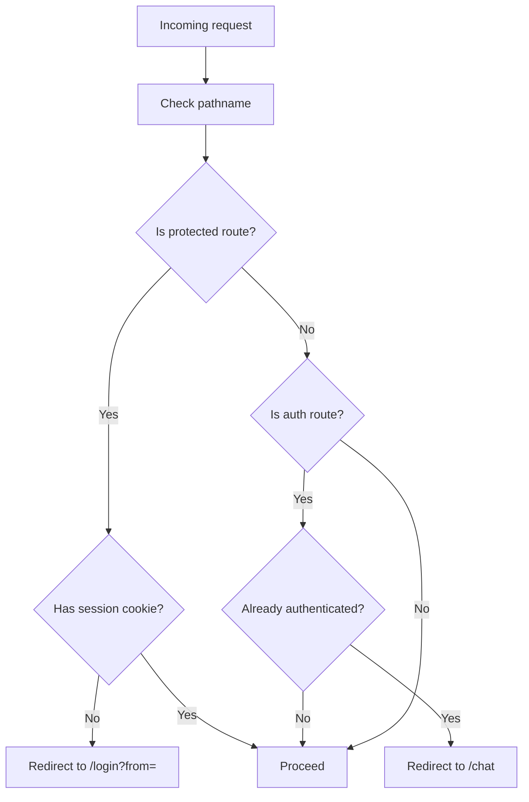
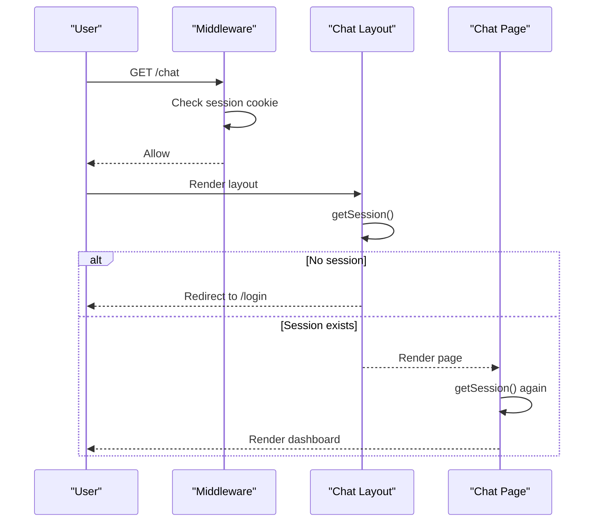
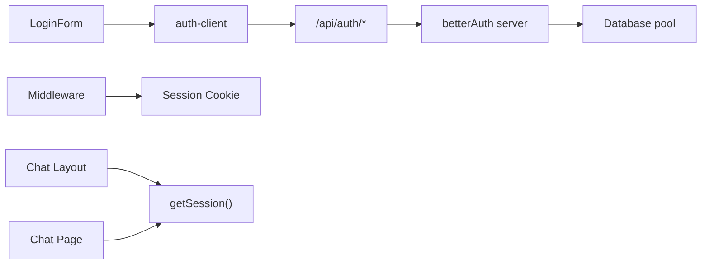

# User Login

<cite>
**Referenced Files in This Document**
- [page.tsx](file://app/(auth)/login/page.tsx)
- [LoginForm.tsx](file://components/auth/LoginForm.tsx)
- [auth.ts](file://lib/auth.ts)
- [auth-client.ts](file://lib/auth-client.ts)
- [route.ts](file://app/api/auth/[...all]/route.ts)
- [middleware.ts](file://middleware.ts)
- [layout.tsx](file://app/(chat)/layout.tsx)
- [page.tsx](file://app/(chat)/chat/page.tsx)
- [auth-utils.ts](file://lib/auth-utils.ts)
- [auth.ts](file://lib/validations/auth.ts)
</cite>

## Table of Contents
1. Introduction
2. Project Structure
3. Core Components
4. Architecture Overview
5. Detailed Component Analysis
6. Dependency Analysis
7. Performance Considerations
8. Troubleshooting Guide
9. Conclusion

## Introduction
This document explains the user login system end-to-end: the login form, client-side validation and state, authentication flow via Better Auth, session creation, automatic sign-in behavior, redirect logic after success, and route protection using middleware and server-side guards. It also covers how the chat area verifies sessions to ensure only authenticated users can access protected routes.

## Project Structure
The login feature spans a few key areas:
- UI for signing in (Next.js page and React component)
- Client SDK integration with Better Auth
- Server configuration for Better Auth and API routes
- Middleware and layout-level guards for route protection
- Validation schemas for input sanitization

**Diagram sources**
- [page.tsx:9-19](file://app/(auth)/login/page.tsx#L9-L19)
- [LoginForm.tsx:1-135](file://components/auth/LoginForm.tsx#L1-L135)
- [auth-client.ts:1-8](file://lib/auth-client.ts#L1-L8)
- [auth.ts:1-65](file://lib/auth.ts#L1-L65)
- [route.ts:1-5](file://app/api/auth/[...all]/route.ts#L1-L5)
- [middleware.ts:1-42](file://middleware.ts#L1-L42)
- [layout.tsx:9-20](file://app/(chat)/layout.tsx#L9-L20)
- [page.tsx:6-10](file://app/(chat)/chat/page.tsx#L6-L10)

**Section sources**
- [page.tsx:9-19](file://app/(auth)/login/page.tsx#L9-L19)
- [LoginForm.tsx:1-135](file://components/auth/LoginForm.tsx#L1-L135)
- [auth-client.ts:1-8](file://lib/auth-client.ts#L1-L8)
- [auth.ts:1-65](file://lib/auth.ts#L1-L65)
- [route.ts:1-5](file://app/api/auth/[...all]/route.ts#L1-L5)
- [middleware.ts:1-42](file://middleware.ts#L1-L42)
- [layout.tsx:9-20](file://app/(chat)/layout.tsx#L9-L20)
- [page.tsx:6-10](file://app/(chat)/chat/page.tsx#L6-L10)

## Core Components
- Login Page: Renders the login card and delegates to the LoginForm component.
- LoginForm: Handles form state, validates inputs, calls Better Auth’s signIn, handles errors, and redirects on success.
- Better Auth Client: Exposes signIn, signUp, signOut, and useSession for client-side operations.
- Better Auth Server: Configures email/password auth, auto sign-in, session options, trusted origins, and Next.js cookie handling.
- Auth API Route: Proxies all /api/auth/* endpoints to Better Auth handlers.
- Middleware: Protects routes by checking session cookies and redirects accordingly.
- Chat Layout/Page: Additional server-side checks to ensure only authenticated users can render chat content.

**Section sources**
- [page.tsx:9-19](file://app/(auth)/login/page.tsx#L9-L19)
- [LoginForm.tsx:17-55](file://components/auth/LoginForm.tsx#L17-L55)
- [auth-client.ts:1-8](file://lib/auth-client.ts#L1-L8)
- [auth.ts:5-64](file://lib/auth.ts#L5-L64)
- [route.ts:1-5](file://app/api/auth/[...all]/route.ts#L1-L5)
- [middleware.ts:7-27](file://middleware.ts#L7-L27)
- [layout.tsx:9-20](file://app/(chat)/layout.tsx#L9-L20)
- [page.tsx:6-10](file://app/(chat)/chat/page.tsx#L6-L10)

## Architecture Overview
The login flow integrates client-side React components with Better Auth’s serverless API and Next.js routing/middleware.

**Diagram sources**
- [LoginForm.tsx:17-55](file://components/auth/LoginForm.tsx#L17-L55)
- [auth-client.ts:1-8](file://lib/auth-client.ts#L1-L8)
- [route.ts:1-5](file://app/api/auth/[...all]/route.ts#L1-L5)
- [auth.ts:5-64](file://lib/auth.ts#L5-L64)
- [middleware.ts:7-27](file://middleware.ts#L7-L27)
- [layout.tsx:9-20](file://app/(chat)/layout.tsx#L9-L20)
- [page.tsx:6-10](file://app/(chat)/chat/page.tsx#L6-L10)

## Detailed Component Analysis

### Login Form Implementation
- State management: Tracks email, password, field errors, server error, and loading state.
- Validation: Uses a Zod schema to validate email format and required password before sending credentials.
- Submission: Calls Better Auth’s signIn.email with a callback URL; on success, navigates to the chat area and refreshes the app state.
- Error handling: Displays server-side errors returned from the auth provider and generic network errors.

**Diagram sources**
- [LoginForm.tsx:17-55](file://components/auth/LoginForm.tsx#L17-L55)
- [auth.ts:22-25](file://lib/validations/auth.ts#L22-L25)

**Section sources**
- [LoginForm.tsx:1-135](file://components/auth/LoginForm.tsx#L1-L135)
- [auth.ts:22-25](file://lib/validations/auth.ts#L22-L25)

### Authentication Flow and Better Auth Integration
- Client SDK: The login form imports signIn from the Better Auth client module and invokes it with email/password and a callback URL.
- Server Configuration: Email/password is enabled with auto sign-in, which automatically creates a session upon successful credential verification.
- API Route: All /api/auth/* requests are proxied to Better Auth handlers via a catch-all route.

**Diagram sources**
- [LoginForm.tsx:33-49](file://components/auth/LoginForm.tsx#L33-L49)
- [auth-client.ts:1-8](file://lib/auth-client.ts#L1-L8)
- [route.ts:1-5](file://app/api/auth/[...all]/route.ts#L1-L5)
- [auth.ts:14-17](file://lib/auth.ts#L14-L17)

**Section sources**
- [LoginForm.tsx:33-49](file://components/auth/LoginForm.tsx#L33-L49)
- [auth-client.ts:1-8](file://lib/auth-client.ts#L1-L8)
- [route.ts:1-5](file://app/api/auth/[...all]/route.ts#L1-L5)
- [auth.ts:14-17](file://lib/auth.ts#L14-L17)

### Session Creation and Automatic Sign-In
- Auto sign-in: When credentials are valid, Better Auth automatically creates a session and sets a secure cookie based on configuration.
- Session options: Configured expiration and update age define how long sessions last and when they are refreshed.
- Cookie attributes: In development, cross-site cookie settings are adjusted to support preview environments.

**Diagram sources**
- [auth.ts:14-17](file://lib/auth.ts#L14-L17)
- [auth.ts:47-62](file://lib/auth.ts#L47-L62)

**Section sources**
- [auth.ts:14-17](file://lib/auth.ts#L14-L17)
- [auth.ts:47-62](file://lib/auth.ts#L47-L62)

### Client-Side State Management
- Local state: The login form manages email, password, field errors, server error, and loading flags.
- Navigation: On success, uses Next.js router to navigate to the protected area and refreshes data.
- Optional session hook: The Better Auth client exposes useSession for reading current session state in client components where needed.

**Diagram sources**
- [LoginForm.tsx:9-15](file://components/auth/LoginForm.tsx#L9-L15)
- [LoginForm.tsx:17-55](file://components/auth/LoginForm.tsx#L17-L55)

**Section sources**
- [LoginForm.tsx:9-15](file://components/auth/LoginForm.tsx#L9-L15)
- [LoginForm.tsx:17-55](file://components/auth/LoginForm.tsx#L17-L55)
- [auth-client.ts:1-8](file://lib/auth-client.ts#L1-L8)

### Redirect Logic After Successful Authentication
- Callback URL: The login form passes a callback URL so that after successful authentication, Better Auth redirects to the specified route.
- Explicit navigation: The form also performs an explicit push to the chat route and refreshes the application state to ensure consistent UI.

**Diagram sources**
- [LoginForm.tsx:33-49](file://components/auth/LoginForm.tsx#L33-L49)

**Section sources**
- [LoginForm.tsx:33-49](file://components/auth/LoginForm.tsx#L33-L49)

### Middleware for Route Protection and Session Verification
- Protected routes: Requests to protected paths are intercepted; if no session cookie exists, users are redirected to login with a “from” parameter.
- Auth routes: Users already logged in are redirected away from login/register pages to the chat area.
- Matcher: Middleware runs for most routes while excluding static assets and the auth API itself.

**Diagram sources**
- [middleware.ts:4-27](file://middleware.ts#L4-L27)

**Section sources**
- [middleware.ts:4-27](file://middleware.ts#L4-L27)

### Server-Side Guards in Chat Area
- Layout guard: The chat layout fetches the server-side session and redirects unauthenticated users to login.
- Page guard: The chat page also checks the session before rendering dashboard data.

**Diagram sources**
- [layout.tsx:9-20](file://app/(chat)/layout.tsx#L9-L20)
- [page.tsx:6-10](file://app/(chat)/chat/page.tsx#L6-L10)
- [auth-utils.ts:7-19](file://lib/auth-utils.ts#L7-L19)

**Section sources**
- [layout.tsx:9-20](file://app/(chat)/layout.tsx#L9-L20)
- [page.tsx:6-10](file://app/(chat)/chat/page.tsx#L6-L10)
- [auth-utils.ts:7-19](file://lib/auth-utils.ts#L7-L19)

## Dependency Analysis
Key dependencies and relationships:
- LoginForm depends on the Better Auth client and validation schema.
- Better Auth client proxies to the Next.js API route.
- The API route delegates to the Better Auth server instance configured in the auth module.
- Middleware protects routes by inspecting session cookies without hitting the database.
- Chat layout and page perform additional server-side session checks.

**Diagram sources**
- [LoginForm.tsx:33-49](file://components/auth/LoginForm.tsx#L33-L49)
- [auth-client.ts:1-8](file://lib/auth-client.ts#L1-L8)
- [route.ts:1-5](file://app/api/auth/[...all]/route.ts#L1-L5)
- [auth.ts:1-65](file://lib/auth.ts#L1-L65)
- [middleware.ts:7-27](file://middleware.ts#L7-L27)
- [layout.tsx:9-20](file://app/(chat)/layout.tsx#L9-L20)
- [page.tsx:6-10](file://app/(chat)/chat/page.tsx#L6-L10)
- [auth-utils.ts:7-19](file://lib/auth-utils.ts#L7-L19)

**Section sources**
- [LoginForm.tsx:33-49](file://components/auth/LoginForm.tsx#L33-L49)
- [auth-client.ts:1-8](file://lib/auth-client.ts#L1-L8)
- [route.ts:1-5](file://app/api/auth/[...all]/route.ts#L1-L5)
- [auth.ts:1-65](file://lib/auth.ts#L1-L65)
- [middleware.ts:7-27](file://middleware.ts#L7-L27)
- [layout.tsx:9-20](file://app/(chat)/layout.tsx#L9-L20)
- [page.tsx:6-10](file://app/(chat)/chat/page.tsx#L6-L10)
- [auth-utils.ts:7-19](file://lib/auth-utils.ts#L7-L19)

## Performance Considerations
- Middleware uses cookie inspection for fast route protection without database queries.
- Session duration and update age are configured to balance security and performance.
- Server-side guards in layout and page provide belt-and-suspenders protection with minimal overhead.
- Avoid unnecessary re-renders by refreshing only after successful authentication.

[No sources needed since this section provides general guidance]

## Troubleshooting Guide
Common issues and resolutions:
- Invalid credentials: The login form displays server-provided error messages; verify email/password and try again.
- Missing session cookie: Ensure cookies are allowed in your environment; in development, Better Auth config adjusts cookie attributes for cross-site contexts.
- Redirect loops: Confirm middleware matcher excludes necessary routes and that protected routes require a session.
- Network errors: If the API call fails, the form shows a generic error; check browser console and server logs.

**Section sources**
- [LoginForm.tsx:41-54](file://components/auth/LoginForm.tsx#L41-L54)
- [auth.ts:28-62](file://lib/auth.ts#L28-L62)
- [middleware.ts:7-27](file://middleware.ts#L7-L27)

## Conclusion
The login system combines a clean React form with robust server-side authentication via Better Auth. Input validation ensures safe submissions, auto sign-in streamlines the user experience, and middleware plus server-side guards protect sensitive routes. The result is a secure, maintainable authentication flow that scales with the application’s needs.

[No sources needed since this section summarizes without analyzing specific files]