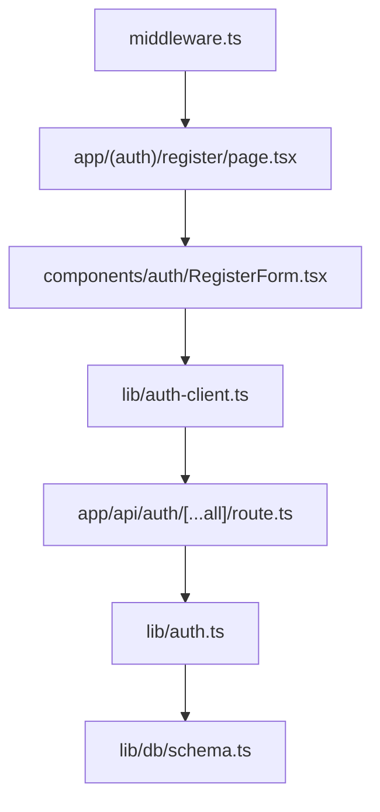
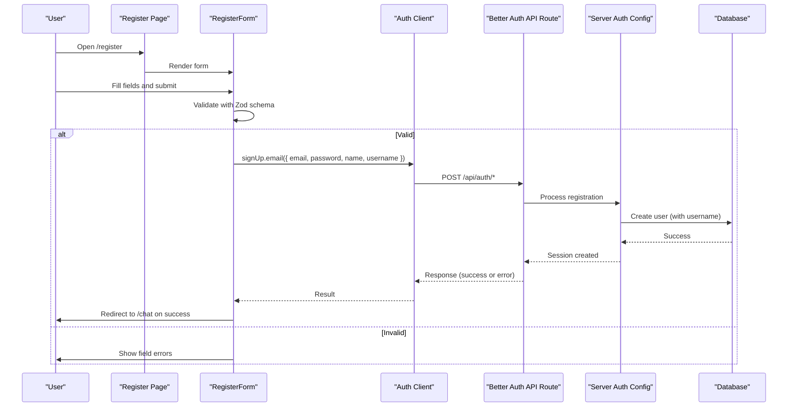
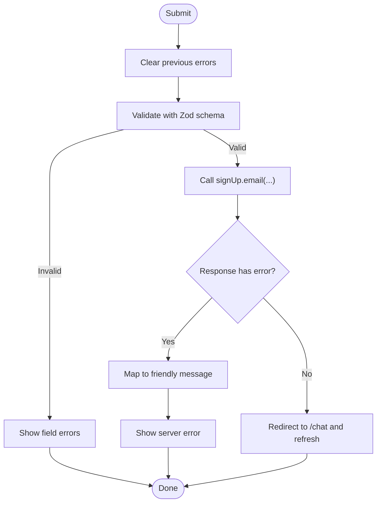
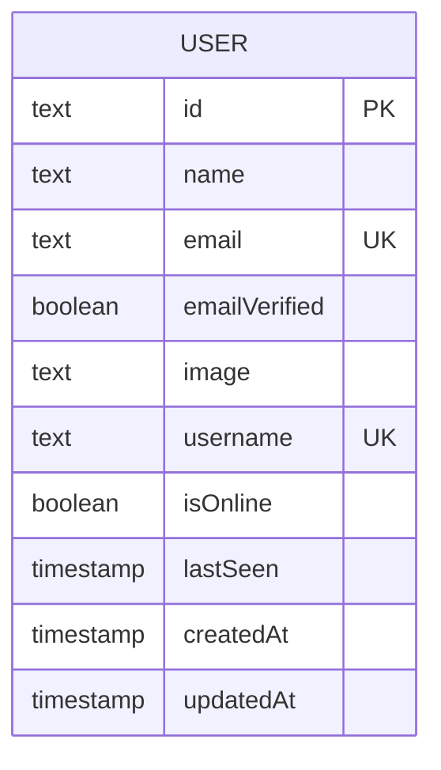
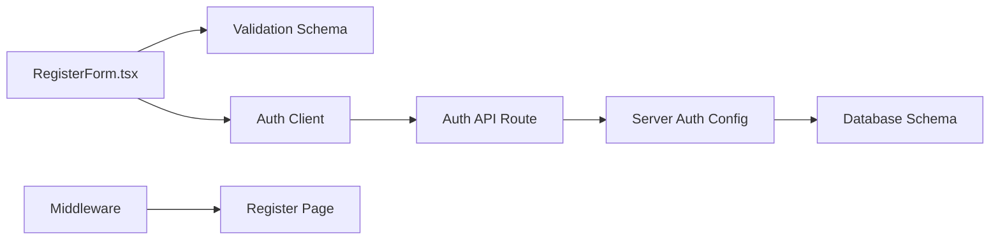

# User Registration

<cite>
**Referenced Files in This Document**
- [page.tsx](file://app/(auth)/register/page.tsx)
- [RegisterForm.tsx](file://components/auth/RegisterForm.tsx)
- [auth.ts](file://lib/validations/auth.ts)
- [auth-client.ts](file://lib/auth-client.ts)
- [route.ts](file://app/api/auth/[...all]/route.ts)
- [auth.ts](file://lib/auth.ts)
- [schema.ts](file://lib/db/schema.ts)
- [middleware.ts](file://middleware.ts)
</cite>

## Table of Contents
1. [Introduction](#introduction)
2. [Project Structure](#project-structure)
3. [Core Components](#core-components)
4. [Architecture Overview](#architecture-overview)
5. [Detailed Component Analysis](#detailed-component-analysis)
6. [Dependency Analysis](#dependency-analysis)
7. [Performance Considerations](#performance-considerations)
8. [Troubleshooting Guide](#troubleshooting-guide)
9. [Conclusion](#conclusion)

## Introduction
This document explains the user registration system end-to-end: the registration form UI, client-side validation with Zod schemas, the server-side authentication setup, and how a new user is created with email/password and an additional username field. It also covers error handling strategies, success flows, and security considerations such as trusted origins and session configuration.

## Project Structure
The registration feature spans a Next.js page, a React form component, shared validation schemas, a Better Auth client, and server-side auth configuration that exposes API routes for sign-up.

**Diagram sources**
- [page.tsx:1-35](file://app/(auth)/register/page.tsx#L1-L35)
- [RegisterForm.tsx:1-161](file://components/auth/RegisterForm.tsx#L1-L161)
- [auth-client.ts:1-8](file://lib/auth-client.ts#L1-L8)
- [route.ts:1-5](file://app/api/auth/[...all]/route.ts#L1-L5)
- [auth.ts:1-65](file://lib/auth.ts#L1-L65)
- [schema.ts:1-101](file://lib/db/schema.ts#L1-L101)
- [middleware.ts:1-42](file://middleware.ts#L1-L42)

**Section sources**
- [page.tsx:1-35](file://app/(auth)/register/page.tsx#L1-L35)
- [RegisterForm.tsx:1-161](file://components/auth/RegisterForm.tsx#L1-L161)
- [auth-client.ts:1-8](file://lib/auth-client.ts#L1-L8)
- [route.ts:1-5](file://app/api/auth/[...all]/route.ts#L1-L5)
- [auth.ts:1-65](file://lib/auth.ts#L1-L65)
- [schema.ts:1-101](file://lib/db/schema.ts#L1-L101)
- [middleware.ts:1-42](file://middleware.ts#L1-L42)

## Core Components
- Registration page: Renders the “Create account” heading and embeds the form component.
- RegisterForm: Client-side form with state management, Zod-based validation, submission to Better Auth’s signUp endpoint, and user-friendly error display.
- Validation schema: Defines rules for username, email, password, and confirm password, including cross-field checks.
- Auth client: Exposes Better Auth client methods (signUp, signIn, etc.) used by the form.
- Server auth configuration: Enables email/password auth, adds a username field to users, configures sessions, and sets trusted origins.
- Database schema: Defines the user table with a unique username and other presence/timestamp fields.

**Section sources**
- [page.tsx:1-35](file://app/(auth)/register/page.tsx#L1-L35)
- [RegisterForm.tsx:1-161](file://components/auth/RegisterForm.tsx#L1-L161)
- [auth.ts:1-28](file://lib/validations/auth.ts#L1-L28)
- [auth-client.ts:1-8](file://lib/auth-client.ts#L1-L8)
- [auth.ts:1-65](file://lib/auth.ts#L1-L65)
- [schema.ts:1-20](file://lib/db/schema.ts#L1-L20)

## Architecture Overview
Registration flow from UI to server and back:

**Diagram sources**
- [RegisterForm.tsx:29-75](file://components/auth/RegisterForm.tsx#L29-L75)
- [auth-client.ts:1-8](file://lib/auth-client.ts#L1-L8)
- [route.ts:1-5](file://app/api/auth/[...all]/route.ts#L1-L5)
- [auth.ts:1-65](file://lib/auth.ts#L1-L65)
- [schema.ts:1-20](file://lib/db/schema.ts#L1-L20)

## Detailed Component Analysis

### Registration Page
- Purpose: Provides metadata and renders the registration form within a styled container.
- Behavior: Delegates all logic to the RegisterForm component; includes a link to the login page.

**Section sources**
- [page.tsx:1-35](file://app/(auth)/register/page.tsx#L1-L35)

### Registration Form (Client-Side)
- State: Tracks form values, per-field errors, server error message, and loading state.
- Validation: Uses a Zod schema to validate inputs before submission. Field-level errors are mapped from validation issues.
- Submission: Calls Better Auth’s signUp.email with email, password, name (display name), and username (additional field). On success, navigates to /chat and refreshes the session. On error, maps common messages to user-friendly text.
- UX: Displays inline field errors and a top-level server error alert. Disables inputs while submitting.

**Diagram sources**
- [RegisterForm.tsx:29-75](file://components/auth/RegisterForm.tsx#L29-L75)

**Section sources**
- [RegisterForm.tsx:1-161](file://components/auth/RegisterForm.tsx#L1-L161)

### Validation Schema (Zod)
- Username: Required string, length constraints, and allowed characters.
- Email: Must be a valid email format.
- Password: Minimum and maximum length constraints.
- Confirm password: Must match password via a refinement rule.

These rules ensure consistent validation across the app and provide clear error messages.

**Section sources**
- [auth.ts:1-28](file://lib/validations/auth.ts#L1-L28)

### Auth Client Integration
- The form imports signUp from the Better Auth client wrapper.
- The client delegates to the server’s Better Auth API route under /api/auth.

**Section sources**
- [auth-client.ts:1-8](file://lib/auth-client.ts#L1-L8)
- [route.ts:1-5](file://app/api/auth/[...all]/route.ts#L1-L5)

### Server-Side Authentication Configuration
- Email/password enabled with auto sign-in after registration.
- Additional user field: username is added to the user model and accepted during input.
- Trusted origins: Configured based on environment to allow requests from development and production URLs.
- Sessions: Configurable expiration and update age; cookies configured appropriately for dev environments.

**Section sources**
- [auth.ts:1-65](file://lib/auth.ts#L1-L65)

### Database Model and User Fields
- User table includes id, name, email (unique), emailVerified, image, username (unique), presence fields (isOnline, lastSeen), and timestamps.
- Username is stored directly on the user table as an additional field.

**Diagram sources**
- [schema.ts:1-20](file://lib/db/schema.ts#L1-L20)

**Section sources**
- [schema.ts:1-20](file://lib/db/schema.ts#L1-L20)

### Middleware and Access Control
- Protects certain routes (e.g., /chat) by redirecting unauthenticated users to login.
- Redirects authenticated users away from /login and /register to prevent duplicate sessions.
- Uses session cookie detection without hitting the database for performance.

**Section sources**
- [middleware.ts:1-42](file://middleware.ts#L1-L42)

## Dependency Analysis
- RegisterPage depends on RegisterForm.
- RegisterForm depends on:
  - Zod validation schema for input rules.
  - Better Auth client for signing up.
- Better Auth client calls the server route handler which uses the server auth configuration.
- Server auth configuration references the database pool and defines user schema extensions.
- Middleware enforces access control around protected routes.

**Diagram sources**
- [RegisterForm.tsx:1-161](file://components/auth/RegisterForm.tsx#L1-L161)
- [auth.ts:1-28](file://lib/validations/auth.ts#L1-L28)
- [auth-client.ts:1-8](file://lib/auth-client.ts#L1-L8)
- [route.ts:1-5](file://app/api/auth/[...all]/route.ts#L1-L5)
- [auth.ts:1-65](file://lib/auth.ts#L1-L65)
- [schema.ts:1-20](file://lib/db/schema.ts#L1-L20)
- [middleware.ts:1-42](file://middleware.ts#L1-L42)

**Section sources**
- [RegisterForm.tsx:1-161](file://components/auth/RegisterForm.tsx#L1-L161)
- [auth.ts:1-28](file://lib/validations/auth.ts#L1-L28)
- [auth-client.ts:1-8](file://lib/auth-client.ts#L1-L8)
- [route.ts:1-5](file://app/api/auth/[...all]/route.ts#L1-L5)
- [auth.ts:1-65](file://lib/auth.ts#L1-L65)
- [schema.ts:1-20](file://lib/db/schema.ts#L1-L20)
- [middleware.ts:1-42](file://middleware.ts#L1-L42)

## Performance Considerations
- Client-side validation prevents unnecessary network calls by validating inputs early.
- Middleware uses cookie inspection for fast auth checks without database queries.
- Auto sign-in reduces post-registration round trips by establishing a session immediately.

[No sources needed since this section provides general guidance]

## Troubleshooting Guide
Common issues and where they surface:
- Validation errors: Displayed inline beneath each field when inputs do not meet schema rules (e.g., invalid email, short password, mismatched passwords).
- Duplicate email or username: Server returns an error; the form maps these to user-friendly messages and shows them at the top of the form.
- Network or unexpected errors: Caught by the form’s error boundary and shown as a generic server error message.
- Redirect behavior: If already authenticated, middleware redirects away from /register; if unauthenticated, protected routes redirect to /login.

**Section sources**
- [RegisterForm.tsx:29-75](file://components/auth/RegisterForm.tsx#L29-L75)
- [middleware.ts:1-42](file://middleware.ts#L1-L42)

## Conclusion
The registration system combines a clean React form, robust Zod-based validation, and a secure server-side setup using Better Auth. Users can create accounts with email/password and a unique username, receive immediate feedback on validation and server errors, and are automatically signed in and redirected to the chat area upon success. Middleware ensures only authenticated users access protected routes, while server configuration manages sessions and trusted origins for safe operation across environments.

[No sources needed since this section summarizes without analyzing specific files]