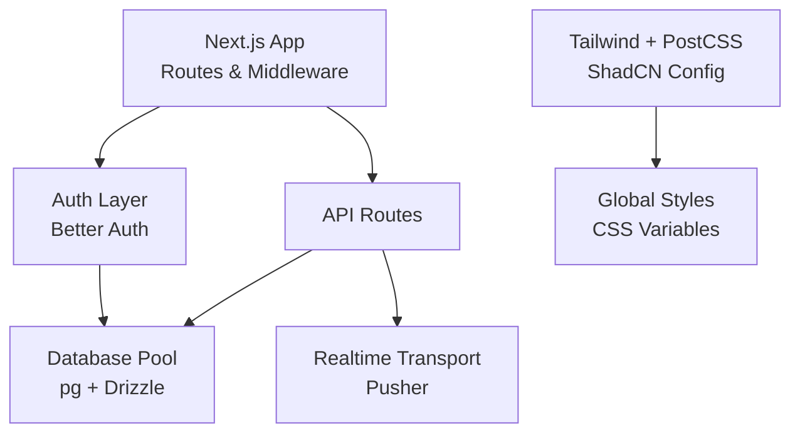
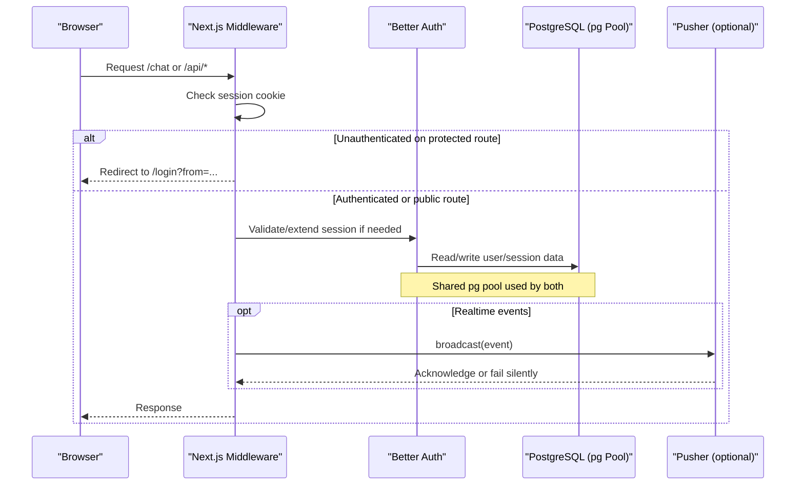
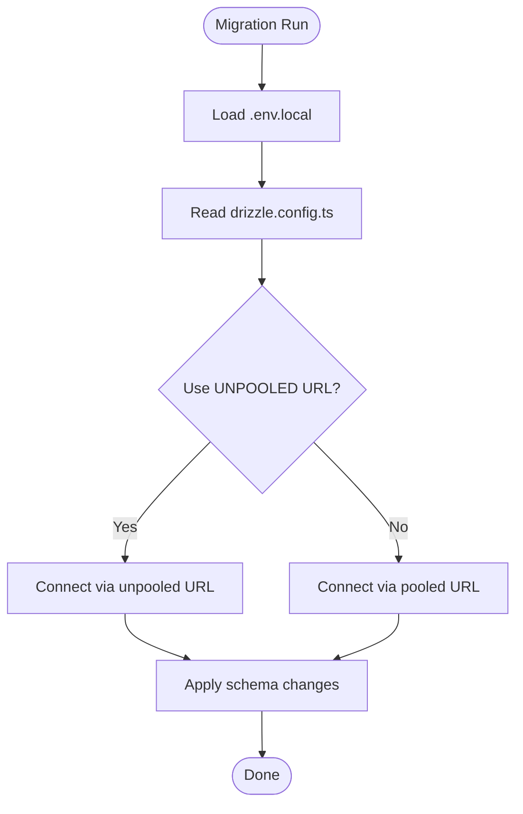
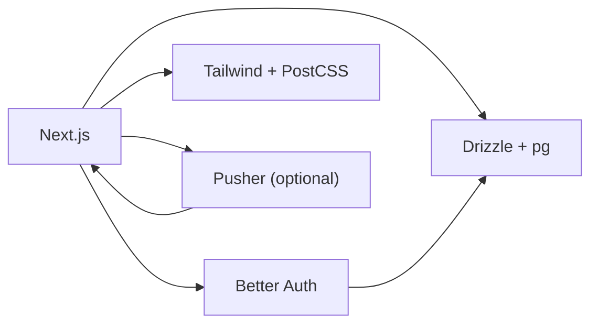

# Configuration & Customization

<cite>
**Referenced Files in This Document**
- [next.config.mjs](file://next.config.mjs)
- [package.json](file://package.json)
- [middleware.ts](file://middleware.ts)
- [drizzle.config.ts](file://drizzle.config.ts)
- [lib/db/index.ts](file://lib/db/index.ts)
- [lib/db/schema.ts](file://lib/db/schema.ts)
- [lib/auth.ts](file://lib/auth.ts)
- [postcss.config.mjs](file://postcss.config.mjs)
- [app/globals.css](file://app/globals.css)
- [components.json](file://components.json)
- [tsconfig.json](file://tsconfig.json)
- [lib/realtime/index.ts](file://lib/realtime/index.ts)
</cite>

## Table of Contents
1. Introduction
2. Project Structure
3. Core Components
4. Architecture Overview
5. Detailed Component Analysis
6. Dependency Analysis
7. Performance Considerations
8. Troubleshooting Guide
9. Conclusion

## Introduction
This document explains how to configure and customize SecureChat for your environment. It covers Next.js build and runtime settings, database configuration with Drizzle ORM and connection pooling, environment variables, UI customization via Tailwind CSS and ShadCN, TypeScript and development tooling, and production-focused performance, security, and monitoring guidance. It also includes common customization scenarios and deployment-specific optimizations.

## Project Structure
SecureChat is a Next.js application using:
- Next.js App Router for routing and middleware
- Better Auth for authentication and session management
- Drizzle ORM with PostgreSQL for data access and migrations
- Tailwind CSS v4 with PostCSS and ShadCN for styling
- Pusher Channels for real-time messaging (optional)

**Diagram sources**
- [next.config.mjs:1-12](file://next.config.mjs#L1-L12)
- [middleware.ts:1-42](file://middleware.ts#L1-L42)
- [lib/auth.ts:1-65](file://lib/auth.ts#L1-L65)
- [lib/db/index.ts:1-10](file://lib/db/index.ts#L1-L10)
- [postcss.config.mjs:1-9](file://postcss.config.mjs#L1-L9)
- [app/globals.css:1-177](file://app/globals.css#L1-L177)
- [lib/realtime/index.ts:1-78](file://lib/realtime/index.ts#L1-L78)

**Section sources**
- [next.config.mjs:1-12](file://next.config.mjs#L1-L12)
- [package.json:1-53](file://package.json#L1-L53)
- [middleware.ts:1-42](file://middleware.ts#L1-L42)

## Core Components
- Next.js configuration controls build behavior and image optimization.
- Authentication uses Better Auth with cookies and environment-driven trusted origins.
- Database layer uses a shared pg pool consumed by both Drizzle queries and Better Auth.
- Styling is driven by Tailwind v4, PostCSS, and ShadCN theme variables.
- Realtime messaging is optional and gated by environment variables.

Key areas to customize:
- Build/runtime: next.config.mjs, package.json scripts
- Auth: lib/auth.ts, middleware.ts
- Database: drizzle.config.ts, lib/db/index.ts, lib/db/schema.ts
- UI: postcss.config.mjs, app/globals.css, components.json
- Realtime: lib/realtime/index.ts

**Section sources**
- [next.config.mjs:1-12](file://next.config.mjs#L1-L12)
- [lib/auth.ts:1-65](file://lib/auth.ts#L1-L65)
- [middleware.ts:1-42](file://middleware.ts#L1-L42)
- [drizzle.config.ts:1-19](file://drizzle.config.ts#L1-L19)
- [lib/db/index.ts:1-10](file://lib/db/index.ts#L1-L10)
- [lib/db/schema.ts:1-101](file://lib/db/schema.ts#L1-L101)
- [postcss.config.mjs:1-9](file://postcss.config.mjs#L1-L9)
- [app/globals.css:1-177](file://app/globals.css#L1-L177)
- [components.json:1-22](file://components.json#L1-L22)
- [lib/realtime/index.ts:1-78](file://lib/realtime/index.ts#L1-L78)

## Architecture Overview
The runtime flow integrates routing, auth, database, and optional realtime transport.

**Diagram sources**
- [middleware.ts:1-42](file://middleware.ts#L1-L42)
- [lib/auth.ts:1-65](file://lib/auth.ts#L1-L65)
- [lib/db/index.ts:1-10](file://lib/db/index.ts#L1-L10)
- [lib/realtime/index.ts:1-78](file://lib/realtime/index.ts#L1-L78)

## Detailed Component Analysis

### Next.js Configuration and Build Settings
- Typescript build errors are ignored during builds to keep CI flexible.
- Image optimization is disabled; images are served unoptimized.
- Scripts provide dev, build, start, and database commands.

Customization tips:
- Enable image optimization for production by removing the unoptimized flag.
- Adjust TypeScript strictness and incremental compilation based on team preferences.
- Add caching or CDN directives via Next headers if needed.

**Section sources**
- [next.config.mjs:1-12](file://next.config.mjs#L1-L12)
- [package.json:1-53](file://package.json#L1-L53)

### Runtime Middleware and Route Protection
- Protected routes include chat-related paths.
- Authenticated users are redirected away from login/register.
- Unauthenticated users are redirected to login with a return URL.
- Matcher excludes static assets, images, favicon, and auth API routes.

Customization tips:
- Extend PROTECTED list to secure additional pages.
- Customize AUTH_ROUTES to match your auth flows.
- Update matcher patterns if you add new static assets or APIs.

**Section sources**
- [middleware.ts:1-42](file://middleware.ts#L1-L42)

### Authentication with Better Auth
- Uses email/password with auto sign-in enabled.
- Adds username as an additional field on the user model.
- Trusted origins vary by environment (development vs production).
- Session lifetime and update age are configured.
- Development mode sets cross-site cookie attributes for preview environments.
- Integrates Next.js cookies plugin.

Environment variables:
- BETTER_AUTH_URL or derived from Vercel runtime URLs.
- NODE_ENV influences trusted origins and cookie attributes.

Customization tips:
- Restrict trustedOrigins to exact domains per environment.
- Adjust session expiresIn and updateAge for your security posture.
- Integrate additional providers by extending the auth config.

**Section sources**
- [lib/auth.ts:1-65](file://lib/auth.ts#L1-L65)

### Database Configuration with Drizzle ORM
- Schema defines users, sessions, accounts, verifications, conversations, participants, and messages.
- A single pg Pool is created and shared between Drizzle and Better Auth.
- Drizzle Kit configuration loads .env.local explicitly and uses an unpooled DATABASE_URL for migrations.

Environment variables:
- DATABASE_URL for runtime connections.
- DATABASE_URL_UNPOOLED for schema migrations (avoids pooled DDL restrictions).

Customization tips:
- Tune pool size and timeouts in the pg Pool options for high concurrency.
- Use DATABASE_URL_UNPOOLED only for migrations; never expose it in runtime logs.
- Keep schema changes under version control and run generate/push in CI.

**Diagram sources**
- [drizzle.config.ts:1-19](file://drizzle.config.ts#L1-L19)

**Section sources**
- [drizzle.config.ts:1-19](file://drizzle.config.ts#L1-L19)
- [lib/db/index.ts:1-10](file://lib/db/index.ts#L1-L10)
- [lib/db/schema.ts:1-101](file://lib/db/schema.ts#L1-L101)

### Environment Variables Setup
Required and recommended variables:
- DATABASE_URL: Runtime database connection string.
- DATABASE_URL_UNPOOLED: Migration-only connection string (no pooling).
- BETTER_AUTH_URL: Base URL for auth callbacks and cookies.
- PUSHER_APP_ID, PUSHER_KEY, PUSHER_SECRET, PUSHER_CLUSTER: Optional realtime configuration.
- NODE_ENV: Controls environment-specific behavior (trusted origins, cookie attributes).

Best practices:
- Store secrets in your platform’s secret manager (e.g., Vercel env vars).
- Never commit .env.local to version control.
- Validate required variables at startup and fail fast if missing.

**Section sources**
- [lib/auth.ts:1-65](file://lib/auth.ts#L1-L65)
- [lib/realtime/index.ts:1-78](file://lib/realtime/index.ts#L1-L78)
- [drizzle.config.ts:1-19](file://drizzle.config.ts#L1-L19)

### UI Customization with Tailwind CSS and ShadCN
- Tailwind v4 is configured via PostCSS with @tailwindcss/postcss.
- Global styles define light/dark themes and CSS variables for colors, radii, and component tokens.
- ShadCN is integrated through its CSS import and components.json aliases.

Customization steps:
- Modify CSS variables in :root and .dark to rebrand colors and spacing.
- Override ShadCN tokens via components.json style and baseColor.
- Add custom utilities or variants in globals.css or dedicated style files.
- Use the cn utility for conditional class merging across components.

Notes:
- No separate tailwind.config file is present; configuration is handled via PostCSS and CSS imports.
- The project uses shadcn/tailwind.css and tw-animate-css for animations.

**Section sources**
- [postcss.config.mjs:1-9](file://postcss.config.mjs#L1-L9)
- [app/globals.css:1-177](file://app/globals.css#L1-L177)
- [components.json:1-22](file://components.json#L1-L22)
- [lib/utils.ts:1-94](file://lib/utils.ts#L1-L94)

### TypeScript Configuration and Development Tooling
- Strict mode enabled, target ES6, module resolution set to bundler.
- Path alias @/* maps to root for cleaner imports.
- Incremental compilation enabled for faster rebuilds.
- Next plugin included for type generation.

Development tooling:
- Scripts for dev, build, start, and database operations.
- Drizzle Kit commands for push, studio, and generate.

Customization tips:
- Adjust tsconfig strictness or target based on compatibility needs.
- Add linting/formatting rules via ESLint/Prettier if desired.
- Configure path aliases consistently across tools.

**Section sources**
- [tsconfig.json:1-34](file://tsconfig.json#L1-L34)
- [package.json:1-53](file://package.json#L1-L53)

### Realtime Messaging Configuration
- Realtime is optional and enabled when all Pusher variables are set.
- Server-side broadcast wraps Pusher triggers and fails safely without affecting message persistence.
- Channel authorization endpoint signs private channels after verifying user permissions.

Customization tips:
- Provide fallback logic in clients when realtime is disabled.
- Monitor broadcast failures and log metrics for observability.
- Consider scaling strategies for high-volume channels.

**Section sources**
- [lib/realtime/index.ts:1-78](file://lib/realtime/index.ts#L1-L78)

## Dependency Analysis
High-level dependencies and their roles:
- Next.js: Framework and runtime.
- Better Auth: Authentication and session handling.
- Drizzle ORM + pg: Data access and migrations.
- Tailwind v4 + PostCSS: Styling pipeline.
- Pusher: Realtime event delivery (optional).

**Diagram sources**
- [package.json:1-53](file://package.json#L1-L53)
- [lib/auth.ts:1-65](file://lib/auth.ts#L1-L65)
- [lib/db/index.ts:1-10](file://lib/db/index.ts#L1-L10)
- [postcss.config.mjs:1-9](file://postcss.config.mjs#L1-L9)
- [lib/realtime/index.ts:1-78](file://lib/realtime/index.ts#L1-L78)

**Section sources**
- [package.json:1-53](file://package.json#L1-L53)

## Performance Considerations
- Images: Disable unoptimized images in production to leverage Next.js image optimization.
- Database pool: Tune pg Pool size and idle timeouts for expected concurrency.
- Sessions: Adjust session expiresIn and updateAge to balance security and UX.
- Realtime: Ensure Pusher credentials are set; otherwise, broadcast becomes a no-op and clients should handle fallback gracefully.
- Middleware: Keep matcher patterns minimal to reduce overhead on each request.
- Build: Keep TypeScript strictness consistent; consider enabling image optimization and compression plugins as needed.

[No sources needed since this section provides general guidance]

## Troubleshooting Guide
Common issues and resolutions:
- Database migrations fail due to pooling: Use DATABASE_URL_UNPOOLED for migrations to avoid pgbouncer DDL restrictions.
- Auth redirects loop: Verify BETTER_AUTH_URL matches your deployed domain and that trustedOrigins includes the correct host.
- Realtime not working: Confirm all PUSHER_* variables are set; check server logs for broadcast errors.
- Styles not applying: Ensure PostCSS is configured and globals.css imports Tailwind and ShadCN correctly.
- Type errors in build: Review tsconfig settings and ensure Next plugin is active.

**Section sources**
- [drizzle.config.ts:1-19](file://drizzle.config.ts#L1-L19)
- [lib/auth.ts:1-65](file://lib/auth.ts#L1-L65)
- [lib/realtime/index.ts:1-78](file://lib/realtime/index.ts#L1-L78)
- [postcss.config.mjs:1-9](file://postcss.config.mjs#L1-L9)
- [app/globals.css:1-177](file://app/globals.css#L1-L177)

## Conclusion
SecureChat is highly configurable across build, runtime, database, UI, and realtime layers. Use environment variables to tailor behavior per environment, adjust Tailwind and ShadCN tokens for branding, and tune database pools and sessions for performance and security. For production, enable image optimization, restrict trusted origins, use unpooled migration URLs, and monitor realtime delivery.

[No sources needed since this section summarizes without analyzing specific files]