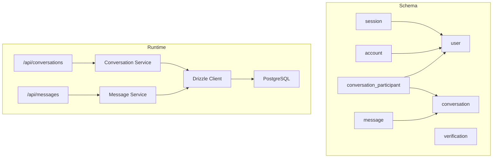
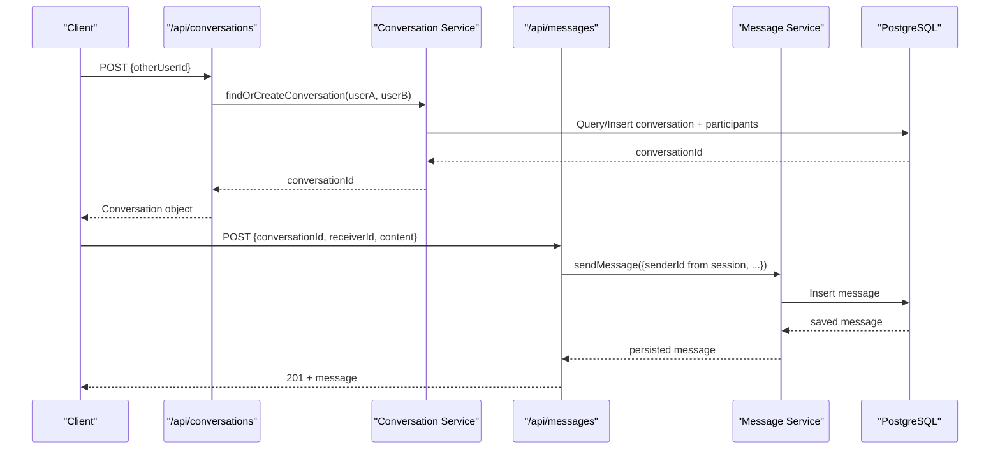
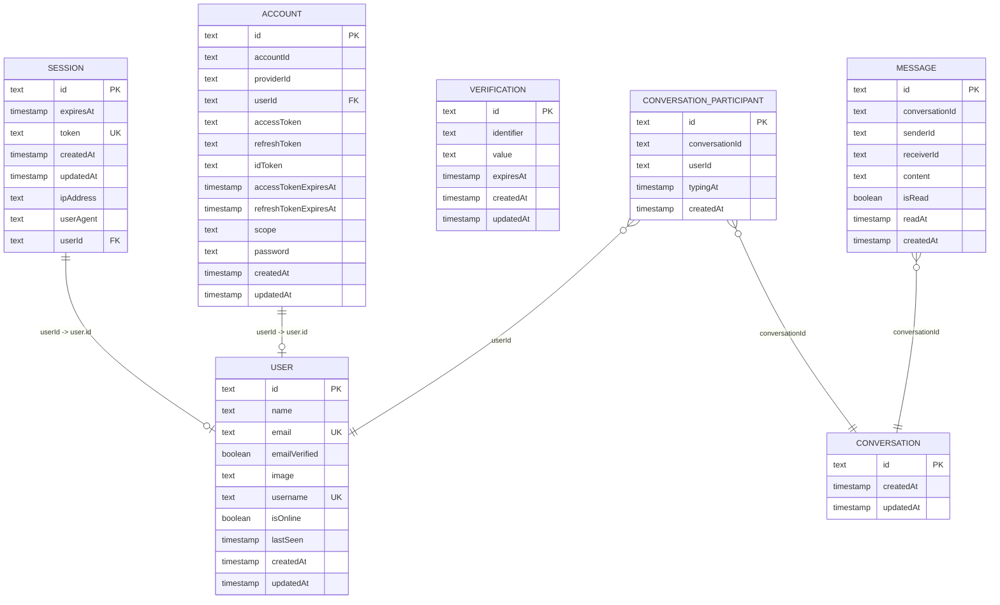
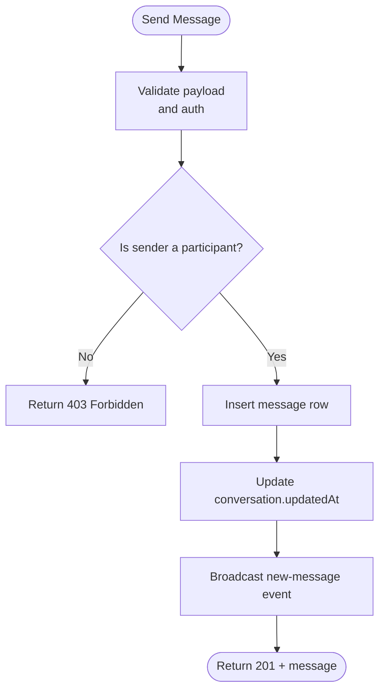
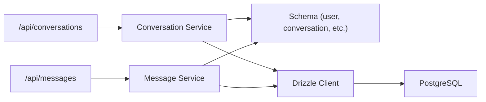

# Database Schema & Data Models

<cite>
**Referenced Files in This Document**
- [schema.ts](file://lib/db/schema.ts)
- [index.ts](file://lib/db/index.ts)
- [drizzle.config.ts](file://drizzle.config.ts)
- [conversation.service.ts](file://lib/services/conversation.service.ts)
- [message.service.ts](file://lib/services/message.service.ts)
- [route.ts (conversations)](file://app/api/conversations/route.ts)
- [route.ts (messages)](file://app/api/messages/route.ts)
- [types/index.ts](file://types/index.ts)
</cite>

## Table of Contents
1. Introduction
2. Project Structure
3. Core Components
4. Architecture Overview
5. Detailed Component Analysis
6. Dependency Analysis
7. Performance Considerations
8. Troubleshooting Guide
9. Conclusion

## Introduction
This document describes SecureChat’s database schema and data models built with Drizzle ORM on PostgreSQL. It covers the User, Session, Conversation, Message, and related tables, their fields, constraints, indexes, relationships, validation rules, and business logic enforced by services. It also explains database connection configuration, migration strategy using Drizzle Kit, query patterns used across the application, and performance considerations including indexing and scaling strategies.

## Project Structure
The data model is defined in a single schema module and consumed via a shared Drizzle client instance. Services implement business logic and query patterns over these tables. API routes orchestrate requests through services to persist and retrieve data.

**Diagram sources**
- [schema.ts:8-100](file://lib/db/schema.ts#L8-L100)
- [index.ts:1-10](file://lib/db/index.ts#L1-L10)
- [conversation.service.ts:1-236](file://lib/services/conversation.service.ts#L1-L236)
- [message.service.ts:1-164](file://lib/services/message.service.ts#L1-L164)
- [route.ts (conversations):1-81](file://app/api/conversations/route.ts#L1-L81)
- [route.ts (messages):1-51](file://app/api/messages/route.ts#L1-L51)

**Section sources**
- [schema.ts:8-100](file://lib/db/schema.ts#L8-L100)
- [index.ts:1-10](file://lib/db/index.ts#L1-L10)
- [drizzle.config.ts:1-19](file://drizzle.config.ts#L1-L19)

## Core Components
This section summarizes each table’s purpose, fields, types, constraints, and indexes as defined in the schema.

- user
  - Purpose: Identity and presence for Better Auth and chat features.
  - Fields: id (text PK), name (text, not null), email (text, not null, unique), emailVerified (boolean, default false), image (text, nullable), username (text, unique), isOnline (boolean, default false), lastSeen (timestamp, nullable), createdAt (timestamp, default now), updatedAt (timestamp, default now).
  - Constraints: Primary key on id; unique on email and username; not null on name, emailVerified, createdAt, updatedAt; defaults for timestamps and booleans.
  - Indexes: Implicit primary key index; unique indexes on email and username.

- session
  - Purpose: Authentication sessions managed by Better Auth.
  - Fields: id (text PK), expiresAt (timestamp, not null), token (text, not null, unique), createdAt (timestamp, default now), updatedAt (timestamp, default now), ipAddress (text, nullable), userAgent (text, nullable), userId (text, not null, references user.id with cascade delete).
  - Constraints: Primary key on id; unique on token; foreign key to user(id) with cascade delete.
  - Indexes: Primary key index; unique index on token; foreign key index on userId (inherited from reference).

- account
  - Purpose: OAuth/account provider linkage for users.
  - Fields: id (text PK), accountId (text, not null), providerId (text, not null), userId (text, not null, references user.id with cascade delete), accessToken (text, nullable), refreshToken (text, nullable), idToken (text, nullable), accessTokenExpiresAt (timestamp, nullable), refreshTokenExpiresAt (timestamp, nullable), scope (text, nullable), password (text, nullable), createdAt (timestamp, default now), updatedAt (timestamp, default now).
  - Constraints: Primary key on id; foreign key to user(id) with cascade delete.
  - Indexes: Primary key index; foreign key index on userId.

- verification
  - Purpose: Email or other verification tokens.
  - Fields: id (text PK), identifier (text, not null), value (text, not null), expiresAt (timestamp, not null), createdAt (timestamp, default now), updatedAt (timestamp, default now).
  - Constraints: Primary key on id; not null on identifier, value, expiresAt.
  - Indexes: Primary key index.

- conversation
  - Purpose: Groups messages between participants; one per unique pair of users.
  - Fields: id (text PK), createdAt (timestamp, default now), updatedAt (timestamp, default now).
  - Constraints: Primary key on id.
  - Indexes: Primary key index.

- conversation_participant
  - Purpose: Many-to-many link between conversations and users; tracks typing state per participant.
  - Fields: id (text PK), conversationId (text, not null), userId (text, not null), typingAt (timestamp, nullable), createdAt (timestamp, default now).
  - Constraints: Primary key on id; unique composite on (conversationId, userId) to prevent duplicate membership.
  - Indexes: Primary key index; unique index on (conversationId, userId).

- message
  - Purpose: Chat messages within a conversation.
  - Fields: id (text PK), conversationId (text, not null), senderId (text, not null), receiverId (text, not null), content (text, not null), isRead (boolean, default false), readAt (timestamp, nullable), createdAt (timestamp, default now).
  - Constraints: Primary key on id; not null on conversationId, senderId, receiverId, content.
  - Indexes: Primary key index.

Business logic constraints enforced at the service layer:
- One conversation per user pair: findOrCreateConversation ensures reuse of an existing conversation when both users are already participants; otherwise creates a new conversation and adds both participants.
- Participant authorization: isParticipant checks that a user belongs to a conversation before allowing message send or read operations.
- Presence and typing: isOnline and lastSeen updated via presence endpoints; typingAt set temporarily per participant.

**Section sources**
- [schema.ts:8-100](file://lib/db/schema.ts#L8-L100)
- [conversation.service.ts:25-69](file://lib/services/conversation.service.ts#L25-L69)
- [conversation.service.ts:157-170](file://lib/services/conversation.service.ts#L157-L170)
- [conversation.service.ts:202-235](file://lib/services/conversation.service.ts#L202-L235)

## Architecture Overview
SecureChat uses Drizzle ORM with a shared pg pool for all queries. The schema defines entities; services encapsulate business logic and query composition; API routes validate inputs and delegate to services. Realtime updates are broadcast after persistence.

**Diagram sources**
- [route.ts (conversations):14-72](file://app/api/conversations/route.ts#L14-L72)
- [conversation.service.ts:25-69](file://lib/services/conversation.service.ts#L25-L69)
- [route.ts (messages):12-42](file://app/api/messages/route.ts#L12-L42)
- [message.service.ts:59-117](file://lib/services/message.service.ts#L59-L117)

## Detailed Component Analysis

### Entity Relationship Diagram

**Diagram sources**
- [schema.ts:8-100](file://lib/db/schema.ts#L8-L100)

### Data Validation Rules and Business Logic
- Input validation: API routes use Zod schemas to validate request payloads before processing. For example, /api/messages validates required fields and trims content; /api/conversations validates otherUserId and prevents self-conversation.
- Authorization: Sender identity is derived from the authenticated session, never from client input. Before sending a message, the route verifies the sender is a participant in the conversation.
- Uniqueness and integrity: Unique constraints on email and username ensure identity uniqueness; unique composite on conversation_participant prevents duplicate memberships; cascade deletes remove dependent records when a user is deleted.
- Presence and typing: Presence fields are updated by presence endpoints; typingAt is set transiently and cleared after a TTL.

**Section sources**
- [route.ts (messages):12-42](file://app/api/messages/route.ts#L12-L42)
- [route.ts (conversations):33-72](file://app/api/conversations/route.ts#L33-L72)
- [schema.ts:8-100](file://lib/db/schema.ts#L8-L100)
- [conversation.service.ts:202-235](file://lib/services/conversation.service.ts#L202-L235)

### Query Patterns
- Find-or-create conversation: Queries participant lists for both users, finds overlap, and either returns existing conversationId or inserts a new conversation plus two participants.
- List user conversations: Joins participants with users to get the other participant, fetches the last message per conversation, and counts unread messages for the current user.
- Send message: Inserts a message row, updates conversation.updatedAt to reflect recent activity, and broadcasts realtime events.
- Mark messages read: Updates isRead and readAt for messages addressed to the current user in a conversation, then broadcasts read receipts.

**Diagram sources**
- [route.ts (messages):12-42](file://app/api/messages/route.ts#L12-L42)
- [message.service.ts:59-117](file://lib/services/message.service.ts#L59-L117)

**Section sources**
- [conversation.service.ts:25-69](file://lib/services/conversation.service.ts#L25-L69)
- [conversation.service.ts:75-151](file://lib/services/conversation.service.ts#L75-L151)
- [message.service.ts:59-117](file://lib/services/message.service.ts#L59-L117)
- [message.service.ts:139-164](file://lib/services/message.service.ts#L139-L164)

## Dependency Analysis
- Schema dependencies: session and account reference user; conversation_participant references conversation and user; message references conversation.
- Runtime dependencies: All modules import the shared db client from lib/db/index.ts, which constructs a pg Pool and Drizzle instance with the schema.
- Service dependencies: conversation.service.ts depends on schema tables and utils; message.service.ts depends on schema tables and realtime broadcasting utilities.
- API dependencies: Routes depend on services and validation schemas; they do not directly access the database.

**Diagram sources**
- [index.ts:1-10](file://lib/db/index.ts#L1-L10)
- [conversation.service.ts:1-236](file://lib/services/conversation.service.ts#L1-L236)
- [message.service.ts:1-164](file://lib/services/message.service.ts#L1-L164)
- [route.ts (conversations):1-81](file://app/api/conversations/route.ts#L1-L81)
- [route.ts (messages):1-51](file://app/api/messages/route.ts#L1-L51)

**Section sources**
- [index.ts:1-10](file://lib/db/index.ts#L1-L10)
- [schema.ts:8-100](file://lib/db/schema.ts#L8-L100)

## Performance Considerations
- Indexing strategy
  - Primary keys: All tables define text-based UUIDs as primary keys, providing efficient lookups by id.
  - Unique constraints: email and username on user; token on session; composite unique on conversation_participant (conversationId, userId) prevents duplicates and supports fast membership checks.
  - Foreign keys: session.userId and account.userId reference user.id; conversation_participant.conversationId and message.conversationId provide join paths. While the code comments note no explicit FK constraints for some joins due to Neon stack defaults, adding appropriate indexes on frequently joined columns can improve performance.
  - Recommended additional indexes
    - message(conversationId, createdAt) to optimize listing messages per conversation ordered by time.
    - message(receiverId, isRead, conversationId) to speed up marking messages read and counting unread per conversation.
    - conversation_participant(userId) to accelerate “find conversations for user” queries.
    - user(lastSeen) if frequent presence filtering is needed.

- Query optimization
  - Use selective selects: Only project needed fields (e.g., public user fields) to reduce payload size.
  - Limit results: Pagination or limits on message retrieval avoid large result sets.
  - Avoid N+1 queries: Batch operations where possible; consider joins or IN clauses for multi-row reads.
  - Leverage ordering and limits: Order by updatedAt or createdAt with LIMIT for list views.

- Scaling approaches
  - Connection pooling: A single pg Pool is shared across Drizzle and Better Auth; tune pool size based on workload and database capacity.
  - Read replicas: Offload read-heavy queries (listing conversations, fetching messages) to read replicas if supported by your PostgreSQL provider.
  - Partitioning: Consider partitioning the message table by conversationId or time ranges for very high-volume messaging.
  - Caching: Cache hot data like user presence and last messages at the application layer to reduce database load.

[No sources needed since this section provides general guidance]

## Troubleshooting Guide
- Unauthorized errors
  - Cause: Missing or invalid session; getUserId fails.
  - Resolution: Ensure authentication middleware runs; verify session validity; check environment variables for database connectivity.

- Invalid request
  - Cause: Zod validation failure on request body.
  - Resolution: Inspect error details returned by validation; ensure required fields are present and correctly typed.

- Forbidden
  - Cause: Sender is not a participant in the conversation.
  - Resolution: Verify participant status before sending; ensure correct conversationId and senderId from session.

- Internal server error
  - Cause: Unexpected exceptions during DB operations or service logic.
  - Resolution: Check logs; verify database connectivity and credentials; review transactional steps in services.

**Section sources**
- [route.ts (conversations):14-25](file://app/api/conversations/route.ts#L14-L25)
- [route.ts (messages):12-49](file://app/api/messages/route.ts#L12-L49)

## Conclusion
SecureChat’s data model centers around secure authentication via Better Auth tables and a chat system built on conversation and message entities. The schema enforces identity uniqueness and participant integrity, while services implement robust business logic for conversation lifecycle, messaging, and presence. With careful indexing and query design, the system can scale to support real-time chat workloads. Future enhancements should focus on targeted indexes, pagination, and caching to maintain performance under growth.