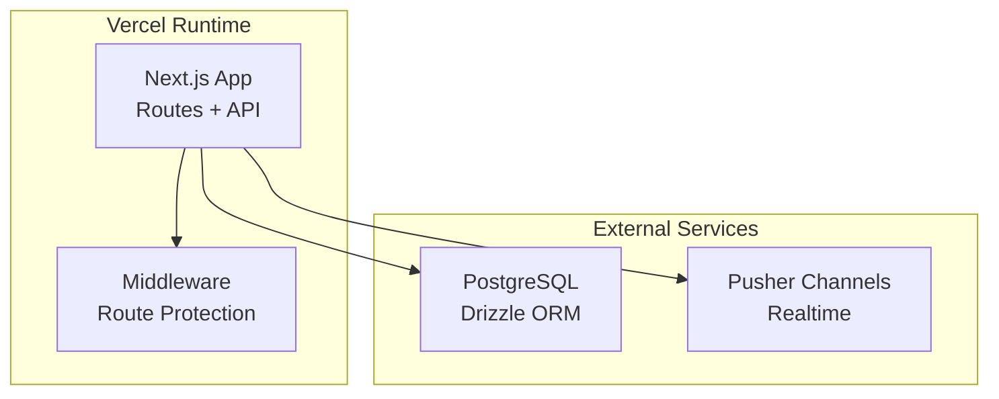
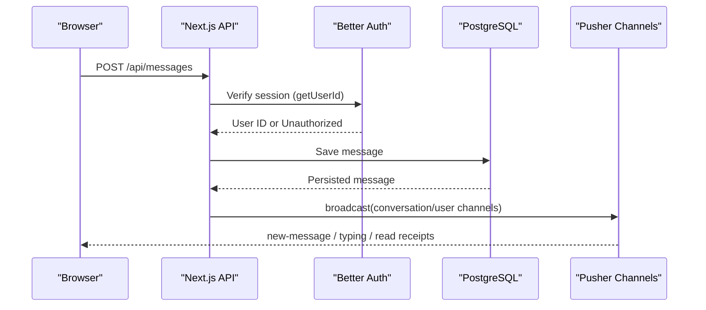
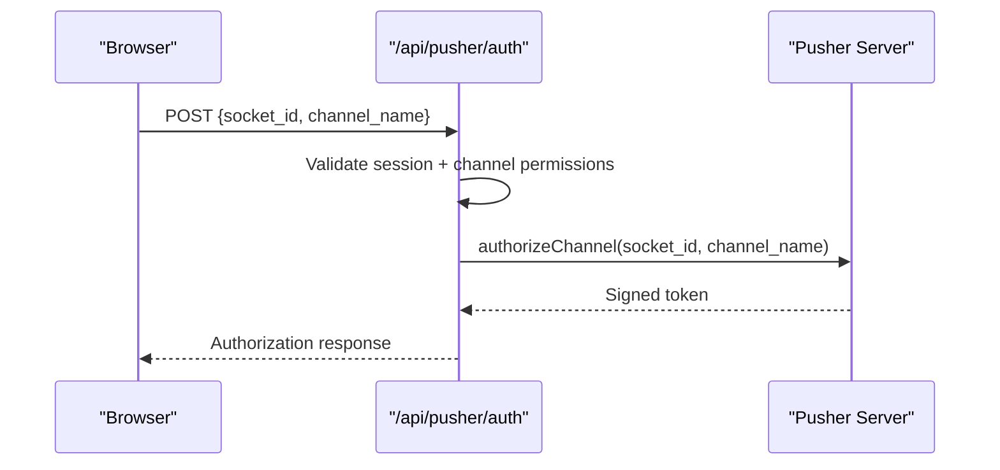
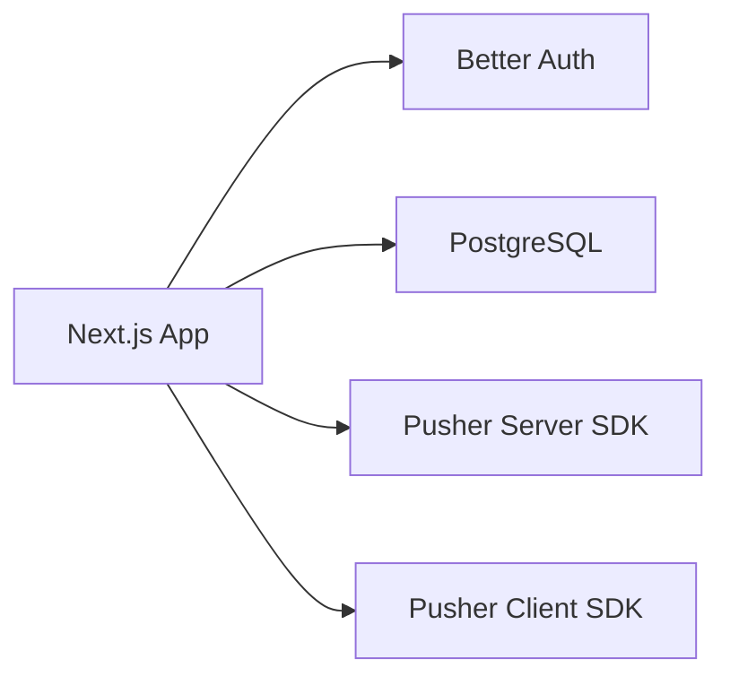

# Deployment & Production

<cite>
**Referenced Files in This Document**
- [package.json](file://package.json)
- [next.config.mjs](file://next.config.mjs)
- [drizzle.config.ts](file://drizzle.config.ts)
- [middleware.ts](file://middleware.ts)
- [lib/auth.ts](file://lib/auth.ts)
- [lib/db/index.ts](file://lib/db/index.ts)
- [lib/db/schema.ts](file://lib/db/schema.ts)
- [lib/realtime/index.ts](file://lib/realtime/index.ts)
- [lib/realtime/client.ts](file://lib/realtime/client.ts)
- [lib/realtime/channels.ts](file://lib/realtime/channels.ts)
- [app/api/pusher/auth/route.ts](file://app/api/pusher/auth/route.ts)
- [app/layout.tsx](file://app/layout.tsx)
- [.gitignore](file://.gitignore)
</cite>

## Table of Contents
1. Introduction
2. Project Structure
3. Core Components
4. Architecture Overview
5. Detailed Component Analysis
6. Dependency Analysis
7. Performance Considerations
8. Troubleshooting Guide
9. Conclusion
10. Appendices

## Introduction
This document provides a comprehensive production deployment guide for SecureChat on Vercel, including environment configuration, PostgreSQL provisioning and migrations, Pusher Channels setup for real-time messaging, build optimization, CI/CD automation, monitoring and logging, scaling strategies, security hardening, and troubleshooting with rollback procedures. It is tailored to the project’s Next.js app, Better Auth integration, Drizzle ORM with PostgreSQL, and Pusher-based real-time transport.

## Project Structure
SecureChat is a Next.js application using:
- Server-side authentication via Better Auth
- PostgreSQL database accessed through Drizzle ORM
- Real-time features powered by Pusher Channels (server SDK and client SDK)
- Middleware protecting routes based on session cookies
- Vercel as the hosting platform

**Diagram sources**
- [middleware.ts:1-42](file://middleware.ts#L1-L42)
- [lib/db/index.ts:1-10](file://lib/db/index.ts#L1-L10)
- [lib/realtime/index.ts:1-78](file://lib/realtime/index.ts#L1-L78)

**Section sources**
- [package.json:1-53](file://package.json#L1-L53)
- [next.config.mjs:1-12](file://next.config.mjs#L1-L12)
- [middleware.ts:1-42](file://middleware.ts#L1-L42)

## Core Components
- Authentication: Better Auth configured with database pool, base URL resolution, trusted origins, and session settings.
- Database: PostgreSQL connection pooling via pg and Drizzle ORM; schema defines users, sessions, accounts, verification, conversations, participants, and messages.
- Realtime: Pusher Channels server SDK for broadcasting events and authorizing private channels; client SDK for browser subscriptions.
- Middleware: Protects chat routes and redirects based on session cookie presence.
- Build Config: Next.js config disables image optimization for serverless compatibility and ignores TypeScript build errors for faster builds.

**Section sources**
- [lib/auth.ts:1-65](file://lib/auth.ts#L1-L65)
- [lib/db/index.ts:1-10](file://lib/db/index.ts#L1-L10)
- [lib/db/schema.ts:1-101](file://lib/db/schema.ts#L1-L101)
- [lib/realtime/index.ts:1-78](file://lib/realtime/index.ts#L1-L78)
- [lib/realtime/client.ts:1-29](file://lib/realtime/client.ts#L1-L29)
- [middleware.ts:1-42](file://middleware.ts#L1-L42)
- [next.config.mjs:1-12](file://next.config.mjs#L1-L12)

## Architecture Overview
The runtime architecture integrates Next.js API routes with external services:
- Better Auth manages sessions and user data against PostgreSQL.
- Pusher Channels provides real-time event delivery and private channel authorization.
- Middleware enforces route protection at the edge.

**Diagram sources**
- [app/api/pusher/auth/route.ts:1-62](file://app/api/pusher/auth/route.ts#L1-L62)
- [lib/realtime/index.ts:1-78](file://lib/realtime/index.ts#L1-L78)
- [lib/auth.ts:1-65](file://lib/auth.ts#L1-L65)
- [lib/db/index.ts:1-10](file://lib/db/index.ts#L1-L10)

## Detailed Component Analysis

### Vercel Deployment Configuration
- Use Vercel CLI or Git integration to deploy the Next.js app.
- Configure environment variables in Vercel dashboard or .env files for local development.
- Ensure Node version matches your toolchain; Next.js 16 is used.
- The app uses serverless functions for API routes; avoid long-lived connections outside of pools.

Key considerations:
- Base URL resolution for Better Auth supports Vercel production URLs automatically.
- Trusted origins are set for both development and production environments.
- Image optimization is disabled to ensure compatibility with serverless runtimes.

**Section sources**
- [lib/auth.ts:1-65](file://lib/auth.ts#L1-L65)
- [next.config.mjs:1-12](file://next.config.mjs#L1-L12)
- [package.json:1-53](file://package.json#L1-L53)

### Environment Variable Management
Required environment variables:
- Database:
  - DATABASE_URL: PostgreSQL connection string for pooled connections used by the app.
  - DATABASE_URL_UNPOOLED: Unpooled connection string for schema migrations (required when using Neon or similar providers that block DDL over pooled connections).
- Authentication:
  - BETTER_AUTH_URL: Optional override for base URL; otherwise inferred from Vercel environment variables.
- Realtime:
  - PUSHER_APP_ID, PUSHER_KEY, PUSHER_SECRET, PUSHER_CLUSTER: Server-side Pusher credentials.
  - NEXT_PUBLIC_PUSHER_KEY, NEXT_PUBLIC_PUSHER_CLUSTER: Client-side Pusher credentials exposed to the browser.

Security notes:
- Never commit secrets; use Vercel environment variables or secure secret management.
- .env*.local is ignored by default.

**Section sources**
- [drizzle.config.ts:1-19](file://drizzle.config.ts#L1-L19)
- [lib/db/index.ts:1-10](file://lib/db/index.ts#L1-L10)
- [lib/realtime/index.ts:1-78](file://lib/realtime/index.ts#L1-L78)
- [lib/realtime/client.ts:1-29](file://lib/realtime/client.ts#L1-L29)
- [.gitignore:1-15](file://.gitignore#L1-L15)

### Database Provisioning with PostgreSQL
- Provider: PostgreSQL (e.g., Neon, Supabase, AWS RDS).
- Connection pooling: The app uses a single shared pg Pool for Drizzle and Better Auth.
- Migrations: Use Drizzle Kit with an unpooled URL to run DDL safely.

Steps:
1. Provision a PostgreSQL instance and obtain connection strings.
2. Set DATABASE_URL and DATABASE_URL_UNPOOLED in your environment.
3. Run migrations locally or in CI using Drizzle Kit commands defined in package scripts.

Schema highlights:
- Users, sessions, accounts, verification tables for Better Auth.
- Conversations, conversation_participant, and message tables for chat functionality.

**Section sources**
- [lib/db/index.ts:1-10](file://lib/db/index.ts#L1-L10)
- [lib/db/schema.ts:1-101](file://lib/db/schema.ts#L1-L101)
- [drizzle.config.ts:1-19](file://drizzle.config.ts#L1-L19)
- [package.json:1-53](file://package.json#L1-L53)

### Pusher Channels Setup for Production
Server-side:
- Initialize Pusher with appId, key, secret, cluster, and TLS enabled.
- Broadcast events to private channels for conversations and user-specific updates.
- Authorize private channel subscriptions via /api/pusher/auth after verifying permissions.

Client-side:
- Initialize Pusher with public key and cluster.
- Subscribe to private channels and handle events like new messages, typing, and read receipts.

Authorization flow:
- The auth endpoint validates the user session and channel membership before signing the subscription.

**Diagram sources**
- [app/api/pusher/auth/route.ts:1-62](file://app/api/pusher/auth/route.ts#L1-L62)
- [lib/realtime/index.ts:1-78](file://lib/realtime/index.ts#L1-L78)
- [lib/realtime/client.ts:1-29](file://lib/realtime/client.ts#L1-L29)

**Section sources**
- [lib/realtime/index.ts:1-78](file://lib/realtime/index.ts#L1-L78)
- [lib/realtime/client.ts:1-29](file://lib/realtime/client.ts#L1-L29)
- [lib/realtime/channels.ts:1-26](file://lib/realtime/channels.ts#L1-L26)
- [app/api/pusher/auth/route.ts:1-62](file://app/api/pusher/auth/route.ts#L1-L62)

### Build Optimization and Asset Bundling
- Next.js build ignores TypeScript errors to speed up deployments; consider enabling strict checks in CI for quality gates.
- Images are unoptimized for serverless compatibility; if you need image optimization, consider a compatible provider or enable it only on supported platforms.
- Keep dependencies minimal and pinned via lockfiles to ensure reproducible builds.

Recommendations:
- Enable incremental static regeneration where applicable.
- Use code splitting and dynamic imports to reduce bundle size.
- Monitor bundle sizes and remove unused dependencies.

**Section sources**
- [next.config.mjs:1-12](file://next.config.mjs#L1-L12)
- [package.json:1-53](file://package.json#L1-L53)

### Performance Tuning for Production
- Database:
  - Tune connection pool size based on expected concurrency and provider limits.
  - Add indexes for frequently queried columns (e.g., conversationId, senderId, receiverId).
- Realtime:
  - Ensure Pusher cluster selection is optimal for your audience region.
  - Debounce high-frequency events like typing indicators.
- Application:
  - Cache expensive queries where appropriate.
  - Use SWR or similar caching strategies for list endpoints.

[No sources needed since this section provides general guidance]

### CI/CD Pipeline Setup and Automated Testing
Recommended pipeline stages:
- Install dependencies using pnpm or npm.
- Lint and type-check code.
- Run unit and integration tests.
- Build the Next.js app.
- Deploy to Vercel (via Git integration or CLI).

Environment:
- Provide all required environment variables in CI secrets.
- Run migrations in CI before deploying if necessary.

Testing strategy:
- Unit tests for services and utilities.
- Integration tests for API routes with mocked databases and Pusher.
- E2E tests for critical user flows (login, send message, receive realtime updates).

[No sources needed since this section provides general guidance]

### Monitoring and Logging
- Analytics: Vercel Analytics is included and enabled in production layout.
- Logs:
  - Console logs in API routes are captured by Vercel logs; structure logs for readability.
  - Consider integrating a structured logging service for centralized observability.
- Error tracking:
  - Integrate error reporting (e.g., Sentry) for frontend and backend errors.
- Performance monitoring:
  - Use Vercel Insights or APM tools to track latency and errors.

**Section sources**
- [app/layout.tsx:1-36](file://app/layout.tsx#L1-L36)

### Scaling Considerations, Load Balancing, and High Availability
- Vercel scales serverless functions automatically; ensure stateless operations and externalize state to databases and caches.
- Database scaling:
  - Choose a managed PostgreSQL provider with auto-scaling and read replicas if needed.
  - Use connection pooling appropriately; avoid excessive pool sizes.
- Realtime scaling:
  - Pusher handles horizontal scaling; ensure proper channel naming and authorization logic.
- High availability:
  - Multi-region deployments can be achieved via CDN and regional DNS.
  - Backups and point-in-time recovery for the database are recommended.

[No sources needed since this section provides general guidance]

### Security Hardening and SSL Configuration
- HTTPS:
  - Vercel enforces HTTPS; ensure all APIs and assets are served over HTTPS.
- Session security:
  - Better Auth sets secure cookies in production; verify trusted origins include your domain.
- Input validation:
  - Validate all inputs using Zod schemas in API routes.
- Authorization:
  - Enforce per-route checks using session userId; never trust client-provided identifiers.
- Secrets management:
  - Store secrets in Vercel environment variables; do not commit to repository.

**Section sources**
- [lib/auth.ts:1-65](file://lib/auth.ts#L1-L65)
- [middleware.ts:1-42](file://middleware.ts#L1-L42)
- [.gitignore:1-15](file://.gitignore#L1-L15)

### Rollback Procedures
- Vercel rollbacks:
  - Use Vercel UI to revert to a previous deployment.
  - Pin deployments to specific commits for reproducibility.
- Database rollbacks:
  - Maintain migration history; apply reverse migrations cautiously.
  - Test rollbacks in staging before applying to production.
- Feature flags:
  - Use feature toggles to disable risky features without full rollbacks.

[No sources needed since this section provides general guidance]

## Dependency Analysis
Core runtime dependencies:
- Next.js framework and React ecosystem.
- Better Auth for authentication and session management.
- Drizzle ORM and PostgreSQL driver for database access.
- Pusher SDKs for real-time communication.

**Diagram sources**
- [package.json:1-53](file://package.json#L1-L53)
- [lib/auth.ts:1-65](file://lib/auth.ts#L1-L65)
- [lib/db/index.ts:1-10](file://lib/db/index.ts#L1-L10)
- [lib/realtime/index.ts:1-78](file://lib/realtime/index.ts#L1-L78)
- [lib/realtime/client.ts:1-29](file://lib/realtime/client.ts#L1-L29)

**Section sources**
- [package.json:1-53](file://package.json#L1-L53)

## Performance Considerations
- Optimize database queries and add indexes for frequent filters.
- Reduce payload sizes by selecting only necessary fields.
- Use efficient real-time event patterns (e.g., batch updates).
- Monitor cold start times and function memory usage on Vercel.

[No sources needed since this section provides general guidance]

## Troubleshooting Guide
Common issues and resolutions:
- Realtime not working:
  - Ensure Pusher environment variables are set correctly on both server and client.
  - Verify /api/pusher/auth returns valid authorization tokens.
- Database connection failures:
  - Check DATABASE_URL and DATABASE_URL_UNPOOLED values.
  - Confirm network access and firewall rules allow connections.
- Authentication redirects loop:
  - Verify BETTER_AUTH_URL and trusted origins match your deployed domain.
  - Ensure middleware matcher excludes static assets and auth routes.
- Build errors:
  - Review TypeScript configuration and dependency versions.
  - Temporarily ignore build errors only in non-critical branches.

Diagnostic steps:
- Inspect Vercel function logs for API route errors.
- Use browser DevTools to check Pusher connection status and authorization responses.
- Validate database connectivity using Drizzle Studio or direct SQL clients.

**Section sources**
- [app/api/pusher/auth/route.ts:1-62](file://app/api/pusher/auth/route.ts#L1-L62)
- [lib/realtime/index.ts:1-78](file://lib/realtime/index.ts#L1-L78)
- [lib/auth.ts:1-65](file://lib/auth.ts#L1-L65)
- [middleware.ts:1-42](file://middleware.ts#L1-L42)

## Conclusion
SecureChat is designed for production-grade deployment on Vercel with robust authentication, scalable database access, and reliable real-time messaging via Pusher Channels. By following the environment configuration, build optimizations, CI/CD practices, monitoring setup, and security hardening guidelines outlined here, you can deploy a secure, performant, and maintainable application. Regularly review performance metrics, update dependencies, and test rollbacks to ensure stability in production.

## Appendices

### Environment Variables Reference
- DATABASE_URL: PostgreSQL connection string for pooled connections.
- DATABASE_URL_UNPOOLED: Unpooled connection string for migrations.
- BETTER_AUTH_URL: Optional base URL override for authentication.
- PUSHER_APP_ID, PUSHER_KEY, PUSHER_SECRET, PUSHER_CLUSTER: Server-side Pusher credentials.
- NEXT_PUBLIC_PUSHER_KEY, NEXT_PUBLIC_PUSHER_CLUSTER: Client-side Pusher credentials.

**Section sources**
- [drizzle.config.ts:1-19](file://drizzle.config.ts#L1-L19)
- [lib/db/index.ts:1-10](file://lib/db/index.ts#L1-L10)
- [lib/realtime/index.ts:1-78](file://lib/realtime/index.ts#L1-L78)
- [lib/realtime/client.ts:1-29](file://lib/realtime/client.ts#L1-L29)

### Database Schema Overview
- user: id, name, email, emailVerified, image, username, isOnline, lastSeen, createdAt, updatedAt.
- session: id, expiresAt, token, createdAt, updatedAt, ipAddress, userAgent, userId.
- account: id, accountId, providerId, userId, tokens, scopes, timestamps.
- verification: id, identifier, value, expiresAt, timestamps.
- conversation: id, timestamps.
- conversation_participant: id, conversationId, userId, typingAt, createdAt.
- message: id, conversationId, senderId, receiverId, content, isRead, readAt, createdAt.

**Section sources**
- [lib/db/schema.ts:1-101](file://lib/db/schema.ts#L1-L101)