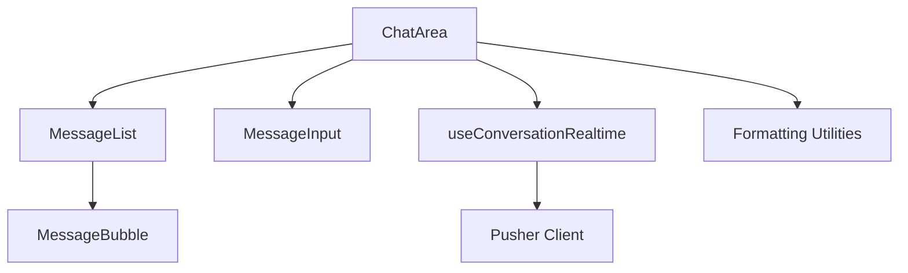
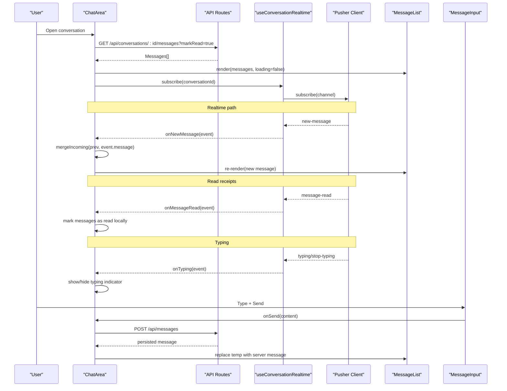
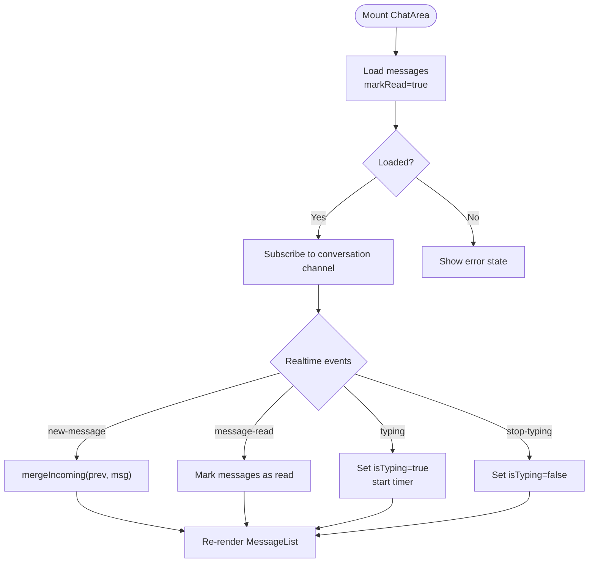
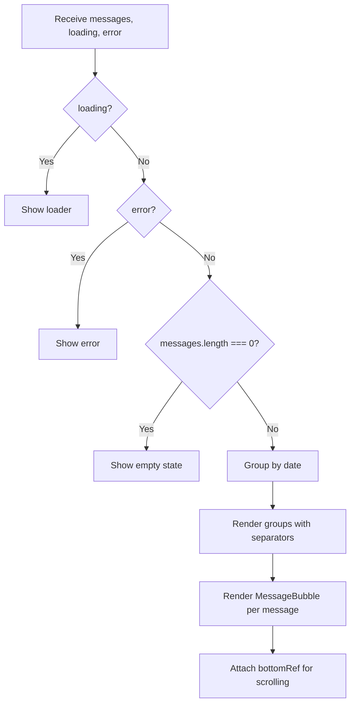
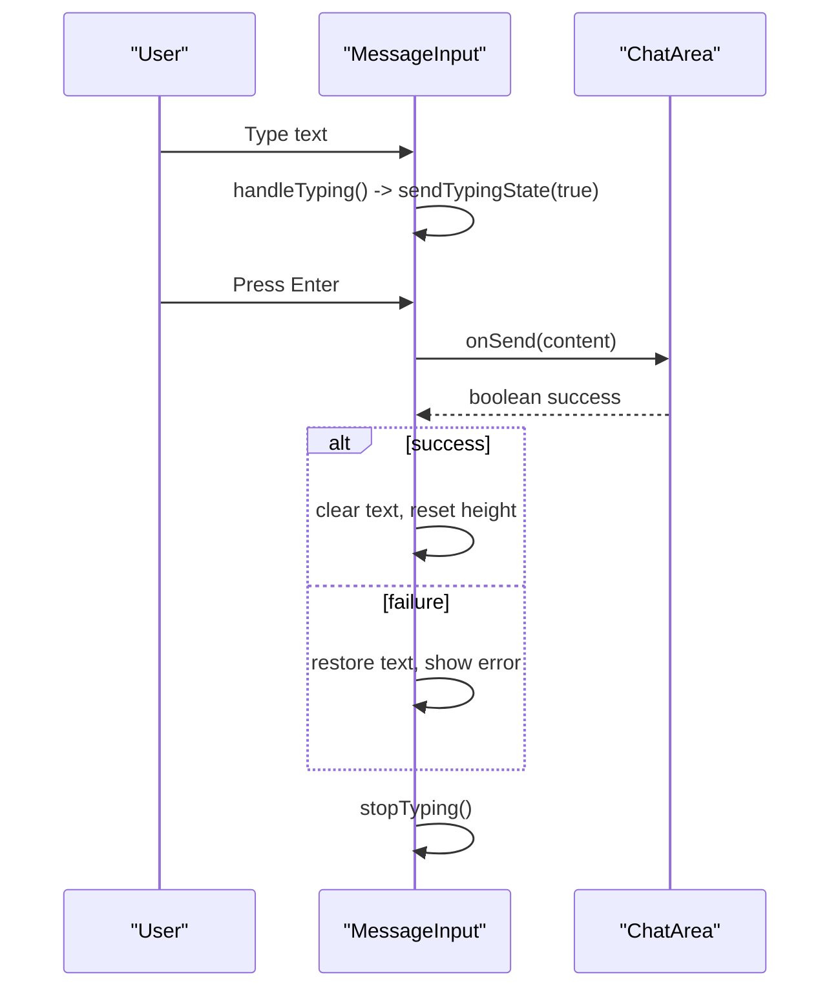
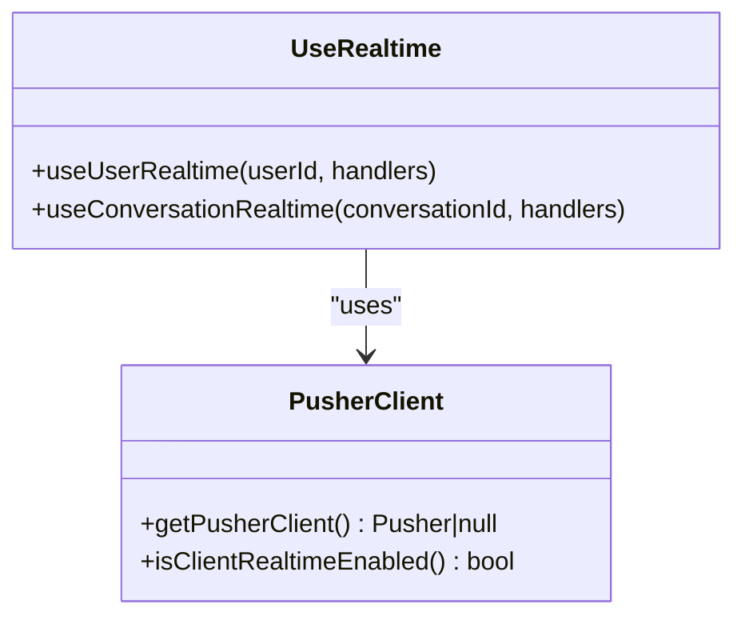
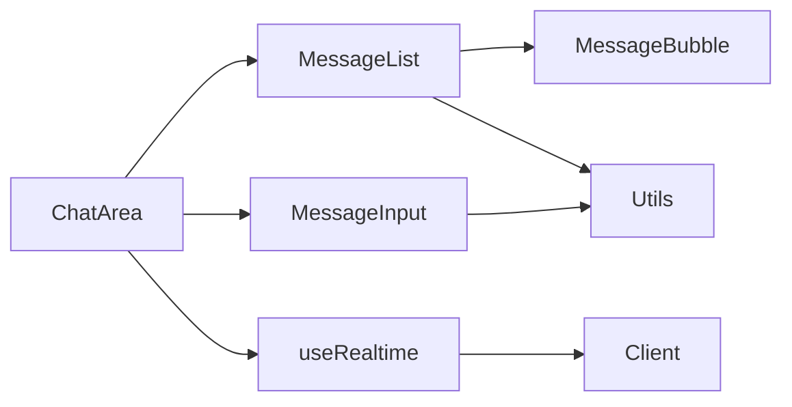

# Chat Area Component

<cite>
**Referenced Files in This Document**
- [ChatArea.tsx](file://components/chat/ChatArea.tsx)
- [MessageList.tsx](file://components/chat/MessageList.tsx)
- [MessageInput.tsx](file://components/chat/MessageInput.tsx)
- [MessageBubble.tsx](file://components/chat/MessageBubble.tsx)
- [useRealtime.ts](file://hooks/useRealtime.ts)
- [client.ts](file://lib/realtime/client.ts)
- [utils.ts](file://lib/utils.ts)
- [index.ts](file://types/index.ts)
- [page.tsx](file://app/(chat)/chat/page.tsx)
</cite>

## Table of Contents
1. [Introduction](#introduction)
2. [Project Structure](#project-structure)
3. [Core Components](#core-components)
4. [Architecture Overview](#architecture-overview)
5. [Detailed Component Analysis](#detailed-component-analysis)
6. [Dependency Analysis](#dependency-analysis)
7. [Performance Considerations](#performance-considerations)
8. [Troubleshooting Guide](#troubleshooting-guide)
9. [Conclusion](#conclusion)
10. [Appendices](#appendices)

## Introduction
This document provides comprehensive documentation for the ChatArea component, which renders the active conversation interface. It covers props, message display logic, real-time updates, typing indicators, read receipts, integration with MessageList and MessageInput, scroll management, empty state handling, event subscriptions, performance optimizations, responsive design, and accessibility features.

## Project Structure
The chat UI is composed of a few focused components:
- ChatArea: orchestrates conversation state, real-time events, and layout
- MessageList: renders grouped messages with date separators and scroll anchor
- MessageInput: handles composing and sending messages, typing indicators
- MessageBubble: renders individual message bubbles with timestamps and read status
- useRealtime hook: subscribes to Pusher channels for new messages, read receipts, and typing events
- Realtime client utilities: Pusher initialization and feature detection
- Shared types: Message, Conversation, PublicUser, and realtime event payloads

**Diagram sources**
- [ChatArea.tsx:1-292](file://components/chat/ChatArea.tsx#L1-L292)
- [MessageList.tsx:1-100](file://components/chat/MessageList.tsx#L1-L100)
- [MessageInput.tsx:1-193](file://components/chat/MessageInput.tsx#L1-L193)
- [MessageBubble.tsx:1-60](file://components/chat/MessageBubble.tsx#L1-L60)
- [useRealtime.ts:1-120](file://hooks/useRealtime.ts#L1-L120)
- [client.ts:1-30](file://lib/realtime/client.ts#L1-L30)
- [utils.ts:1-94](file://lib/utils.ts#L1-L94)

**Section sources**
- [ChatArea.tsx:1-292](file://components/chat/ChatArea.tsx#L1-L292)
- [MessageList.tsx:1-100](file://components/chat/MessageList.tsx#L1-L100)
- [MessageInput.tsx:1-193](file://components/chat/MessageInput.tsx#L1-L193)
- [MessageBubble.tsx:1-60](file://components/chat/MessageBubble.tsx#L1-L60)
- [useRealtime.ts:1-120](file://hooks/useRealtime.ts#L1-L120)
- [client.ts:1-30](file://lib/realtime/client.ts#L1-L30)
- [utils.ts:1-94](file://lib/utils.ts#L1-L94)
- [index.ts:1-118](file://types/index.ts#L1-L118)
- [page.tsx:1-27](file://app/(chat)/chat/page.tsx#L1-L27)

## Core Components
- ChatArea: Manages conversation context, loads messages, integrates real-time updates, shows typing indicator, and composes the header, message list, and input area.
- MessageList: Renders messages grouped by date, displays loading/error/empty states, and exposes a bottom ref for auto-scrolling.
- MessageInput: Handles text input, validation, send flow, and typing indicator signaling.
- MessageBubble: Displays message content, timestamp, and read status (single or double check).
- useRealtime: Subscribes to conversation channel for new-message, message-read, typing, and stop-typing events; also supports user presence via user channel.
- Realtime client: Provides Pusher instance when configured; otherwise ChatArea falls back to polling.

Key responsibilities and interactions are detailed in the sections below.

**Section sources**
- [ChatArea.tsx:28-48](file://components/chat/ChatArea.tsx#L28-L48)
- [MessageList.tsx:8-22](file://components/chat/MessageList.tsx#L8-L22)
- [MessageInput.tsx:7-10](file://components/chat/MessageInput.tsx#L7-L10)
- [MessageBubble.tsx:5-11](file://components/chat/MessageBubble.tsx#L5-L11)
- [useRealtime.ts:65-119](file://hooks/useRealtime.ts#L65-L119)
- [client.ts:7-29](file://lib/realtime/client.ts#L7-L29)

## Architecture Overview
The ChatArea coordinates data fetching, real-time updates, and UI composition. When Pusher is enabled, it uses event-driven updates; otherwise, it polls for new messages and typing state.

**Diagram sources**
- [ChatArea.tsx:57-176](file://components/chat/ChatArea.tsx#L57-L176)
- [useRealtime.ts:75-119](file://hooks/useRealtime.ts#L75-L119)
- [client.ts:17-29](file://lib/realtime/client.ts#L17-L29)
- [MessageList.tsx:23-99](file://components/chat/MessageList.tsx#L23-L99)
- [MessageInput.tsx:89-114](file://components/chat/MessageInput.tsx#L89-L114)

## Detailed Component Analysis

### ChatArea
Responsibilities:
- Props:
  - conversation: The active conversation object including otherUser, lastMessage, unreadCount, and timestamps.
  - currentUser: The current user’s public profile used to identify sender and update read status.
  - onBack: Navigation callback to return to conversations list.
  - onConversationUpdate: Callback to update conversation metadata (lastMessage, updatedAt, unreadCount).
- Message loading:
  - Fetches messages with markRead=true on mount to mark them as read.
  - Resets loading, error, and typing state per conversation change.
- Real-time vs polling:
  - If Pusher is enabled, subscribes to conversation channel for new-message, message-read, typing, and stop-typing.
  - Otherwise, polls for new messages and typing state at an interval.
- Incoming message merging:
  - Deduplicates incoming messages and removes matching optimistic messages before appending.
- Read receipts:
  - Updates local message read flags upon receiving message-read events.
- Typing indicators:
  - Shows typing indicator when receiving typing events from the other user; clears after timeout or stop-typing.
- Sending messages:
  - Optimistically inserts a temporary message, sends to server, then replaces with persisted message.
  - Updates conversation metadata via onConversationUpdate.
- Scroll management:
  - Auto-scrolls to bottom on message changes using a ref passed to MessageList.
- Header:
  - Displays avatar, username/name, online status or last seen time.

**Diagram sources**
- [ChatArea.tsx:57-176](file://components/chat/ChatArea.tsx#L57-L176)

**Section sources**
- [ChatArea.tsx:28-48](file://components/chat/ChatArea.tsx#L28-L48)
- [ChatArea.tsx:57-89](file://components/chat/ChatArea.tsx#L57-L89)
- [ChatArea.tsx:91-132](file://components/chat/ChatArea.tsx#L91-L132)
- [ChatArea.tsx:134-176](file://components/chat/ChatArea.tsx#L134-L176)
- [ChatArea.tsx:178-229](file://components/chat/ChatArea.tsx#L178-L229)
- [ChatArea.tsx:231-289](file://components/chat/ChatArea.tsx#L231-L289)

### MessageList
Responsibilities:
- Display modes:
  - Loading spinner while fetching.
  - Error message if fetch fails.
  - Empty state when no messages exist.
- Grouping:
  - Groups messages by formatted date and inserts date separators.
- Rendering:
  - Renders each message via MessageBubble, passing ownership and grouping hints.
- Scroll anchor:
  - Exposes a bottom ref for ChatArea to scroll into view.

**Diagram sources**
- [MessageList.tsx:23-99](file://components/chat/MessageList.tsx#L23-L99)

**Section sources**
- [MessageList.tsx:8-22](file://components/chat/MessageList.tsx#L8-L22)
- [MessageList.tsx:23-99](file://components/chat/MessageList.tsx#L23-L99)

### MessageInput
Responsibilities:
- Text input with auto-resize and character limit enforcement.
- Send flow:
  - Validates input length and disables send during sending.
  - Calls parent onSend handler.
  - Restores text on failure.
- Typing indicators:
  - Debounced typing signals sent to server; stops typing on unmount or explicit stop.
- Keyboard support:
  - Enter to send, Shift+Enter for newline.

**Diagram sources**
- [MessageInput.tsx:33-87](file://components/chat/MessageInput.tsx#L33-L87)
- [MessageInput.tsx:89-114](file://components/chat/MessageInput.tsx#L89-L114)

**Section sources**
- [MessageInput.tsx:7-10](file://components/chat/MessageInput.tsx#L7-L10)
- [MessageInput.tsx:22-31](file://components/chat/MessageInput.tsx#L22-L31)
- [MessageInput.tsx:33-87](file://components/chat/MessageInput.tsx#L33-L87)
- [MessageInput.tsx:89-114](file://components/chat/MessageInput.tsx#L89-L114)
- [MessageInput.tsx:116-124](file://components/chat/MessageInput.tsx#L116-L124)
- [MessageInput.tsx:126-193](file://components/chat/MessageInput.tsx#L126-L193)

### MessageBubble
Responsibilities:
- Renders message content safely as text.
- Shows timestamp and read status for own messages:
  - Single check for sent/unread.
  - Double check for read.
  - Temporary messages shown with reduced opacity.
- Responsive width constraints and alignment based on ownership.

**Section sources**
- [MessageBubble.tsx:5-11](file://components/chat/MessageBubble.tsx#L5-L11)
- [MessageBubble.tsx:11-59](file://components/chat/MessageBubble.tsx#L11-L59)

### Realtime Integration (useRealtime)
Responsibilities:
- Subscribes to conversation channel for:
  - new-message
  - message-read
  - typing
  - stop-typing
- Subscribes to user channel for presence events (used elsewhere in the app).
- Gracefully handles absence of Pusher configuration by returning null client.

**Diagram sources**
- [useRealtime.ts:1-120](file://hooks/useRealtime.ts#L1-L120)
- [client.ts:1-30](file://lib/realtime/client.ts#L1-L30)

**Section sources**
- [useRealtime.ts:15-61](file://hooks/useRealtime.ts#L15-L61)
- [useRealtime.ts:65-119](file://hooks/useRealtime.ts#L65-L119)
- [client.ts:7-29](file://lib/realtime/client.ts#L7-L29)

### Data Models
Shared types define the contract between components and APIs:
- Message: includes id, conversationId, sender/receiver ids, content, read status, timestamps, and optional sender info.
- Conversation: includes otherUser, lastMessage, unreadCount, and timestamps.
- PublicUser: safe subset of User for UI consumption.
- Realtime events: NewMessageEvent, MessageReadEvent, TypingEvent, PresenceEvent.

**Section sources**
- [index.ts:9-21](file://types/index.ts#L9-L21)
- [index.ts:25-53](file://types/index.ts#L25-L53)
- [index.ts:91-118](file://types/index.ts#L91-L118)

## Dependency Analysis
- ChatArea depends on:
  - MessageList for rendering messages
  - MessageInput for composing and sending
  - useConversationRealtime for real-time events
  - utils for formatting dates/times and presence
  - types for shared interfaces
- MessageList depends on:
  - MessageBubble for individual message rendering
  - utils for date formatting
- MessageInput depends on:
  - Validation constants for max length
- Realtime layer depends on:
  - Pusher client utility for connection and authorization endpoint

**Diagram sources**
- [ChatArea.tsx:1-292](file://components/chat/ChatArea.tsx#L1-L292)
- [MessageList.tsx:1-100](file://components/chat/MessageList.tsx#L1-L100)
- [MessageInput.tsx:1-193](file://components/chat/MessageInput.tsx#L1-L193)
- [useRealtime.ts:1-120](file://hooks/useRealtime.ts#L1-L120)
- [client.ts:1-30](file://lib/realtime/client.ts#L1-L30)
- [utils.ts:1-94](file://lib/utils.ts#L1-L94)

**Section sources**
- [ChatArea.tsx:1-292](file://components/chat/ChatArea.tsx#L1-L292)
- [MessageList.tsx:1-100](file://components/chat/MessageList.tsx#L1-L100)
- [MessageInput.tsx:1-193](file://components/chat/MessageInput.tsx#L1-L193)
- [useRealtime.ts:1-120](file://hooks/useRealtime.ts#L1-L120)
- [client.ts:1-30](file://lib/realtime/client.ts#L1-L30)
- [utils.ts:1-94](file://lib/utils.ts#L1-L94)

## Performance Considerations
- Optimistic messaging:
  - Inserts temporary messages immediately to improve perceived latency; replaced by server response.
- Efficient merging:
  - Incoming messages deduplicated and matched against optimistic entries to avoid duplicates.
- Polling fallback:
  - When Pusher is not configured, polling intervals refresh messages and typing state without blocking UI.
- Grouped rendering:
  - MessageList groups messages by date to reduce DOM complexity and improve readability.
- Scroll anchoring:
  - Uses a single bottom ref to minimize scroll operations; smooth scrolling on message changes.
- Typing debounce:
  - Debounces typing signals to reduce network overhead.
- Conditional real-time:
  - Only subscribes to Pusher when keys are present; otherwise degrades gracefully to polling.

[No sources needed since this section provides general guidance]

## Troubleshooting Guide
Common issues and resolutions:
- No real-time updates:
  - Verify Pusher environment variables are set; if missing, ChatArea falls back to polling.
  - Check that the authorization endpoint is reachable for private channels.
- Messages not appearing:
  - Ensure loadMessages succeeds and sets messages state; errors are surfaced in MessageList.
  - Confirm mergeIncoming does not filter out valid messages due to optimistic mismatches.
- Read receipts not updating:
  - Confirm message-read events include correct conversationId and messageIds.
  - Ensure onMessageRead maps messageIds to local messages and updates isRead/readAt.
- Typing indicator stuck:
  - Ensure stop-typing events are received or timers clear correctly; verify debounce and cleanup on unmount.
- Send failures:
  - MessageInput restores text and shows error; retry sending after resolving issues.

**Section sources**
- [ChatArea.tsx:57-89](file://components/chat/ChatArea.tsx#L57-L89)
- [ChatArea.tsx:91-132](file://components/chat/ChatArea.tsx#L91-L132)
- [ChatArea.tsx:134-176](file://components/chat/ChatArea.tsx#L134-L176)
- [MessageList.tsx:23-47](file://components/chat/MessageList.tsx#L23-L47)
- [MessageInput.tsx:89-114](file://components/chat/MessageInput.tsx#L89-L114)
- [client.ts:7-29](file://lib/realtime/client.ts#L7-L29)

## Conclusion
The ChatArea component provides a robust, real-time-enabled chat interface with graceful fallbacks, efficient message handling, and strong UX patterns such as optimistic updates, typing indicators, and read receipts. Its modular design integrates cleanly with MessageList and MessageInput, while the useRealtime hook centralizes event subscription logic. The implementation balances performance and reliability across both real-time and polling scenarios.

[No sources needed since this section summarizes without analyzing specific files]

## Appendices

### Props Reference
- ChatArea props:
  - conversation: Conversation object containing otherUser, lastMessage, unreadCount, and timestamps.
  - currentUser: PublicUser representing the current user.
  - onBack: Function to navigate back to conversations list.
  - onConversationUpdate: Function to update conversation metadata (id, partial update).

**Section sources**
- [ChatArea.tsx:28-40](file://components/chat/ChatArea.tsx#L28-L40)

### Event Subscription Summary
- Conversation channel events:
  - new-message: Adds incoming message and updates conversation metadata.
  - message-read: Marks messages as read locally.
  - typing/stop-typing: Controls typing indicator visibility.
- User channel events:
  - presence: Used elsewhere for sidebar presence updates.

**Section sources**
- [useRealtime.ts:65-119](file://hooks/useRealtime.ts#L65-L119)

### Responsive Design Patterns
- Mobile-friendly header with back button visible only on small screens.
- Message bubbles adapt width and alignment based on ownership.
- Input area remains fixed at the bottom with auto-resizing textarea.

**Section sources**
- [ChatArea.tsx:231-262](file://components/chat/ChatArea.tsx#L231-L262)
- [MessageBubble.tsx:23-31](file://components/chat/MessageBubble.tsx#L23-L31)
- [MessageInput.tsx:126-193](file://components/chat/MessageInput.tsx#L126-L193)

### Accessibility Features
- Back button has aria-label for screen readers.
- Message input has aria-label and keyboard shortcuts documented inline.
- Send button has aria-label and disabled state feedback.

**Section sources**
- [ChatArea.tsx:235-241](file://components/chat/ChatArea.tsx#L235-L241)
- [MessageInput.tsx:135-158](file://components/chat/MessageInput.tsx#L135-L158)
- [MessageInput.tsx:171-184](file://components/chat/MessageInput.tsx#L171-L184)