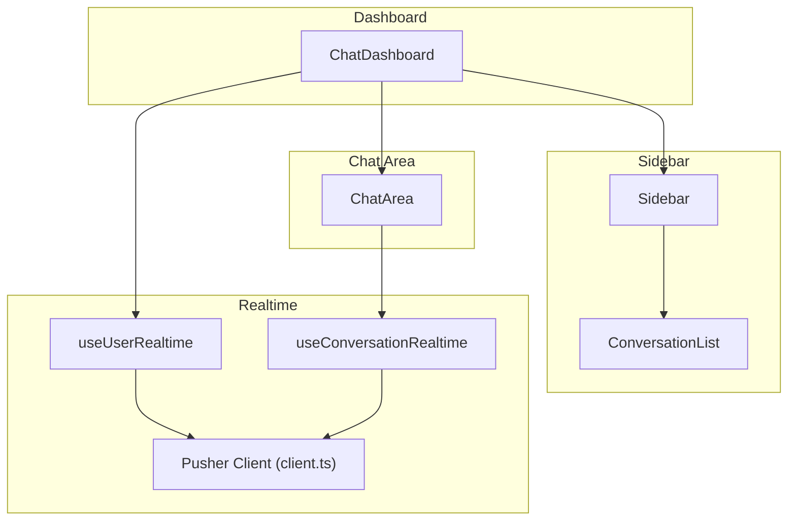
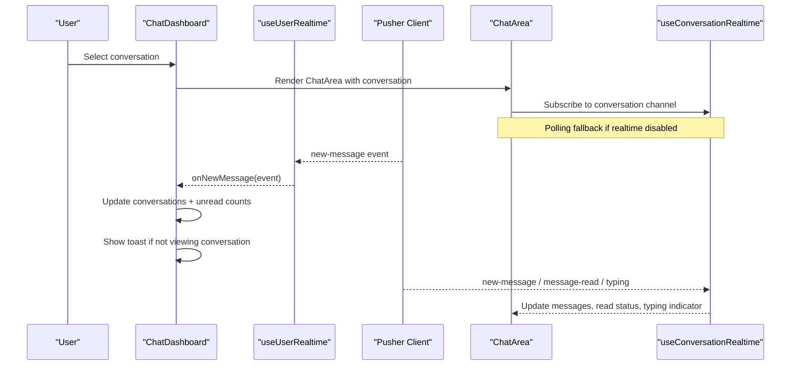
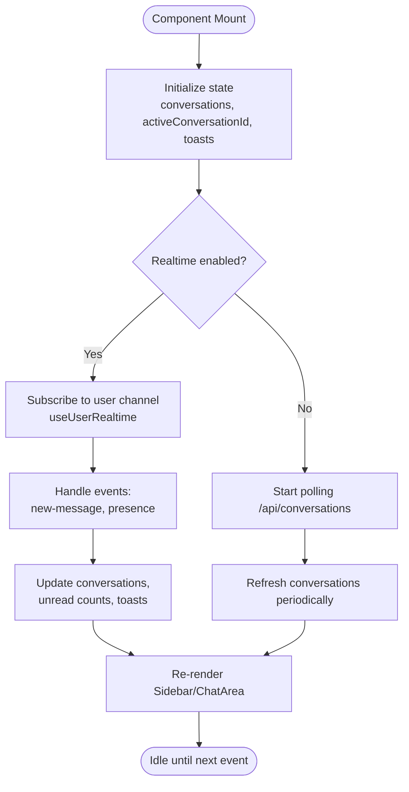
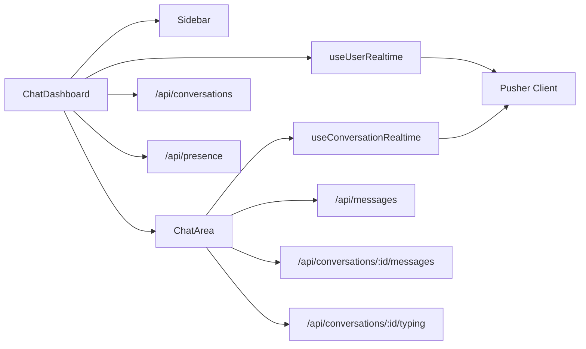

# Chat Dashboard Component

<cite>
**Referenced Files in This Document**
- [ChatDashboard.tsx](file://components/chat/ChatDashboard.tsx)
- [useRealtime.ts](file://hooks/useRealtime.ts)
- [client.ts](file://lib/realtime/client.ts)
- [index.ts](file://types/index.ts)
- [Sidebar.tsx](file://components/chat/Sidebar.tsx)
- [ConversationList.tsx](file://components/chat/ConversationList.tsx)
- [ChatArea.tsx](file://components/chat/ChatArea.tsx)
</cite>

## Table of Contents
1. [Introduction](#introduction)
2. [Project Structure](#project-structure)
3. [Core Components](#core-components)
4. [Architecture Overview](#architecture-overview)
5. [Detailed Component Analysis](#detailed-component-analysis)
6. [Dependency Analysis](#dependency-analysis)
7. [Performance Considerations](#performance-considerations)
8. [Troubleshooting Guide](#troubleshooting-guide)
9. [Conclusion](#conclusion)

## Introduction
The ChatDashboard component is the main container for the chat application. It manages conversation state, real-time message handling, toast notifications, and presence tracking. It integrates with a real-time messaging system via the useUserRealtime hook and provides an auto-refresh fallback when real-time is disabled. It also implements a heartbeat mechanism to keep user presence up-to-date while the dashboard is open. The layout switches between sidebar and chat views based on screen size and active conversation selection.

## Project Structure
At a high level:
- ChatDashboard orchestrates conversations, active chat selection, toasts, and presence.
- Sidebar renders the conversation list and user controls.
- ChatArea handles message display, sending, typing indicators, and per-conversation real-time events.
- Real-time integration is provided by hooks that subscribe to Pusher channels when enabled; otherwise, polling is used as a fallback.

**Diagram sources**
- [ChatDashboard.tsx:99-363](file://components/chat/ChatDashboard.tsx#L99-L363)
- [useRealtime.ts:26-61](file://hooks/useRealtime.ts#L26-L61)
- [useRealtime.ts:75-119](file://hooks/useRealtime.ts#L75-L119)
- [client.ts:7-29](file://lib/realtime/client.ts#L7-L29)

**Section sources**
- [ChatDashboard.tsx:99-363](file://components/chat/ChatDashboard.tsx#L99-L363)
- [useRealtime.ts:26-119](file://hooks/useRealtime.ts#L26-L119)
- [client.ts:7-29](file://lib/realtime/client.ts#L7-L29)

## Core Components
- ChatDashboard: Manages global conversation state, active chat selection, toast notifications, presence heartbeat, and responsive layout.
- useUserRealtime: Subscribes to the current user’s private channel to receive new messages and presence updates.
- useConversationRealtime: Subscribes to a specific conversation channel for new messages, read receipts, and typing events.
- Sidebar and ConversationList: Render the conversation list, search, and profile controls.
- ChatArea: Renders messages, sends messages, shows typing indicators, and handles per-conversation real-time events.

Key responsibilities:
- Conversation state: List of conversations, active conversation ID, unread counts, last message updates.
- Real-time integration: Subscribe to user and conversation channels; fall back to polling if real-time is disabled.
- Toasts: Show incoming messages from non-active conversations; auto-dismiss after a short duration.
- Presence: Heartbeat to mark online/offline based on tab visibility; update other users’ online status.

**Section sources**
- [ChatDashboard.tsx:99-363](file://components/chat/ChatDashboard.tsx#L99-L363)
- [useRealtime.ts:26-119](file://hooks/useRealtime.ts#L26-L119)
- [Sidebar.tsx:13-159](file://components/chat/Sidebar.tsx#L13-L159)
- [ConversationList.tsx:7-57](file://components/chat/ConversationList.tsx#L7-L57)
- [ChatArea.tsx:28-292](file://components/chat/ChatArea.tsx#L28-L292)

## Architecture Overview
The dashboard coordinates UI and data flow across components and real-time services.

**Diagram sources**
- [ChatDashboard.tsx:147-196](file://components/chat/ChatDashboard.tsx#L147-L196)
- [useRealtime.ts:26-61](file://hooks/useRealtime.ts#L26-L61)
- [useRealtime.ts:75-119](file://hooks/useRealtime.ts#L75-L119)
- [ChatArea.tsx:134-176](file://components/chat/ChatArea.tsx#L134-L176)

## Detailed Component Analysis

### ChatDashboard
Responsibilities:
- Props interface:
  - currentUser: Public user info passed down to child components.
  - initialConversations: Initial list of conversations to bootstrap the UI.
- State management:
  - conversations: Array of conversations with last message, unread count, and timestamps.
  - activeConversationId: Currently selected conversation.
  - showChat: Controls visibility of chat area vs. sidebar on small screens.
  - toasts: Queue of notification items for incoming messages.
  - currentUserState: Local copy of the current user, updated via profile changes.
- Real-time integration:
  - useUserRealtime subscribes to the user’s private channel for new messages and presence updates.
  - When real-time is disabled, an interval polls /api/conversations to refresh the list.
- Presence heartbeat:
  - Periodically POSTs to /api/presence with isOnline true while the tab is visible.
  - Marks offline when the tab becomes hidden using Page Visibility API.
- Event handling:
  - New message: Updates last message, timestamp, unread counts, and shows toast if not viewing the conversation.
  - Presence update: Updates other user’s online status and last seen time in the conversation list.
  - Conversation selection: Sets active conversation, clears unread count, shows chat view, and dismisses related toasts.
  - New conversation: Inserts into list and navigates to it.
  - Profile update: Reflects profile changes in the sidebar.
- Responsive layout:
  - On small screens, toggles between sidebar and chat views using showChat.
  - On medium+ screens, both sidebar and chat are shown side-by-side.

**Diagram sources**
- [ChatDashboard.tsx:147-204](file://components/chat/ChatDashboard.tsx#L147-L204)
- [ChatDashboard.tsx:206-276](file://components/chat/ChatDashboard.tsx#L206-L276)

**Section sources**
- [ChatDashboard.tsx:13-16](file://components/chat/ChatDashboard.tsx#L13-L16)
- [ChatDashboard.tsx:99-108](file://components/chat/ChatDashboard.tsx#L99-L108)
- [ChatDashboard.tsx:110-133](file://components/chat/ChatDashboard.tsx#L110-L133)
- [ChatDashboard.tsx:135-145](file://components/chat/ChatDashboard.tsx#L135-L145)
- [ChatDashboard.tsx:147-196](file://components/chat/ChatDashboard.tsx#L147-L196)
- [ChatDashboard.tsx:198-204](file://components/chat/ChatDashboard.tsx#L198-L204)
- [ChatDashboard.tsx:206-276](file://components/chat/ChatDashboard.tsx#L206-L276)
- [ChatDashboard.tsx:278-314](file://components/chat/ChatDashboard.tsx#L278-L314)
- [ChatDashboard.tsx:316-363](file://components/chat/ChatDashboard.tsx#L316-L363)

### useUserRealtime Hook
Purpose:
- Subscribes to the current user’s private channel to handle:
  - New messages: For updating conversation lists and triggering toasts.
  - Presence updates: For reflecting other users’ online status and last seen times.
- Uses a ref to always call the latest handler functions without re-subscribing.

Behavior:
- If userId is null or Pusher client is unavailable, no subscription occurs.
- Binds/unbinds events and unsubscribes on cleanup.

**Section sources**
- [useRealtime.ts:17-61](file://hooks/useRealtime.ts#L17-L61)

### useConversationRealtime Hook
Purpose:
- Subscribes to a specific conversation channel to handle:
  - New messages: For appending to the message list and updating conversation metadata.
  - Message read events: For marking messages as read locally.
  - Typing events: For showing/hiding typing indicators.
- Also uses a ref to ensure handlers are always current.

**Section sources**
- [useRealtime.ts:65-119](file://hooks/useRealtime.ts#L65-L119)

### ChatArea
Responsibilities:
- Loads messages for the selected conversation.
- Handles optimistic send with temporary IDs and replaces them with server responses.
- Integrates with useConversationRealtime for live updates.
- Implements polling fallback for messages and typing when real-time is disabled.
- Displays typing indicators and marks messages as read.

**Section sources**
- [ChatArea.tsx:28-292](file://components/chat/ChatArea.tsx#L28-L292)

### Sidebar and ConversationList
Responsibilities:
- Sidebar:
  - Displays current user info and actions (profile edit, sign out).
  - Provides search input to filter conversations by other user name.
  - Opens modals for creating new conversations and editing profile.
- ConversationList:
  - Renders empty state when no conversations exist.
  - Maps conversations to individual items and handles selection.

**Section sources**
- [Sidebar.tsx:13-159](file://components/chat/Sidebar.tsx#L13-L159)
- [ConversationList.tsx:7-57](file://components/chat/ConversationList.tsx#L7-L57)

### Realtime Client
Responsibilities:
- Determines whether real-time is enabled based on environment variables.
- Provides a singleton Pusher client configured with authorization endpoint.
- Returns null when keys are missing so callers can fall back to polling.

**Section sources**
- [client.ts:7-29](file://lib/realtime/client.ts#L7-L29)

### Types
Key types used by the dashboard and related components:
- PublicUser: Safe subset of user data exposed to clients.
- Conversation: Includes other user, last message, unread count, and timestamps.
- Message: Includes sender/receiver, content, read status, and timestamps.
- Realtime event payloads: NewMessageEvent, MessageReadEvent, TypingEvent, PresenceEvent.

**Section sources**
- [index.ts:9-21](file://types/index.ts#L9-L21)
- [index.ts:25-53](file://types/index.ts#L25-L53)
- [index.ts:91-117](file://types/index.ts#L91-L117)

## Dependency Analysis
High-level dependencies:
- ChatDashboard depends on:
  - Sidebar and ChatArea for rendering.
  - useUserRealtime for real-time events.
  - Realtime client utilities to detect capability and configure Pusher.
  - API endpoints for refreshing conversations and presence heartbeat.
- ChatArea depends on:
  - useConversationRealtime for per-conversation events.
  - API endpoints for loading/sending messages and typing status.
- Hooks depend on:
  - Pusher client for subscribing/unsubscribing to channels.

**Diagram sources**
- [ChatDashboard.tsx:135-145](file://components/chat/ChatDashboard.tsx#L135-L145)
- [ChatDashboard.tsx:206-276](file://components/chat/ChatDashboard.tsx#L206-L276)
- [ChatArea.tsx:57-132](file://components/chat/ChatArea.tsx#L57-L132)
- [useRealtime.ts:26-119](file://hooks/useRealtime.ts#L26-L119)
- [client.ts:7-29](file://lib/realtime/client.ts#L7-L29)

**Section sources**
- [ChatDashboard.tsx:135-145](file://components/chat/ChatDashboard.tsx#L135-L145)
- [ChatDashboard.tsx:206-276](file://components/chat/ChatDashboard.tsx#L206-L276)
- [ChatArea.tsx:57-132](file://components/chat/ChatArea.tsx#L57-L132)
- [useRealtime.ts:26-119](file://hooks/useRealtime.ts#L26-L119)
- [client.ts:7-29](file://lib/realtime/client.ts#L7-L29)

## Performance Considerations
- Real-time vs. polling:
  - When real-time is enabled, avoid unnecessary polling; rely on Pusher events for efficiency.
  - When disabled, intervals poll at a reasonable cadence to balance freshness and network usage.
- Unread count updates:
  - Only increment unread counts for incoming messages when not viewing the conversation to minimize redundant state changes.
- Toast management:
  - Limit the number of toasts and auto-dismiss to prevent memory growth and UI clutter.
- Presence heartbeat:
  - Use Page Visibility API to stop heartbeats when the tab is hidden, reducing server load.
- Optimistic UI:
  - ChatArea uses temporary message IDs to provide immediate feedback, then reconciles with server responses.

[No sources needed since this section provides general guidance]

## Troubleshooting Guide
Common issues and resolutions:
- No real-time events received:
  - Verify environment variables for Pusher key and cluster are set; if missing, the app falls back to polling.
  - Check that the authorization endpoint is reachable and returns valid tokens.
- Conversations not updating:
  - Ensure the polling interval is running when real-time is disabled.
  - Confirm the /api/conversations endpoint returns valid data.
- Presence not reflecting correctly:
  - Confirm the heartbeat POST to /api/presence succeeds and the server honors isOnline flags.
  - Check browser visibility events are firing as expected.
- Toasts not appearing:
  - Ensure addToast is called only for non-active conversations.
  - Verify toasts are being dismissed when selecting the corresponding conversation.

**Section sources**
- [client.ts:7-29](file://lib/realtime/client.ts#L7-L29)
- [ChatDashboard.tsx:135-145](file://components/chat/ChatDashboard.tsx#L135-L145)
- [ChatDashboard.tsx:206-276](file://components/chat/ChatDashboard.tsx#L206-L276)
- [ChatDashboard.tsx:123-133](file://components/chat/ChatDashboard.tsx#L123-L133)

## Conclusion
The ChatDashboard component centralizes conversation state, real-time messaging, toast notifications, and presence tracking. It integrates seamlessly with the real-time system through useUserRealtime and provides robust fallback behavior when real-time is disabled. Its responsive layout ensures a smooth experience across devices, while its event-driven architecture keeps the UI synchronized with live updates. Proper error handling, performance optimizations, and clear separation of concerns make it a solid foundation for the chat application.

[No sources needed since this section summarizes without analyzing specific files]