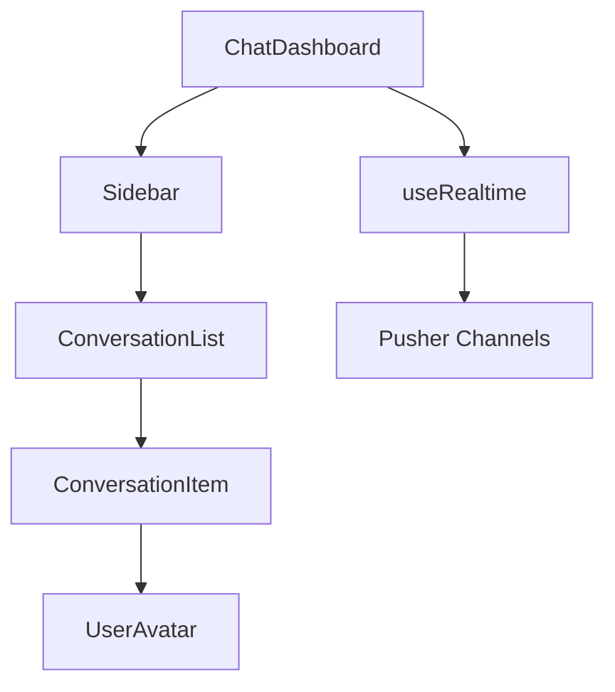
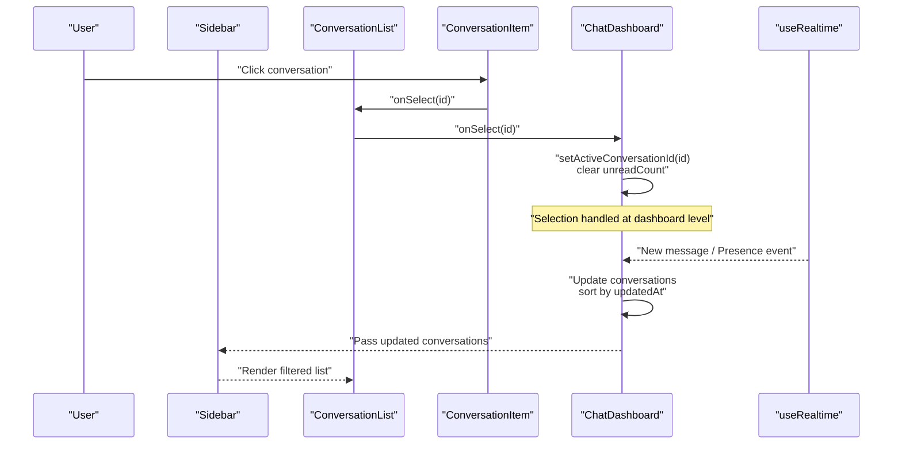
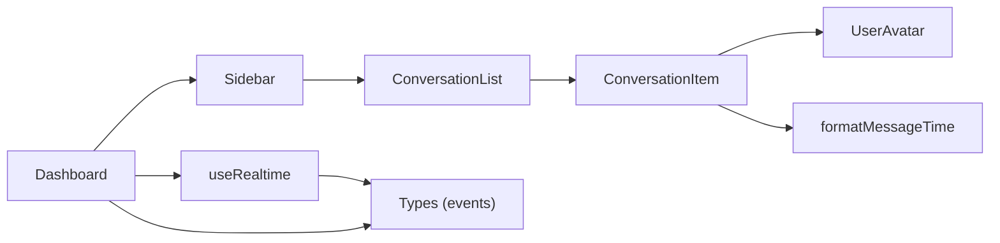

# Conversation List Component

<cite>
**Referenced Files in This Document**
- [ConversationList.tsx](file://components/chat/ConversationList.tsx)
- [ConversationItem.tsx](file://components/chat/ConversationItem.tsx)
- [Sidebar.tsx](file://components/chat/Sidebar.tsx)
- [ChatDashboard.tsx](file://components/chat/ChatDashboard.tsx)
- [UserAvatar.tsx](file://components/chat/UserAvatar.tsx)
- [useRealtime.ts](file://hooks/useRealtime.ts)
- [index.ts (types)](file://types/index.ts)
- [utils.ts](file://lib/utils.ts)
</cite>

## Table of Contents
1. [Introduction](#introduction)
2. [Project Structure](#project-structure)
3. [Core Components](#core-components)
4. [Architecture Overview](#architecture-overview)
5. [Detailed Component Analysis](#detailed-component-analysis)
6. [Dependency Analysis](#dependency-analysis)
7. [Performance Considerations](#performance-considerations)
8. [Troubleshooting Guide](#troubleshooting-guide)
9. [Conclusion](#conclusion)

## Introduction
This document provides comprehensive documentation for the ConversationList component and its ecosystem within the chat application. It explains how conversations are displayed, selected, filtered, and updated in real time. It also covers conversation item rendering (avatars, last message preview, timestamps, unread badges), sorting logic, search integration, real-time updates (new messages, presence changes), customization options, performance optimizations for large lists, accessibility features, and responsive design patterns including mobile interactions.

## Project Structure
The ConversationList is part of a client-side React component tree that renders the sidebar with a list of conversations and delegates selection to a parent dashboard. The key files involved are:
- ConversationList: Renders the list and empty state
- ConversationItem: Renders each conversation row with avatar, preview, timestamp, and unread badge
- Sidebar: Provides search filtering and passes data into ConversationList
- ChatDashboard: Manages conversation state, real-time updates, and selection behavior
- UserAvatar: Displays user images or initials with online status indicator
- useRealtime hook: Subscribes to Pusher channels for new messages and presence events
- Types: Shared TypeScript interfaces for users, messages, conversations, and realtime events
- Utils: Formatting helpers for timestamps and initials

**Diagram sources**
- [ChatDashboard.tsx:99-364](file://components/chat/ChatDashboard.tsx#L99-L364)
- [Sidebar.tsx:22-104](file://components/chat/Sidebar.tsx#L22-L104)
- [ConversationList.tsx:15-55](file://components/chat/ConversationList.tsx#L15-L55)
- [ConversationItem.tsx:14-84](file://components/chat/ConversationItem.tsx#L14-L84)
- [UserAvatar.tsx:19-56](file://components/chat/UserAvatar.tsx#L19-L56)
- [useRealtime.ts:26-119](file://hooks/useRealtime.ts#L26-L119)

**Section sources**
- [ConversationList.tsx:1-57](file://components/chat/ConversationList.tsx#L1-L57)
- [ConversationItem.tsx:1-85](file://components/chat/ConversationItem.tsx#L1-L85)
- [Sidebar.tsx:1-159](file://components/chat/Sidebar.tsx#L1-L159)
- [ChatDashboard.tsx:1-364](file://components/chat/ChatDashboard.tsx#L1-L364)
- [UserAvatar.tsx:1-57](file://components/chat/UserAvatar.tsx#L1-L57)
- [useRealtime.ts:1-120](file://hooks/useRealtime.ts#L1-L120)
- [index.ts:1-118](file://types/index.ts#L1-L118)
- [utils.ts:1-94](file://lib/utils.ts#L1-L94)

## Core Components
- ConversationList: Accepts an array of conversations, active conversation ID, current user ID, selection callback, and a flag indicating whether search is active. It renders either an empty state or a list of ConversationItem components.
- ConversationItem: Renders a single conversation row with user avatar, name, last message preview, timestamp, and unread count badge. It handles truncation and styling based on unread state and active selection.
- Sidebar: Provides search input that filters conversations by the other participant’s username or name, then passes the filtered list to ConversationList.
- ChatDashboard: Holds the source of truth for conversations, applies real-time updates, sorts by most recent, and manages selection and unread counts.

Key props and responsibilities:
- ConversationList props:
  - conversations: Array of Conversation objects
  - activeConversationId: Currently selected conversation ID
  - currentUserId: ID of the logged-in user
  - onSelect: Callback invoked when a conversation is selected
  - searchActive: Boolean indicating if search is currently filtering results
- ConversationItem props:
  - conversation: A single Conversation object
  - isActive: Whether this item is the active conversation
  - currentUserId: Logged-in user ID used to prefix “You:” in previews
  - onSelect: Click handler to select the conversation

**Section sources**
- [ConversationList.tsx:7-21](file://components/chat/ConversationList.tsx#L7-L21)
- [ConversationItem.tsx:7-19](file://components/chat/ConversationItem.tsx#L7-L19)
- [Sidebar.tsx:13-20](file://components/chat/Sidebar.tsx#L13-L20)
- [ChatDashboard.tsx:13-16](file://components/chat/ChatDashboard.tsx#L13-L16)

## Architecture Overview
The architecture centers around a unidirectional data flow:
- ChatDashboard holds the canonical list of conversations and exposes handlers for selection and updates.
- Sidebar filters conversations locally using the search input and passes them to ConversationList.
- ConversationList renders ConversationItem rows; clicking triggers onSelect which updates activeConversationId and clears unread counts in the dashboard.
- Real-time updates via useRealtime modify the conversation list (new messages, presence changes) and trigger re-renders.

**Diagram sources**
- [ChatDashboard.tsx:147-196](file://components/chat/ChatDashboard.tsx#L147-L196)
- [ChatDashboard.tsx:278-310](file://components/chat/ChatDashboard.tsx#L278-L310)
- [Sidebar.tsx:35-40](file://components/chat/Sidebar.tsx#L35-L40)
- [ConversationList.tsx:42-54](file://components/chat/ConversationList.tsx#L42-L54)
- [ConversationItem.tsx:36-51](file://components/chat/ConversationItem.tsx#L36-L51)
- [useRealtime.ts:26-61](file://hooks/useRealtime.ts#L26-L61)

## Detailed Component Analysis

### ConversationList Props Interface
- conversations: Conversation[] — The list of conversations to render. Each includes id, createdAt, updatedAt, otherUser, lastMessage, and unreadCount.
- activeConversationId: string | null — Identifies the currently selected conversation.
- currentUserId: string — Used to determine preview text (“You: …”) and to compute unread indicators.
- onSelect: (id: string) => void — Called when a conversation is selected.
- searchActive: boolean — Controls empty state messaging when no results match the search.

Rendering behavior:
- If conversations is empty, shows an empty state with contextual messaging depending on searchActive.
- Otherwise, maps conversations to ConversationItem elements, passing isActive derived from activeConversationId.

**Section sources**
- [ConversationList.tsx:7-21](file://components/chat/ConversationList.tsx#L7-L21)
- [ConversationList.tsx:22-55](file://components/chat/ConversationList.tsx#L22-L55)
- [index.ts:43-53](file://types/index.ts#L43-L53)

### ConversationItem Rendering
- User avatars: Uses UserAvatar with size "md" and showOnline enabled to display profile image or initials plus an online indicator.
- Last message preview: Computes preview text; if the last message was sent by the current user, it prefixes with “You: ”. Truncates long previews to a fixed length with ellipsis.
- Timestamp formatting: Formats lastMessage.createdAt using formatMessageTime to display a human-readable time.
- Unread message badges: Shows a circular badge with unreadCount when > 0; caps display at “99+”.
- Active state styling: Applies different background styles when isActive is true versus hover states.

Accessibility considerations:
- Button element used for interaction ensures keyboard navigation and screen reader support.
- aria-label on the online indicator communicates presence status to assistive technologies.

**Section sources**
- [ConversationItem.tsx:14-84](file://components/chat/ConversationItem.tsx#L14-L84)
- [UserAvatar.tsx:19-56](file://components/chat/UserAvatar.tsx#L19-L56)
- [utils.ts:37-43](file://lib/utils.ts#L37-L43)

### Sorting Logic for Recent Conversations
- Sorting occurs in ChatDashboard when applying new messages or updating conversations. It sorts by updatedAt in descending order so the most recent conversation appears first.
- When a new message arrives, applyLastMessage updates lastMessage and updatedAt, then re-sorts the list.

Complexity:
- Sorting is O(n log n) per update due to full list sort. For very large lists, consider virtualization or incremental updates.

**Section sources**
- [ChatDashboard.tsx:18-40](file://components/chat/ChatDashboard.tsx#L18-L40)
- [ChatDashboard.tsx:298-310](file://components/chat/ChatDashboard.tsx#L298-L310)

### Filtering Capabilities and Search Integration
- Sidebar maintains local search state and filters conversations by otherUser.username or otherUser.name case-insensitively.
- Filtered results are passed to ConversationList, which uses searchActive to adjust empty state messaging.

Performance:
- Filtering runs on every keystroke; for large datasets, debounce or memoize the filter function to reduce re-renders.

**Section sources**
- [Sidebar.tsx:31-40](file://components/chat/Sidebar.tsx#L31-L40)
- [Sidebar.tsx:81-104](file://components/chat/Sidebar.tsx#L81-L104)
- [ConversationList.tsx:22-40](file://components/chat/ConversationList.tsx#L22-L40)

### Real-Time Updates
- New messages: useUserRealtime subscribes to the user’s private channel and invokes onNewMessage, which updates the conversation list in ChatDashboard, adds toasts for non-active conversations, and refreshes the list if needed.
- Presence updates: Presence events update the isOnline and lastSeen fields for the relevant user in the conversation list, reflected in the avatar’s online indicator.
- Fallback polling: When realtime is disabled, ChatDashboard polls /api/conversations at intervals to keep the list fresh.

Event types and payloads are defined in types/index.ts and consumed by useRealtime.

**Section sources**
- [useRealtime.ts:26-61](file://hooks/useRealtime.ts#L26-L61)
- [ChatDashboard.tsx:147-196](file://components/chat/ChatDashboard.tsx#L147-L196)
- [ChatDashboard.tsx:198-204](file://components/chat/ChatDashboard.tsx#L198-L204)
- [index.ts:91-117](file://types/index.ts#L91-L117)

### Selection Callbacks and Active Tracking
- onSelect in ConversationList calls the parent-provided onSelect, which in ChatDashboard sets activeConversationId and clears unreadCount for the selected conversation.
- Active tracking influences UI highlighting in ConversationItem and determines whether incoming messages increment unread counts.

**Section sources**
- [ConversationList.tsx:42-54](file://components/chat/ConversationList.tsx#L42-L54)
- [ChatDashboard.tsx:278-286](file://components/chat/ChatDashboard.tsx#L278-L286)

### Customization Examples
- Conversation item customization:
  - Adjust avatar size or hide online indicator by modifying ConversationItem’s UserAvatar usage.
  - Customize preview truncation length or formatting by editing the preview computation.
  - Modify unread badge appearance or threshold by changing the conditional rendering and styling.
- Styling hooks:
  - Use Tailwind classes to change colors, spacing, and typography for active/hover states.
  - Extend props to pass theme tokens or custom class names for deeper customization.

[No sources needed since this section provides general guidance]

### Performance Optimizations for Large Lists
- Virtualization: Implement windowing (e.g., react-window) to render only visible items.
- Memoization: Wrap ConversationItem with React.memo to prevent unnecessary re-renders when props haven’t changed.
- Debounced search: Add debouncing to the search input in Sidebar to reduce filter computations.
- Stable keys: Ensure stable unique keys (conversation.id) to optimize reconciliation.
- Incremental updates: Prefer targeted updates (like applyLastMessage) instead of full re-fetches when possible.

[No sources needed since this section provides general guidance]

### Accessibility Features
- Keyboard navigation: ConversationItem uses button elements for selectable rows, enabling Enter/Space activation.
- Screen readers: Online status indicator includes aria-label to communicate presence.
- Focus management: Ensure focus remains predictable when navigating the list; consider adding tabIndex where appropriate.
- Color contrast: Ensure text and badges meet contrast guidelines for readability.

**Section sources**
- [ConversationItem.tsx:36-82](file://components/chat/ConversationItem.tsx#L36-L82)
- [UserAvatar.tsx:45-53](file://components/chat/UserAvatar.tsx#L45-L53)

### Responsive Design Patterns and Mobile Interactions
- Layout: Sidebar hides on small screens when a chat is open, showing only the chat area; on larger screens, both sidebar and chat are visible side-by-side.
- Touch-friendly: Buttons have adequate padding and tap targets; list items are easy to tap on mobile.
- Overflow handling: Conversation list scrolls vertically within the sidebar container.

**Section sources**
- [ChatDashboard.tsx:316-353](file://components/chat/ChatDashboard.tsx#L316-L353)
- [ConversationItem.tsx:36-82](file://components/chat/ConversationItem.tsx#L36-L82)

## Dependency Analysis
The following diagram illustrates dependencies among core components and utilities:

**Diagram sources**
- [ConversationList.tsx:42-54](file://components/chat/ConversationList.tsx#L42-L54)
- [ConversationItem.tsx:4-5](file://components/chat/ConversationItem.tsx#L4-L5)
- [UserAvatar.tsx:1-3](file://components/chat/UserAvatar.tsx#L1-L3)
- [utils.ts:37-43](file://lib/utils.ts#L37-L43)
- [Sidebar.tsx:6-10](file://components/chat/Sidebar.tsx#L6-L10)
- [ChatDashboard.tsx:4-9](file://components/chat/ChatDashboard.tsx#L4-L9)
- [useRealtime.ts:6-11](file://hooks/useRealtime.ts#L6-L11)
- [index.ts:91-117](file://types/index.ts#L91-L117)

**Section sources**
- [ConversationList.tsx:1-57](file://components/chat/ConversationList.tsx#L1-L57)
- [ConversationItem.tsx:1-85](file://components/chat/ConversationItem.tsx#L1-L85)
- [Sidebar.tsx:1-159](file://components/chat/Sidebar.tsx#L1-L159)
- [ChatDashboard.tsx:1-364](file://components/chat/ChatDashboard.tsx#L1-L364)
- [useRealtime.ts:1-120](file://hooks/useRealtime.ts#L1-L120)
- [index.ts:1-118](file://types/index.ts#L1-L118)
- [utils.ts:1-94](file://lib/utils.ts#L1-L94)

## Performance Considerations
- Sorting cost: Full list sort on every update can be expensive for large datasets. Consider maintaining sorted indices or using a library like immutable.js for efficient updates.
- Re-renders: Avoid unnecessary re-renders by memoizing components and stabilizing props.
- Network polling: Polling interval should balance freshness with server load; consider increasing interval or disabling when realtime is available.
- Memory usage: Limit toast history and avoid retaining references to large objects in state.

[No sources needed since this section provides general guidance]

## Troubleshooting Guide
Common issues and resolutions:
- Conversations not updating:
  - Verify realtime is enabled; if not, ensure polling is active and endpoints respond correctly.
  - Check that useUserRealtime subscriptions are bound and unbound properly.
- Incorrect unread counts:
  - Confirm that selection clears unreadCount and that incoming messages increment only when not viewing the conversation.
- Search not working:
  - Ensure search input state is bound and filter logic matches field names (username/name).
- Avatars not showing online status:
  - Validate presence events update otherUser.isOnline and lastSeen; check PRESENCE_TTL_MS logic if needed.

**Section sources**
- [ChatDashboard.tsx:147-196](file://components/chat/ChatDashboard.tsx#L147-L196)
- [ChatDashboard.tsx:278-286](file://components/chat/ChatDashboard.tsx#L278-L286)
- [Sidebar.tsx:35-40](file://components/chat/Sidebar.tsx#L35-L40)
- [utils.ts:45-56](file://lib/utils.ts#L45-L56)

## Conclusion
The ConversationList component integrates seamlessly with the broader chat system to provide a responsive, accessible, and real-time conversation experience. It relies on clear prop contracts, robust rendering logic, and efficient state management in the parent dashboard. With thoughtful customization, performance optimizations, and accessibility enhancements, it scales well for diverse use cases and device sizes.