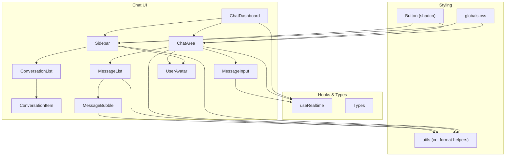
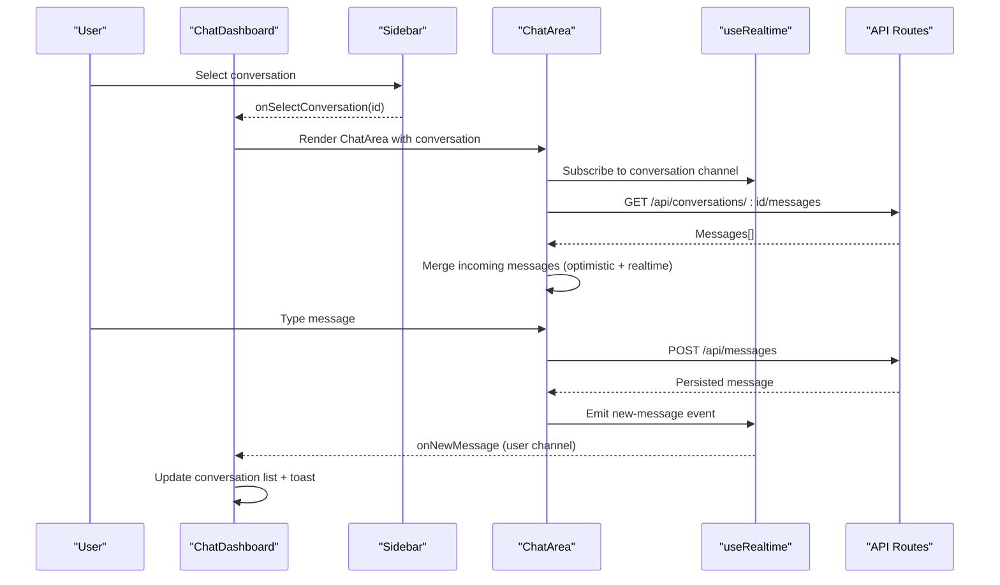
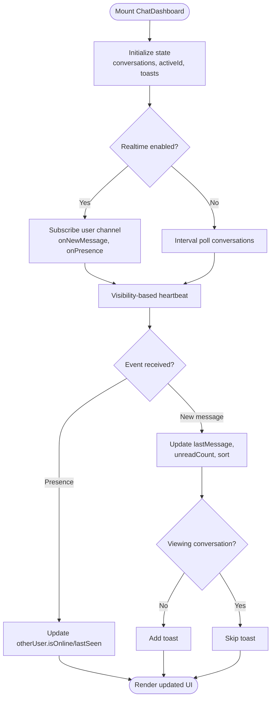
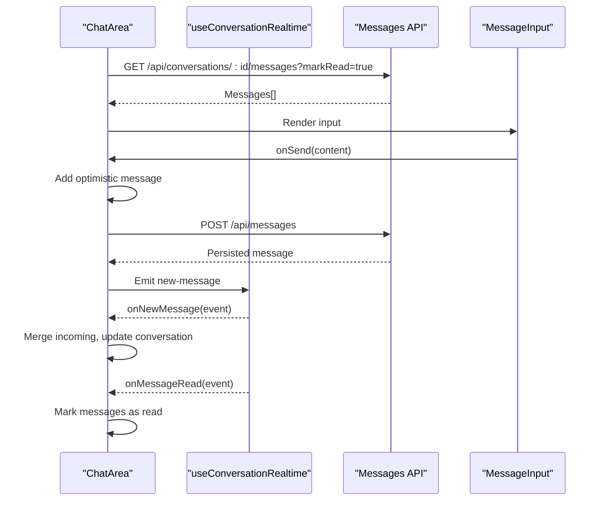
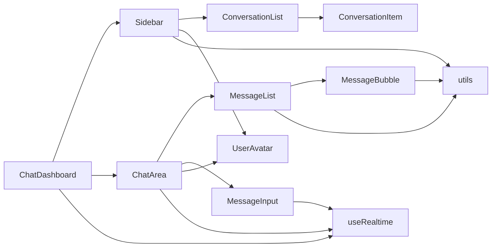

# Frontend Components

<cite>
**Referenced Files in This Document**
- [ChatDashboard.tsx](file://components/chat/ChatDashboard.tsx)
- [Sidebar.tsx](file://components/chat/Sidebar.tsx)
- [ConversationList.tsx](file://components/chat/ConversationList.tsx)
- [ConversationItem.tsx](file://components/chat/ConversationItem.tsx)
- [ChatArea.tsx](file://components/chat/ChatArea.tsx)
- [MessageList.tsx](file://components/chat/MessageList.tsx)
- [MessageInput.tsx](file://components/chat/MessageInput.tsx)
- [MessageBubble.tsx](file://components/chat/MessageBubble.tsx)
- [UserAvatar.tsx](file://components/chat/UserAvatar.tsx)
- [useRealtime.ts](file://hooks/useRealtime.ts)
- [index.ts](file://types/index.ts)
- [button.tsx](file://components/ui/button.tsx)
- [globals.css](file://app/globals.css)
- [utils.ts](file://lib/utils.ts)
</cite>

## Table of Contents
1. Introduction
2. Project Structure
3. Core Components
4. Architecture Overview
5. Detailed Component Analysis
6. Dependency Analysis
7. Performance Considerations
8. Troubleshooting Guide
9. Conclusion

## Introduction
This document explains the React component architecture for SecureChat’s frontend. It covers the chat-specific components (ChatDashboard, Sidebar, ChatArea, ConversationList, MessageList, MessageInput), their responsibilities, prop interfaces, state management patterns, and how they compose together to deliver a real-time messaging experience. It also documents UI styling with Tailwind CSS and shadcn/ui configuration, responsive design strategies, accessibility considerations, lifecycle management, performance optimizations, and testing approaches.

## Project Structure
SecureChat organizes features under a clear folder structure:
- app: Next.js pages and API routes
- components/chat: Chat-related React components
- components/ui: Shared UI primitives (e.g., Button)
- hooks: Client-side hooks including real-time subscriptions
- lib: Utilities, validations, and shared helpers
- types: Shared TypeScript types used across client and server

**Diagram sources**
- [ChatDashboard.tsx:1-364](file://components/chat/ChatDashboard.tsx#L1-L364)
- [Sidebar.tsx:1-159](file://components/chat/Sidebar.tsx#L1-L159)
- [ConversationList.tsx:1-57](file://components/chat/ConversationList.tsx#L1-L57)
- [ConversationItem.tsx:1-85](file://components/chat/ConversationItem.tsx#L1-L85)
- [ChatArea.tsx:1-292](file://components/chat/ChatArea.tsx#L1-L292)
- [MessageList.tsx:1-100](file://components/chat/MessageList.tsx#L1-L100)
- [MessageInput.tsx:1-193](file://components/chat/MessageInput.tsx#L1-L193)
- [MessageBubble.tsx:1-60](file://components/chat/MessageBubble.tsx#L1-L60)
- [UserAvatar.tsx:1-57](file://components/chat/UserAvatar.tsx#L1-L57)
- [useRealtime.ts:1-120](file://hooks/useRealtime.ts#L1-L120)
- [globals.css:1-177](file://app/globals.css#L1-L177)
- [button.tsx:1-59](file://components/ui/button.tsx#L1-L59)
- [utils.ts:1-94](file://lib/utils.ts#L1-L94)

**Section sources**
- [ChatDashboard.tsx:1-364](file://components/chat/ChatDashboard.tsx#L1-L364)
- [Sidebar.tsx:1-159](file://components/chat/Sidebar.tsx#L1-L159)
- [ChatArea.tsx:1-292](file://components/chat/ChatArea.tsx#L1-L292)
- [globals.css:1-177](file://app/globals.css#L1-L177)
- [button.tsx:1-59](file://components/ui/button.tsx#L1-L59)

## Core Components
- ChatDashboard: Orchestrates conversations list, active conversation selection, presence heartbeat, toast notifications, and layout switching between sidebar and chat area. Manages user-level realtime events and polling fallback when realtime is disabled.
- Sidebar: Renders header, search, conversation list, profile strip, and modals for new conversation and profile editing. Handles sign-out flow.
- ConversationList: Displays filtered conversations or empty state; renders ConversationItem per row.
- ConversationItem: Shows avatar, name, last message preview, time, unread badge, and active state.
- ChatArea: Loads messages, manages optimistic send, typing indicators, read receipts, and realtime updates. Presents header with online status and delegates rendering to MessageList and MessageInput.
- MessageList: Groups messages by date, renders separators, and displays MessageBubble instances. Provides loading, error, and empty states.
- MessageInput: Handles text input, auto-resize, send validation, typing indicator debouncing, and keyboard shortcuts.
- MessageBubble: Renders individual message content, timestamp, and read status indicators.
- UserAvatar: Displays user image or initials with optional online dot.

Key prop interfaces are defined per component and rely on shared types from types/index.ts.

**Section sources**
- [ChatDashboard.tsx:13-16](file://components/chat/ChatDashboard.tsx#L13-L16)
- [Sidebar.tsx:13-20](file://components/chat/Sidebar.tsx#L13-L20)
- [ConversationList.tsx:7-13](file://components/chat/ConversationList.tsx#L7-L13)
- [ConversationItem.tsx:7-12](file://components/chat/ConversationItem.tsx#L7-L12)
- [ChatArea.tsx:28-33](file://components/chat/ChatArea.tsx#L28-L33)
- [MessageList.tsx:8-14](file://components/chat/MessageList.tsx#L8-L14)
- [MessageInput.tsx:7-10](file://components/chat/MessageInput.tsx#L7-L10)
- [MessageBubble.tsx:5-9](file://components/chat/MessageBubble.tsx#L5-L9)
- [UserAvatar.tsx:5-11](file://components/chat/UserAvatar.tsx#L5-L11)
- [index.ts:9-53](file://types/index.ts#L9-L53)

## Architecture Overview
The application uses a top-down composition pattern:
- ChatDashboard holds global state for conversations and active conversation, subscribes to user-level realtime events, and coordinates UI transitions.
- Sidebar composes ConversationList and modals, and exposes callbacks to create new conversations and update profile.
- ChatArea manages per-conversation state (messages, typing, read receipts) and subscribes to conversation-level realtime events.
- MessageList and MessageInput are presentational components that render data and handle user interactions respectively.
- Realtime integration is abstracted via useRealtime hook, which binds/unbinds channels and events.

**Diagram sources**
- [ChatDashboard.tsx:147-196](file://components/chat/ChatDashboard.tsx#L147-L196)
- [ChatArea.tsx:134-176](file://components/chat/ChatArea.tsx#L134-L176)
- [useRealtime.ts:26-61](file://hooks/useRealtime.ts#L26-L61)
- [useRealtime.ts:75-119](file://hooks/useRealtime.ts#L75-L119)

## Detailed Component Analysis

### ChatDashboard
Responsibilities:
- Maintain conversations list, active conversation id, and visibility flags for mobile/desktop layouts.
- Manage presence heartbeat using Page Visibility API and periodic POST to presence endpoint.
- Subscribe to user-level realtime events for new messages and presence changes.
- Provide fallback polling when realtime is disabled.
- Show toast notifications for incoming messages not currently viewed.

State management:
- Local state for conversations, active conversation, toasts, and current user.
- Refs to avoid stale closures in realtime handlers.

Interactions:
- Passes callbacks to Sidebar for selection and creation flows.
- Renders ChatArea with selected conversation or EmptyState.

**Diagram sources**
- [ChatDashboard.tsx:147-196](file://components/chat/ChatDashboard.tsx#L147-L196)
- [ChatDashboard.tsx:198-204](file://components/chat/ChatDashboard.tsx#L198-L204)
- [ChatDashboard.tsx:211-276](file://components/chat/ChatDashboard.tsx#L211-L276)

**Section sources**
- [ChatDashboard.tsx:13-16](file://components/chat/ChatDashboard.tsx#L13-L16)
- [ChatDashboard.tsx:147-196](file://components/chat/ChatDashboard.tsx#L147-L196)
- [ChatDashboard.tsx:198-204](file://components/chat/ChatDashboard.tsx#L198-L204)
- [ChatDashboard.tsx:211-276](file://components/chat/ChatDashboard.tsx#L211-L276)
- [ChatDashboard.tsx:278-314](file://components/chat/ChatDashboard.tsx#L278-L314)
- [ChatDashboard.tsx:316-364](file://components/chat/ChatDashboard.tsx#L316-L364)

### Sidebar
Responsibilities:
- Display branding, search bar, conversation list, and profile strip.
- Open modals for starting new conversations and editing profile.
- Handle sign-out navigation.

Props:
- currentUser, conversations, activeConversationId, onSelectConversation, onNewConversation, onProfileUpdate.

Accessibility:
- Uses aria-label attributes for actions like “New conversation”, “Sign out”.

**Section sources**
- [Sidebar.tsx:13-20](file://components/chat/Sidebar.tsx#L13-L20)
- [Sidebar.tsx:31-46](file://components/chat/Sidebar.tsx#L31-L46)
- [Sidebar.tsx:48-159](file://components/chat/Sidebar.tsx#L48-L159)

### ConversationList and ConversationItem
Responsibilities:
- ConversationList renders either an empty state or a list of items.
- ConversationItem shows avatar, name, last message preview, time, unread count, and active highlight.

Props:
- ConversationList: conversations, activeConversationId, currentUserId, onSelect, searchActive.
- ConversationItem: conversation, isActive, currentUserId, onSelect.

**Section sources**
- [ConversationList.tsx:7-13](file://components/chat/ConversationList.tsx#L7-L13)
- [ConversationList.tsx:15-57](file://components/chat/ConversationList.tsx#L15-L57)
- [ConversationItem.tsx:7-12](file://components/chat/ConversationItem.tsx#L7-L12)
- [ConversationItem.tsx:14-85](file://components/chat/ConversationItem.tsx#L14-L85)

### ChatArea
Responsibilities:
- Load messages with mark-read behavior.
- Manage optimistic message sending and server reconciliation.
- Subscribe to conversation-level realtime events for new messages, read receipts, and typing.
- Provide fallback polling for messages and typing when realtime is disabled.
- Render header with online status, MessageList, typing indicator, and MessageInput.

Props:
- conversation, currentUser, onBack, onConversationUpdate.

Realtime integration:
- useConversationRealtime handles new-message, message-read, and typing events.

**Diagram sources**
- [ChatArea.tsx:57-89](file://components/chat/ChatArea.tsx#L57-L89)
- [ChatArea.tsx:91-132](file://components/chat/ChatArea.tsx#L91-L132)
- [ChatArea.tsx:134-176](file://components/chat/ChatArea.tsx#L134-L176)
- [ChatArea.tsx:182-229](file://components/chat/ChatArea.tsx#L182-L229)
- [useRealtime.ts:75-119](file://hooks/useRealtime.ts#L75-L119)

**Section sources**
- [ChatArea.tsx:28-33](file://components/chat/ChatArea.tsx#L28-L33)
- [ChatArea.tsx:57-89](file://components/chat/ChatArea.tsx#L57-L89)
- [ChatArea.tsx:91-132](file://components/chat/ChatArea.tsx#L91-L132)
- [ChatArea.tsx:134-176](file://components/chat/ChatArea.tsx#L134-L176)
- [ChatArea.tsx:182-229](file://components/chat/ChatArea.tsx#L182-L229)
- [ChatArea.tsx:231-292](file://components/chat/ChatArea.tsx#L231-L292)

### MessageList
Responsibilities:
- Group messages by date and render separators.
- Determine avatar visibility per run of consecutive messages from same sender.
- Provide loading, error, and empty states.

Props:
- messages, currentUserId, loading, error, bottomRef.

**Section sources**
- [MessageList.tsx:8-14](file://components/chat/MessageList.tsx#L8-L14)
- [MessageList.tsx:16-100](file://components/chat/MessageList.tsx#L16-L100)

### MessageInput
Responsibilities:
- Validate input length, manage sending state, and show errors.
- Auto-resize textarea and handle Enter/Shift+Enter.
- Debounce typing indicator emissions and stop typing on unmount or send.

Props:
- onSend, conversationId.

Accessibility:
- aria-label on textarea and send button.

**Section sources**
- [MessageInput.tsx:7-10](file://components/chat/MessageInput.tsx#L7-L10)
- [MessageInput.tsx:14-114](file://components/chat/MessageInput.tsx#L14-L114)
- [MessageInput.tsx:116-193](file://components/chat/MessageInput.tsx#L116-L193)

### MessageBubble and UserAvatar
Responsibilities:
- MessageBubble renders message content safely, timestamp, and read status icons.
- UserAvatar renders image or initials with optional online indicator.

Props:
- MessageBubble: message, isOwn, isLastInRun.
- UserAvatar: user, size, showOnline, dotBorder.

**Section sources**
- [MessageBubble.tsx:5-9](file://components/chat/MessageBubble.tsx#L5-L9)
- [MessageBubble.tsx:11-60](file://components/chat/MessageBubble.tsx#L11-L60)
- [UserAvatar.tsx:5-11](file://components/chat/UserAvatar.tsx#L5-L11)
- [UserAvatar.tsx:19-57](file://components/chat/UserAvatar.tsx#L19-L57)

## Dependency Analysis
Component relationships and data flow:
- ChatDashboard depends on Sidebar and ChatArea; it owns conversation state and realtime subscriptions at the user level.
- Sidebar depends on ConversationList and modals; it triggers navigation and profile updates.
- ChatArea depends on MessageList, MessageInput, and useRealtime; it owns per-conversation state and realtime subscriptions.
- MessageList depends on MessageBubble and formatting utilities.
- MessageInput emits typing events and sends messages via API.

**Diagram sources**
- [ChatDashboard.tsx:1-364](file://components/chat/ChatDashboard.tsx#L1-L364)
- [Sidebar.tsx:1-159](file://components/chat/Sidebar.tsx#L1-L159)
- [ConversationList.tsx:1-57](file://components/chat/ConversationList.tsx#L1-L57)
- [ConversationItem.tsx:1-85](file://components/chat/ConversationItem.tsx#L1-L85)
- [ChatArea.tsx:1-292](file://components/chat/ChatArea.tsx#L1-L292)
- [MessageList.tsx:1-100](file://components/chat/MessageList.tsx#L1-L100)
- [MessageInput.tsx:1-193](file://components/chat/MessageInput.tsx#L1-L193)
- [MessageBubble.tsx:1-60](file://components/chat/MessageBubble.tsx#L1-L60)
- [UserAvatar.tsx:1-57](file://components/chat/UserAvatar.tsx#L1-L57)
- [useRealtime.ts:1-120](file://hooks/useRealtime.ts#L1-L120)
- [utils.ts:1-94](file://lib/utils.ts#L1-L94)

**Section sources**
- [index.ts:9-53](file://types/index.ts#L9-L53)
- [useRealtime.ts:1-120](file://hooks/useRealtime.ts#L1-L120)

## Performance Considerations
- Optimistic UI: ChatArea inserts temporary messages before server confirmation and reconciles on success or removes them on failure.
- Efficient updates: ChatDashboard applies last message and sorts conversations only when necessary; avoids full re-renders by mapping over existing arrays.
- Polling fallback: When realtime is disabled, intervals fetch messages and typing state at a fixed cadence to keep UI fresh.
- Typing debounce: MessageInput debounces typing events to reduce network chatter.
- Avatar runs: MessageList hides redundant avatars within consecutive messages from the same sender to reduce visual noise and DOM nodes.
- Presence heartbeat: Uses Page Visibility API to minimize unnecessary heartbeats when tab is hidden.

[No sources needed since this section provides general guidance]

## Troubleshooting Guide
Common issues and resolutions:
- Realtime not configured: The app falls back to polling for messages and typing. Verify environment configuration for Pusher if realtime is expected.
- Network errors: Fetch failures during load/send are caught; UI retains previous state or shows error messages where appropriate.
- Stale typing indicators: Typing state is cleared after a timeout or on explicit stop-typing events; ensure proper cleanup on unmount.
- Presence staleness: Heartbeat interval marks users offline when tab is hidden; ensure server TTL handles disconnected clients gracefully.

**Section sources**
- [ChatArea.tsx:91-132](file://components/chat/ChatArea.tsx#L91-L132)
- [ChatArea.tsx:182-229](file://components/chat/ChatArea.tsx#L182-L229)
- [MessageInput.tsx:49-57](file://components/chat/MessageInput.tsx#L49-L57)
- [ChatDashboard.tsx:211-276](file://components/chat/ChatDashboard.tsx#L211-L276)

## Conclusion
SecureChat’s frontend employs a clean, composable React architecture centered around ChatDashboard, Sidebar, and ChatArea. State is managed locally within each component with minimal coupling, while real-time capabilities are abstracted through hooks. Styling leverages Tailwind CSS and shadcn/ui configuration for consistent theming and accessibility. The design supports responsive layouts, robust error handling, and performance optimizations such as optimistic updates and efficient list rendering.

[No sources needed since this section summarizes without analyzing specific files]

## Appendices

### UI Component Library Usage and Styling Patterns
- shadcn/ui configuration: Base Nova style, RSC enabled, Tailwind CSS variables, aliases mapped to project paths.
- Global theme: CSS variables define light/dark palettes, including custom bubble colors for outgoing/incoming messages.
- Button primitive: Variants and sizes controlled via class-variance-authority; accessible focus and invalid states included.

**Section sources**
- [components.json:1-22](file://components.json#L1-L22)
- [globals.css:1-177](file://app/globals.css#L1-L177)
- [button.tsx:1-59](file://components/ui/button.tsx#L1-L59)

### Accessibility Considerations
- ARIA labels on interactive elements (e.g., message input, send button).
- Keyboard support: Enter to send, Shift+Enter for newline.
- Focus styles and ring utilities for visible focus indication.
- Color contrast and semantic markup for status indicators (online/offline, read receipts).

**Section sources**
- [MessageInput.tsx:135-184](file://components/chat/MessageInput.tsx#L135-L184)
- [UserAvatar.tsx:45-53](file://components/chat/UserAvatar.tsx#L45-L53)
- [globals.css:169-177](file://app/globals.css#L169-L177)

### Testing Approaches
- Unit tests for pure functions: formatMessageDate, formatMessageTime, getInitials, isRecentlyOnline.
- Component tests: Render ChatArea with mocked API responses and realtime events; assert optimistic message insertion and removal on failure.
- Integration tests: Simulate user selecting a conversation, sending a message, and verifying UI updates and toast behavior.
- Realtime mocking: Stub useRealtime to emit synthetic events and verify state transitions.

[No sources needed since this section provides general guidance]