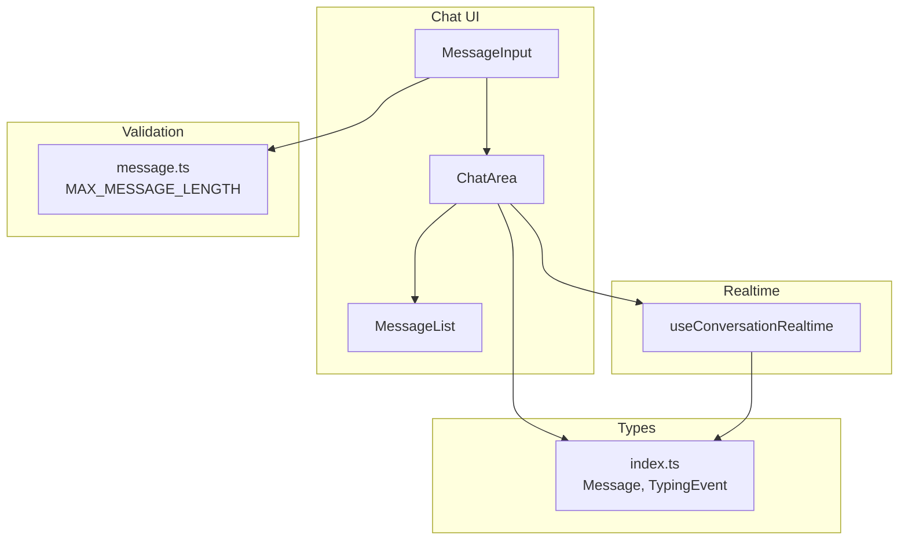
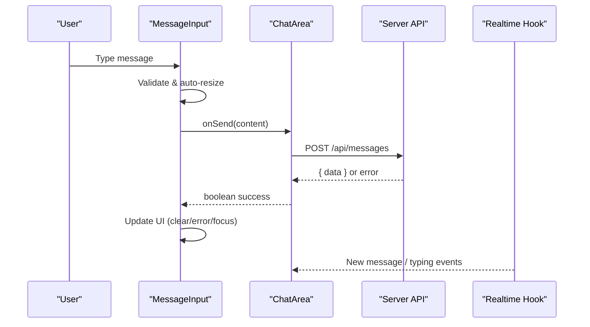
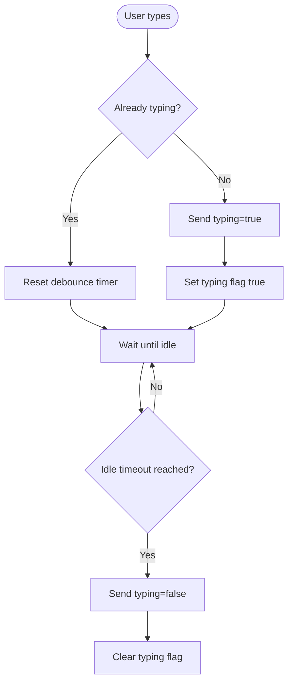
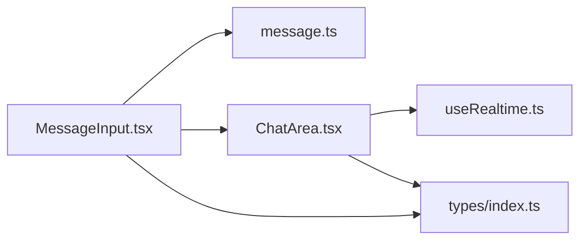

# Message Input Component

<cite>
**Referenced Files in This Document**
- [MessageInput.tsx](file://components/chat/MessageInput.tsx)
- [ChatArea.tsx](file://components/chat/ChatArea.tsx)
- [useRealtime.ts](file://hooks/useRealtime.ts)
- [message.ts](file://lib/validations/message.ts)
- [index.ts](file://types/index.ts)
</cite>

## Table of Contents
1. [Introduction](#introduction)
2. [Project Structure](#project-structure)
3. [Core Components](#core-components)
4. [Architecture Overview](#architecture-overview)
5. [Detailed Component Analysis](#detailed-component-analysis)
6. [Dependency Analysis](#dependency-analysis)
7. [Performance Considerations](#performance-considerations)
8. [Troubleshooting Guide](#troubleshooting-guide)
9. [Conclusion](#conclusion)
10. [Appendices](#appendices)

## Introduction
This document provides comprehensive documentation for the MessageInput component, which implements the message composition interface within the chat application. It covers props for sending messages, focus management, validation callbacks, text input handling, character counting, auto-resize behavior, keyboard shortcuts, real-time typing indicator integration, message validation, error handling for failed sends, accessibility features (ARIA labels, keyboard navigation, screen reader support), examples of custom input behaviors and formatting options, integration with the chat area for sending messages, responsive design patterns, and touch device optimizations.

## Project Structure
The MessageInput component is part of the chat feature and integrates with:
- ChatArea to send messages and display typing indicators
- Realtime hooks to subscribe to conversation events
- Validation utilities to enforce message length constraints
- Shared types for message and event payloads

**Diagram sources**
- [MessageInput.tsx:1-193](file://components/chat/MessageInput.tsx#L1-L193)
- [ChatArea.tsx:1-292](file://components/chat/ChatArea.tsx#L1-L292)
- [useRealtime.ts:1-120](file://hooks/useRealtime.ts#L1-L120)
- [message.ts:1-40](file://lib/validations/message.ts#L1-L40)
- [index.ts:1-118](file://types/index.ts#L1-L118)

**Section sources**
- [MessageInput.tsx:1-193](file://components/chat/MessageInput.tsx#L1-L193)
- [ChatArea.tsx:1-292](file://components/chat/ChatArea.tsx#L1-L292)
- [useRealtime.ts:1-120](file://hooks/useRealtime.ts#L1-L120)
- [message.ts:1-40](file://lib/validations/message.ts#L1-L40)
- [index.ts:1-118](file://types/index.ts#L1-L118)

## Core Components
- MessageInput: A client-side React component that manages user input, validation, auto-resize, keyboard shortcuts, typing indicators, and send actions via a callback prop.
- ChatArea: Hosts the MessageInput, handles optimistic message updates, server communication, polling fallback, and displays typing indicators.
- useConversationRealtime: Subscribes to conversation channels for new messages, read receipts, and typing events.
- Validation: Enforces maximum message length and message content rules.
- Types: Define shared interfaces for messages and realtime events.

**Section sources**
- [MessageInput.tsx:1-193](file://components/chat/MessageInput.tsx#L1-L193)
- [ChatArea.tsx:1-292](file://components/chat/ChatArea.tsx#L1-L292)
- [useRealtime.ts:1-120](file://hooks/useRealtime.ts#L1-L120)
- [message.ts:1-40](file://lib/validations/message.ts#L1-L40)
- [index.ts:1-118](file://types/index.ts#L1-L118)

## Architecture Overview
The MessageInput component composes messages by:
- Capturing text input and managing state
- Validating input against configured limits
- Handling keyboard shortcuts for sending
- Auto-resizing the textarea as content grows
- Emitting typing indicators while the user types
- Invoking an onSend callback to transmit the message
- Managing focus and error states

**Diagram sources**
- [MessageInput.tsx:89-121](file://components/chat/MessageInput.tsx#L89-L121)
- [ChatArea.tsx:182-229](file://components/chat/ChatArea.tsx#L182-L229)
- [useRealtime.ts:75-119](file://hooks/useRealtime.ts#L75-L119)

## Detailed Component Analysis

### Props and Integration
- onSend: Async callback receiving the trimmed message content; returns a boolean indicating success. Used by ChatArea to perform optimistic updates and server calls.
- conversationId: Identifies the conversation context for typing indicators and API endpoints.

**Section sources**
- [MessageInput.tsx:7-10](file://components/chat/MessageInput.tsx#L7-L10)
- [ChatArea.tsx:182-229](file://components/chat/ChatArea.tsx#L182-L229)

### Text Input Handling and Focus Management
- Controlled textarea with local state for text
- Auto-resize logic adjusts height based on scrollHeight up to a max height
- Focus restoration after send or error to maintain workflow continuity
- Disabled state during sending to prevent duplicate submissions

**Section sources**
- [MessageInput.tsx:25-31](file://components/chat/MessageInput.tsx#L25-L31)
- [MessageInput.tsx:89-114](file://components/chat/MessageInput.tsx#L89-L114)

### Character Counting and Validation
- Uses MAX_MESSAGE_LENGTH from validation module to compute remaining characters
- Shows counter when near limit; allows one extra character to surface overflow feedback
- Prevents sending if content is empty or exceeds limit

**Section sources**
- [message.ts:1-12](file://lib/validations/message.ts#L1-L12)
- [MessageInput.tsx:22-24](file://components/chat/MessageInput.tsx#L22-L24)
- [MessageInput.tsx:123-125](file://components/chat/MessageInput.tsx#L123-L125)

### Keyboard Shortcuts
- Enter sends the message when Shift is not pressed
- Shift + Enter inserts a new line without sending

**Section sources**
- [MessageInput.tsx:116-121](file://components/chat/MessageInput.tsx#L116-L121)

### Auto-Resize Functionality
- Dynamically sets textarea height to fit content, capped at a maximum height
- Resets height on send to return to default

**Section sources**
- [MessageInput.tsx:25-31](file://components/chat/MessageInput.tsx#L25-L31)
- [MessageInput.tsx:96-99](file://components/chat/MessageInput.tsx#L96-L99)

### Real-Time Typing Indicator Integration
- Emits typing start and stop signals to the server via a dedicated endpoint
- Debounces stop-typing to avoid excessive requests
- Clears timers on unmount to ensure clean state

**Diagram sources**
- [MessageInput.tsx:33-87](file://components/chat/MessageInput.tsx#L33-L87)

**Section sources**
- [MessageInput.tsx:33-87](file://components/chat/MessageInput.tsx#L33-L87)

### Message Validation and Error Handling
- Client-side validation prevents sending invalid messages
- Server-side validation enforced via schema in validation module
- On send failure:
  - Displays error message
  - Restores original text so users can retry
  - Keeps focus on input for quick correction

**Section sources**
- [message.ts:5-12](file://lib/validations/message.ts#L5-L12)
- [MessageInput.tsx:89-114](file://components/chat/MessageInput.tsx#L89-L114)

### Accessibility Features
- ARIA label on textarea for screen readers
- ARIA label on send button
- Keyboard navigation supports Enter to send and Shift+Enter for new lines
- Visual cues for disabled states and errors

**Section sources**
- [MessageInput.tsx:135-184](file://components/chat/MessageInput.tsx#L135-L184)

### Responsive Design and Touch Optimizations
- Flexible layout with flexbox ensures proper alignment across screen sizes
- Max-height and overflow-y-auto allow scrolling within the textarea
- Touch-friendly sizing and spacing for buttons and inputs
- Mobile-specific back button in ChatArea header improves navigation on small screens

**Section sources**
- [MessageInput.tsx:126-190](file://components/chat/MessageInput.tsx#L126-L190)
- [ChatArea.tsx:231-262](file://components/chat/ChatArea.tsx#L231-L262)

### Integration with Chat Area
- ChatArea passes onSend and conversationId to MessageInput
- ChatArea performs optimistic message insertion and server communication
- ChatArea displays typing indicators and updates conversation metadata

**Section sources**
- [ChatArea.tsx:182-229](file://components/chat/ChatArea.tsx#L182-L229)
- [ChatArea.tsx:273-288](file://components/chat/ChatArea.tsx#L273-L288)

## Dependency Analysis
MessageInput depends on:
- Validation constants for message length
- ChatArea for sending messages and coordinating UI state
- Realtime hook for conversation-level events
- Shared types for consistent messaging and event structures

**Diagram sources**
- [MessageInput.tsx:1-193](file://components/chat/MessageInput.tsx#L1-L193)
- [ChatArea.tsx:1-292](file://components/chat/ChatArea.tsx#L1-L292)
- [useRealtime.ts:1-120](file://hooks/useRealtime.ts#L1-L120)
- [message.ts:1-40](file://lib/validations/message.ts#L1-L40)
- [index.ts:1-118](file://types/index.ts#L1-L118)

**Section sources**
- [MessageInput.tsx:1-193](file://components/chat/MessageInput.tsx#L1-L193)
- [ChatArea.tsx:1-292](file://components/chat/ChatArea.tsx#L1-L292)
- [useRealtime.ts:1-120](file://hooks/useRealtime.ts#L1-L120)
- [message.ts:1-40](file://lib/validations/message.ts#L1-L40)
- [index.ts:1-118](file://types/index.ts#L1-L118)

## Performance Considerations
- Debounced typing indicators reduce network overhead
- Auto-resize uses minimal DOM reads/writes and caps height to avoid excessive layout thrashing
- Optimistic UI updates improve perceived responsiveness
- Polling fallback ensures functionality when realtime is unavailable, with careful interval cleanup

[No sources needed since this section provides general guidance]

## Troubleshooting Guide
Common issues and resolutions:
- Messages fail to send:
  - Check server response and error messages displayed by MessageInput
  - Ensure conversationId is valid and provided
  - Verify network connectivity and API availability
- Typing indicator not updating:
  - Confirm typing endpoint is reachable
  - Check debouncing logic and timers are cleared properly
- Input not focusing after send:
  - Verify textarea ref exists and focus call executes
- Counter not showing correctly:
  - Ensure MAX_MESSAGE_LENGTH is imported and used consistently

**Section sources**
- [MessageInput.tsx:89-114](file://components/chat/MessageInput.tsx#L89-L114)
- [MessageInput.tsx:33-87](file://components/chat/MessageInput.tsx#L33-L87)
- [message.ts:1-12](file://lib/validations/message.ts#L1-L12)

## Conclusion
The MessageInput component delivers a robust, accessible, and responsive message composition experience. It integrates tightly with ChatArea for sending and displaying messages, supports real-time typing indicators, enforces validation constraints, and maintains good performance through debouncing and optimistic updates. Its design accommodates various screen sizes and touch interactions, ensuring usability across devices.

[No sources needed since this section summarizes without analyzing specific files]

## Appendices

### Example Usage Patterns
- Custom input behaviors:
  - Extend handleKeyDown to support additional shortcuts (e.g., Ctrl+Enter)
  - Integrate rich text formatting by wrapping content before sending
- Message formatting options:
  - Preprocess content to normalize whitespace or sanitize HTML
  - Apply markdown-to-HTML conversion prior to sending
- Integration with chat area:
  - Use ChatArea’s onSend to manage optimistic updates and server sync
  - Handle conversation updates via onConversationUpdate callback

[No sources needed since this section provides conceptual guidance]