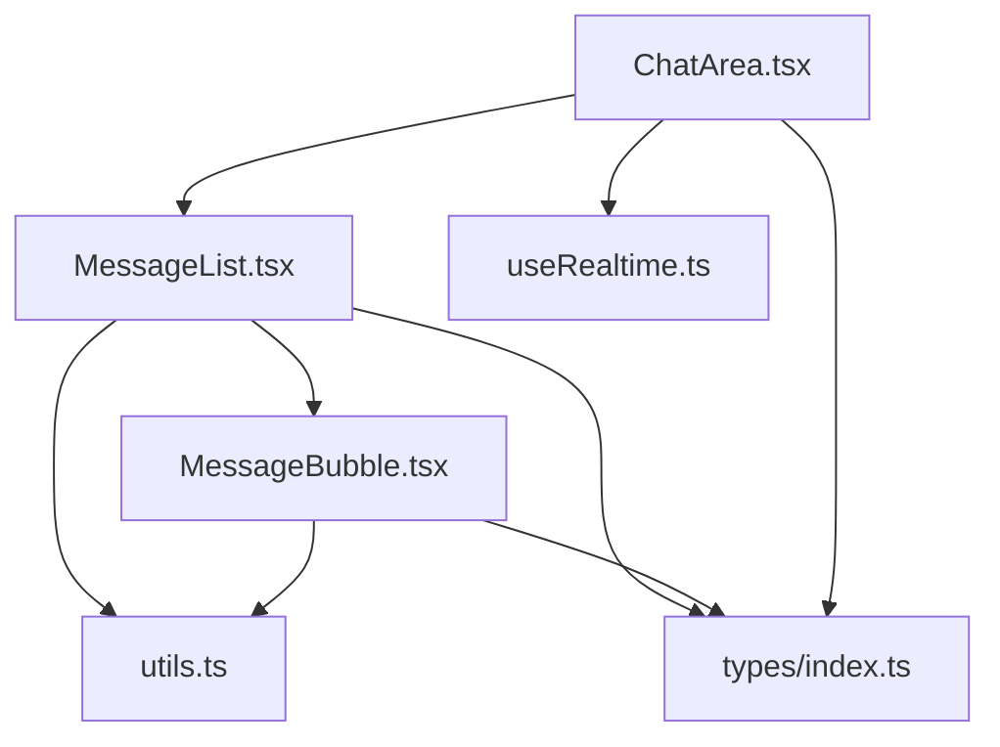
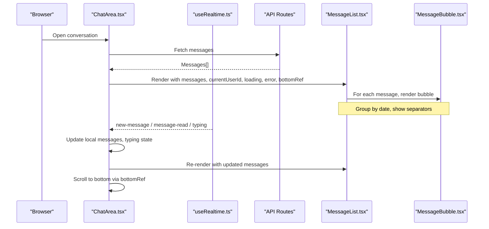
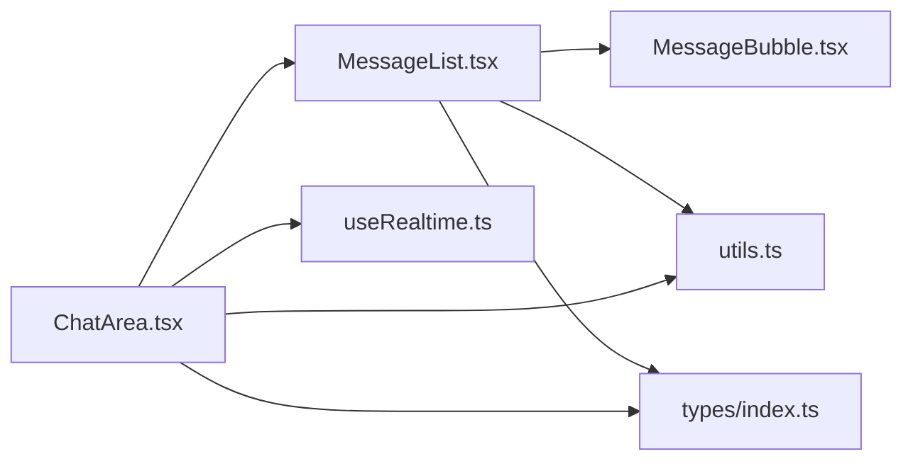
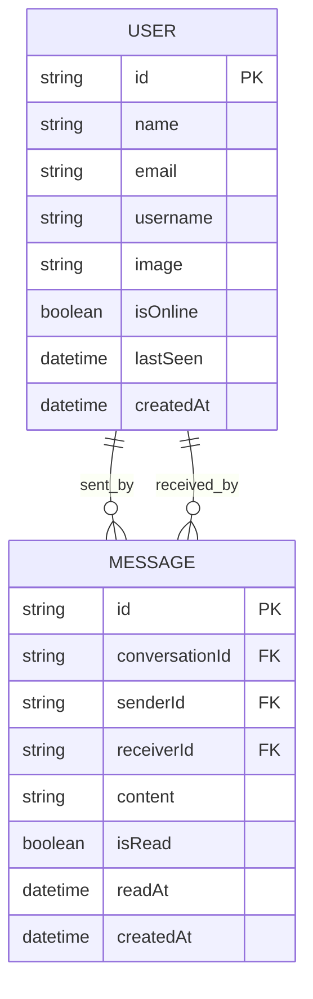

# Message List Component

<cite>
**Referenced Files in This Document**
- [MessageList.tsx](file://components/chat/MessageList.tsx)
- [MessageBubble.tsx](file://components/chat/MessageBubble.tsx)
- [ChatArea.tsx](file://components/chat/ChatArea.tsx)
- [index.ts](file://types/index.ts)
- [utils.ts](file://lib/utils.ts)
- [useRealtime.ts](file://hooks/useRealtime.ts)
</cite>

## Table of Contents
1. [Introduction](#introduction)
2. [Project Structure](#project-structure)
3. [Core Components](#core-components)
4. [Architecture Overview](#architecture-overview)
5. [Detailed Component Analysis](#detailed-component-analysis)
6. [Dependency Analysis](#dependency-analysis)
7. [Performance Considerations](#performance-considerations)
8. [Troubleshooting Guide](#troubleshooting-guide)
9. [Conclusion](#conclusion)
10. [Appendices](#appendices)

## Introduction
This document provides detailed documentation for the MessageList component, which renders a chronological display of messages within a conversation. It covers props, message rendering logic (sender vs receiver styling, grouping by date and user), content formatting, real-time insertion, automatic scrolling, performance considerations for large histories, integration with read receipts and timestamps, accessibility, and virtualization strategies for efficient rendering at scale.

## Project Structure
The messaging UI is composed of:
- ChatArea: orchestrates data fetching, real-time updates, scroll management, and composes MessageList and MessageInput.
- MessageList: groups messages by date and renders them with MessageBubble components.
- MessageBubble: renders individual message bubbles with sender-specific styling, timestamps, and read status indicators.
- Types and utilities define shared interfaces and formatting helpers used across the chat features.

**Diagram sources**
- [ChatArea.tsx:1-292](file://components/chat/ChatArea.tsx#L1-L292)
- [MessageList.tsx:1-100](file://components/chat/MessageList.tsx#L1-L100)
- [MessageBubble.tsx:1-60](file://components/chat/MessageBubble.tsx#L1-L60)
- [useRealtime.ts:1-120](file://hooks/useRealtime.ts#L1-L120)
- [utils.ts:1-94](file://lib/utils.ts#L1-L94)
- [index.ts:1-118](file://types/index.ts#L1-L118)

**Section sources**
- [ChatArea.tsx:1-292](file://components/chat/ChatArea.tsx#L1-L292)
- [MessageList.tsx:1-100](file://components/chat/MessageList.tsx#L1-L100)
- [MessageBubble.tsx:1-60](file://components/chat/MessageBubble.tsx#L1-L60)
- [useRealtime.ts:1-120](file://hooks/useRealtime.ts#L1-L120)
- [utils.ts:1-94](file://lib/utils.ts#L1-L94)
- [index.ts:1-118](file://types/index.ts#L1-L118)

## Core Components
- MessageList: Groups messages by date, renders date separators, and delegates each message to MessageBubble with sender context and run detection.
- MessageBubble: Renders a single message bubble with sender-specific layout and colors, timestamp, and read status indicators; supports temporary (optimistic) messages.
- ChatArea: Manages message state, real-time events, polling fallback, typing indicators, and scroll-to-bottom behavior via a bottom ref passed to MessageList.

Key responsibilities:
- MessageList: Data grouping and presentation structure.
- MessageBubble: Visual representation and micro-interactions per message.
- ChatArea: State orchestration, real-time integration, and scroll control.

**Section sources**
- [MessageList.tsx:1-100](file://components/chat/MessageList.tsx#L1-L100)
- [MessageBubble.tsx:1-60](file://components/chat/MessageBubble.tsx#L1-L60)
- [ChatArea.tsx:1-292](file://components/chat/ChatArea.tsx#L1-L292)

## Architecture Overview
The chat flow integrates real-time events and local state to keep the message list current and scrolled to the latest content.

**Diagram sources**
- [ChatArea.tsx:57-180](file://components/chat/ChatArea.tsx#L57-L180)
- [useRealtime.ts:75-119](file://hooks/useRealtime.ts#L75-L119)
- [MessageList.tsx:49-99](file://components/chat/MessageList.tsx#L49-L99)
- [MessageBubble.tsx:11-59](file://components/chat/MessageBubble.tsx#L11-L59)

## Detailed Component Analysis

### MessageList Props and Responsibilities
Props:
- messages: Array of Message objects to render chronologically.
- currentUserId: Identifier of the current user to determine own/receiver styling.
- loading: Boolean to show a loading indicator while fetching.
- error: String to display an error state when message loading fails.
- bottomRef: React ref to a sentinel element used to auto-scroll to the newest message.

Responsibilities:
- Display loading, error, or empty states appropriately.
- Group messages by date using a date formatter and insert date separators between groups.
- Determine if a message belongs to the current user and whether it is the last in a consecutive run from the same sender to decide avatar visibility.
- Render each message via MessageBubble with contextual flags.

Grouping logic:
- Iterates through messages and groups them by formatted date.
- Inserts a visual separator with the formatted date label between groups.

Run detection:
- For each message, checks the next message’s senderId to determine if the current message is the last in a run from the same sender. This controls avatar display to avoid repetition.

Scroll anchor:
- A sentinel div at the bottom receives the bottomRef so the parent can scroll into view after updates.

**Section sources**
- [MessageList.tsx:8-14](file://components/chat/MessageList.tsx#L8-L14)
- [MessageList.tsx:23-47](file://components/chat/MessageList.tsx#L23-L47)
- [MessageList.tsx:49-99](file://components/chat/MessageList.tsx#L49-L99)

### MessageBubble Rendering Logic
Props:
- message: The Message object containing content, timestamps, and read status.
- isOwn: Boolean indicating if the message was sent by the current user.
- isLastInRun: Boolean indicating if this is the last message from the same sender in a run.

Rendering details:
- Layout direction and colors differ based on isOwn to distinguish sent vs received messages.
- Temporary messages (with IDs starting with a specific prefix) are visually dimmed to indicate pending send.
- Timestamps are formatted using a utility function.
- Read receipts: For own messages, shows different icons depending on whether the message is read or not.

Accessibility:
- Uses semantic HTML elements and avoids injecting raw HTML; content is rendered as text to prevent XSS.
- Status icons are decorative; ensure surrounding text conveys meaning for screen readers.

**Section sources**
- [MessageBubble.tsx:5-9](file://components/chat/MessageBubble.tsx#L5-L9)
- [MessageBubble.tsx:11-59](file://components/chat/MessageBubble.tsx#L11-L59)
- [utils.ts:34-43](file://lib/utils.ts#L34-L43)

### Date Separators and User Information
Date separators:
- Messages are grouped by date using a formatter that returns “Today”, “Yesterday”, or localized date strings.
- Each group displays a centered date label with horizontal lines on either side.

User information:
- Avatar visibility is controlled by run detection in MessageList to show avatars only for the last message in a run from the same sender.
- Sender names and online status are managed at the conversation header level in ChatArea, not within MessageList.

**Section sources**
- [MessageList.tsx:49-72](file://components/chat/MessageList.tsx#L49-L72)
- [utils.ts:16-32](file://lib/utils.ts#L16-L32)

### Real-Time Message Insertion and Automatic Scrolling
Real-time integration:
- ChatArea subscribes to conversation channels for new-message, message-read, and typing events.
- On new-message, ChatArea merges incoming messages into local state, removing optimistic duplicates and appending the server message.
- On message-read, ChatArea updates read status for affected messages.

Automatic scrolling:
- After messages update, ChatArea scrolls the bottomRef into view smoothly to keep the latest message visible.

Polling fallback:
- When real-time is disabled, ChatArea polls for new messages and typing state at intervals, merging results while preserving optimistic messages.

**Section sources**
- [useRealtime.ts:75-119](file://hooks/useRealtime.ts#L75-L119)
- [ChatArea.tsx:91-132](file://components/chat/ChatArea.tsx#L91-L132)
- [ChatArea.tsx:134-180](file://components/chat/ChatArea.tsx#L134-L180)

### Performance Considerations for Large Message Histories
Current implementation:
- MessageList renders all messages in memory without virtualization.
- Grouping and run detection occur on every render pass.

Recommendations for scalability:
- Implement windowed/virtualized rendering to only render visible messages plus a small buffer.
- Memoize expensive computations (grouping, run detection) using memoization hooks or stable references.
- Use key-based lists with stable unique IDs to minimize re-renders.
- Debounce or throttle frequent updates during heavy real-time bursts.
- Consider pagination or infinite scroll for very long histories.

[No sources needed since this section provides general guidance]

### Accessibility Considerations
- Content safety: MessageBubble renders message content as plain text, avoiding HTML injection risks.
- Semantic structure: Use appropriate roles and labels where necessary for screen readers, especially around status icons and interactive elements.
- Keyboard navigation: Ensure focus management when scrolling to new messages.
- Color contrast: Ensure bubble colors meet contrast guidelines for readability.

[No sources needed since this section provides general guidance]

### Customization Hooks and Extensibility
- MessageList accepts a bottomRef for custom scroll behaviors; you can integrate intersection observers or custom scroll policies.
- MessageBubble can be extended to support rich content types (images, files) while maintaining safe rendering practices.
- Date formatting and time formatting are centralized in utils, making it easy to customize localization and formats globally.

**Section sources**
- [MessageList.tsx:13-22](file://components/chat/MessageList.tsx#L13-L22)
- [utils.ts:16-43](file://lib/utils.ts#L16-L43)

## Dependency Analysis
MessageList depends on:
- MessageBubble for rendering individual messages.
- Utils for date/time formatting.
- Types for Message interface definitions.

ChatArea depends on:
- MessageList for rendering.
- useRealtime for real-time event subscriptions.
- Utils for presence and last-seen formatting.
- Types for shared interfaces.

**Diagram sources**
- [MessageList.tsx:1-100](file://components/chat/MessageList.tsx#L1-L100)
- [MessageBubble.tsx:1-60](file://components/chat/MessageBubble.tsx#L1-L60)
- [ChatArea.tsx:1-292](file://components/chat/ChatArea.tsx#L1-L292)
- [useRealtime.ts:1-120](file://hooks/useRealtime.ts#L1-L120)
- [utils.ts:1-94](file://lib/utils.ts#L1-L94)
- [index.ts:1-118](file://types/index.ts#L1-L118)

**Section sources**
- [MessageList.tsx:1-100](file://components/chat/MessageList.tsx#L1-L100)
- [MessageBubble.tsx:1-60](file://components/chat/MessageBubble.tsx#L1-L60)
- [ChatArea.tsx:1-292](file://components/chat/ChatArea.tsx#L1-L292)
- [useRealtime.ts:1-120](file://hooks/useRealtime.ts#L1-L120)
- [utils.ts:1-94](file://lib/utils.ts#L1-L94)
- [index.ts:1-118](file://types/index.ts#L1-L118)

## Performance Considerations
- Avoid unnecessary re-renders by memoizing derived data (e.g., grouped messages).
- Use stable keys (message.id) to optimize list reconciliation.
- Consider virtualization libraries to handle large datasets efficiently.
- Debounce rapid real-time updates to reduce render frequency.
- Offload heavy formatting to memoized functions or Web Workers if needed.

[No sources needed since this section provides general guidance]

## Troubleshooting Guide
Common issues and resolutions:
- Messages not appearing:
  - Verify real-time subscriptions are active and conversationId matches.
  - Check polling fallback when real-time is disabled.
- Duplicate messages:
  - Ensure mergeIncoming removes optimistic duplicates before appending server messages.
- Read receipts not updating:
  - Confirm message-read events include correct messageIds and that local state mapping updates isRead and readAt fields.
- Scrolling behavior:
  - Ensure bottomRef is attached to a sentinel element and scrollIntoView is called after message updates.

**Section sources**
- [ChatArea.tsx:15-26](file://components/chat/ChatArea.tsx#L15-L26)
- [ChatArea.tsx:91-132](file://components/chat/ChatArea.tsx#L91-L132)
- [ChatArea.tsx:134-180](file://components/chat/ChatArea.tsx#L134-L180)

## Conclusion
MessageList provides a clear, grouped, and accessible rendering of chat messages with robust integration for real-time updates and automatic scrolling. While the current implementation does not use virtualization, it offers a solid foundation for extending functionality such as custom message types, enhanced formatting, and scalable rendering strategies for large histories.

[No sources needed since this section summarizes without analyzing specific files]

## Appendices

### Message Data Model
The Message type defines the core shape of messages, including identifiers, content, read status, timestamps, and optional sender information populated via joins.

**Diagram sources**
- [index.ts:25-36](file://types/index.ts#L25-L36)
- [index.ts:9-18](file://types/index.ts#L9-L18)

**Section sources**
- [index.ts:25-36](file://types/index.ts#L25-L36)