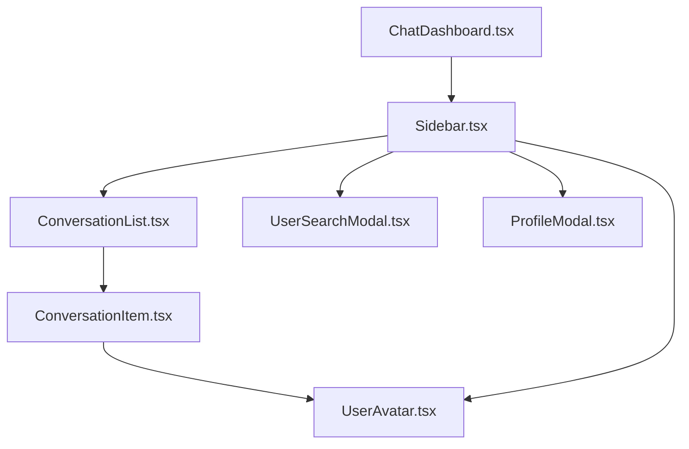
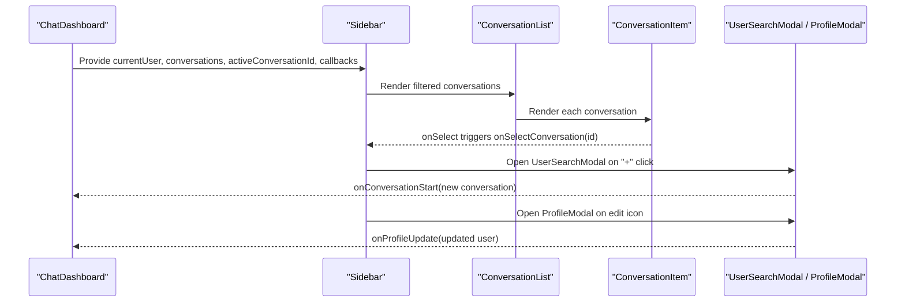
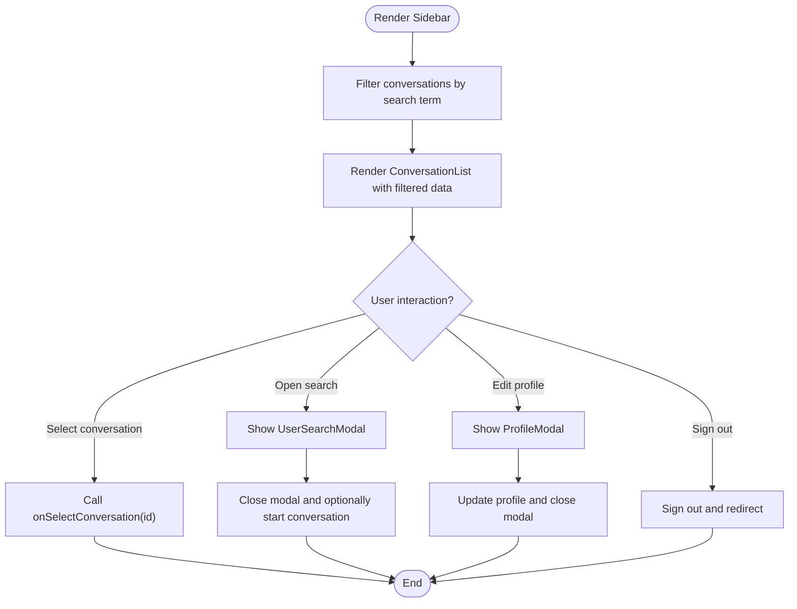
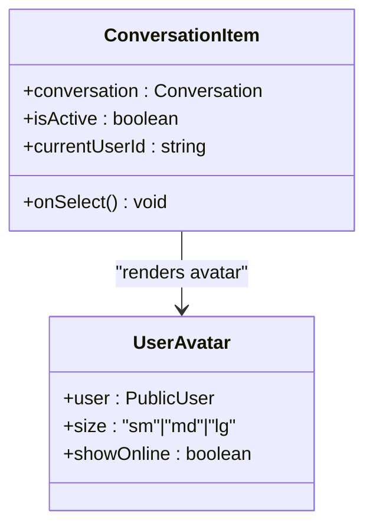
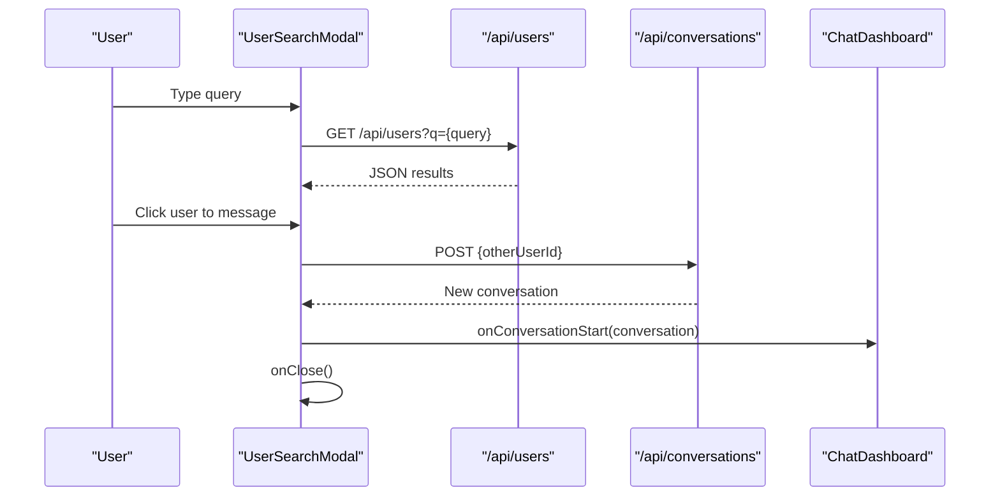
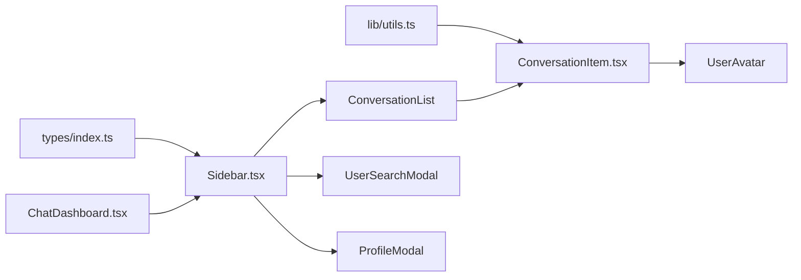

# Sidebar Component

<cite>
**Referenced Files in This Document**
- [Sidebar.tsx](file://components/chat/Sidebar.tsx)
- [ConversationList.tsx](file://components/chat/ConversationList.tsx)
- [ConversationItem.tsx](file://components/chat/ConversationItem.tsx)
- [UserSearchModal.tsx](file://components/chat/UserSearchModal.tsx)
- [ProfileModal.tsx](file://components/chat/ProfileModal.tsx)
- [UserAvatar.tsx](file://components/chat/UserAvatar.tsx)
- [ChatDashboard.tsx](file://components/chat/ChatDashboard.tsx)
- [index.ts](file://types/index.ts)
- [utils.ts](file://lib/utils.ts)
</cite>

## Table of Contents
1. [Introduction](#introduction)
2. [Project Structure](#project-structure)
3. [Core Components](#core-components)
4. [Architecture Overview](#architecture-overview)
5. [Detailed Component Analysis](#detailed-component-analysis)
6. [Dependency Analysis](#dependency-analysis)
7. [Performance Considerations](#performance-considerations)
8. [Troubleshooting Guide](#troubleshooting-guide)
9. [Conclusion](#conclusion)
10. [Appendices](#appendices)

## Introduction
This document provides comprehensive documentation for the Sidebar component that displays the conversation list and user profile section within the chat application. It covers the props interface, rendering logic for conversations, unread indicators, online status display, search functionality, user profile management via modals, responsive design patterns using Tailwind CSS, accessibility considerations, and performance optimizations for large lists and efficient re-renders.

## Project Structure
The Sidebar is part of a modular chat UI composed of focused components:
- Sidebar orchestrates the header, search bar, conversation list, and profile strip, and manages modal visibility.
- ConversationList renders a list of ConversationItem components or an empty state when there are no conversations.
- ConversationItem shows avatar, name, last message preview, time, and unread badge.
- UserSearchModal enables searching users and starting new conversations.
- ProfileModal allows editing the current user’s profile.
- UserAvatar renders avatars with optional online indicator.
- ChatDashboard composes Sidebar and ChatArea and manages state such as active conversation and real-time updates.

**Diagram sources**
- [Sidebar.tsx:1-159](file://components/chat/Sidebar.tsx#L1-L159)
- [ConversationList.tsx:1-57](file://components/chat/ConversationList.tsx#L1-L57)
- [ConversationItem.tsx:1-85](file://components/chat/ConversationItem.tsx#L1-L85)
- [UserSearchModal.tsx:1-168](file://components/chat/UserSearchModal.tsx#L1-L168)
- [ProfileModal.tsx:1-176](file://components/chat/ProfileModal.tsx#L1-L176)
- [UserAvatar.tsx:1-57](file://components/chat/UserAvatar.tsx#L1-L57)
- [ChatDashboard.tsx:1-364](file://components/chat/ChatDashboard.tsx#L1-L364)

**Section sources**
- [Sidebar.tsx:1-159](file://components/chat/Sidebar.tsx#L1-L159)
- [ChatDashboard.tsx:316-333](file://components/chat/ChatDashboard.tsx#L316-L333)

## Core Components
- Sidebar: Provides the main layout, search filtering, and integration with modals and profile strip.
- ConversationList: Renders either an empty state or a list of ConversationItem elements.
- ConversationItem: Displays per-conversation details including unread count and last message preview.
- UserSearchModal: Debounced user search and conversation creation flow.
- ProfileModal: Editable profile form with save feedback.
- UserAvatar: Avatar with initials fallback and online status dot.

Key responsibilities:
- Filtering conversations by other user’s name based on local search input.
- Rendering unread badges and last message previews.
- Managing modal states for user search and profile editing.
- Displaying current user info and actions (edit profile, sign out).

**Section sources**
- [Sidebar.tsx:13-20](file://components/chat/Sidebar.tsx#L13-L20)
- [ConversationList.tsx:7-13](file://components/chat/ConversationList.tsx#L7-L13)
- [ConversationItem.tsx:7-12](file://components/chat/ConversationItem.tsx#L7-L12)
- [UserSearchModal.tsx:8-12](file://components/chat/UserSearchModal.tsx#L8-L12)
- [ProfileModal.tsx:8-12](file://components/chat/ProfileModal.tsx#L8-L12)
- [UserAvatar.tsx:5-11](file://components/chat/UserAvatar.tsx#L5-L11)

## Architecture Overview
The Sidebar integrates with ChatDashboard to receive current user data, conversation list, and callbacks. It delegates rendering to ConversationList and uses modals for user search and profile editing. Real-time presence and message updates are handled at the dashboard level and reflected in the sidebar through updated conversation objects.

**Diagram sources**
- [ChatDashboard.tsx:316-333](file://components/chat/ChatDashboard.tsx#L316-L333)
- [Sidebar.tsx:22-159](file://components/chat/Sidebar.tsx#L22-L159)
- [ConversationList.tsx:15-57](file://components/chat/ConversationList.tsx#L15-L57)
- [ConversationItem.tsx:14-85](file://components/chat/ConversationItem.tsx#L14-L85)
- [UserSearchModal.tsx:14-168](file://components/chat/UserSearchModal.tsx#L14-L168)
- [ProfileModal.tsx:14-176](file://components/chat/ProfileModal.tsx#L14-L176)

## Detailed Component Analysis

### Sidebar
- Props:
  - currentUser: PublicUser object representing the logged-in user.
  - conversations: Array of Conversation objects to render.
  - activeConversationId: ID of the currently selected conversation.
  - onSelectConversation: Callback invoked when a conversation is selected.
  - onNewConversation: Callback invoked when a new conversation is created.
  - onProfileUpdate: Callback invoked when the profile is updated.
- Features:
  - Local search filters conversations by the other user’s username or name.
  - Header includes app branding and “+” button to open UserSearchModal.
  - Search input with placeholder and accessible label via aria attributes where applicable.
  - ConversationList receives filtered data and activeConversationId.
  - Profile strip shows UserAvatar with online indicator, username/email, edit profile button, and sign-out button.
  - Modals are conditionally rendered based on local state toggles.

Accessibility highlights:
- Buttons have descriptive titles for screen readers.
- Inputs use semantic types and placeholders; focus management is delegated to child modals.

Styling approach:
- Uses Tailwind utility classes for layout, spacing, colors, and typography.
- Consistent theme tokens via custom color names (e.g., sidebar-*).

**Section sources**
- [Sidebar.tsx:13-20](file://components/chat/Sidebar.tsx#L13-L20)
- [Sidebar.tsx:31-46](file://components/chat/Sidebar.tsx#L31-L46)
- [Sidebar.tsx:48-159](file://components/chat/Sidebar.tsx#L48-L159)

#### Sidebar Flowchart

**Diagram sources**
- [Sidebar.tsx:31-46](file://components/chat/Sidebar.tsx#L31-L46)
- [Sidebar.tsx:72-159](file://components/chat/Sidebar.tsx#L72-L159)

### ConversationList
- Props:
  - conversations: Array of Conversation objects.
  - activeConversationId: ID used to highlight the active item.
  - currentUserId: Used by items to format previews and unread logic.
  - onSelect: Callback to select a conversation.
  - searchActive: Boolean indicating if search is active to adjust empty state messaging.
- Behavior:
  - If no conversations exist, renders an empty state with contextual messages.
  - Otherwise, maps over conversations to render ConversationItem with isActive flag.

**Section sources**
- [ConversationList.tsx:7-13](file://components/chat/ConversationList.tsx#L7-L13)
- [ConversationList.tsx:15-57](file://components/chat/ConversationList.tsx#L15-L57)

### ConversationItem
- Props:
  - conversation: The conversation object containing otherUser, lastMessage, and unreadCount.
  - isActive: Boolean to highlight the active conversation.
  - currentUserId: Current user’s ID to determine preview prefix.
  - onSelect: Callback to select this conversation.
- Rendering:
  - Shows UserAvatar with online indicator.
  - Displays other user’s name and last message preview, truncated for space.
  - Formats last message time using utility function.
  - Unread badge displays unreadCount capped at “99+”.

**Section sources**
- [ConversationItem.tsx:7-12](file://components/chat/ConversationItem.tsx#L7-L12)
- [ConversationItem.tsx:14-85](file://components/chat/ConversationItem.tsx#L14-L85)
- [utils.ts:37-43](file://lib/utils.ts#L37-L43)

#### ConversationItem Class Diagram

**Diagram sources**
- [ConversationItem.tsx:14-85](file://components/chat/ConversationItem.tsx#L14-L85)
- [UserAvatar.tsx:5-11](file://components/chat/UserAvatar.tsx#L5-L11)

### UserSearchModal
- Props:
  - currentUser: PublicUser to identify the initiator.
  - onClose: Callback to close the modal.
  - onConversationStart: Callback to create a new conversation and pass it up.
- Functionality:
  - Debounced search queries to /api/users?q=... with loading and error states.
  - Results list with UserAvatar and user details.
  - Starts a conversation via POST to /api/conversations with otherUserId.
  - Keyboard support: Escape closes modal; auto-focuses input on open.

**Section sources**
- [UserSearchModal.tsx:8-12](file://components/chat/UserSearchModal.tsx#L8-L12)
- [UserSearchModal.tsx:14-168](file://components/chat/UserSearchModal.tsx#L14-L168)

#### UserSearchModal Sequence Diagram

**Diagram sources**
- [UserSearchModal.tsx:40-89](file://components/chat/UserSearchModal.tsx#L40-L89)
- [UserSearchModal.tsx:91-168](file://components/chat/UserSearchModal.tsx#L91-L168)

### ProfileModal
- Props:
  - currentUser: PublicUser to prefill fields.
  - onClose: Callback to close the modal.
  - onProfileUpdate: Callback to propagate updated user data.
- Functionality:
  - Editable fields for display name and username.
  - Saves changes via PATCH to /api/users.
  - Shows success/error states and auto-closes after successful update.
  - Keyboard support: Enter saves; Escape closes modal.

**Section sources**
- [ProfileModal.tsx:8-12](file://components/chat/ProfileModal.tsx#L8-L12)
- [ProfileModal.tsx:14-176](file://components/chat/ProfileModal.tsx#L14-L176)

### UserAvatar
- Props:
  - user: Subset of PublicUser including name, username, image, isOnline.
  - size: Controls container and text sizes.
  - showOnline: Optional boolean to display online status dot.
  - dotBorder: Tailwind border class for the online dot ring.
- Rendering:
  - Displays user image if available; otherwise, shows initials derived from name/username.
  - Online indicator dot color reflects isOnline status.

**Section sources**
- [UserAvatar.tsx:5-11](file://components/chat/UserAvatar.tsx#L5-L11)
- [UserAvatar.tsx:19-57](file://components/chat/UserAvatar.tsx#L19-L57)

## Dependency Analysis
- Types:
  - PublicUser defines safe user shape used across components.
  - Conversation includes otherUser, lastMessage, and unreadCount.
- Utilities:
  - formatMessageTime formats timestamps for display.
  - getInitials generates avatar initials.
- Integration:
  - ChatDashboard passes state and callbacks to Sidebar and handles real-time updates.
  - Sidebar relies on modals for extended interactions without breaking layout.

**Diagram sources**
- [index.ts:9-53](file://types/index.ts#L9-L53)
- [utils.ts:37-43](file://lib/utils.ts#L37-L43)
- [ChatDashboard.tsx:316-333](file://components/chat/ChatDashboard.tsx#L316-L333)
- [Sidebar.tsx:1-159](file://components/chat/Sidebar.tsx#L1-L159)
- [ConversationList.tsx:1-57](file://components/chat/ConversationList.tsx#L1-L57)
- [ConversationItem.tsx:1-85](file://components/chat/ConversationItem.tsx#L1-L85)
- [UserSearchModal.tsx:1-168](file://components/chat/UserSearchModal.tsx#L1-L168)
- [ProfileModal.tsx:1-176](file://components/chat/ProfileModal.tsx#L1-L176)
- [UserAvatar.tsx:1-57](file://components/chat/UserAvatar.tsx#L1-L57)

**Section sources**
- [index.ts:9-53](file://types/index.ts#L9-L53)
- [utils.ts:37-43](file://lib/utils.ts#L37-L43)
- [ChatDashboard.tsx:147-196](file://components/chat/ChatDashboard.tsx#L147-L196)

## Performance Considerations
- Efficient list rendering:
  - ConversationList maps over conversations and passes stable keys (conversation.id) to optimize reconciliation.
  - Active highlighting uses a simple equality check against activeConversationId.
- Filtering strategy:
  - Local search filter runs on the client side; for very large lists, consider virtualization or pagination to reduce DOM nodes.
- Debounced search:
  - UserSearchModal debounces API calls to avoid excessive network requests.
- Re-render minimization:
  - ChatDashboard memoizes callbacks (useCallback) and updates only necessary parts of state.
  - Presence events update specific conversation entries rather than full re-fetch when possible.
- Image optimization:
  - UserAvatar uses Next.js Image for optimized loading when user images are present.

Recommendations:
- Implement virtualized lists (e.g., react-window) for thousands of conversations.
- Use React.memo for ConversationItem to prevent unnecessary re-renders when props haven’t changed.
- Consider server-side search for UserSearchModal to scale beyond client memory limits.

[No sources needed since this section provides general guidance]

## Troubleshooting Guide
- Search returns no results:
  - Ensure query is trimmed and non-empty; verify API endpoint responds correctly.
  - Check network tab for errors and handle error state in UserSearchModal.
- Profile update fails:
  - Validate payload sent to /api/users; ensure required fields are included.
  - Review error messages displayed in ProfileModal and retry.
- Online status not updating:
  - Confirm presence heartbeat is running and server is broadcasting presence events.
  - Verify ChatDashboard updates otherUser.isOnline based on presence events.
- Sign out does not redirect:
  - Ensure signOut function resolves and router navigation occurs.
  - Check for any unhandled promise rejections.

**Section sources**
- [UserSearchModal.tsx:40-89](file://components/chat/UserSearchModal.tsx#L40-L89)
- [ProfileModal.tsx:36-61](file://components/chat/ProfileModal.tsx#L36-L61)
- [ChatDashboard.tsx:179-196](file://components/chat/ChatDashboard.tsx#L179-L196)
- [Sidebar.tsx:42-46](file://components/chat/Sidebar.tsx#L42-L46)

## Conclusion
The Sidebar component provides a cohesive interface for browsing conversations, managing user profiles, and initiating new chats. It leverages modular subcomponents for clarity and maintainability, integrates seamlessly with ChatDashboard for state and real-time updates, and employs Tailwind CSS for consistent styling. With careful attention to accessibility and performance, it scales well for typical usage patterns and can be further optimized for large datasets.

[No sources needed since this section summarizes without analyzing specific files]

## Appendices

### Props Interface Summary
- Sidebar:
  - currentUser: PublicUser
  - conversations: Conversation[]
  - activeConversationId: string | null
  - onSelectConversation: (id: string) => void
  - onNewConversation: (conversation: Conversation) => void
  - onProfileUpdate: (updated: PublicUser) => void
- ConversationList:
  - conversations: Conversation[]
  - activeConversationId: string | null
  - currentUserId: string
  - onSelect: (id: string) => void
  - searchActive: boolean
- ConversationItem:
  - conversation: Conversation
  - isActive: boolean
  - currentUserId: string
  - onSelect: () => void
- UserSearchModal:
  - currentUser: PublicUser
  - onClose: () => void
  - onConversationStart: (conversation: Conversation) => void
- ProfileModal:
  - currentUser: PublicUser
  - onClose: () => void
  - onProfileUpdate: (updated: PublicUser) => void
- UserAvatar:
  - user: Pick<PublicUser, "name" | "username" | "image" | "isOnline">
  - size?: "sm" | "md" | "lg"
  - showOnline?: boolean
  - dotBorder?: string

**Section sources**
- [Sidebar.tsx:13-20](file://components/chat/Sidebar.tsx#L13-L20)
- [ConversationList.tsx:7-13](file://components/chat/ConversationList.tsx#L7-L13)
- [ConversationItem.tsx:7-12](file://components/chat/ConversationItem.tsx#L7-L12)
- [UserSearchModal.tsx:8-12](file://components/chat/UserSearchModal.tsx#L8-L12)
- [ProfileModal.tsx:8-12](file://components/chat/ProfileModal.tsx#L8-L12)
- [UserAvatar.tsx:5-11](file://components/chat/UserAvatar.tsx#L5-L11)

### Data Models Reference
- PublicUser: id, name, username, email, image, isOnline, lastSeen
- Conversation: id, createdAt, updatedAt, otherUser, lastMessage, unreadCount
- Message: id, conversationId, senderId, receiverId, content, isRead, readAt, createdAt

**Section sources**
- [index.ts:9-53](file://types/index.ts#L9-L53)