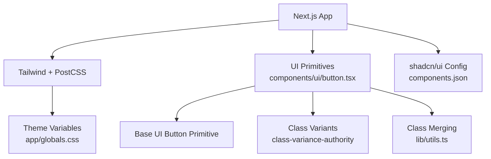
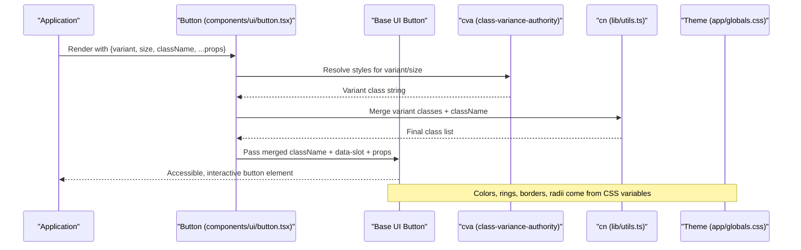
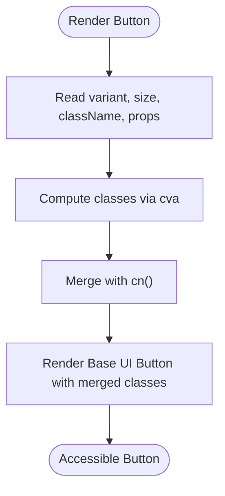
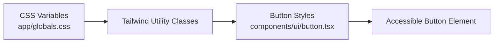
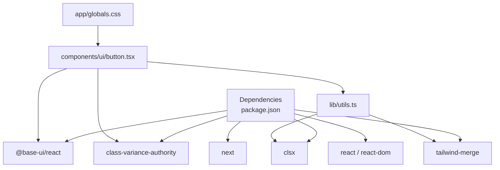

# UI Components Library

<cite>
**Referenced Files in This Document**
- [button.tsx](file://components/ui/button.tsx)
- [globals.css](file://app/globals.css)
- [utils.ts](file://lib/utils.ts)
- [components.json](file://components.json)
- [package.json](file://package.json)
- [next.config.mjs](file://next.config.mjs)
- [tsconfig.json](file://tsconfig.json)
- [postcss.config.mjs](file://postcss.config.mjs)
</cite>

## Table of Contents
1. Introduction
2. Project Structure
3. Core Components
4. Architecture Overview
5. Detailed Component Analysis
6. Dependency Analysis
7. Performance Considerations
8. Troubleshooting Guide
9. Conclusion
10. Appendices

## Introduction
This document describes the reusable UI component library built with shadcn/ui and Tailwind CSS, focusing on the Button component. It explains how the component is implemented using Base UI primitives, styled via class-variance-authority (cva), and themed through CSS variables. It also covers accessibility features, responsive design patterns, composition strategies, style inheritance, Next.js integration, TypeScript support, development workflow, usage examples, customization options, extension patterns, build process, testing approaches, and contribution guidelines for adding new components.

## Project Structure
The project follows a feature-oriented layout with a dedicated UI primitives folder under components/ui. The Button component lives in components/ui/button.tsx and is styled with Tailwind classes and theme variables defined in app/globals.css. Utilities for class merging are provided by lib/utils.ts. Configuration for shadcn/ui, Tailwind, PostCSS, TypeScript, and Next.js is centralized in their respective config files.

**Diagram sources**
- [button.tsx:1-58](file://components/ui/button.tsx#L1-L58)
- [globals.css:1-177](file://app/globals.css#L1-L177)
- [utils.ts:1-94](file://lib/utils.ts#L1-L94)
- [components.json:1-22](file://components.json#L1-L22)

**Section sources**
- [components.json:1-22](file://components.json#L1-L22)
- [package.json:1-53](file://package.json#L1-L53)
- [next.config.mjs:1-12](file://next.config.mjs#L1-L12)
- [tsconfig.json:1-34](file://tsconfig.json#L1-L34)
- [postcss.config.mjs:1-9](file://postcss.config.mjs#L1-L9)

## Core Components
- Button: A composable, accessible button primitive that wraps Base UI’s Button. It uses cva to define variants and sizes, merges classes via a utility function, and applies data-slot attributes for consistent styling and testing hooks.

Key characteristics:
- Variants: default, outline, secondary, ghost, destructive, link
- Sizes: default, xs, sm, lg, icon, icon-xs, icon-sm, icon-lg
- Accessibility: inherits focus-visible states, keyboard behavior, and aria attributes from Base UI; supports invalid state styling via aria-invalid
- Theming: fully driven by CSS variables for colors, rings, borders, and radii
- Composition: accepts all Base UI props plus variant/size overrides; className merging ensures predictable style precedence

**Section sources**
- [button.tsx:1-58](file://components/ui/button.tsx#L1-L58)
- [utils.ts:1-94](file://lib/utils.ts#L1-L94)
- [globals.css:1-177](file://app/globals.css#L1-L177)

## Architecture Overview
The Button component is a thin wrapper around a low-level primitive to provide a stable API surface while delegating complex behavior (focus management, keyboard navigation, ARIA) to Base UI. Styling is declarative and theme-driven, enabling easy customization without touching component code.

**Diagram sources**
- [button.tsx:1-58](file://components/ui/button.tsx#L1-L58)
- [utils.ts:1-94](file://lib/utils.ts#L1-L94)
- [globals.css:1-177](file://app/globals.css#L1-L177)

## Detailed Component Analysis

### Button Component
- Purpose: Provide a consistent, accessible, and themeable button across the application.
- Props: Inherits Base UI Button props; adds variant and size controlled by cva; supports className override.
- Styling: Uses cva to compose base styles and variant-specific classes; merges with cn to avoid conflicts.
- Accessibility: Relies on Base UI for keyboard interaction, focus management, and ARIA attributes; includes invalid state styling via aria-invalid.
- Data attributes: Sets data-slot="button" for consistent targeting and testing.

**Diagram sources**
- [button.tsx:1-58](file://components/ui/button.tsx#L1-L58)
- [utils.ts:1-94](file://lib/utils.ts#L1-L94)

**Section sources**
- [button.tsx:1-58](file://components/ui/button.tsx#L1-L58)

### Prop Interfaces and Types
- The component composes Base UI Button props with cva’s VariantProps for type-safe variant and size selection.
- TypeScript configuration enables strict mode and path aliases for clean imports.

**Section sources**
- [button.tsx:1-58](file://components/ui/button.tsx#L1-L58)
- [tsconfig.json:1-34](file://tsconfig.json#L1-L34)

### Styling Variants and Sizes
- Variants: default, outline, secondary, ghost, destructive, link
- Sizes: default, xs, sm, lg, icon, icon-xs, icon-sm, icon-lg
- Each variant and size maps to specific Tailwind utility classes that leverage theme variables for colors, spacing, and radii.

**Section sources**
- [button.tsx:6-41](file://components/ui/button.tsx#L6-L41)

### Accessibility Features
- Keyboard navigation and focus management are handled by Base UI.
- Focus-visible outlines and ring styles use theme variables for consistent focus indicators.
- Invalid state styling responds to aria-invalid for form validation feedback.
- Icons inside buttons are disabled from pointer events and sized consistently.

**Section sources**
- [button.tsx:1-58](file://components/ui/button.tsx#L1-L58)

### Theme Customization via CSS Variables
- All colors, rings, borders, and radii are exposed as CSS variables in app/globals.css.
- Light and dark themes are defined with color-scheme and variable overrides.
- Additional tokens (e.g., bubble colors) demonstrate extensibility beyond core tokens.

**Diagram sources**
- [globals.css:1-177](file://app/globals.css#L1-L177)
- [button.tsx:1-58](file://components/ui/button.tsx#L1-L58)

**Section sources**
- [globals.css:1-177](file://app/globals.css#L1-L177)

### Responsive Design Patterns
- Buttons adapt to content and container constraints using flexible sizing and spacing utilities.
- Icon-only sizes ensure compact controls at various breakpoints.
- Focus and hover states remain consistent across devices.

[No sources needed since this section provides general guidance]

### Component Composition Strategies
- The Button composes Base UI primitives and leverages cva for declarative styling.
- Class merging via cn ensures predictable style precedence when overriding className.
- data-slot enables robust testing and targeted styling within groups or layouts.

**Section sources**
- [button.tsx:1-58](file://components/ui/button.tsx#L1-L58)
- [utils.ts:1-94](file://lib/utils.ts#L1-L94)

### Style Inheritance and Design System Principles
- Single source of truth for theming via CSS variables.
- Consistent naming and structure across components promote maintainability.
- Separation of concerns: behavior (Base UI), styling (Tailwind/cva), and utilities (cn).

**Section sources**
- [globals.css:1-177](file://app/globals.css#L1-L177)
- [button.tsx:1-58](file://components/ui/button.tsx#L1-L58)

### Integration with Next.js and TypeScript
- Next.js configuration disables image optimization for simplicity and ignores TS build errors during builds.
- TypeScript is configured with strict mode, JSX runtime, and path aliases for cleaner imports.
- PostCSS integrates Tailwind processing.

**Section sources**
- [next.config.mjs:1-12](file://next.config.mjs#L1-L12)
- [tsconfig.json:1-34](file://tsconfig.json#L1-L34)
- [postcss.config.mjs:1-9](file://postcss.config.mjs#L1-L9)

### Development Workflow
- Scripts: dev, build, start for local development and production builds.
- Dependencies: Base UI, class-variance-authority, clsx, tailwind-merge, lucide-react, Next.js, React, and related tooling.
- shadcn/ui configuration defines style, RSC, TSX, Tailwind settings, aliases, and icon library.

**Section sources**
- [package.json:1-53](file://package.json#L1-L53)
- [components.json:1-22](file://components.json#L1-L22)

### Usage Examples
- Basic usage: render a default button with text and optional icons.
- Variants: apply outline, secondary, ghost, destructive, or link to match context.
- Sizes: choose xs, sm, lg, or icon variants for different densities.
- Overriding styles: pass className to fine-tune appearance while preserving variant behavior.

[No sources needed since this section provides general guidance]

### Customization Options
- Add new variants or sizes by extending cva definitions.
- Customize theme tokens in app/globals.css to rebrand colors, radii, and spacing.
- Extend props by composing additional attributes or handlers while keeping Base UI compatibility.

**Section sources**
- [button.tsx:6-41](file://components/ui/button.tsx#L6-L41)
- [globals.css:1-177](file://app/globals.css#L1-L177)

### Extension Patterns
- Create compound components (e.g., ButtonGroup) by leveraging data-slot and group selectors.
- Build higher-order wrappers for specialized behaviors (e.g., loading states, async actions).
- Use cva exports to share variant logic across multiple components.

**Section sources**
- [button.tsx:1-58](file://components/ui/button.tsx#L1-L58)

### Build Process
- Next.js handles bundling and optimization based on next.config.mjs.
- Tailwind processes styles via PostCSS plugin.
- TypeScript compiles types and enforces strict checks during development.

**Section sources**
- [next.config.mjs:1-12](file://next.config.mjs#L1-L12)
- [postcss.config.mjs:1-9](file://postcss.config.mjs#L1-L9)
- [tsconfig.json:1-34](file://tsconfig.json#L1-L34)

### Testing Approaches
- Unit tests: assert rendered output, variant/sizes, and prop passthroughs.
- Interaction tests: verify keyboard navigation, focus-visible states, and aria attributes using Base UI’s behavior.
- Visual regression: snapshot or compare screenshots across variants and themes.
- Targeting: use data-slot="button" for reliable queries in test runners.

[No sources needed since this section provides general guidance]

### Contribution Guidelines for Adding New UI Components
- Place new components under components/ui with clear filenames.
- Follow existing patterns: wrap primitives, define variants with cva, merge classes with cn, and expose data-slot attributes.
- Update theme variables if introducing new tokens; keep light/dark parity.
- Ensure TypeScript safety by composing primitive props and variant types.
- Add documentation and examples; consider tests for interactions and accessibility.

**Section sources**
- [button.tsx:1-58](file://components/ui/button.tsx#L1-L58)
- [globals.css:1-177](file://app/globals.css#L1-L177)
- [components.json:1-22](file://components.json#L1-L22)

## Dependency Analysis
The Button component depends on Base UI for behavior, class-variance-authority for styling variants, and utility functions for class merging. Theme variables drive visual consistency.

**Diagram sources**
- [package.json:1-53](file://package.json#L1-L53)
- [button.tsx:1-58](file://components/ui/button.tsx#L1-L58)
- [utils.ts:1-94](file://lib/utils.ts#L1-L94)
- [globals.css:1-177](file://app/globals.css#L1-L177)

**Section sources**
- [package.json:1-53](file://package.json#L1-L53)

## Performance Considerations
- Prefer lightweight primitives and rely on Base UI for efficient DOM updates and event handling.
- Use cva to compute minimal class sets per variant/size to reduce CSS bloat.
- Avoid heavy inline styles; prefer theme variables and utility classes for better caching and tree-shaking.
- Keep component boundaries small to enable selective re-renders.

[No sources needed since this section provides general guidance]

## Troubleshooting Guide
- Focus not visible: ensure focus-visible styles are enabled and theme ring variables are set.
- Incorrect variant/style: verify cva keys and that className merging does not override critical classes.
- Dark mode issues: confirm .dark overrides exist for relevant variables and that color-scheme is set.
- TypeScript errors: check prop types and ensure imports align with Base UI and cva signatures.

**Section sources**
- [button.tsx:1-58](file://components/ui/button.tsx#L1-L58)
- [globals.css:1-177](file://app/globals.css#L1-L177)

## Conclusion
The Button component exemplifies a modern, accessible, and themeable UI building block. By combining Base UI primitives, class-variance-authority, and CSS variables, it delivers a consistent experience across variants, sizes, and themes. The architecture promotes composability, maintainability, and extensibility, making it straightforward to add new components and customize the design system.

## Appendices

### Quick Reference: Button Variants and Sizes
- Variants: default, outline, secondary, ghost, destructive, link
- Sizes: default, xs, sm, lg, icon, icon-xs, icon-sm, icon-lg

**Section sources**
- [button.tsx:6-41](file://components/ui/button.tsx#L6-L41)

### Theme Tokens Overview
- Core tokens: background, foreground, primary, secondary, muted, accent, destructive, border, input, ring
- Radii: sm, md, lg, xl, 2xl, 3xl, 4xl derived from a base radius
- Dark mode: full token overrides for contrast and brand alignment

**Section sources**
- [globals.css:1-177](file://app/globals.css#L1-L177)