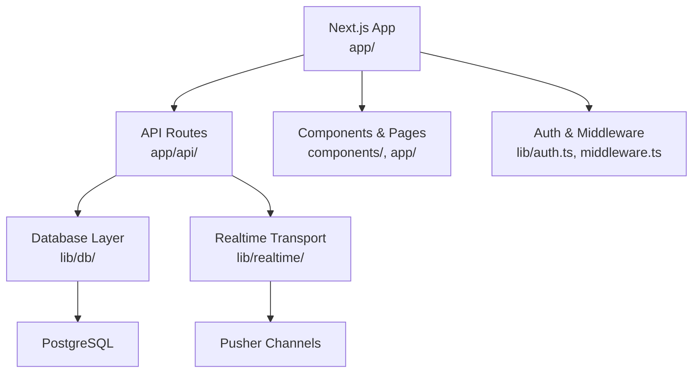
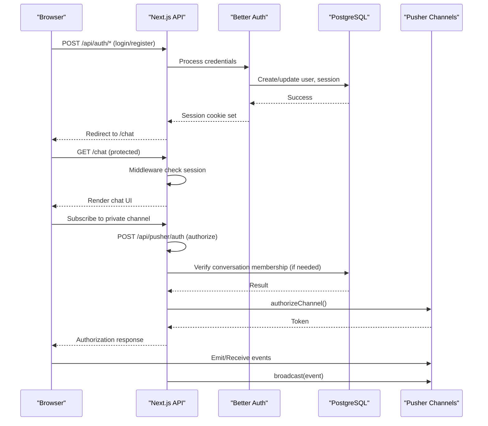
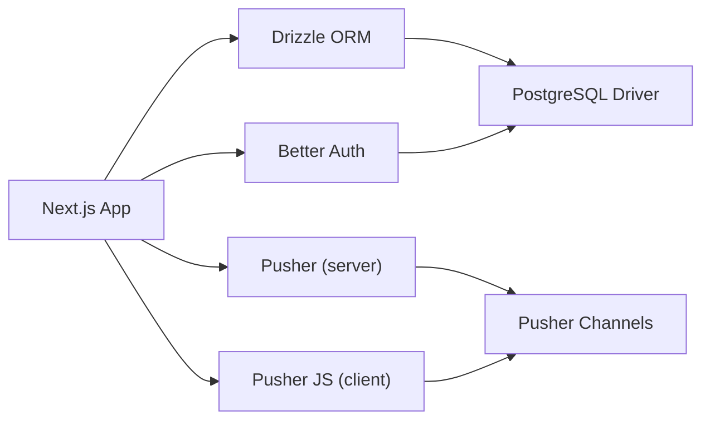

# Getting Started

<cite>
**Referenced Files in This Document**
- [package.json](file://package.json)
- [drizzle.config.ts](file://drizzle.config.ts)
- [next.config.mjs](file://next.config.mjs)
- [lib/db/index.ts](file://lib/db/index.ts)
- [lib/db/schema.ts](file://lib/db/schema.ts)
- [lib/auth.ts](file://lib/auth.ts)
- [middleware.ts](file://middleware.ts)
- [app/api/pusher/auth/route.ts](file://app/api/pusher/auth/route.ts)
- [lib/realtime/index.ts](file://lib/realtime/index.ts)
- [lib/realtime/client.ts](file://lib/realtime/client.ts)
</cite>

## Table of Contents
1. Introduction
2. Project Structure
3. Core Components
4. Architecture Overview
5. Detailed Component Analysis
6. Dependency Analysis
7. Performance Considerations
8. Troubleshooting Guide
9. Conclusion
10. Appendices

## Introduction
SecureChat is a real-time messaging application built with Next.js, PostgreSQL, Drizzle ORM for database schema and migrations, Better Auth for authentication, and Pusher Channels for real-time features. This guide walks you through setting up your environment, configuring the database and Pusher account, running migrations, and starting the development server so you can run SecureChat locally.

## Project Structure
At a high level:
- Frontend pages and components live under app/ and components/.
- Server-side logic includes API routes under app/api/.
- Database configuration and schema are under lib/db/.
- Real-time transport (Pusher) is configured under lib/realtime/.
- Authentication setup is under lib/auth.ts and protected by middleware.

**Diagram sources**
- [next.config.mjs:1-12](file://next.config.mjs#L1-L12)
- [lib/db/index.ts:1-10](file://lib/db/index.ts#L1-L10)
- [lib/realtime/index.ts:1-78](file://lib/realtime/index.ts#L1-L78)
- [lib/auth.ts:1-65](file://lib/auth.ts#L1-L65)
- [middleware.ts:1-42](file://middleware.ts#L1-L42)

**Section sources**
- [next.config.mjs:1-12](file://next.config.mjs#L1-L12)
- [package.json:1-53](file://package.json#L1-L53)

## Core Components
- Database: PostgreSQL via Drizzle ORM; schema defined in lib/db/schema.ts; connection pool shared between app queries and auth.
- Authentication: Better Auth with email/password; session cookies managed via middleware; additional username field on user table.
- Real-time: Pusher Channels for private channels; server authorizes subscriptions via /api/pusher/auth; client connects using public keys.
- Routing and protection: Next.js middleware redirects unauthenticated users to login and authenticated users away from auth routes.

Key responsibilities:
- lib/db/index.ts creates a shared pg Pool and Drizzle instance.
- lib/db/schema.ts defines tables for users, sessions, accounts, verifications, conversations, participants, and messages.
- lib/auth.ts configures Better Auth with DB pool, base URL, email/password, trusted origins, and session settings.
- lib/realtime/index.ts provides broadcast and channel authorization helpers; checks if Pusher is configured.
- lib/realtime/client.ts initializes the browser-side Pusher client with public keys and an authorization endpoint.
- app/api/pusher/auth/route.ts validates requests and authorizes private channels based on user identity and conversation membership.
- middleware.ts enforces route-level access control.

**Section sources**
- [lib/db/index.ts:1-10](file://lib/db/index.ts#L1-L10)
- [lib/db/schema.ts:1-101](file://lib/db/schema.ts#L1-L101)
- [lib/auth.ts:1-65](file://lib/auth.ts#L1-L65)
- [lib/realtime/index.ts:1-78](file://lib/realtime/index.ts#L1-L78)
- [lib/realtime/client.ts:1-29](file://lib/realtime/client.ts#L1-L29)
- [app/api/pusher/auth/route.ts:1-63](file://app/api/pusher/auth/route.ts#L1-L63)
- [middleware.ts:1-42](file://middleware.ts#L1-L42)

## Architecture Overview
The runtime architecture combines Next.js serverless functions with a persistent PostgreSQL database and Pusher Channels for real-time events.

**Diagram sources**
- [lib/auth.ts:1-65](file://lib/auth.ts#L1-L65)
- [middleware.ts:1-42](file://middleware.ts#L1-L42)
- [app/api/pusher/auth/route.ts:1-63](file://app/api/pusher/auth/route.ts#L1-L63)
- [lib/realtime/index.ts:1-78](file://lib/realtime/index.ts#L1-L78)

## Detailed Component Analysis

### Environment Setup and Prerequisites
- Node.js: Use a recent LTS version compatible with Next.js 16.x.
- Package manager: pnpm or npm (scripts use pnpm conventions).
- PostgreSQL: Install and start a local PostgreSQL server or use a managed service like Neon. Ensure you have a database created and accessible.
- Pusher account: Create a Pusher Channels account and obtain:
  - Server-side: APP_ID, KEY, SECRET, CLUSTER
  - Client-side: NEXT_PUBLIC_PUSHER_KEY, NEXT_PUBLIC_PUSHER_CLUSTER

Environment variables required:
- DATABASE_URL: Connection string for the PostgreSQL database used at runtime.
- DATABASE_URL_UNPOOLED: Unpooled connection string used by Drizzle migrations (required for DDL operations).
- PUSHER_APP_ID, PUSHER_KEY, PUSHER_SECRET, PUSHER_CLUSTER: Server-side Pusher credentials.
- NEXT_PUBLIC_PUSHER_KEY, NEXT_PUBLIC_PUSHER_CLUSTER: Client-side Pusher credentials.
- BETTER_AUTH_URL: Base URL for Better Auth (auto-detected on Vercel; otherwise set explicitly).
- Optional V0_* URLs for development environments.

Create a .env.local file in the project root with these variables before running migrations or the dev server.

**Section sources**
- [drizzle.config.ts:1-19](file://drizzle.config.ts#L1-L19)
- [lib/db/index.ts:1-10](file://lib/db/index.ts#L1-L10)
- [lib/realtime/index.ts:22-44](file://lib/realtime/index.ts#L22-L44)
- [lib/realtime/client.ts:7-28](file://lib/realtime/client.ts#L7-L28)
- [lib/auth.ts:5-13](file://lib/auth.ts#L5-L13)

### Database Configuration with PostgreSQL and Drizzle ORM
- Schema definition: All tables are defined in lib/db/schema.ts, including user, session, account, verification, conversation, conversation_participant, and message.
- Runtime connection: lib/db/index.ts creates a shared pg Pool using DATABASE_URL and exposes a Drizzle instance.
- Migrations: drizzle.config.ts points to the schema file and uses DATABASE_URL_UNPOOLED (or DATABASE_URL fallback) for direct DDL operations.

Steps:
1. Ensure PostgreSQL is running and accessible.
2. Set DATABASE_URL and DATABASE_URL_UNPOOLED in .env.local.
3. Run migrations to create tables:
   - Using pnpm: pnpm db:generate then pnpm db:push
   - Or directly: pnpm db:push
4. Optionally open Drizzle Studio to inspect the database: pnpm db:studio

Notes:
- The unpooled URL is required because pooled connections (e.g., PgBouncer) block DDL statements during migrations.

**Section sources**
- [lib/db/schema.ts:1-101](file://lib/db/schema.ts#L1-L101)
- [lib/db/index.ts:1-10](file://lib/db/index.ts#L1-L10)
- [drizzle.config.ts:1-19](file://drizzle.config.ts#L1-L19)
- [package.json:5-12](file://package.json#L5-L12)

### Pusher Account Setup for Real-Time Features
- Create a Pusher Channels application and note:
  - Server-side: APP_ID, KEY, SECRET, CLUSTER
  - Client-side: NEXT_PUBLIC_PUSHER_KEY, NEXT_PUBLIC_PUSHER_CLUSTER
- Add these values to .env.local.
- The server checks for presence of all four server-side variables to enable realtime features; the client checks for the two public variables.

Behavior:
- If Pusher is not configured, broadcast becomes a no-op and clients fall back to polling where applicable.
- Private channel authorization goes through /api/pusher/auth, which verifies user identity and conversation membership before signing the subscription.

**Section sources**
- [lib/realtime/index.ts:22-44](file://lib/realtime/index.ts#L22-L44)
- [lib/realtime/client.ts:7-28](file://lib/realtime/client.ts#L7-L28)
- [app/api/pusher/auth/route.ts:11-63](file://app/api/pusher/auth/route.ts#L11-L63)

### Initial Project Configuration
- Next.js configuration: next.config.mjs disables image optimization and ignores TypeScript build errors for faster iteration.
- Scripts: package.json provides scripts for development, building, starting, and database tasks.
- Middleware: middleware.ts protects /chat and redirects appropriately based on session state.

Recommended steps:
1. Install dependencies:
   - pnpm install
2. Start the development server:
   - pnpm dev
3. Access the app in your browser at http://localhost:3000.

**Section sources**
- [next.config.mjs:1-12](file://next.config.mjs#L1-L12)
- [package.json:5-12](file://package.json#L5-L12)
- [middleware.ts:1-42](file://middleware.ts#L1-L42)

### Running Locally Step-by-Step
1. Install prerequisites:
   - Node.js (LTS recommended)
   - PostgreSQL (local or managed)
   - Pusher Channels account
2. Clone the repository and navigate to the project root.
3. Install dependencies:
   - pnpm install
4. Configure environment variables in .env.local:
   - DATABASE_URL, DATABASE_URL_UNPOOLED
   - PUSHER_APP_ID, PUSHER_KEY, PUSHER_SECRET, PUSHER_CLUSTER
   - NEXT_PUBLIC_PUSHER_KEY, NEXT_PUBLIC_PUSHER_CLUSTER
   - BETTER_AUTH_URL (optional; auto-detected on Vercel)
5. Run database migrations:
   - pnpm db:generate
   - pnpm db:push
6. Start the development server:
   - pnpm dev
7. Open http://localhost:3000 and register or log in. Protected routes will redirect to login if needed.

Verification:
- Visit /chat after logging in to ensure middleware allows access.
- Send a message and confirm it appears in real time (if Pusher is configured).
- Check that Pusher authorization succeeds by subscribing to a private channel in the browser console when enabled.

**Section sources**
- [package.json:5-12](file://package.json#L5-L12)
- [middleware.ts:1-42](file://middleware.ts#L1-L42)
- [lib/realtime/index.ts:22-44](file://lib/realtime/index.ts#L22-L44)
- [lib/realtime/client.ts:7-28](file://lib/realtime/client.ts#L7-L28)

## Dependency Analysis
Core runtime dependencies include Next.js, React, Drizzle ORM, PostgreSQL driver, Pusher libraries, and Better Auth. Development dependencies cover TypeScript, PostCSS, Tailwind, and Drizzle Kit.

**Diagram sources**
- [package.json:13-46](file://package.json#L13-L46)
- [lib/db/index.ts:1-10](file://lib/db/index.ts#L1-L10)
- [lib/realtime/index.ts:12-44](file://lib/realtime/index.ts#L12-L44)
- [lib/realtime/client.ts:1-29](file://lib/realtime/client.ts#L1-L29)

**Section sources**
- [package.json:13-46](file://package.json#L13-L46)

## Performance Considerations
- Shared database pool: lib/db/index.ts uses a single pg Pool for both app queries and Better Auth, reducing connection overhead.
- Image optimization disabled: next.config.mjs sets images.unoptimized to true, which can improve compatibility but may impact performance; consider enabling optimization for production deployments.
- Realtime fallback: When Pusher is not configured, broadcast is a no-op; ensure your client handles fallbacks gracefully.

[No sources needed since this section provides general guidance]

## Troubleshooting Guide
Common issues and resolutions:
- Migrations fail due to pooled connection:
  - Ensure DATABASE_URL_UNPOOLED is set and points to a direct PostgreSQL connection. Drizzle uses this for DDL operations.
  - Reference: [drizzle.config.ts:13-17](file://drizzle.config.ts#L13-L17)
- Realtime not working:
  - Verify all server-side Pusher variables are set (PUSHER_APP_ID, PUSHER_KEY, PUSHER_SECRET, PUSHER_CLUSTER).
  - Verify client-side variables (NEXT_PUBLIC_PUSHER_KEY, NEXT_PUBLIC_PUSHER_CLUSTER).
  - Check /api/pusher/auth returns a valid token; ensure user is authenticated and authorized for the channel.
  - References: [lib/realtime/index.ts:22-44](file://lib/realtime/index.ts#L22-L44), [app/api/pusher/auth/route.ts:11-63](file://app/api/pusher/auth/route.ts#L11-L63), [lib/realtime/client.ts:7-28](file://lib/realtime/client.ts#L7-L28)
- Cannot access /chat:
  - Middleware redirects unauthenticated users to /login. Ensure you have a valid session cookie after login.
  - Reference: [middleware.ts:4-26](file://middleware.ts#L4-L26)
- Better Auth base URL issues:
  - Set BETTER_AUTH_URL explicitly if auto-detection fails; ensure trustedOrigins include your development domain.
  - Reference: [lib/auth.ts:5-13](file://lib/auth.ts#L5-L13)

**Section sources**
- [drizzle.config.ts:13-17](file://drizzle.config.ts#L13-L17)
- [lib/realtime/index.ts:22-44](file://lib/realtime/index.ts#L22-L44)
- [app/api/pusher/auth/route.ts:11-63](file://app/api/pusher/auth/route.ts#L11-L63)
- [lib/realtime/client.ts:7-28](file://lib/realtime/client.ts#L7-L28)
- [middleware.ts:4-26](file://middleware.ts#L4-L26)
- [lib/auth.ts:5-13](file://lib/auth.ts#L5-L13)

## Conclusion
You now have everything needed to run SecureChat locally: install dependencies, configure PostgreSQL and Pusher, run migrations, and start the development server. Follow the step-by-step instructions and use the troubleshooting tips to resolve common setup issues. Once running, verify authentication, protected routes, and real-time messaging to ensure a complete local environment.

[No sources needed since this section summarizes without analyzing specific files]

## Appendices

### Environment Variables Reference
- DATABASE_URL: Runtime database connection string.
- DATABASE_URL_UNPOOLED: Unpooled connection string for migrations.
- PUSHER_APP_ID, PUSHER_KEY, PUSHER_SECRET, PUSHER_CLUSTER: Server-side Pusher credentials.
- NEXT_PUBLIC_PUSHER_KEY, NEXT_PUBLIC_PUSHER_CLUSTER: Client-side Pusher credentials.
- BETTER_AUTH_URL: Base URL for Better Auth (optional; auto-detected on Vercel).

**Section sources**
- [drizzle.config.ts:13-17](file://drizzle.config.ts#L13-L17)
- [lib/realtime/index.ts:22-44](file://lib/realtime/index.ts#L22-L44)
- [lib/realtime/client.ts:7-28](file://lib/realtime/client.ts#L7-L28)
- [lib/auth.ts:5-13](file://lib/auth.ts#L5-L13)

### Database Schema Overview
Tables include user, session, account, verification, conversation, conversation_participant, and message. These support authentication, presence, conversations, and messaging.

**Section sources**
- [lib/db/schema.ts:1-101](file://lib/db/schema.ts#L1-L101)