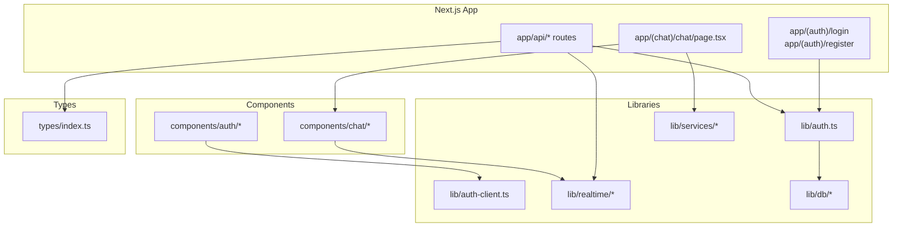
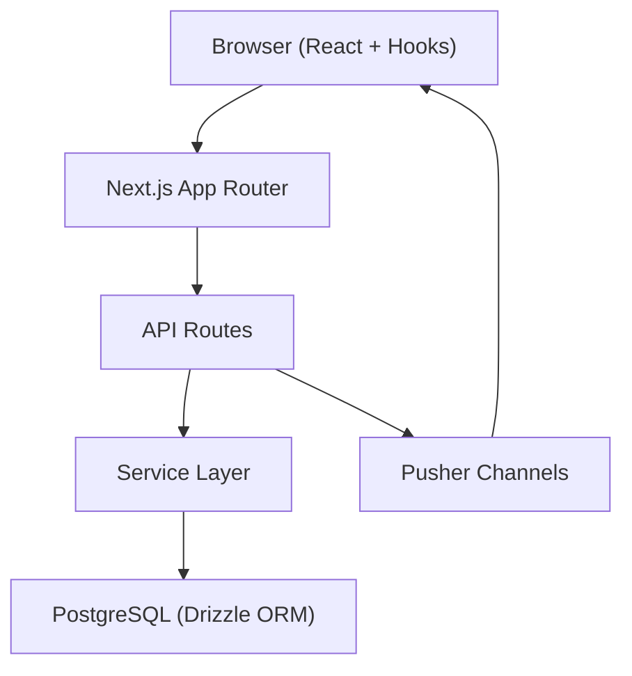
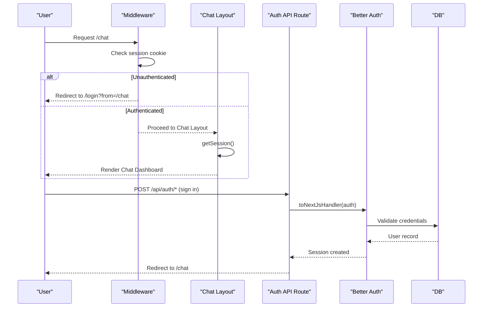
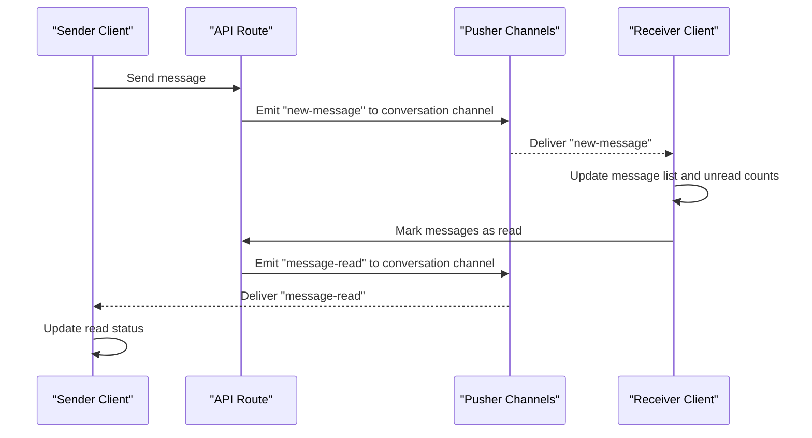
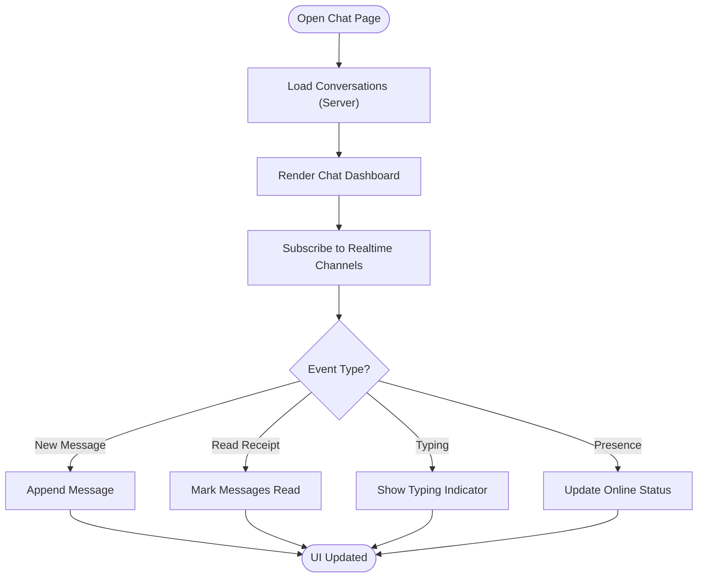
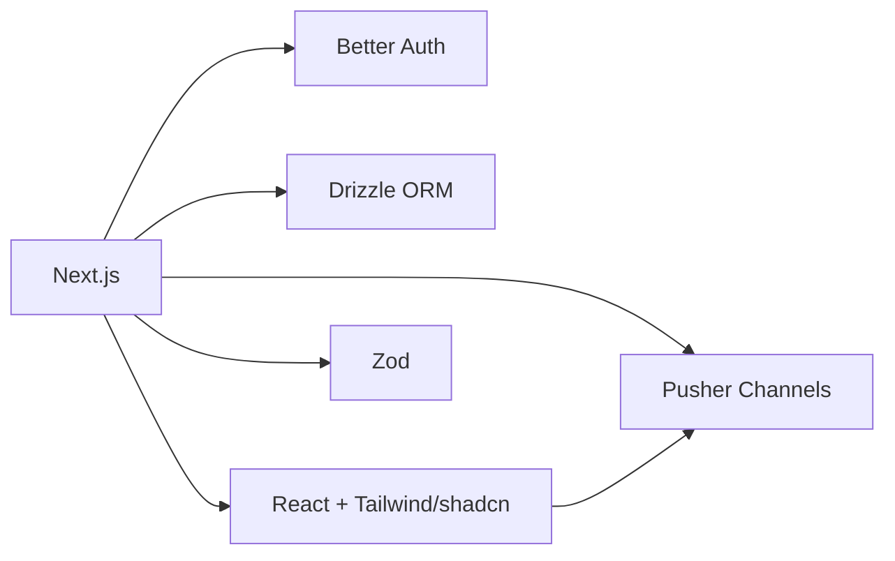

# Project Overview

<cite>
**Referenced Files in This Document**
- [package.json](file://package.json)
- [app/layout.tsx](file://app/layout.tsx)
- [middleware.ts](file://middleware.ts)
- [lib/auth.ts](file://lib/auth.ts)
- [lib/auth-client.ts](file://lib/auth-client.ts)
- [drizzle.config.ts](file://drizzle.config.ts)
- [app/(chat)/layout.tsx](file://app/(chat)/layout.tsx)
- [app/(chat)/chat/page.tsx](file://app/(chat)/chat/page.tsx)
- [app/api/auth/[...all]/route.ts](file://app/api/auth/[...all]/route.ts)
- [hooks/useRealtime.ts](file://hooks/useRealtime.ts)
- [types/index.ts](file://types/index.ts)
</cite>

## Table of Contents
1. Introduction
2. Project Structure
3. Core Components
4. Architecture Overview
5. Detailed Component Analysis
6. Dependency Analysis
7. Performance Considerations
8. Troubleshooting Guide
9. Conclusion

## Introduction
SecureChat is a secure, real-time, one-to-one messaging application built with Next.js 16. It provides private conversations with live updates, user presence indicators, and robust authentication. The app follows a full-stack architecture:
- Frontend: React components using the Next.js App Router for routing and server-side rendering where appropriate.
- Authentication: Better Auth for session-based auth with email/password and additional user fields.
- Database layer: Drizzle ORM configured for PostgreSQL, with schema-driven migrations.
- Real-time communication: Pusher Channels for live events such as new messages, read receipts, typing indicators, and presence updates.

The system emphasizes security (session protection, route guards), performance (server-side data loading, efficient client subscriptions), and a clean user experience focused on private, responsive chats.

**Section sources**
- [package.json:13-33](file://package.json#L13-L33)
- [app/layout.tsx:9-13](file://app/layout.tsx#L9-L13)

## Project Structure
SecureChat organizes code by feature and layer:
- app/: Next.js App Router pages and API routes
  - (auth)/: Login and register flows protected by middleware and layout guards
  - (chat)/: Chat dashboard and conversation UI
  - api/: REST endpoints for auth, conversations, messages, presence, and Pusher auth
- components/: Feature-specific React components (auth forms, chat UI, shared UI primitives)
- hooks/: Client-side hooks including real-time subscription management
- lib/: Shared libraries for auth configuration, utilities, DB config, realtime clients, services, validations
- types/: Centralized TypeScript types used across the stack

**Diagram sources**
- [app/(chat)/chat/page.tsx:6-24](file://app/(chat)/chat/page.tsx#L6-L24)
- [app/api/auth/[...all]/route.ts:1-5](file://app/api/auth/[...all]/route.ts#L1-L5)
- [lib/auth.ts:5-64](file://lib/auth.ts#L5-L64)
- [lib/auth-client.ts:1-8](file://lib/auth-client.ts#L1-L8)
- [hooks/useRealtime.ts:26-119](file://hooks/useRealtime.ts#L26-L119)
- [types/index.ts:9-117](file://types/index.ts#L9-L117)

**Section sources**
- [package.json:1-53](file://package.json#L1-L53)
- [app/layout.tsx:1-37](file://app/layout.tsx#L1-L37)

## Core Components
- Authentication and Session Management
  - Server-side auth configured via Better Auth with database integration and environment-aware base URL and trusted origins.
  - Client-side auth client exposes signIn, signUp, signOut, and useSession for React components.
  - Middleware enforces route-level access control, redirecting unauthenticated users to login and authenticated users away from auth pages.
  - Chat layout performs an additional server-side session check before rendering chat content.

- Data Layer
  - Drizzle ORM configured for PostgreSQL with explicit handling for pooled vs unpooled connections during migrations.
  - Centralized types define User, Message, Conversation, and realtime event payloads, ensuring consistency between API, services, and UI.

- Real-Time Communication
  - Client hook subscribes to user-private channels and conversation channels for live updates: new messages, read receipts, typing indicators, and presence changes.
  - Events are typed and routed to component handlers, enabling reactive UI updates without page reloads.

- UI and Routing
  - Chat dashboard loads initial conversations server-side and renders a list and active conversation area.
  - Components are organized by feature (auth, chat, ui) to promote reusability and maintainability.

**Section sources**
- [lib/auth.ts:5-64](file://lib/auth.ts#L5-L64)
- [lib/auth-client.ts:1-8](file://lib/auth-client.ts#L1-L8)
- [middleware.ts:1-42](file://middleware.ts#L1-L42)
- [app/(chat)/layout.tsx:9-21](file://app/(chat)/layout.tsx#L9-L21)
- [drizzle.config.ts:1-19](file://drizzle.config.ts#L1-L19)
- [types/index.ts:9-117](file://types/index.ts#L9-L117)
- [hooks/useRealtime.ts:26-119](file://hooks/useRealtime.ts#L26-L119)
- [app/(chat)/chat/page.tsx:6-24](file://app/(chat)/chat/page.tsx#L6-L24)

## Architecture Overview
SecureChat uses a layered architecture that separates concerns:
- Presentation Layer: React components render the chat interface and handle user interactions.
- Application Layer: Service functions encapsulate business logic (e.g., fetching conversations).
- Integration Layer: API routes expose endpoints for client requests and orchestrate services and real-time events.
- Persistence Layer: Drizzle ORM interacts with PostgreSQL for durable storage.
- Real-Time Layer: Pusher Channels deliver live updates to subscribed clients.

**Diagram sources**
- [app/(chat)/chat/page.tsx:6-24](file://app/(chat)/chat/page.tsx#L6-L24)
- [app/api/auth/[...all]/route.ts:1-5](file://app/api/auth/[...all]/route.ts#L1-L5)
- [hooks/useRealtime.ts:26-119](file://hooks/useRealtime.ts#L26-L119)
- [drizzle.config.ts:9-18](file://drizzle.config.ts#L9-L18)

## Detailed Component Analysis

### Authentication Flow
- Middleware checks for a Better Auth session cookie and redirects based on route protection rules.
- Chat layout performs a server-side session check to ensure only authenticated users can access chat features.
- Auth API routes delegate to Better Auth’s Next.js handler for sign-in/sign-up/sign-out.
- Client hooks provide methods to interact with auth endpoints and manage sessions in React components.

**Diagram sources**
- [middleware.ts:7-27](file://middleware.ts#L7-L27)
- [app/(chat)/layout.tsx:9-21](file://app/(chat)/layout.tsx#L9-L21)
- [app/api/auth/[...all]/route.ts:1-5](file://app/api/auth/[...all]/route.ts#L1-L5)
- [lib/auth.ts:5-64](file://lib/auth.ts#L5-L64)

**Section sources**
- [middleware.ts:1-42](file://middleware.ts#L1-L42)
- [app/(chat)/layout.tsx:1-22](file://app/(chat)/layout.tsx#L1-L22)
- [app/api/auth/[...all]/route.ts:1-5](file://app/api/auth/[...all]/route.ts#L1-L5)
- [lib/auth.ts:1-65](file://lib/auth.ts#L1-L65)

### Real-Time Messaging and Presence
- Client hooks subscribe to:
  - User channel: receives new messages and presence updates for the current user.
  - Conversation channel: receives new messages, read receipts, typing indicators, and stop-typing events.
- Event payloads are strongly typed to ensure consistent handling across components.
- Components update UI reactively when events arrive, providing instant feedback and live presence indicators.

**Diagram sources**
- [hooks/useRealtime.ts:26-119](file://hooks/useRealtime.ts#L26-L119)
- [types/index.ts:91-117](file://types/index.ts#L91-L117)

**Section sources**
- [hooks/useRealtime.ts:1-120](file://hooks/useRealtime.ts#L1-L120)
- [types/index.ts:1-118](file://types/index.ts#L1-L118)

### Conversation Management
- Server-side page fetches the current user’s conversations and passes them to the dashboard component.
- The dashboard renders a conversation list and an active chat area, leveraging real-time hooks for live updates.
- Types define Conversation shape including lastMessage and unreadCount to support UI features like previews and badges.

**Diagram sources**
- [app/(chat)/chat/page.tsx:6-24](file://app/(chat)/chat/page.tsx#L6-L24)
- [hooks/useRealtime.ts:26-119](file://hooks/useRealtime.ts#L26-L119)
- [types/index.ts:43-53](file://types/index.ts#L43-L53)

**Section sources**
- [app/(chat)/chat/page.tsx:1-27](file://app/(chat)/chat/page.tsx#L1-L27)
- [types/index.ts:43-53](file://types/index.ts#L43-L53)

## Dependency Analysis
Key dependencies and their roles:
- Next.js 16: Framework for routing, SSR, and API routes.
- Better Auth: Authentication and session management with Next.js integration.
- Drizzle ORM: Type-safe database queries and migrations for PostgreSQL.
- Pusher/Pusher JS: Real-time event streaming for live messaging and presence.
- React 19: UI library powering components and hooks.
- Zod: Validation for inputs and payloads.
- Tailwind CSS and shadcn/ui: Styling and accessible UI primitives.

**Diagram sources**
- [package.json:13-33](file://package.json#L13-L33)

**Section sources**
- [package.json:13-33](file://package.json#L13-L33)

## Performance Considerations
- Server-side data loading: Initial conversations are fetched on the server to reduce client workload and improve perceived performance.
- Efficient subscriptions: Realtime hooks subscribe only when necessary and unsubscribe on cleanup to minimize overhead.
- Session checks: Middleware and layout guards avoid unnecessary DB calls by checking cookies first; layout adds a belt-and-suspenders server-side check.
- Database configuration: Drizzle uses an unpooled connection for migrations to avoid DDL restrictions while allowing pooled connections at runtime.

[No sources needed since this section provides general guidance]

## Troubleshooting Guide
- Authentication issues
  - Ensure BASE_URL and TRUSTED_ORIGINS are correctly set for your environment so Better Auth can issue valid cookies and accept requests.
  - Verify middleware matcher excludes static assets and auth routes to prevent unintended redirects.
- Realtime connectivity
  - Confirm Pusher client initialization and channel names match server emissions.
  - Check that user and conversation channels are subscribed/unsubscribed properly to avoid memory leaks or stale listeners.
- Database migrations
  - Use the unpooled DATABASE_URL_UNPOOLED for schema migrations to avoid pgbouncer limitations.

**Section sources**
- [lib/auth.ts:5-64](file://lib/auth.ts#L5-L64)
- [middleware.ts:29-42](file://middleware.ts#L29-L42)
- [drizzle.config.ts:9-18](file://drizzle.config.ts#L9-L18)

## Conclusion
SecureChat delivers a secure, real-time messaging experience through a well-structured full-stack architecture. By combining Next.js App Router, Better Auth, Drizzle ORM, and Pusher Channels, it provides robust authentication, reliable persistence, and live updates for one-to-one conversations. The service layer and component-based UI design enable clear separation of concerns, maintainability, and scalability. With thoughtful performance optimizations and strong type safety, SecureChat offers a solid foundation for private, responsive messaging.

[No sources needed since this section summarizes without analyzing specific files]