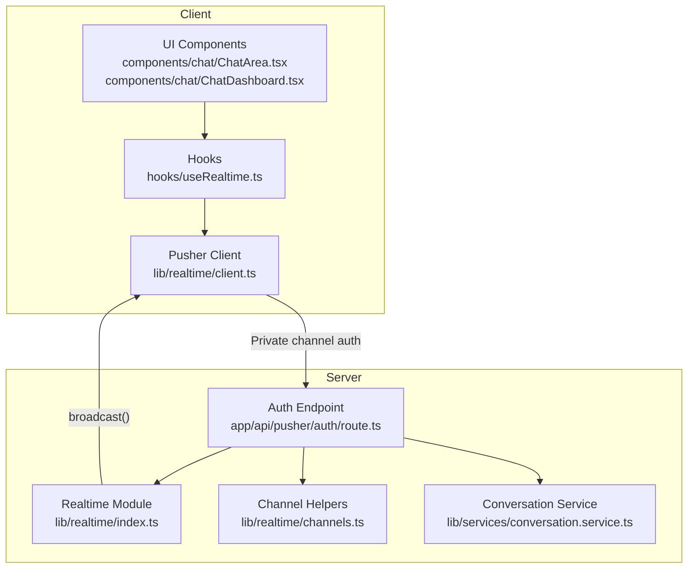
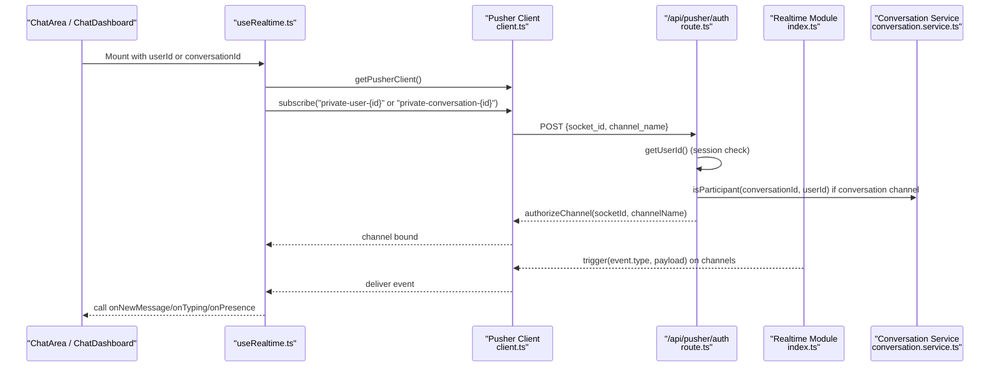
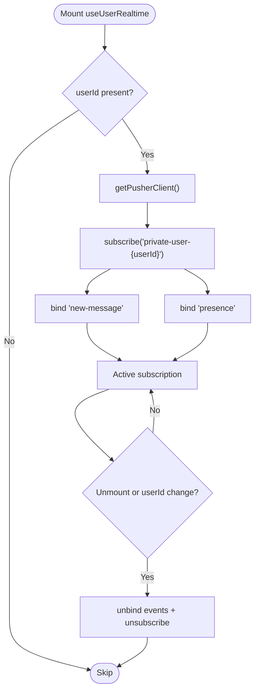
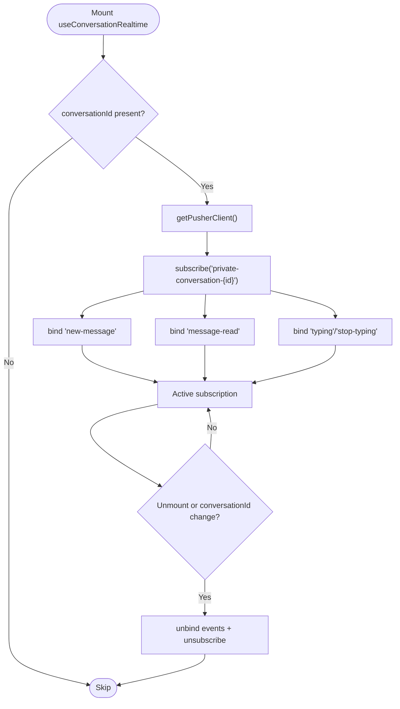
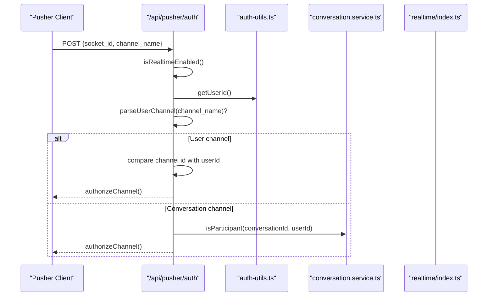
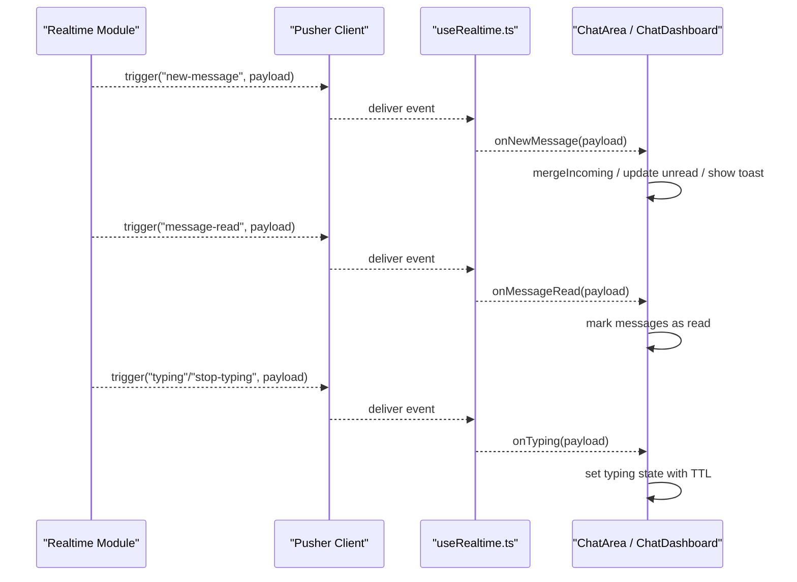
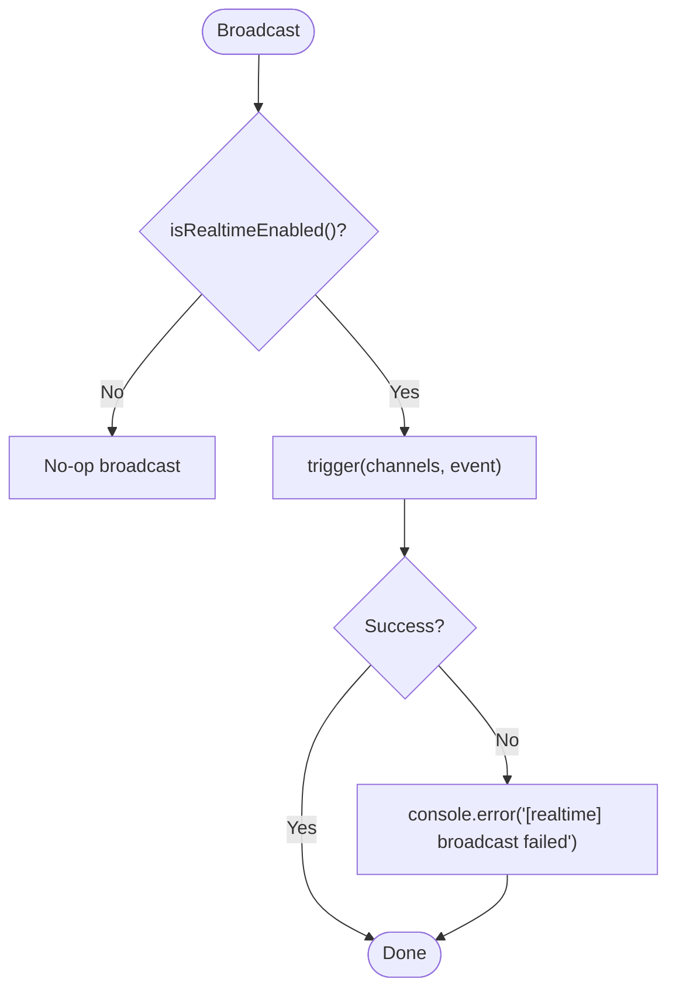
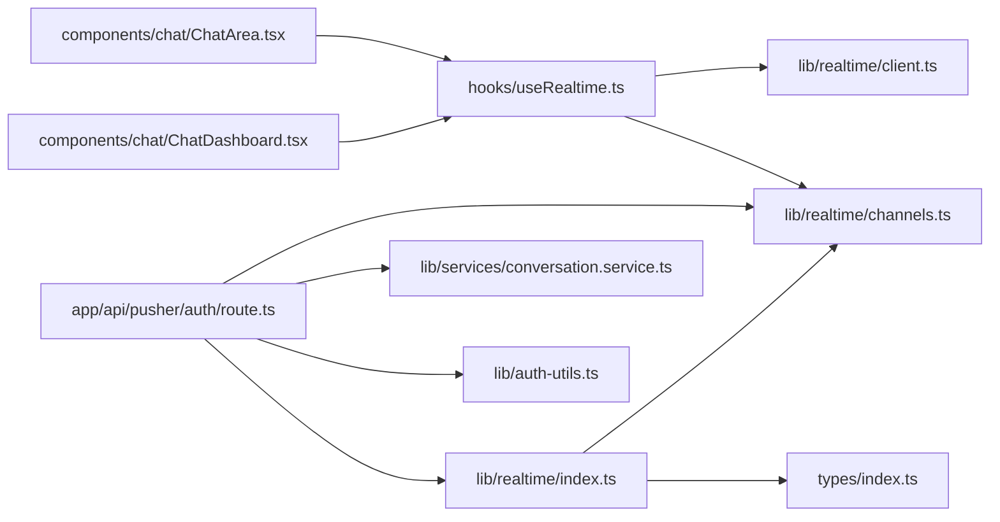

# Channel Subscription and Management

<cite>
**Referenced Files in This Document**
- [useRealtime.ts](file://hooks/useRealtime.ts)
- [client.ts](file://lib/realtime/client.ts)
- [channels.ts](file://lib/realtime/channels.ts)
- [index.ts](file://lib/realtime/index.ts)
- [route.ts](file://app/api/pusher/auth/route.ts)
- [types/index.ts](file://types/index.ts)
- [ChatArea.tsx](file://components/chat/ChatArea.tsx)
- [ChatDashboard.tsx](file://components/chat/ChatDashboard.tsx)
- [conversation.service.ts](file://lib/services/conversation.service.ts)
- [auth-utils.ts](file://lib/auth-utils.ts)
</cite>

## Table of Contents
1. Introduction
2. Project Structure
3. Core Components
4. Architecture Overview
5. Detailed Component Analysis
6. Dependency Analysis
7. Performance Considerations
8. Troubleshooting Guide
9. Conclusion

## Introduction
This document explains how the real-time messaging system manages channels for conversations and users, including channel naming conventions, subscription lifecycle, event handling, authorization, security, cleanup, and scaling considerations. It covers private channel creation patterns, error handling, and best practices for organizing channels efficiently.

## Project Structure
The real-time layer is implemented with Pusher Channels:
- Client-side Pusher client initialization and configuration
- Shared channel name helpers for conversation and user channels
- Server-side authorization endpoint for private channels
- React hooks that subscribe to channels and bind/unbind events safely
- UI components that consume channel events to update messages, presence, and typing indicators

**Diagram sources**
- [client.ts:1-30](file://lib/realtime/client.ts#L1-L30)
- [useRealtime.ts:1-120](file://hooks/useRealtime.ts#L1-L120)
- [route.ts:1-63](file://app/api/pusher/auth/route.ts#L1-L63)
- [index.ts:1-79](file://lib/realtime/index.ts#L1-L79)
- [channels.ts:1-27](file://lib/realtime/channels.ts#L1-L27)
- [conversation.service.ts:1-236](file://lib/services/conversation.service.ts#L1-L236)
- [ChatArea.tsx:1-292](file://components/chat/ChatArea.tsx#L1-L292)
- [ChatDashboard.tsx:1-364](file://components/chat/ChatDashboard.tsx#L1-L364)

**Section sources**
- [client.ts:1-30](file://lib/realtime/client.ts#L1-L30)
- [useRealtime.ts:1-120](file://hooks/useRealtime.ts#L1-L120)
- [route.ts:1-63](file://app/api/pusher/auth/route.ts#L1-L63)
- [index.ts:1-79](file://lib/realtime/index.ts#L1-L79)
- [channels.ts:1-27](file://lib/realtime/channels.ts#L1-L27)
- [conversation.service.ts:1-236](file://lib/services/conversation.service.ts#L1-L236)
- [ChatArea.tsx:1-292](file://components/chat/ChatArea.tsx#L1-L292)
- [ChatDashboard.tsx:1-364](file://components/chat/ChatDashboard.tsx#L1-L364)

## Core Components
- Channel naming:
  - Conversation channel: private-conversation-{conversationId}
  - User channel: private-user-{userId}
- Client Pusher singleton configured with a private channel authorization endpoint
- Authorization route validates user identity and permissions before signing channel access
- React hooks manage subscriptions per userId or conversationId and handle event binding and cleanup
- UI components consume events to update message lists, presence, and typing indicators

Key responsibilities:
- lib/realtime/channels.ts: deterministic channel names and parsers
- lib/realtime/client.ts: browser Pusher instance and feature toggle
- app/api/pusher/auth/route.ts: enforce who can subscribe to which private channel
- hooks/useRealtime.ts: subscribe/unsubscribe lifecycle and event handlers
- components/chat/*: integrate events into UI state

**Section sources**
- [channels.ts:1-27](file://lib/realtime/channels.ts#L1-L27)
- [client.ts:1-30](file://lib/realtime/client.ts#L1-L30)
- [route.ts:1-63](file://app/api/pusher/auth/route.ts#L1-L63)
- [useRealtime.ts:1-120](file://hooks/useRealtime.ts#L1-L120)
- [ChatArea.tsx:1-292](file://components/chat/ChatArea.tsx#L1-L292)
- [ChatDashboard.tsx:1-364](file://components/chat/ChatDashboard.tsx#L1-L364)

## Architecture Overview
End-to-end flow for subscribing to private channels and receiving events:

**Diagram sources**
- [useRealtime.ts:1-120](file://hooks/useRealtime.ts#L1-L120)
- [client.ts:1-30](file://lib/realtime/client.ts#L1-L30)
- [route.ts:1-63](file://app/api/pusher/auth/route.ts#L1-L63)
- [index.ts:1-79](file://lib/realtime/index.ts#L1-L79)
- [conversation.service.ts:1-236](file://lib/services/conversation.service.ts#L1-L236)

## Detailed Component Analysis

### Channel Naming Conventions
- Conversation channel: private-conversation-{conversationId}
- User channel: private-user-{userId}
- Parsers validate and extract identifiers from channel names

These helpers are used by both client and server to ensure consistent naming and safe parsing.

**Section sources**
- [channels.ts:1-27](file://lib/realtime/channels.ts#L1-L27)

### User Channel Subscription Lifecycle
- Subscribes to private-user-{userId} when a userId is available
- Binds to new-message and presence events
- Unbinds and unsubscribes on cleanup to prevent memory leaks

**Diagram sources**
- [useRealtime.ts:15-61](file://hooks/useRealtime.ts#L15-L61)
- [client.ts:1-30](file://lib/realtime/client.ts#L1-L30)

**Section sources**
- [useRealtime.ts:15-61](file://hooks/useRealtime.ts#L15-L61)
- [client.ts:1-30](file://lib/realtime/client.ts#L1-L30)

### Conversation Channel Subscription Lifecycle
- Subscribes to private-conversation-{conversationId} when a conversationId is active
- Binds to new-message, message-read, typing, stop-typing events
- Unbinds and unsubscribes on cleanup

**Diagram sources**
- [useRealtime.ts:63-119](file://hooks/useRealtime.ts#L63-L119)
- [client.ts:1-30](file://lib/realtime/client.ts#L1-L30)

**Section sources**
- [useRealtime.ts:63-119](file://hooks/useRealtime.ts#L63-L119)
- [client.ts:1-30](file://lib/realtime/client.ts#L1-L30)

### Private Channel Authorization Flow
- The authorization endpoint enforces:
  - Realtime enabled check
  - Valid session via getUserId()
  - For user channels: channel id must match current user id
  - For conversation channels: verify participant membership
- On success, returns Pusher signature; otherwise returns appropriate error codes

**Diagram sources**
- [route.ts:1-63](file://app/api/pusher/auth/route.ts#L1-L63)
- [auth-utils.ts:1-21](file://lib/auth-utils.ts#L1-L21)
- [conversation.service.ts:153-170](file://lib/services/conversation.service.ts#L153-L170)
- [index.ts:47-57](file://lib/realtime/index.ts#L47-L57)

**Section sources**
- [route.ts:1-63](file://app/api/pusher/auth/route.ts#L1-L63)
- [auth-utils.ts:1-21](file://lib/auth-utils.ts#L1-L21)
- [conversation.service.ts:153-170](file://lib/services/conversation.service.ts#L153-L170)
- [index.ts:47-57](file://lib/realtime/index.ts#L47-L57)

### Channel-Specific Event Handling
- New message: updates local message list and conversation metadata
- Message read: marks messages as read locally
- Typing/stop-typing: shows/hides typing indicator with auto-clear
- Presence: updates online status and last seen in sidebar

**Diagram sources**
- [index.ts:59-79](file://lib/realtime/index.ts#L59-L79)
- [useRealtime.ts:15-119](file://hooks/useRealtime.ts#L15-L119)
- [ChatArea.tsx:134-176](file://components/chat/ChatArea.tsx#L134-L176)
- [ChatDashboard.tsx:147-196](file://components/chat/ChatDashboard.tsx#L147-L196)

**Section sources**
- [index.ts:59-79](file://lib/realtime/index.ts#L59-L79)
- [useRealtime.ts:15-119](file://hooks/useRealtime.ts#L15-L119)
- [ChatArea.tsx:134-176](file://components/chat/ChatArea.tsx#L134-L176)
- [ChatDashboard.tsx:147-196](file://components/chat/ChatDashboard.tsx#L147-L196)

### Channel Creation Patterns
- Conversation channels are created implicitly by conversation IDs derived from database records. There is no explicit “create channel” API; channels exist whenever a valid conversationId is used.
- User channels are created implicitly per user ID.

Best practice:
- Always derive channel names from stable identifiers (conversationId, userId) using shared helpers to avoid mismatches.

**Section sources**
- [channels.ts:1-27](file://lib/realtime/channels.ts#L1-L27)
- [conversation.service.ts:25-69](file://lib/services/conversation.service.ts#L25-L69)

### Error Handling and Fallbacks
- Authorization failures return 401/403 with clear messages
- Broadcast failures are logged but do not throw, ensuring message persistence is unaffected
- When realtime is disabled, clients fall back to polling for messages and typing state

**Diagram sources**
- [index.ts:59-79](file://lib/realtime/index.ts#L59-L79)

**Section sources**
- [index.ts:59-79](file://lib/realtime/index.ts#L59-L79)
- [route.ts:12-61](file://app/api/pusher/auth/route.ts#L12-L61)
- [ChatArea.tsx:91-132](file://components/chat/ChatArea.tsx#L91-L132)

### Security Considerations for Private Channels
- Enforce authenticated sessions before authorizing any private channel
- Validate ownership for user channels (channel id equals userId)
- Validate participation for conversation channels (user must be a participant)
- Never trust client-provided senderId; always use server-session userId

**Section sources**
- [route.ts:17-52](file://app/api/pusher/auth/route.ts#L17-L52)
- [auth-utils.ts:11-20](file://lib/auth-utils.ts#L11-L20)
- [conversation.service.ts:153-170](file://lib/services/conversation.service.ts#L153-L170)

### Channel Cleanup Procedures
- Always unbind all event listeners before unsubscribing to prevent duplicate handlers
- Ensure cleanup runs on component unmount or dependency changes
- Use refs to capture latest handlers to avoid stale closures

**Section sources**
- [useRealtime.ts:55-59](file://hooks/useRealtime.ts#L55-L59)
- [useRealtime.ts:111-117](file://hooks/useRealtime.ts#L111-L117)

### Examples

- Creating a conversation channel:
  - Derive channel name using conversationChannel(conversationId) and subscribe via Pusher client
  - Reference: [channels.ts:6-8](file://lib/realtime/channels.ts#L6-L8), [useRealtime.ts:82-88](file://hooks/useRealtime.ts#L82-L88)

- Subscribing to a user channel:
  - Derive channel name using userChannel(userId) and subscribe via Pusher client
  - Reference: [channels.ts:10-12](file://lib/realtime/channels.ts#L10-L12), [useRealtime.ts:33-39](file://hooks/useRealtime.ts#L33-L39)

- Handling channel errors:
  - Authorization errors: 401/403 responses from /api/pusher/auth
  - Broadcast errors: logged without throwing
  - Reference: [route.ts:12-61](file://app/api/pusher/auth/route.ts#L12-L61), [index.ts:63-79](file://lib/realtime/index.ts#L63-L79)

**Section sources**
- [channels.ts:6-12](file://lib/realtime/channels.ts#L6-L12)
- [useRealtime.ts:33-39](file://hooks/useRealtime.ts#L33-L39)
- [useRealtime.ts:82-88](file://hooks/useRealtime.ts#L82-L88)
- [route.ts:12-61](file://app/api/pusher/auth/route.ts#L12-L61)
- [index.ts:63-79](file://lib/realtime/index.ts#L63-L79)

## Dependency Analysis
High-level dependencies between modules involved in channel management:

**Diagram sources**
- [types/index.ts:1-118](file://types/index.ts#L1-L118)
- [channels.ts:1-27](file://lib/realtime/channels.ts#L1-L27)
- [client.ts:1-30](file://lib/realtime/client.ts#L1-L30)
- [useRealtime.ts:1-120](file://hooks/useRealtime.ts#L1-L120)
- [ChatArea.tsx:1-292](file://components/chat/ChatArea.tsx#L1-L292)
- [ChatDashboard.tsx:1-364](file://components/chat/ChatDashboard.tsx#L1-L364)
- [route.ts:1-63](file://app/api/pusher/auth/route.ts#L1-L63)
- [index.ts:1-79](file://lib/realtime/index.ts#L1-L79)
- [conversation.service.ts:1-236](file://lib/services/conversation.service.ts#L1-L236)
- [auth-utils.ts:1-21](file://lib/auth-utils.ts#L1-L21)

**Section sources**
- [types/index.ts:1-118](file://types/index.ts#L1-L118)
- [channels.ts:1-27](file://lib/realtime/channels.ts#L1-L27)
- [client.ts:1-30](file://lib/realtime/client.ts#L1-L30)
- [useRealtime.ts:1-120](file://hooks/useRealtime.ts#L1-L120)
- [ChatArea.tsx:1-292](file://components/chat/ChatArea.tsx#L1-L292)
- [ChatDashboard.tsx:1-364](file://components/chat/ChatDashboard.tsx#L1-L364)
- [route.ts:1-63](file://app/api/pusher/auth/route.ts#L1-L63)
- [index.ts:1-79](file://lib/realtime/index.ts#L1-L79)
- [conversation.service.ts:1-236](file://lib/services/conversation.service.ts#L1-L236)
- [auth-utils.ts:1-21](file://lib/auth-utils.ts#L1-L21)

## Performance Considerations
- Avoid redundant subscriptions:
  - One subscription per userId and per active conversationId
  - Reuse the same Pusher client instance
- Efficient event handling:
  - Filter events by conversationId to avoid unnecessary state updates
  - Debounce or throttle typing events on the client side if needed
- Memory management:
  - Always unbind events and unsubscribe on cleanup
  - Clear timers for typing indicators and fallback polling
- Scalability:
  - Prefer server-side broadcasting to targeted channels rather than fan-out to many channels
  - Keep payloads small (e.g., minimal message fields in events)
  - Use presence sparingly; rely on heartbeat intervals to reduce overhead

[No sources needed since this section provides general guidance]

## Troubleshooting Guide
Common issues and resolutions:
- Realtime not configured:
  - Ensure NEXT_PUBLIC_PUSHER_KEY and NEXT_PUBLIC_PUSHER_CLUSTER are set on the client
  - Ensure PUSHER_APP_ID, PUSHER_KEY, PUSHER_SECRET, PUSHER_CLUSTER are set on the server
  - Reference: [client.ts:7-11](file://lib/realtime/client.ts#L7-L11), [index.ts:24-31](file://lib/realtime/index.ts#L24-L31)
- Forbidden on private channel:
  - Verify user session and channel ownership/participation checks
  - Reference: [route.ts:37-52](file://app/api/pusher/auth/route.ts#L37-L52)
- Duplicate or missing messages:
  - Confirm event filtering by conversationId and deduplication logic
  - Reference: [ChatArea.tsx:134-176](file://components/chat/ChatArea.tsx#L134-L176)
- Stale typing indicators:
  - Ensure auto-clear timers are set and cleared properly
  - Reference: [ChatArea.tsx:158-175](file://components/chat/ChatArea.tsx#L158-L175)
- Polling fallback behavior:
  - When realtime is disabled, polling occurs at intervals; ensure timers are cleaned up
  - Reference: [ChatArea.tsx:91-132](file://components/chat/ChatArea.tsx#L91-L132), [ChatDashboard.tsx:198-204](file://components/chat/ChatDashboard.tsx#L198-L204)

**Section sources**
- [client.ts:7-11](file://lib/realtime/client.ts#L7-L11)
- [index.ts:24-31](file://lib/realtime/index.ts#L24-L31)
- [route.ts:37-52](file://app/api/pusher/auth/route.ts#L37-L52)
- [ChatArea.tsx:91-132](file://components/chat/ChatArea.tsx#L91-L132)
- [ChatArea.tsx:134-176](file://components/chat/ChatArea.tsx#L134-L176)
- [ChatDashboard.tsx:198-204](file://components/chat/ChatDashboard.tsx#L198-L204)

## Conclusion
The system uses Pusher private channels for secure, real-time messaging with robust authorization and clean lifecycle management. By standardizing channel names, enforcing strict authorization, and carefully managing subscriptions and events, the application achieves reliable delivery, responsive UI updates, and scalable performance. Following the outlined best practices ensures maintainable and efficient channel organization across conversations and users.

[No sources needed since this section summarizes without analyzing specific files]