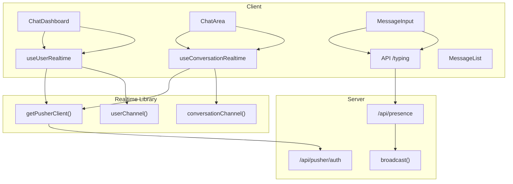
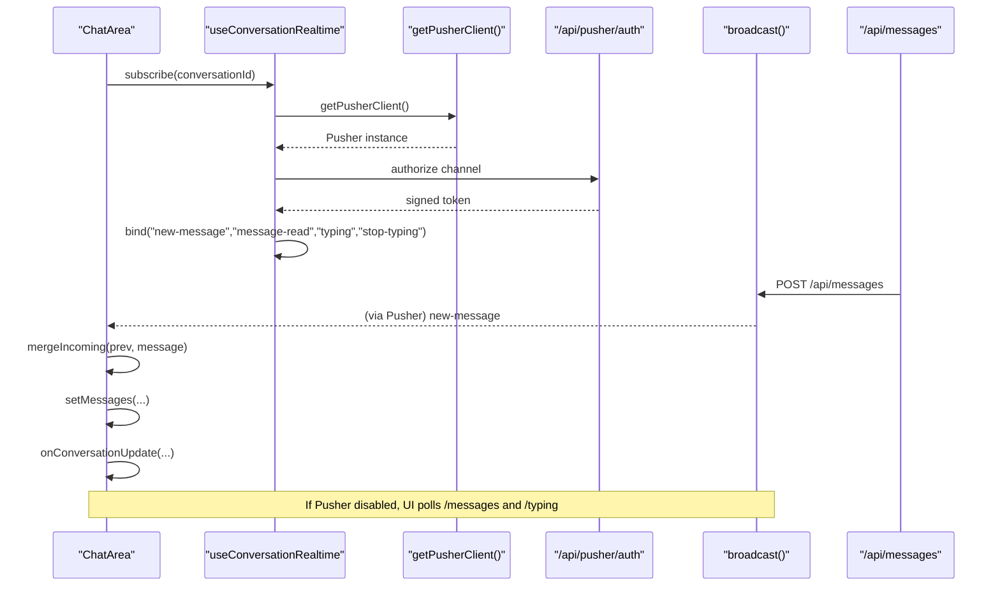
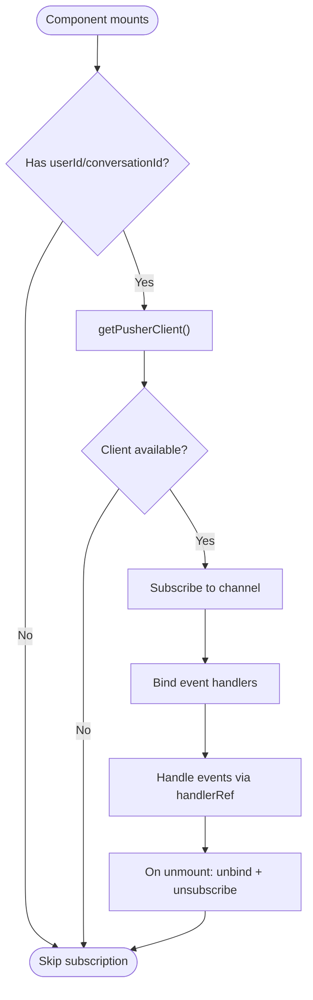
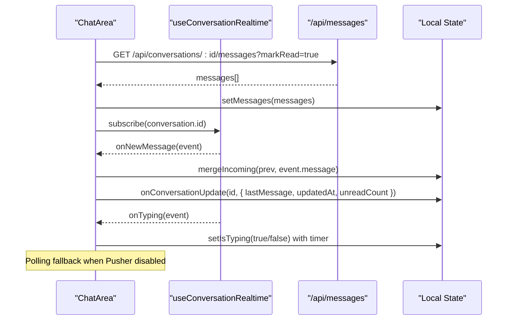
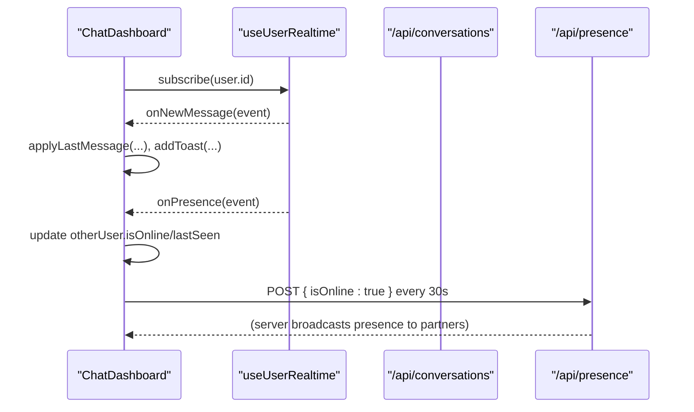
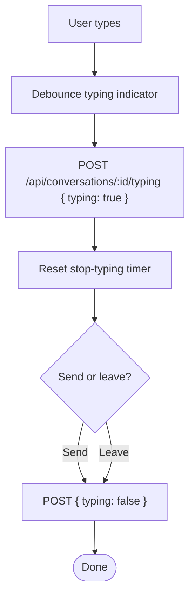
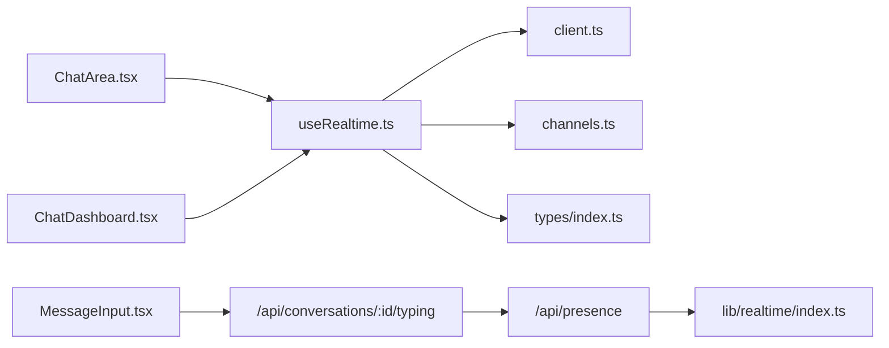

# Client-Side Integration

<cite>
**Referenced Files in This Document**
- [useRealtime.ts](file://hooks/useRealtime.ts)
- [client.ts](file://lib/realtime/client.ts)
- [channels.ts](file://lib/realtime/channels.ts)
- [index.ts](file://lib/realtime/index.ts)
- [ChatArea.tsx](file://components/chat/ChatArea.tsx)
- [MessageList.tsx](file://components/chat/MessageList.tsx)
- [MessageInput.tsx](file://components/chat/MessageInput.tsx)
- [ConversationList.tsx](file://components/chat/ConversationList.tsx)
- [ChatDashboard.tsx](file://components/chat/ChatDashboard.tsx)
- [page.tsx](file://app/(chat)/chat/page.tsx)
- [route.ts](file://app/api/presence/route.ts)
- [index.ts](file://types/index.ts)
</cite>

## Table of Contents
1. [Introduction](#introduction)
2. [Project Structure](#project-structure)
3. [Core Components](#core-components)
4. [Architecture Overview](#architecture-overview)
5. [Detailed Component Analysis](#detailed-component-analysis)
6. [Dependency Analysis](#dependency-analysis)
7. [Performance Considerations](#performance-considerations)
8. [Troubleshooting Guide](#troubleshooting-guide)
9. [Conclusion](#conclusion)
10. [Appendices](#appendices)

## Introduction
This document explains how to integrate real-time messaging on the client side using the provided hooks and components. It covers:
- The useRealtime hook implementation for subscribing to user and conversation channels
- React component integration patterns for receiving events, updating UI state reactively, and handling lifecycle
- State management approaches for messages, typing indicators, read receipts, and presence
- Performance optimization techniques and memory leak prevention
- Examples of integrating real-time features into existing components
- Testing strategies for real-time functionality
- Common challenges, debugging techniques, and best practices for scalable implementations

## Project Structure
The real-time feature is implemented with a clear separation between client-side hooks, shared channel utilities, and UI components:
- Hooks: Centralized subscription logic for Pusher channels
- Realtime library: Client singleton and server broadcast helpers
- Components: Chat dashboard, chat area, message list, input, and sidebar/list components
- Types: Shared event payloads and data models

**Diagram sources**
- [useRealtime.ts:26-61](file://hooks/useRealtime.ts#L26-L61)
- [useRealtime.ts:75-119](file://hooks/useRealtime.ts#L75-L119)
- [client.ts:7-29](file://lib/realtime/client.ts#L7-L29)
- [channels.ts:6-12](file://lib/realtime/channels.ts#L6-L12)
- [index.ts:63-78](file://lib/realtime/index.ts#L63-L78)
- [ChatDashboard.tsx:147-196](file://components/chat/ChatDashboard.tsx#L147-L196)
- [ChatArea.tsx:134-176](file://components/chat/ChatArea.tsx#L134-L176)
- [MessageInput.tsx:33-47](file://components/chat/MessageInput.tsx#L33-L47)
- [route.ts:14-41](file://app/api/presence/route.ts#L14-L41)

**Section sources**
- [useRealtime.ts:1-120](file://hooks/useRealtime.ts#L1-L120)
- [client.ts:1-30](file://lib/realtime/client.ts#L1-L30)
- [channels.ts:1-27](file://lib/realtime/channels.ts#L1-L27)
- [index.ts:1-79](file://lib/realtime/index.ts#L1-L79)
- [ChatDashboard.tsx:1-364](file://components/chat/ChatDashboard.tsx#L1-L364)
- [ChatArea.tsx:1-292](file://components/chat/ChatArea.tsx#L1-L292)
- [MessageInput.tsx:1-193](file://components/chat/MessageInput.tsx#L1-L193)
- [MessageList.tsx:1-100](file://components/chat/MessageList.tsx#L1-L100)
- [ConversationList.tsx:1-57](file://components/chat/ConversationList.tsx#L1-L57)
- [page.tsx:1-27](file://app/(chat)/chat/page.tsx#L1-L27)
- [route.ts:1-41](file://app/api/presence/route.ts#L1-L41)
- [index.ts (types):1-118](file://types/index.ts#L1-L118)

## Core Components
- useUserRealtime: Subscribes to a private user channel to receive new messages and presence updates. It binds/unbinds handlers safely and unsubscribes on cleanup.
- useConversationRealtime: Subscribes to a private conversation channel to handle new messages, read receipts, and typing events. It also cleans up bindings and unsubscribes when dependencies change.
- ChatDashboard: Uses useUserRealtime to update conversations list, show notifications, and manage presence heartbeat.
- ChatArea: Uses useConversationRealtime to merge incoming messages, mark read receipts, and manage typing indicators. Includes polling fallback when Pusher is not configured.
- MessageInput: Sends messages and emits typing events via API; stops typing on unmount or send.
- MessageList: Renders grouped messages with date separators and scroll anchor.
- ConversationList: Renders conversation items and supports selection.

Key responsibilities:
- Event subscription and lifecycle management are encapsulated in hooks
- UI state updates are localized to components that own the relevant state
- Polling fallback ensures app works without Pusher configuration

**Section sources**
- [useRealtime.ts:26-61](file://hooks/useRealtime.ts#L26-L61)
- [useRealtime.ts:75-119](file://hooks/useRealtime.ts#L75-L119)
- [ChatDashboard.tsx:147-196](file://components/chat/ChatDashboard.tsx#L147-L196)
- [ChatArea.tsx:134-176](file://components/chat/ChatArea.tsx#L134-L176)
- [MessageInput.tsx:33-47](file://components/chat/MessageInput.tsx#L33-L47)
- [MessageList.tsx:49-99](file://components/chat/MessageList.tsx#L49-L99)
- [ConversationList.tsx:42-55](file://components/chat/ConversationList.tsx#L42-L55)

## Architecture Overview
The system uses Pusher Channels for real-time delivery. The client maintains a singleton Pusher instance and subscribes to private channels based on user and conversation identifiers. Server routes authorize subscriptions and broadcast events. When Pusher is not configured, the client falls back to short polling for messages and typing status.

**Diagram sources**
- [useRealtime.ts:75-119](file://hooks/useRealtime.ts#L75-L119)
- [client.ts:17-29](file://lib/realtime/client.ts#L17-L29)
- [index.ts:63-78](file://lib/realtime/index.ts#L63-L78)
- [ChatArea.tsx:134-176](file://components/chat/ChatArea.tsx#L134-L176)
- [ChatArea.tsx:182-229](file://components/chat/ChatArea.tsx#L182-L229)

## Detailed Component Analysis

### useRealtime Hook Implementation
- useUserRealtime(userId, handlers):
  - Subscribes to userChannel(userId)
  - Binds handlers for "new-message" and "presence"
  - Uses handlerRef to avoid stale closures
  - Unsubscribes and unbinds on cleanup
- useConversationRealtime(conversationId, handlers):
  - Subscribes to conversationChannel(conversationId)
  - Binds handlers for "new-message", "message-read", "typing", "stop-typing"
  - Cleans up all bindings and unsubscribes on dependency changes

**Diagram sources**
- [useRealtime.ts:26-61](file://hooks/useRealtime.ts#L26-L61)
- [useRealtime.ts:75-119](file://hooks/useRealtime.ts#L75-L119)

**Section sources**
- [useRealtime.ts:1-120](file://hooks/useRealtime.ts#L1-L120)

### ChatArea Integration
- Loads initial messages and marks them as read
- Subscribes to conversation channel for real-time updates
- Merges incoming messages while removing optimistic duplicates
- Updates conversation metadata (last message, unread count)
- Handles typing indicators with auto-clear timers
- Falls back to polling if Pusher is disabled

**Diagram sources**
- [ChatArea.tsx:57-89](file://components/chat/ChatArea.tsx#L57-L89)
- [ChatArea.tsx:91-132](file://components/chat/ChatArea.tsx#L91-L132)
- [ChatArea.tsx:134-176](file://components/chat/ChatArea.tsx#L134-L176)
- [ChatArea.tsx:182-229](file://components/chat/ChatArea.tsx#L182-L229)

**Section sources**
- [ChatArea.tsx:1-292](file://components/chat/ChatArea.tsx#L1-L292)

### ChatDashboard Integration
- Subscribes to user channel for new messages and presence
- Updates conversations list with last message and unread counts
- Shows toast notifications for incoming messages not in active conversation
- Implements presence heartbeat using Page Visibility API
- Falls back to polling when Pusher is disabled

**Diagram sources**
- [ChatDashboard.tsx:147-196](file://components/chat/ChatDashboard.tsx#L147-L196)
- [ChatDashboard.tsx:198-204](file://components/chat/ChatDashboard.tsx#L198-L204)
- [ChatDashboard.tsx:211-276](file://components/chat/ChatDashboard.tsx#L211-L276)
- [route.ts:14-41](file://app/api/presence/route.ts#L14-L41)

**Section sources**
- [ChatDashboard.tsx:1-364](file://components/chat/ChatDashboard.tsx#L1-L364)
- [route.ts:1-41](file://app/api/presence/route.ts#L1-L41)

### MessageInput Integration
- Emits typing events via API with debounce
- Stops typing on unmount or send
- Validates input length and handles send errors gracefully

**Diagram sources**
- [MessageInput.tsx:33-47](file://components/chat/MessageInput.tsx#L33-L47)
- [MessageInput.tsx:59-87](file://components/chat/MessageInput.tsx#L59-L87)
- [MessageInput.tsx:89-114](file://components/chat/MessageInput.tsx#L89-L114)

**Section sources**
- [MessageInput.tsx:1-193](file://components/chat/MessageInput.tsx#L1-L193)

### MessageList Rendering
- Groups messages by date and renders separators
- Displays avatars only for the last message in a run from the same sender
- Provides scroll anchor for auto-scrolling after updates

**Section sources**
- [MessageList.tsx:49-99](file://components/chat/MessageList.tsx#L49-L99)

### ConversationList Rendering
- Renders empty states and conversation items
- Supports selection and highlights active conversation

**Section sources**
- [ConversationList.tsx:22-55](file://components/chat/ConversationList.tsx#L22-L55)

## Dependency Analysis
- Hooks depend on:
  - lib/realtime/client.ts for Pusher client singleton and environment checks
  - lib/realtime/channels.ts for channel name generation
  - types/index.ts for event payload shapes
- Components depend on:
  - hooks/useRealtime.ts for subscription logic
  - lib/utils.ts for formatting
  - API routes for persistence and presence
- Server depends on:
  - lib/realtime/index.ts for broadcasting and authorization

**Diagram sources**
- [useRealtime.ts:1-120](file://hooks/useRealtime.ts#L1-L120)
- [client.ts:1-30](file://lib/realtime/client.ts#L1-L30)
- [channels.ts:1-27](file://lib/realtime/channels.ts#L1-L27)
- [index.ts (types):1-118](file://types/index.ts#L1-L118)
- [ChatArea.tsx:1-292](file://components/chat/ChatArea.tsx#L1-L292)
- [ChatDashboard.tsx:1-364](file://components/chat/ChatDashboard.tsx#L1-L364)
- [MessageInput.tsx:1-193](file://components/chat/MessageInput.tsx#L1-L193)
- [route.ts:1-41](file://app/api/presence/route.ts#L1-L41)
- [index.ts (realtime):1-79](file://lib/realtime/index.ts#L1-L79)

**Section sources**
- [useRealtime.ts:1-120](file://hooks/useRealtime.ts#L1-L120)
- [client.ts:1-30](file://lib/realtime/client.ts#L1-L30)
- [channels.ts:1-27](file://lib/realtime/channels.ts#L1-L27)
- [index.ts (types):1-118](file://types/index.ts#L1-L118)
- [ChatArea.tsx:1-292](file://components/chat/ChatArea.tsx#L1-L292)
- [ChatDashboard.tsx:1-364](file://components/chat/ChatDashboard.tsx#L1-L364)
- [MessageInput.tsx:1-193](file://components/chat/MessageInput.tsx#L1-L193)
- [route.ts:1-41](file://app/api/presence/route.ts#L1-L41)
- [index.ts (realtime):1-79](file://lib/realtime/index.ts#L1-L79)

## Performance Considerations
- Use handlerRef in hooks to avoid re-binding handlers on every render
- Merge incoming messages efficiently to prevent duplicate entries and remove optimistic placeholders
- Debounce typing indicators to reduce network churn
- Use polling fallback sparingly; prefer real-time when Pusher is enabled
- Group messages by date to minimize re-renders and improve readability
- Avoid unnecessary state updates; filter events by conversationId/userId before updating
- Clean up intervals and timers on unmount to prevent memory leaks

[No sources needed since this section provides general guidance]

## Troubleshooting Guide
Common issues and resolutions:
- No real-time events received:
  - Verify NEXT_PUBLIC_PUSHER_KEY and NEXT_PUBLIC_PUSHER_CLUSTER are set
  - Ensure /api/pusher/auth is reachable and returns valid signatures
  - Check browser console for Pusher errors and network requests
- Messages not updating:
  - Confirm server broadcasts new-message events after persisting messages
  - Validate conversationId filtering in onNewMessage handlers
- Typing indicators not clearing:
  - Ensure stop-typing events are sent and handled
  - Check debounce timers and server TTL alignment
- Memory leaks:
  - Confirm channel.unsubscribe and unbind calls execute on cleanup
  - Ensure intervals and timers are cleared in useEffect return functions

**Section sources**
- [client.ts:7-29](file://lib/realtime/client.ts#L7-L29)
- [useRealtime.ts:55-59](file://hooks/useRealtime.ts#L55-L59)
- [useRealtime.ts:111-117](file://hooks/useRealtime.ts#L111-L117)
- [ChatArea.tsx:91-132](file://components/chat/ChatArea.tsx#L91-L132)
- [MessageInput.tsx:49-57](file://components/chat/MessageInput.tsx#L49-L57)

## Conclusion
The client-side integration leverages well-structured hooks to manage real-time subscriptions, ensuring clean separation of concerns and robust lifecycle management. Components update UI reactively through local state, with efficient merging and debouncing to maintain performance. The design includes a reliable fallback to polling when Pusher is unavailable, making the application resilient across environments. Following the outlined best practices will help you scale real-time features effectively while preventing common pitfalls like memory leaks and excessive network calls.

[No sources needed since this section summarizes without analyzing specific files]

## Appendices

### Integrating Real-Time Features Into Existing Components
- Add useUserRealtime in parent containers to update lists and show notifications
- Add useConversationRealtime in chat threads to handle messages, read receipts, and typing
- Use isClientRealtimeEnabled to conditionally enable polling fallback
- Keep event handlers stable using useCallback where necessary

**Section sources**
- [ChatDashboard.tsx:147-196](file://components/chat/ChatDashboard.tsx#L147-L196)
- [ChatArea.tsx:134-176](file://components/chat/ChatArea.tsx#L134-L176)
- [client.ts:7-11](file://lib/realtime/client.ts#L7-L11)

### Handling Component Lifecycle With Real-Time Connections
- Always unsubscribe and unbind in effect cleanup
- Guard subscriptions with null checks for IDs and client availability
- Use refs to hold latest handlers to avoid stale closures
- Clear timers and intervals on unmount

**Section sources**
- [useRealtime.ts:33-60](file://hooks/useRealtime.ts#L33-L60)
- [useRealtime.ts:82-118](file://hooks/useRealtime.ts#L82-L118)
- [MessageInput.tsx:49-57](file://components/chat/MessageInput.tsx#L49-L57)

### Testing Real-Time Functionality
- Mock getPusherClient to return a test Pusher instance
- Simulate events by triggering channel.bind callbacks
- Assert state updates in components after event handling
- Test polling fallback by disabling Pusher and verifying interval behavior
- Validate cleanup by checking unbind and unsubscribe calls

[No sources needed since this section provides general guidance]

### Best Practices for Scalable Real-Time Implementations
- Centralize channel naming and parsing in shared utilities
- Use typed event payloads to ensure consistency across client and server
- Limit event scope by filtering on conversationId/userId
- Prefer idempotent merges to handle duplicate events gracefully
- Monitor and log broadcast failures without breaking core flows

**Section sources**
- [channels.ts:6-27](file://lib/realtime/channels.ts#L6-L27)
- [index.ts (types):89-118](file://types/index.ts#L89-L118)
- [index.ts (realtime):63-78](file://lib/realtime/index.ts#L63-L78)