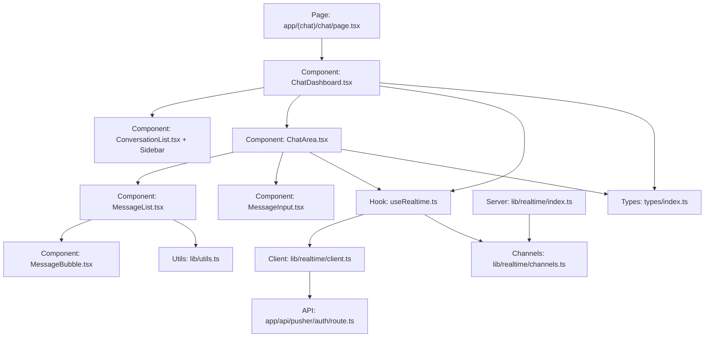
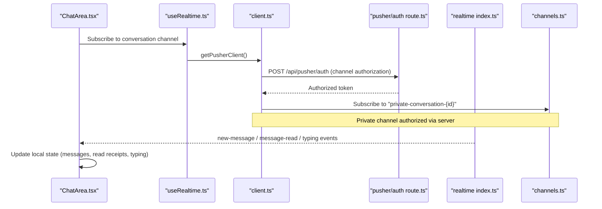
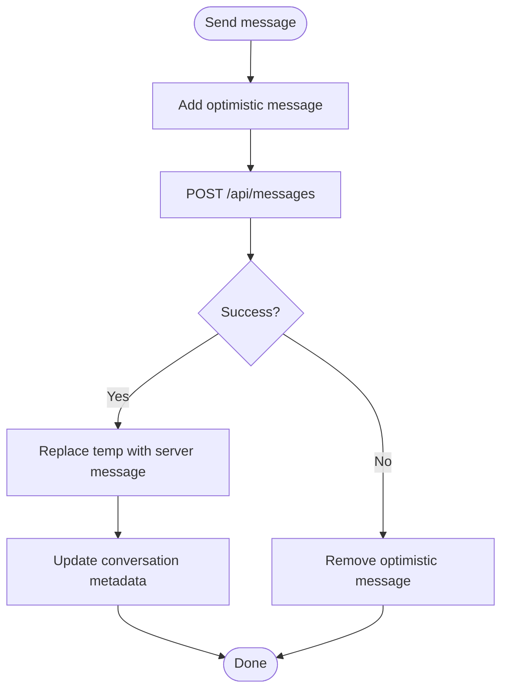
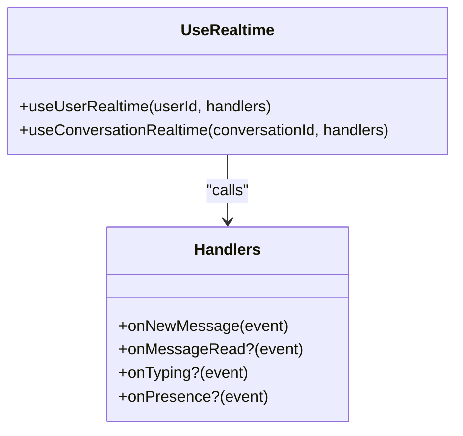
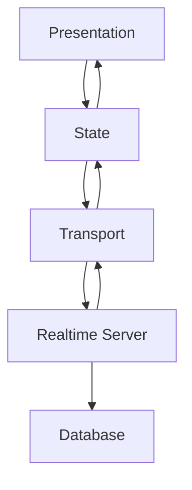
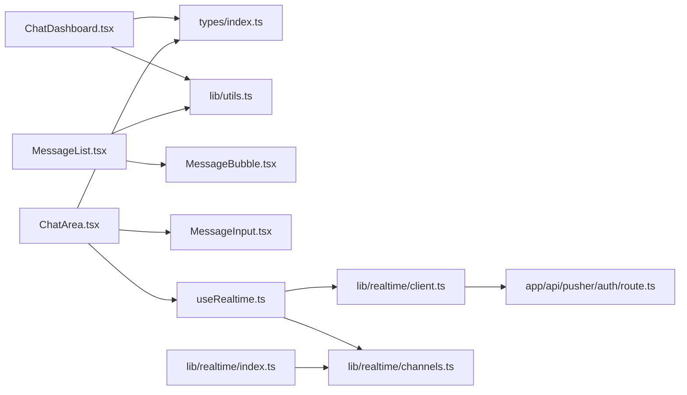

# Component Integration Patterns

<cite>
**Referenced Files in This Document**
- [useRealtime.ts](file://hooks/useRealtime.ts)
- [ChatArea.tsx](file://components/chat/ChatArea.tsx)
- [MessageList.tsx](file://components/chat/MessageList.tsx)
- [MessageInput.tsx](file://components/chat/MessageInput.tsx)
- [MessageBubble.tsx](file://components/chat/MessageBubble.tsx)
- [ChatDashboard.tsx](file://components/chat/ChatDashboard.tsx)
- [ConversationList.tsx](file://components/chat/ConversationList.tsx)
- [index.ts](file://types/index.ts)
- [client.ts](file://lib/realtime/client.ts)
- [index.ts](file://lib/realtime/index.ts)
- [channels.ts](file://lib/realtime/channels.ts)
- [route.ts](file://app/api/pusher/auth/route.ts)
- [utils.ts](file://lib/utils.ts)
- [page.tsx](file://app/(chat)/chat/page.tsx)
</cite>

## Table of Contents
1. [Introduction](#introduction)
2. [Project Structure](#project-structure)
3. [Core Components](#core-components)
4. [Architecture Overview](#architecture-overview)
5. [Detailed Component Analysis](#detailed-component-analysis)
6. [Dependency Analysis](#dependency-analysis)
7. [Performance Considerations](#performance-considerations)
8. [Troubleshooting Guide](#troubleshooting-guide)
9. [Conclusion](#conclusion)
10. [Appendices](#appendices)

## Introduction
This document explains how to integrate real-time features into React components for a chat application. It covers component patterns for displaying real-time messages, handling user interactions, and managing state with live data. It also documents prop interfaces, event handling patterns, composition strategies for chat UIs, performance optimizations (memoization, virtual scrolling, efficient re-renders), accessibility, responsive design, and cross-browser compatibility considerations.

## Project Structure
The project is organized around Next.js pages and reusable React components:
- Pages orchestrate server-side data fetching and render client dashboards.
- The chat dashboard composes sidebar and chat area components.
- Real-time subscriptions are abstracted in hooks that wrap Pusher channels.
- Types define shared contracts for messages, conversations, and events.
- Utilities provide formatting helpers and presence logic.

**Diagram sources**
- [page.tsx:6-26](file://app/(chat)/chat/page.tsx#L6-L26)
- [ChatDashboard.tsx:99-364](file://components/chat/ChatDashboard.tsx#L99-L364)
- [ChatArea.tsx:35-292](file://components/chat/ChatArea.tsx#L35-L292)
- [MessageList.tsx:16-100](file://components/chat/MessageList.tsx#L16-L100)
- [MessageBubble.tsx:11-60](file://components/chat/MessageBubble.tsx#L11-L60)
- [MessageInput.tsx:14-193](file://components/chat/MessageInput.tsx#L14-L193)
- [useRealtime.ts:26-119](file://hooks/useRealtime.ts#L26-L119)
- [client.ts:7-29](file://lib/realtime/client.ts#L7-L29)
- [index.ts:24-78](file://lib/realtime/index.ts#L24-L78)
- [channels.ts:6-26](file://lib/realtime/channels.ts#L6-L26)
- [route.ts:11-38](file://app/api/pusher/auth/route.ts#L11-L38)
- [index.ts:25-118](file://types/index.ts#L25-L118)
- [utils.ts:20-81](file://lib/utils.ts#L20-L81)

**Section sources**
- [page.tsx:6-26](file://app/(chat)/chat/page.tsx#L6-L26)
- [ChatDashboard.tsx:99-364](file://components/chat/ChatDashboard.tsx#L99-L364)
- [ChatArea.tsx:35-292](file://components/chat/ChatArea.tsx#L35-L292)
- [MessageList.tsx:16-100](file://components/chat/MessageList.tsx#L16-L100)
- [MessageBubble.tsx:11-60](file://components/chat/MessageBubble.tsx#L11-L60)
- [MessageInput.tsx:14-193](file://components/chat/MessageInput.tsx#L14-L193)
- [useRealtime.ts:26-119](file://hooks/useRealtime.ts#L26-L119)
- [client.ts:7-29](file://lib/realtime/client.ts#L7-L29)
- [index.ts:24-78](file://lib/realtime/index.ts#L24-L78)
- [channels.ts:6-26](file://lib/realtime/channels.ts#L6-L26)
- [route.ts:11-38](file://app/api/pusher/auth/route.ts#L11-L38)
- [index.ts:25-118](file://types/index.ts#L25-L118)
- [utils.ts:20-81](file://lib/utils.ts#L20-L81)

## Core Components
- ChatDashboard: Orchestrates conversation list, active chat selection, presence heartbeat, toasts, and realtime updates for the user channel.
- ChatArea: Manages per-conversation message state, optimistic sends, typing indicators, read receipts, and realtime subscription to conversation events.
- MessageList: Renders grouped messages with date separators and scroll-to-bottom anchor; delegates rendering to MessageBubble.
- MessageInput: Handles text input, auto-resize, send flow, and debounced typing indicator emission.
- MessageBubble: Displays individual message content, time, and read status; safe text rendering without HTML injection.
- useRealtime hook: Encapsulates Pusher subscriptions for user and conversation channels, mapping events to typed handlers.

Key responsibilities and interactions:
- Realtime events update local state without full page reloads.
- Optimistic UI improves perceived latency by showing messages immediately.
- Polling fallback ensures functionality when realtime transport is unavailable.
- Presence heartbeats keep online status accurate across tabs and devices.

**Section sources**
- [ChatDashboard.tsx:99-364](file://components/chat/ChatDashboard.tsx#L99-L364)
- [ChatArea.tsx:35-292](file://components/chat/ChatArea.tsx#L35-L292)
- [MessageList.tsx:16-100](file://components/chat/MessageList.tsx#L16-L100)
- [MessageInput.tsx:14-193](file://components/chat/MessageInput.tsx#L14-L193)
- [MessageBubble.tsx:11-60](file://components/chat/MessageBubble.tsx#L11-L60)
- [useRealtime.ts:26-119](file://hooks/useRealtime.ts#L26-L119)

## Architecture Overview
The system uses Pusher Channels for real-time messaging with a robust fallback to polling when configuration is missing. Client-side hooks subscribe to private channels and dispatch typed events to components. Server-side broadcasting triggers events on appropriate channels after persisting messages or updating presence.

**Diagram sources**
- [useRealtime.ts:75-119](file://hooks/useRealtime.ts#L75-L119)
- [client.ts:17-29](file://lib/realtime/client.ts#L17-L29)
- [route.ts:11-38](file://app/api/pusher/auth/route.ts#L11-L38)
- [index.ts:63-78](file://lib/realtime/index.ts#L63-L78)
- [channels.ts:6-12](file://lib/realtime/channels.ts#L6-L12)

## Detailed Component Analysis

### ChatArea
Responsibilities:
- Load initial messages and handle errors/loading states.
- Manage optimistic message sending and rollback on failure.
- Merge incoming messages while removing temporary entries.
- Handle typing indicators and stop-typing timers.
- Mark messages as read based on realtime events.
- Provide fallback polling when realtime is disabled.

Prop interface:
- conversation: Conversation
- currentUser: PublicUser
- onBack: () => void
- onConversationUpdate: (id: string, update: Partial<Conversation>) => void

Event handling patterns:
- New message handler merges and updates last message and unread counts.
- Read receipt handler updates read flags locally.
- Typing handler toggles indicator with auto-clear timer.

**Diagram sources**
- [ChatArea.tsx:182-229](file://components/chat/ChatArea.tsx#L182-L229)

**Section sources**
- [ChatArea.tsx:35-292](file://components/chat/ChatArea.tsx#L35-L292)

### MessageList
Responsibilities:
- Group messages by date and render separators.
- Render avatars only for the last message in a run from the same sender.
- Provide scroll anchor for auto-scrolling to latest messages.

Props:
- messages: Message[]
- currentUserId: string
- loading: boolean
- error: string
- bottomRef: RefObject<HTMLDivElement | null>

Optimization notes:
- Grouping reduces layout recalculations.
- Date separators improve readability and reduce unnecessary re-renders.

**Section sources**
- [MessageList.tsx:16-100](file://components/chat/MessageList.tsx#L16-L100)

### MessageInput
Responsibilities:
- Auto-resize textarea up to a max height.
- Debounce typing indicator emissions to avoid excessive network calls.
- Validate message length and prevent sending while sending.
- Restore text on send failure to preserve user input.

Props:
- onSend: (content: string) => Promise<boolean>
- conversationId: string

Typing indicator pattern:
- Start typing on first keystroke.
- Reset stop-typing timer on each change.
- Stop typing on unmount or explicit stop.

**Section sources**
- [MessageInput.tsx:14-193](file://components/chat/MessageInput.tsx#L14-L193)

### MessageBubble
Responsibilities:
- Display message content safely as text.
- Show timestamp and read status for own messages.
- Indicate temporary messages with reduced opacity.

Props:
- message: Message
- isOwn: boolean
- isLastInRun: boolean

Accessibility:
- Content rendered as plain text avoids XSS risks.

**Section sources**
- [MessageBubble.tsx:11-60](file://components/chat/MessageBubble.tsx#L11-L60)

### ChatDashboard
Responsibilities:
- Maintain conversation list and active conversation.
- Subscribe to user channel for new messages and presence updates.
- Show toast notifications for incoming messages not currently viewed.
- Implement presence heartbeat using visibility changes.
- Provide fallback polling when realtime is disabled.

Props:
- currentUser: PublicUser
- initialConversations: Conversation[]

Presence heartbeat:
- Posts presence endpoint at intervals while tab is visible.
- Marks offline when tab becomes hidden.

**Section sources**
- [ChatDashboard.tsx:99-364](file://components/chat/ChatDashboard.tsx#L99-L364)

### useRealtime Hook
Responsibilities:
- Subscribe to user and conversation channels.
- Bind/unbind event listeners safely with cleanup.
- Use handler refs to avoid stale closures.

Interfaces:
- UserRealtimeHandlers: onNewMessage, onPresence?
- ConversationRealtimeHandlers: onNewMessage, onMessageRead?, onTyping?

**Diagram sources**
- [useRealtime.ts:17-119](file://hooks/useRealtime.ts#L17-L119)

**Section sources**
- [useRealtime.ts:26-119](file://hooks/useRealtime.ts#L26-L119)

### Conceptual Overview
The chat UI follows a layered architecture:
- Presentation layer: ChatArea, MessageList, MessageInput, MessageBubble.
- State management: Local component state plus realtime-driven updates.
- Transport layer: Pusher Channels with polling fallback.
- Server layer: Broadcasting events after persistence and presence updates.

[No sources needed since this diagram shows conceptual workflow, not actual code structure]

## Dependency Analysis
Components depend on shared types and utilities, and on the realtime layer for live updates. The dashboard depends on the sidebar and chat area, while the chat area depends on message list, input, and bubble components.

**Diagram sources**
- [index.ts:25-118](file://types/index.ts#L25-L118)
- [utils.ts:20-81](file://lib/utils.ts#L20-L81)
- [ChatDashboard.tsx:99-364](file://components/chat/ChatDashboard.tsx#L99-L364)
- [ChatArea.tsx:35-292](file://components/chat/ChatArea.tsx#L35-L292)
- [MessageList.tsx:16-100](file://components/chat/MessageList.tsx#L16-L100)
- [MessageBubble.tsx:11-60](file://components/chat/MessageBubble.tsx#L11-L60)
- [MessageInput.tsx:14-193](file://components/chat/MessageInput.tsx#L14-L193)
- [useRealtime.ts:26-119](file://hooks/useRealtime.ts#L26-L119)
- [client.ts:7-29](file://lib/realtime/client.ts#L7-L29)
- [index.ts:24-78](file://lib/realtime/index.ts#L24-L78)
- [channels.ts:6-26](file://lib/realtime/channels.ts#L6-L26)
- [route.ts:11-38](file://app/api/pusher/auth/route.ts#L11-L38)

**Section sources**
- [index.ts:25-118](file://types/index.ts#L25-L118)
- [utils.ts:20-81](file://lib/utils.ts#L20-L81)
- [ChatDashboard.tsx:99-364](file://components/chat/ChatDashboard.tsx#L99-L364)
- [ChatArea.tsx:35-292](file://components/chat/ChatArea.tsx#L35-L292)
- [MessageList.tsx:16-100](file://components/chat/MessageList.tsx#L16-L100)
- [MessageBubble.tsx:11-60](file://components/chat/MessageBubble.tsx#L11-L60)
- [MessageInput.tsx:14-193](file://components/chat/MessageInput.tsx#L14-L193)
- [useRealtime.ts:26-119](file://hooks/useRealtime.ts#L26-L119)
- [client.ts:7-29](file://lib/realtime/client.ts#L7-L29)
- [index.ts:24-78](file://lib/realtime/index.ts#L24-L78)
- [channels.ts:6-26](file://lib/realtime/channels.ts#L6-L26)
- [route.ts:11-38](file://app/api/pusher/auth/route.ts#L11-L38)

## Performance Considerations
- Memoization:
  - Wrap expensive computations and callbacks with memoization where appropriate (e.g., loadMessages, handleSend).
  - Avoid recreating handler objects frequently; use refs to store latest handlers when binding/unbinding events.
- Efficient re-renders:
  - Keep message lists stable by merging incoming messages carefully and avoiding unnecessary array copies.
  - Use keys that are stable identifiers (message.id) to minimize re-renders.
- Virtual scrolling:
  - For large message histories, consider virtualizing the list to render only visible items. This reduces DOM size and improves scroll performance.
- Optimistic updates:
  - Show messages immediately and reconcile with server responses to reduce perceived latency.
- Polling fallback:
  - When realtime is disabled, use periodic polling with minimal overhead and ignore transient errors to maintain UI stability.
- Presence heartbeat:
  - Use visibility changes to pause heartbeats when the tab is hidden, reducing unnecessary network requests.

[No sources needed since this section provides general guidance]

## Troubleshooting Guide
Common issues and resolutions:
- Realtime not configured:
  - If Pusher environment variables are missing, the client returns null and falls back to polling. Ensure NEXT_PUBLIC_PUSHER_KEY and NEXT_PUBLIC_PUSHER_CLUSTER are set for realtime features.
- Private channel authorization failures:
  - Verify the pusher/auth route validates user identity and permissions. Check server logs for broadcast failures.
- Typing indicator not clearing:
  - Ensure stop-typing timers are cleared on unmount and when sending messages. Confirm server TTL matches client expectations.
- Messages not appearing:
  - Check mergeIncoming logic to ensure duplicate detection works and temporary messages are replaced correctly.
- Presence inaccuracies:
  - Confirm heartbeat interval and visibility change handling. Ensure server marks users offline when tabs are hidden.

**Section sources**
- [client.ts:7-29](file://lib/realtime/client.ts#L7-L29)
- [route.ts:11-38](file://app/api/pusher/auth/route.ts#L11-L38)
- [index.ts:63-78](file://lib/realtime/index.ts#L63-L78)
- [ChatArea.tsx:15-26](file://components/chat/ChatArea.tsx#L15-L26)
- [MessageInput.tsx:49-87](file://components/chat/MessageInput.tsx#L49-L87)
- [ChatDashboard.tsx:211-276](file://components/chat/ChatDashboard.tsx#L211-L276)

## Conclusion
The chat application integrates real-time features through a clear separation of concerns: components manage presentation and local state, hooks encapsulate realtime subscriptions, and the server broadcasts events after persistence. The design supports optimistic updates, fallback polling, and presence heartbeats, ensuring a responsive and resilient user experience. Following the documented patterns and performance recommendations will help maintain scalability and accessibility across browsers and devices.

[No sources needed since this section summarizes without analyzing specific files]

## Appendices

### Prop Interfaces Summary
- ChatArea props:
  - conversation: Conversation
  - currentUser: PublicUser
  - onBack: () => void
  - onConversationUpdate: (id: string, update: Partial<Conversation>) => void
- MessageList props:
  - messages: Message[]
  - currentUserId: string
  - loading: boolean
  - error: string
  - bottomRef: RefObject<HTMLDivElement | null>
- MessageInput props:
  - onSend: (content: string) => Promise<boolean>
  - conversationId: string
- MessageBubble props:
  - message: Message
  - isOwn: boolean
  - isLastInRun: boolean

**Section sources**
- [ChatArea.tsx:28-40](file://components/chat/ChatArea.tsx#L28-L40)
- [MessageList.tsx:8-22](file://components/chat/MessageList.tsx#L8-L22)
- [MessageInput.tsx:7-10](file://components/chat/MessageInput.tsx#L7-L10)
- [MessageBubble.tsx:5-9](file://components/chat/MessageBubble.tsx#L5-L9)

### Accessibility and Responsive Design
- Accessibility:
  - Use aria-labels for interactive elements like send buttons and inputs.
  - Ensure keyboard navigation works for sending messages (Enter to send, Shift+Enter for newline).
  - Avoid HTML injection in message content; render as plain text.
- Responsive design:
  - Hide sidebar on small screens and show back button to navigate to conversation list.
  - Use flexible layouts and constraints to adapt to different screen sizes.
- Cross-browser compatibility:
  - Use standard APIs available in modern browsers (crypto.randomUUID, fetch, Visibility API).
  - Provide fallbacks when realtime transport is unavailable.

**Section sources**
- [MessageInput.tsx:116-121](file://components/chat/MessageInput.tsx#L116-L121)
- [MessageBubble.tsx:33-34](file://components/chat/MessageBubble.tsx#L33-L34)
- [ChatArea.tsx:235-241](file://components/chat/ChatArea.tsx#L235-L241)
- [utils.ts:12-14](file://lib/utils.ts#L12-L14)