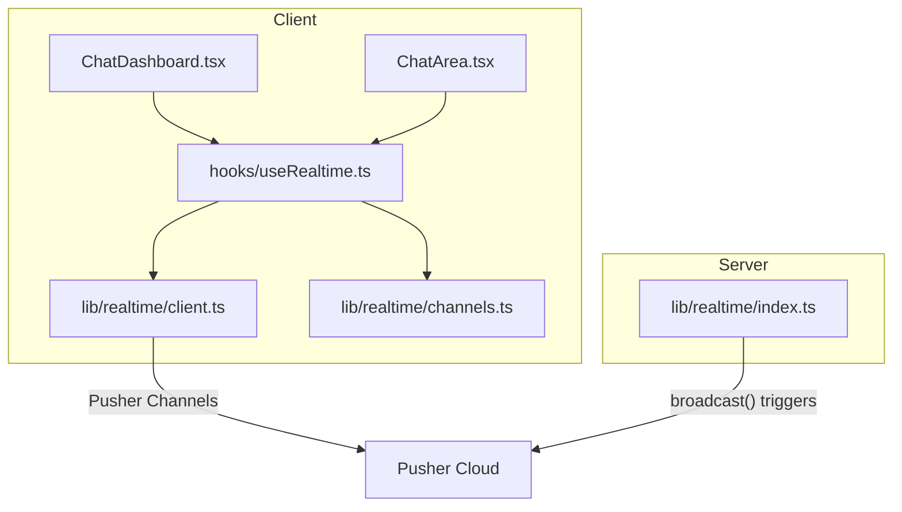
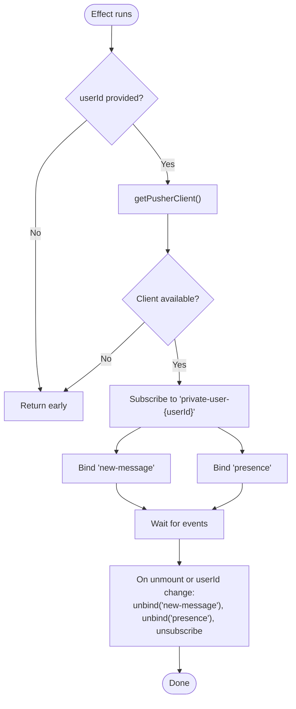
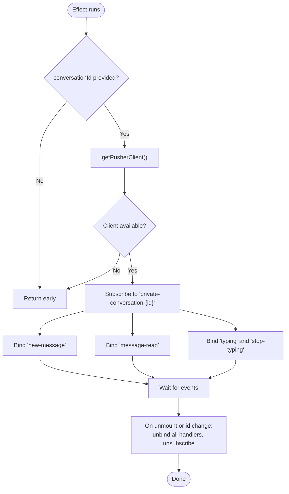
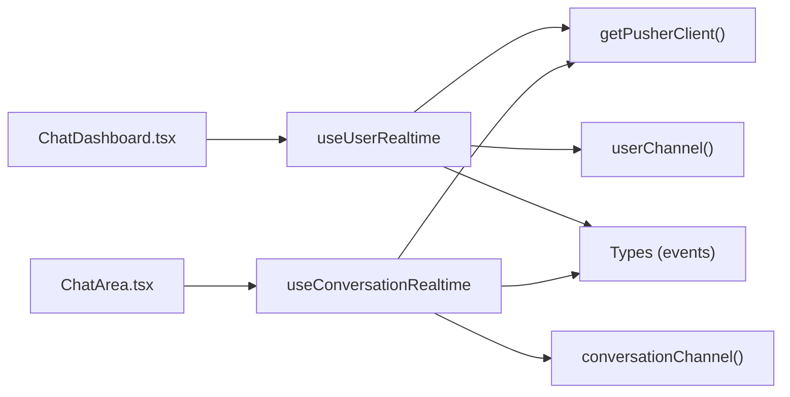

# React Hooks Implementation

<cite>
**Referenced Files in This Document**
- [useRealtime.ts](file://hooks/useRealtime.ts)
- [client.ts](file://lib/realtime/client.ts)
- [channels.ts](file://lib/realtime/channels.ts)
- [index.ts](file://lib/realtime/index.ts)
- [ChatDashboard.tsx](file://components/chat/ChatDashboard.tsx)
- [ChatArea.tsx](file://components/chat/ChatArea.tsx)
- [index.ts (types)](file://types/index.ts)
</cite>

## Table of Contents
1. Introduction
2. Project Structure
3. Core Components
4. Architecture Overview
5. Detailed Component Analysis
6. Dependency Analysis
7. Performance Considerations
8. Troubleshooting Guide
9. Conclusion

## Introduction
This document explains the React hooks implementation for real-time messaging in the application, focusing on useUserRealtime and useConversationRealtime. It covers their APIs, parameters, return values, lifecycle management, dependency handling, cleanup procedures for Pusher connections, composition patterns, testing strategies, error handling, performance optimization, and common pitfalls such as memory leaks, stale closures, and debugging techniques for real-time event handling.

## Project Structure
The real-time feature is implemented with:
- Client-side hooks that subscribe to Pusher channels and forward events to components
- A client-side Pusher singleton that initializes only when environment variables are present
- Channel name helpers that define private channel naming conventions
- Server-side broadcast utilities that publish events to one or more channels
- Components that consume the hooks to update UI state reactively



**Diagram sources**
- [useRealtime.ts:26-119](file://hooks/useRealtime.ts#L26-L119)
- [client.ts:17-29](file://lib/realtime/client.ts#L17-L29)
- [channels.ts:6-12](file://lib/realtime/channels.ts#L6-L12)
- [index.ts:63-78](file://lib/realtime/index.ts#L63-L78)
- [ChatDashboard.tsx:147-196](file://components/chat/ChatDashboard.tsx#L147-L196)
- [ChatArea.tsx:134-176](file://components/chat/ChatArea.tsx#L134-L176)

**Section sources**
- [useRealtime.ts:1-120](file://hooks/useRealtime.ts#L1-L120)
- [client.ts:1-30](file://lib/realtime/client.ts#L1-L30)
- [channels.ts:1-27](file://lib/realtime/channels.ts#L1-L27)
- [index.ts:1-79](file://lib/realtime/index.ts#L1-L79)
- [ChatDashboard.tsx:1-364](file://components/chat/ChatDashboard.tsx#L1-L364)
- [ChatArea.tsx:1-292](file://components/chat/ChatArea.tsx#L1-L292)
- [index.ts (types):1-118](file://types/index.ts#L1-L118)

## Core Components
- useUserRealtime(userId, handlers): Subscribes to a user’s private channel to receive new messages and presence updates. It binds/unbinds event listeners and unsubscribes from the channel on cleanup.
- useConversationRealtime(conversationId, handlers): Subscribes to a conversation’s private channel to receive new messages, read receipts, and typing indicators. It binds/unbinds event listeners and unsubscribes on cleanup.

Both hooks:
- Use a ref to hold the latest handlers to avoid stale closures
- Guard against missing IDs or disabled realtime by early returns
- Subscribe to channels using deterministic names generated by channel helpers
- Clean up all bindings and subscriptions in effect cleanup functions

**Section sources**
- [useRealtime.ts:26-61](file://hooks/useRealtime.ts#L26-L61)
- [useRealtime.ts:75-119](file://hooks/useRealtime.ts#L75-L119)
- [channels.ts:6-12](file://lib/realtime/channels.ts#L6-L12)

## Architecture Overview
The hooks act as a bridge between Pusher Channels and React component state. The server publishes events via broadcast(), which reach clients subscribed through the hooks. When realtime is not enabled, components fall back to polling.

```mermaid
sequenceDiagram
participant Comp as "Component"
participant Hook as "useUserRealtime / useConversationRealtime"
participant Client as "getPusherClient()"
participant Pusher as "Pusher Channels"
participant Server as "broadcast()"
Note over Comp,Hook : Component mounts
Hook->>Client : getPusherClient()
alt Realtime enabled
Client-->>Hook : Pusher instance
Hook->>Pusher : subscribe(channelName)
Pusher-->>Hook : channel bound
Hook->>Pusher : bind(event, handler)
else Realtime disabled
Hook-->>Comp : No subscription; fallback polling used elsewhere
end
Note over Server,Pusher : Server publishes events
Server->>Pusher : trigger(channel, event.type, payload)
Pusher-->>Hook : event delivered
Hook->>Comp : invoke handlers with payload
```

**Diagram sources**
- [useRealtime.ts:33-60](file://hooks/useRealtime.ts#L33-L60)
- [useRealtime.ts:82-118](file://hooks/useRealtime.ts#L82-L118)
- [client.ts:17-29](file://lib/realtime/client.ts#L17-L29)
- [index.ts:63-78](file://lib/realtime/index.ts#L63-L78)

## Detailed Component Analysis

### useUserRealtime
- Purpose: Subscribe to a user’s private channel for incoming messages and presence updates.
- Parameters:
  - userId: string | null — target user ID; if null, no subscription occurs
  - handlers: UserRealtimeHandlers
    - onNewMessage(event: NewMessageEvent) — required
    - onPresence?(event: PresenceEvent) — optional
- Return value: void (side-effectful hook)
- Lifecycle:
  - On mount or when userId changes:
    - If userId is null or realtime is disabled, return early
    - Create channel name via userChannel(userId)
    - Subscribe to channel and bind “new-message” and “presence” events
  - On unmount or userId change:
    - Unbind both event handlers
    - Unsubscribe from the channel
- Stale closure prevention:
  - Uses useRef to store the latest handlers object and calls handlerRef.current inside event callbacks
- Error handling:
  - Guards against missing pusher client and invalid events before invoking handlers
- Usage example:
  - See ChatDashboard where it updates conversations list and shows toasts for new messages and presence changes



**Diagram sources**
- [useRealtime.ts:33-60](file://hooks/useRealtime.ts#L33-L60)

**Section sources**
- [useRealtime.ts:17-61](file://hooks/useRealtime.ts#L17-L61)
- [ChatDashboard.tsx:147-196](file://components/chat/ChatDashboard.tsx#L147-L196)
- [index.ts (types):91-115](file://types/index.ts#L91-L115)

### useConversationRealtime
- Purpose: Subscribe to a conversation’s private channel for new messages, read receipts, and typing indicators.
- Parameters:
  - conversationId: string | null — target conversation ID; if null, no subscription occurs
  - handlers: ConversationRealtimeHandlers
    - onNewMessage(event: NewMessageEvent) — required
    - onMessageRead?(event: MessageReadEvent) — optional
    - onTyping?(event: TypingEvent) — optional
- Return value: void (side-effectful hook)
- Lifecycle:
  - On mount or when conversationId changes:
    - If conversationId is null or realtime is disabled, return early
    - Create channel name via conversationChannel(conversationId)
    - Subscribe to channel and bind “new-message”, “message-read”, “typing”, and “stop-typing” events
  - On unmount or conversationId change:
    - Unbind all four event handlers
    - Unsubscribe from the channel
- Stale closure prevention:
  - Uses useRef to store the latest handlers object and calls handlerRef.current inside event callbacks
- Error handling:
  - Guards against missing pusher client and validates event types before invoking handlers
- Usage example:
  - See ChatArea where it merges incoming messages, marks read receipts, and manages typing indicators



**Diagram sources**
- [useRealtime.ts:82-118](file://hooks/useRealtime.ts#L82-L118)

**Section sources**
- [useRealtime.ts:65-119](file://hooks/useRealtime.ts#L65-L119)
- [ChatArea.tsx:134-176](file://components/chat/ChatArea.tsx#L134-L176)
- [index.ts (types):91-108](file://types/index.ts#L91-L108)

### Client Pusher Singleton and Channel Helpers
- getPusherClient(): Returns a browser Pusher instance if NEXT_PUBLIC_PUSHER_KEY and NEXT_PUBLIC_PUSHER_CLUSTER are set; otherwise returns null so components can fall back to polling.
- isClientRealtimeEnabled(): Boolean check for environment configuration.
- conversationChannel(id), userChannel(id): Generate deterministic private channel names.
- parseConversationChannel(channel), parseUserChannel(channel): Parse channel names back to IDs (useful on server).

**Section sources**
- [client.ts:7-29](file://lib/realtime/client.ts#L7-L29)
- [channels.ts:6-26](file://lib/realtime/channels.ts#L6-L26)

### Server Broadcast Utility
- broadcast(channels, event): Publishes an event to one or more private channels. It never throws; failures are logged and do not interrupt message persistence.
- authorizeChannel(socketId, channel): Signs private-channel subscriptions used by the auth endpoint.

**Section sources**
- [index.ts:24-57](file://lib/realtime/index.ts#L24-L57)
- [index.ts:63-78](file://lib/realtime/index.ts#L63-L78)

## Dependency Analysis
- useUserRealtime depends on:
  - getPusherClient() for Pusher instance
  - userChannel() for channel naming
  - Types for event payloads
- useConversationRealtime depends on:
  - getPusherClient() for Pusher instance
  - conversationChannel() for channel naming
  - Types for event payloads
- Components depend on hooks to keep UI in sync with server-published events.



**Diagram sources**
- [useRealtime.ts:26-119](file://hooks/useRealtime.ts#L26-L119)
- [client.ts:17-29](file://lib/realtime/client.ts#L17-L29)
- [channels.ts:6-12](file://lib/realtime/channels.ts#L6-L12)
- [ChatDashboard.tsx:147-196](file://components/chat/ChatDashboard.tsx#L147-L196)
- [ChatArea.tsx:134-176](file://components/chat/ChatArea.tsx#L134-L176)
- [index.ts (types):91-115](file://types/index.ts#L91-L115)

**Section sources**
- [useRealtime.ts:1-120](file://hooks/useRealtime.ts#L1-L120)
- [client.ts:1-30](file://lib/realtime/client.ts#L1-L30)
- [channels.ts:1-27](file://lib/realtime/channels.ts#L1-L27)
- [ChatDashboard.tsx:1-364](file://components/chat/ChatDashboard.tsx#L1-L364)
- [ChatArea.tsx:1-292](file://components/chat/ChatArea.tsx#L1-L292)
- [index.ts (types):1-118](file://types/index.ts#L1-L118)

## Performance Considerations
- Avoid unnecessary re-subscriptions:
  - Both hooks depend only on userId or conversationId, minimizing re-runs.
- Prevent stale closures:
  - Handlers are stored in refs and invoked via handlerRef.current to always call the latest function without recreating subscriptions.
- Efficient event filtering:
  - Event handlers validate event.type and payload before invoking component callbacks.
- Fallback to polling:
  - When realtime is disabled, components poll at intervals to keep UI updated without Pusher overhead.
- Minimize network churn:
  - Channel names are deterministic; subscriptions are created once per effect run and cleaned up properly.

[No sources needed since this section provides general guidance]

## Troubleshooting Guide
Common issues and resolutions:
- Memory leaks:
  - Ensure effects clean up by unbinding all event listeners and unsubscribing from channels. The hooks already implement cleanup; verify custom code does not add additional listeners without cleanup.
- Stale closures:
  - Always pass stable or memoized handlers to hooks. The hooks use refs to avoid stale references, but passing new objects every render can still cause extra work. Memoize handlers with useCallback where appropriate.
- Missing realtime configuration:
  - If NEXT_PUBLIC_PUSHER_KEY or NEXT_PUBLIC_PUSHER_CLUSTER are not set, getPusherClient returns null and hooks skip subscriptions. Confirm environment variables and that components fall back to polling.
- Unauthorized channel access:
  - Private channels require authentication. Verify the authorization endpoint is reachable and correctly authorizes users.
- Duplicate or out-of-order messages:
  - Validate event.conversationId before applying updates. The hooks and components filter by conversationId to ensure correctness.
- Debugging tips:
  - Log event payloads in handlers during development.
  - Inspect Pusher connection status and channel subscriptions in the browser console.
  - Temporarily enable verbose logging in Pusher to trace events.

**Section sources**
- [useRealtime.ts:33-60](file://hooks/useRealtime.ts#L33-L60)
- [useRealtime.ts:82-118](file://hooks/useRealtime.ts#L82-L118)
- [client.ts:7-29](file://lib/realtime/client.ts#L7-L29)
- [ChatArea.tsx:134-176](file://components/chat/ChatArea.tsx#L134-L176)

## Conclusion
The useUserRealtime and useConversationRealtime hooks provide a robust, efficient abstraction for real-time messaging. They encapsulate Pusher subscription lifecycle, handle cleanup, prevent stale closures, and integrate cleanly with React components. With proper configuration, they deliver instant updates for messages, read receipts, and typing indicators, while gracefully falling back to polling when realtime is unavailable. Following the patterns and guidelines in this document will help you build reliable real-time features and avoid common pitfalls.

[No sources needed since this section summarizes without analyzing specific files]