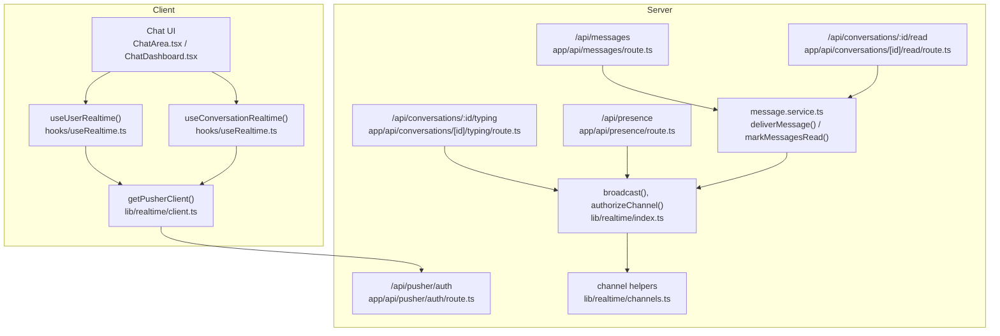
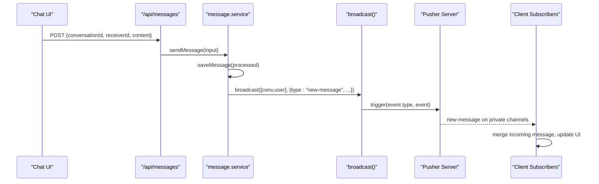
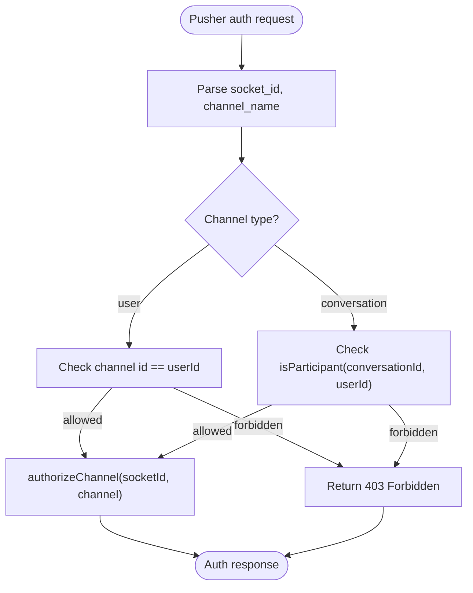
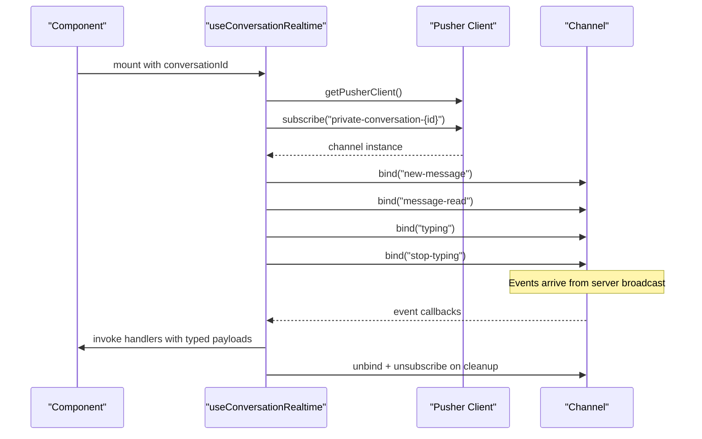
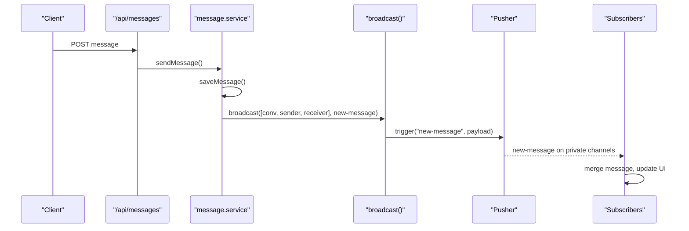
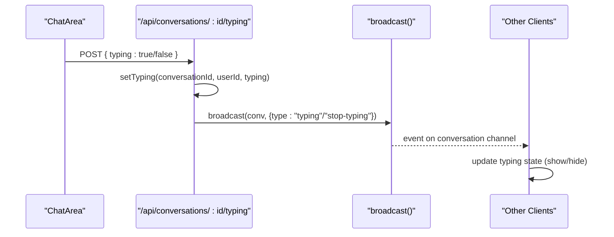
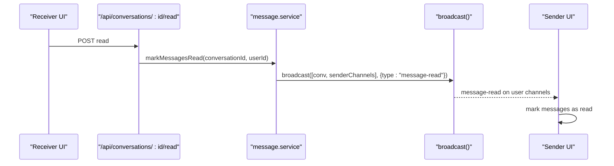
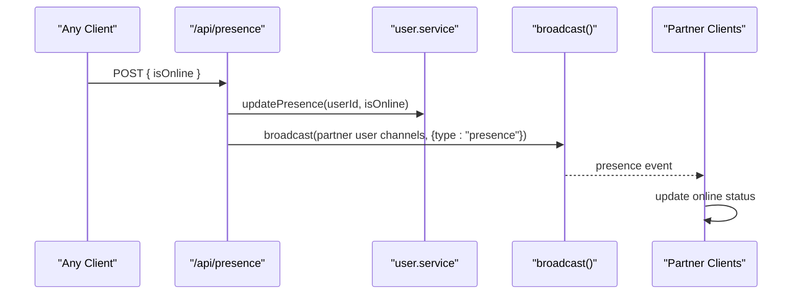
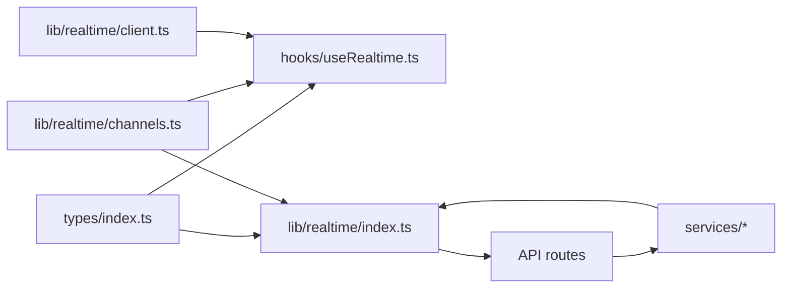

# Event Broadcasting and Handling

<cite>
**Referenced Files in This Document**
- [types/index.ts](file://types/index.ts)
- [hooks/useRealtime.ts](file://hooks/useRealtime.ts)
- [lib/realtime/client.ts](file://lib/realtime/client.ts)
- [lib/realtime/channels.ts](file://lib/realtime/channels.ts)
- [lib/realtime/index.ts](file://lib/realtime/index.ts)
- [app/api/pusher/auth/route.ts](file://app/api/pusher/auth/route.ts)
- [app/api/messages/route.ts](file://app/api/messages/route.ts)
- [lib/services/message.service.ts](file://lib/services/message.service.ts)
- [app/api/conversations/[id]/typing/route.ts](file://app/api/conversations/[id]/typing/route.ts)
- [app/api/conversations/[id]/read/route.ts](file://app/api/conversations/[id]/read/route.ts)
- [app/api/presence/route.ts](file://app/api/presence/route.ts)
- [components/chat/ChatArea.tsx](file://components/chat/ChatArea.tsx)
- [components/chat/ChatDashboard.tsx](file://components/chat/ChatDashboard.tsx)
</cite>

## Table of Contents
1. [Introduction](#introduction)
2. [Project Structure](#project-structure)
3. [Core Components](#core-components)
4. [Architecture Overview](#architecture-overview)
5. [Detailed Component Analysis](#detailed-component-analysis)
6. [Dependency Analysis](#dependency-analysis)
7. [Performance Considerations](#performance-considerations)
8. [Troubleshooting Guide](#troubleshooting-guide)
9. [Conclusion](#conclusion)

## Introduction
This document explains how real-time events are broadcast and handled across the messaging system. It covers the RealtimePayload type, event types (new-message, message-read, typing/stop-typing, presence), server-side broadcasting via the broadcast function, channel-specific routing, and client-side subscription patterns. It also details the end-to-end flow for messages, typing indicators, read receipts, and presence updates, plus guidance on custom handlers, filtering, performance optimization, ordering guarantees, duplicate handling, and debugging.

## Project Structure
The real-time layer is split into:
- Types that define event payloads
- Server-side transport and authorization
- Client-side Pusher initialization and hooks for subscribing to channels
- API routes that trigger events after state changes
- UI components that consume events to update local state

**Diagram sources**
- [hooks/useRealtime.ts:26-119](file://hooks/useRealtime.ts#L26-L119)
- [lib/realtime/client.ts:17-29](file://lib/realtime/client.ts#L17-L29)
- [app/api/pusher/auth/route.ts:11-62](file://app/api/pusher/auth/route.ts#L11-L62)
- [app/api/messages/route.ts:12-42](file://app/api/messages/route.ts#L12-L42)
- [lib/services/message.service.ts:90-105](file://lib/services/message.service.ts#L90-L105)
- [lib/realtime/index.ts:51-78](file://lib/realtime/index.ts#L51-L78)
- [lib/realtime/channels.ts:6-26](file://lib/realtime/channels.ts#L6-L26)
- [app/api/conversations/[id]/typing/route.ts:42-83](file://app/api/conversations/[id]/typing/route.ts#L42-L83)
- [app/api/conversations/[id]/read/route.ts:10-33](file://app/api/conversations/[id]/read/route.ts#L10-L33)
- [app/api/presence/route.ts:14-41](file://app/api/presence/route.ts#L14-L41)

**Section sources**
- [hooks/useRealtime.ts:26-119](file://hooks/useRealtime.ts#L26-L119)
- [lib/realtime/client.ts:17-29](file://lib/realtime/client.ts#L17-L29)
- [lib/realtime/channels.ts:6-26](file://lib/realtime/channels.ts#L6-L26)
- [lib/realtime/index.ts:24-78](file://lib/realtime/index.ts#L24-L78)
- [app/api/pusher/auth/route.ts:11-62](file://app/api/pusher/auth/route.ts#L11-L62)

## Core Components
- RealtimePayload union defines all supported event shapes: new-message, message-read, typing/stop-typing, presence.
- Channel helpers generate private channel names per conversation and per user.
- Client Pusher singleton initializes with environment keys and a custom auth endpoint.
- Server broadcast function triggers events to one or more channels safely.
- Hooks bind/unbind event listeners for user and conversation channels.

Key responsibilities:
- Types: centralize payload schemas used by both server and client.
- Channels: ensure consistent naming and parsing for authorization.
- Transport: abstracts Pusher provider; graceful fallback when not configured.
- Hooks: encapsulate subscription lifecycle and handler wiring.
- Routes: enforce permissions and trigger events after state mutations.

**Section sources**
- [types/index.ts:89-118](file://types/index.ts#L89-L118)
- [lib/realtime/channels.ts:6-26](file://lib/realtime/channels.ts#L6-L26)
- [lib/realtime/client.ts:7-29](file://lib/realtime/client.ts#L7-L29)
- [lib/realtime/index.ts:51-78](file://lib/realtime/index.ts#L51-L78)
- [hooks/useRealtime.ts:26-119](file://hooks/useRealtime.ts#L26-L119)

## Architecture Overview
End-to-end flows:

- Message send: client posts to /api/messages → service persists → deliverMessage broadcasts new-message to conversation and user channels → clients subscribed to those channels receive the event and update UI.
- Typing indicator: client POSTS to /api/conversations/:id/typing → server sets typing flag → broadcasts typing or stop-typing to the conversation channel → other participants’ UI updates.
- Read receipt: client POSTS to /api/conversations/:id/read → service marks messages as read → broadcasts message-read to conversation and sender user channels → sender’s UI updates ticks.
- Presence: client calls /api/presence → server updates online status → if changed, broadcasts presence to partner user channels.

**Diagram sources**
- [app/api/messages/route.ts:12-42](file://app/api/messages/route.ts#L12-L42)
- [lib/services/message.service.ts:113-118](file://lib/services/message.service.ts#L113-L118)
- [lib/services/message.service.ts:90-105](file://lib/services/message.service.ts#L90-L105)
- [lib/realtime/index.ts:63-78](file://lib/realtime/index.ts#L63-L78)

**Section sources**
- [lib/services/message.service.ts:90-105](file://lib/services/message.service.ts#L90-L105)
- [lib/realtime/index.ts:63-78](file://lib/realtime/index.ts#L63-L78)
- [app/api/messages/route.ts:12-42](file://app/api/messages/route.ts#L12-L42)

## Detailed Component Analysis

### RealtimePayload and Event Schemas
- NewMessageEvent: carries conversationId and the persisted Message object.
- MessageReadEvent: carries conversationId and an array of messageIds marked read.
- TypingEvent: carries conversationId, userId, username, and type is either "typing" or "stop-typing".
- PresenceEvent: carries userId, isOnline, lastSeen.
- RealtimePayload is the union of these four event types.

These types are consumed by both server broadcast calls and client event handlers to ensure type safety across the boundary.

**Section sources**
- [types/index.ts:89-118](file://types/index.ts#L89-L118)

### Channel Routing and Authorization
- Private channels:
  - Conversation channel name: "private-conversation-{conversationId}"
  - User channel name: "private-user-{userId}"
- Authorization route validates:
  - For user channels: channel id must match current user id.
  - For conversation channels: current user must be a participant.
- If authorized, the route returns a signed authorization token for the channel.

**Diagram sources**
- [app/api/pusher/auth/route.ts:11-62](file://app/api/pusher/auth/route.ts#L11-L62)
- [lib/realtime/channels.ts:6-26](file://lib/realtime/channels.ts#L6-L26)

**Section sources**
- [app/api/pusher/auth/route.ts:11-62](file://app/api/pusher/auth/route.ts#L11-L62)
- [lib/realtime/channels.ts:6-26](file://lib/realtime/channels.ts#L6-L26)

### Client-Side Subscription Patterns
- useUserRealtime(userId, handlers):
  - Subscribes to private-user-{userId}.
  - Binds to "new-message" and "presence" events.
  - Unsubscribes and unbinds on cleanup.
- useConversationRealtime(conversationId, handlers):
  - Subscribes to private-conversation-{conversationId}.
  - Binds to "new-message", "message-read", "typing", "stop-typing".
  - Filters events by conversationId in handlers to avoid cross-talk.

**Diagram sources**
- [hooks/useRealtime.ts:75-119](file://hooks/useRealtime.ts#L75-L119)
- [lib/realtime/client.ts:17-29](file://lib/realtime/client.ts#L17-L29)

**Section sources**
- [hooks/useRealtime.ts:26-119](file://hooks/useRealtime.ts#L26-L119)

### Message Event Flow: Sending to Delivery
- The client posts a message to /api/messages.
- The route validates input and verifies participation.
- The service processes, persists, and delivers the message.
- deliverMessage constructs a new-message payload and broadcasts it to:
  - The conversation channel
  - The sender’s user channel
  - The receiver’s user channel
- Clients subscribed to these channels receive the event and update their UI.

**Diagram sources**
- [app/api/messages/route.ts:12-42](file://app/api/messages/route.ts#L12-L42)
- [lib/services/message.service.ts:113-118](file://lib/services/message.service.ts#L113-L118)
- [lib/services/message.service.ts:90-105](file://lib/services/message.service.ts#L90-L105)
- [lib/realtime/index.ts:63-78](file://lib/realtime/index.ts#L63-L78)

**Section sources**
- [lib/services/message.service.ts:90-105](file://lib/services/message.service.ts#L90-L105)
- [lib/services/message.service.ts:113-118](file://lib/services/message.service.ts#L113-L118)
- [app/api/messages/route.ts:12-42](file://app/api/messages/route.ts#L12-L42)

### Typing Indicator Events
- Client periodically polls GET /api/conversations/:id/typing for fallback behavior.
- When typing changes, client POSTS { typing: boolean } to the same endpoint.
- Server sets the typing flag and broadcasts either "typing" or "stop-typing" to the conversation channel.
- Other clients handle these events to show/hide typing indicators with auto-clear timers.

**Diagram sources**
- [app/api/conversations/[id]/typing/route.ts:42-83](file://app/api/conversations/[id]/typing/route.ts#L42-L83)
- [components/chat/ChatArea.tsx:118-176](file://components/chat/ChatArea.tsx#L118-L176)

**Section sources**
- [app/api/conversations/[id]/typing/route.ts:42-83](file://app/api/conversations/[id]/typing/route.ts#L42-L83)
- [components/chat/ChatArea.tsx:118-176](file://components/chat/ChatArea.tsx#L118-L176)

### Read Receipt Events
- When a user opens or views a conversation, the client can call POST /api/conversations/:id/read.
- The service marks unread messages as read and broadcasts a message-read event to:
  - The conversation channel
  - Each sender’s user channel
- Sender clients update read status (ticks) accordingly.

**Diagram sources**
- [app/api/conversations/[id]/read/route.ts:10-33](file://app/api/conversations/[id]/read/route.ts#L10-L33)
- [lib/services/message.service.ts:139-164](file://lib/services/message.service.ts#L139-L164)

**Section sources**
- [lib/services/message.service.ts:139-164](file://lib/services/message.service.ts#L139-L164)
- [app/api/conversations/[id]/read/route.ts:10-33](file://app/api/conversations/[id]/read/route.ts#L10-L33)

### Presence Updates
- Clients call POST /api/presence with isOnline.
- Server updates presence and, if online status changed, broadcasts presence to partner user channels.
- Receiver UI updates online indicators based on presence events.

**Diagram sources**
- [app/api/presence/route.ts:14-41](file://app/api/presence/route.ts#L14-L41)

**Section sources**
- [app/api/presence/route.ts:14-41](file://app/api/presence/route.ts#L14-L41)

### Custom Event Handlers and Filtering
- Implement custom handlers by passing functions to useUserRealtime and useConversationRealtime.
- Filter events by conversationId inside handlers to prevent cross-conversation interference.
- Example patterns:
  - Merge incoming messages into local list while avoiding duplicates using message id checks.
  - Update last message and unread counts in conversation lists upon receiving new-message.
  - Show toasts for incoming messages outside the active conversation.

**Section sources**
- [hooks/useRealtime.ts:26-119](file://hooks/useRealtime.ts#L26-L119)
- [components/chat/ChatArea.tsx:134-176](file://components/chat/ChatArea.tsx#L134-L176)
- [components/chat/ChatDashboard.tsx:149-187](file://components/chat/ChatDashboard.tsx#L149-L187)

## Dependency Analysis
- Types are imported by both server and client modules to keep payloads consistent.
- Client depends on lib/realtime/client for Pusher initialization and feature gating.
- Hooks depend on channel helpers to build channel names consistently.
- Server routes depend on services and realtime utilities to mutate state and broadcast events.
- Services encapsulate persistence and delivery logic, isolating transport concerns behind broadcast.

**Diagram sources**
- [types/index.ts:89-118](file://types/index.ts#L89-L118)
- [hooks/useRealtime.ts:26-119](file://hooks/useRealtime.ts#L26-L119)
- [lib/realtime/channels.ts:6-26](file://lib/realtime/channels.ts#L6-L26)
- [lib/realtime/client.ts:17-29](file://lib/realtime/client.ts#L17-L29)
- [lib/realtime/index.ts:24-78](file://lib/realtime/index.ts#L24-L78)

**Section sources**
- [lib/realtime/index.ts:24-78](file://lib/realtime/index.ts#L24-L78)
- [hooks/useRealtime.ts:26-119](file://hooks/useRealtime.ts#L26-L119)
- [lib/realtime/channels.ts:6-26](file://lib/realtime/channels.ts#L6-L26)
- [lib/realtime/client.ts:17-29](file://lib/realtime/client.ts#L17-L29)

## Performance Considerations
- Batched broadcasting:
  - Presence updates iterate partners in fixed-size slices to limit concurrent channel triggers.
- Deduplicated channel lists:
  - Broadcast builds a Set of channels before triggering to avoid redundant sends.
- Graceful degradation:
  - If Pusher is not configured, broadcast becomes a no-op; clients fall back to polling where applicable.
- Efficient subscriptions:
  - Hooks bind only necessary events and unbind on cleanup to reduce memory usage.
- Local state optimizations:
  - Use conversationId filters in handlers to avoid unnecessary re-renders.
  - Debounce or throttle typing events at the client level to reduce network churn.

[No sources needed since this section provides general guidance]

## Troubleshooting Guide
Common issues and diagnostics:
- Realtime not configured:
  - Client-side: getPusherClient returns null when public keys are missing; verify NEXT_PUBLIC_PUSHER_KEY and NEXT_PUBLIC_PUSHER_CLUSTER.
  - Server-side: isRealtimeEnabled checks required env vars; confirm PUSHER_APP_ID, PUSHER_KEY, PUSHER_SECRET, PUSHER_CLUSTER.
- Authorization failures:
  - Ensure channel names match expected prefixes and that the current user is permitted to subscribe.
  - For conversation channels, verify participant checks pass.
- Missing events:
  - Confirm handlers are bound to correct event names and channels.
  - Validate that broadcast is called with correct channel arrays and valid event payloads.
- Duplicate or stale events:
  - Filter by conversationId and message id in handlers.
  - Use optimistic updates with temporary ids and reconcile on server confirmation.
- Debugging tips:
  - Inspect browser network tab for Pusher auth requests and events.
  - Add logging around broadcast calls and event bindings to trace flow.
  - Use console logs in handlers to verify event shapes and timing.

**Section sources**
- [lib/realtime/client.ts:7-29](file://lib/realtime/client.ts#L7-L29)
- [lib/realtime/index.ts:24-31](file://lib/realtime/index.ts#L24-L31)
- [app/api/pusher/auth/route.ts:11-62](file://app/api/pusher/auth/route.ts#L11-L62)
- [hooks/useRealtime.ts:26-119](file://hooks/useRealtime.ts#L26-L119)

## Conclusion
The system uses a clean separation between transport, channels, and application logic. RealtimePayload ensures consistent event schemas across boundaries. The broadcast function centralizes event publishing, while hooks encapsulate client subscriptions and lifecycle management. Together, they provide reliable real-time messaging, typing indicators, read receipts, and presence updates with robust authorization and graceful fallbacks.

[No sources needed since this section summarizes without analyzing specific files]