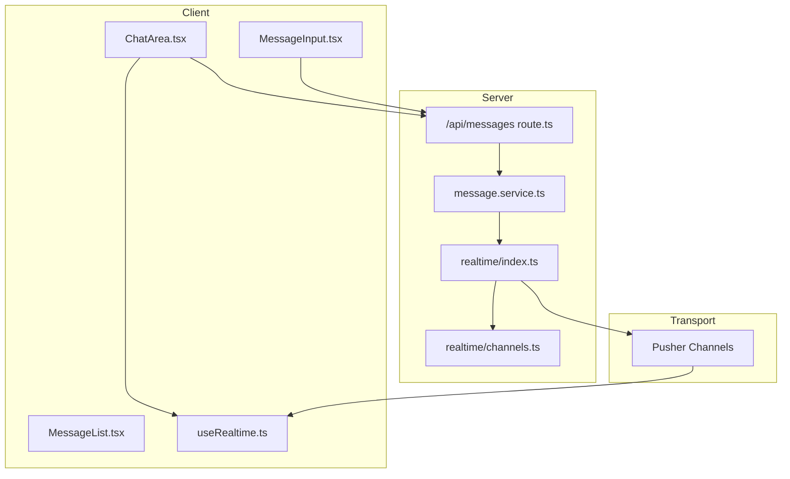
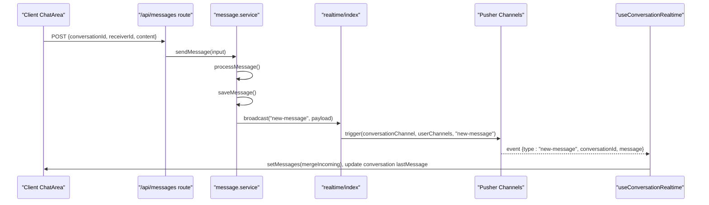
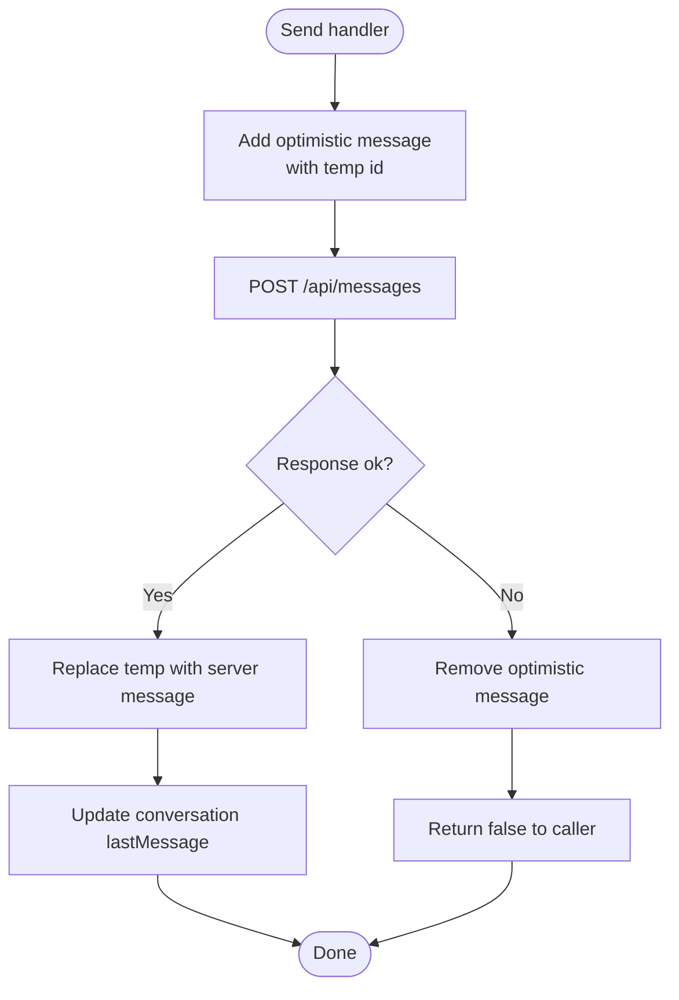
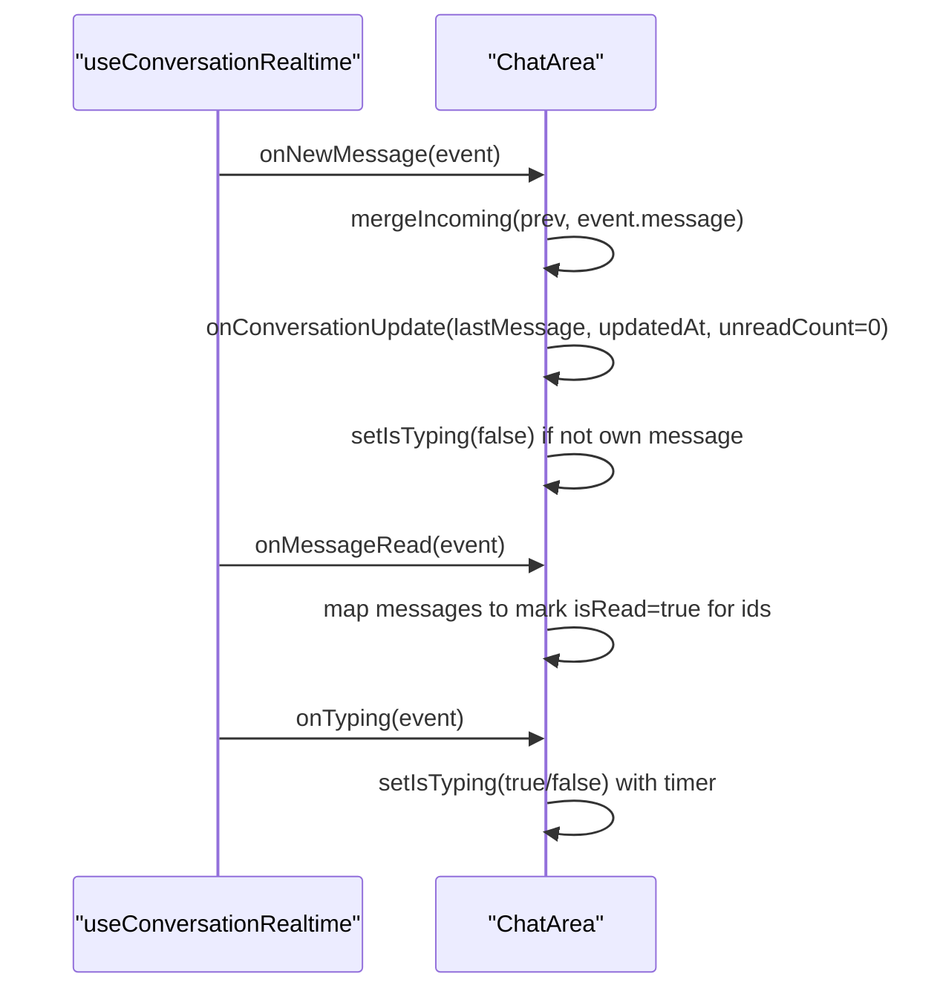
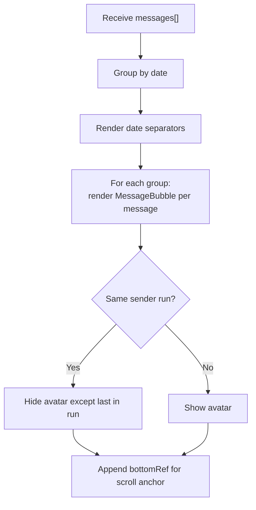
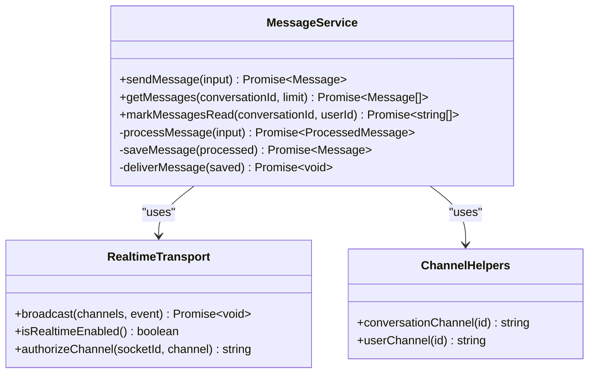
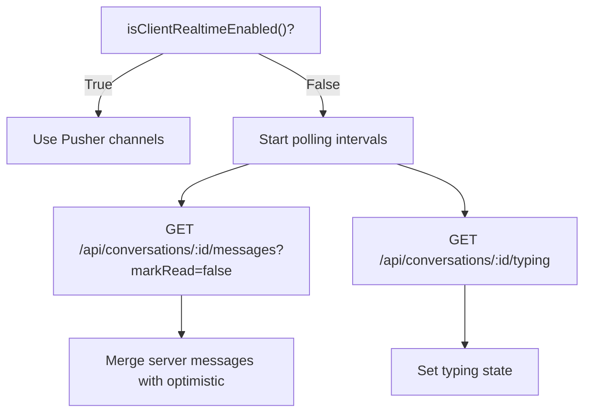
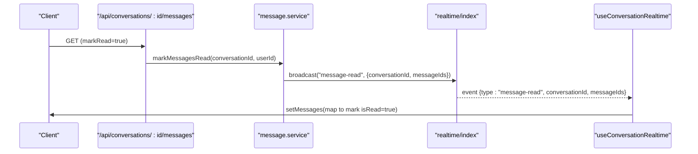
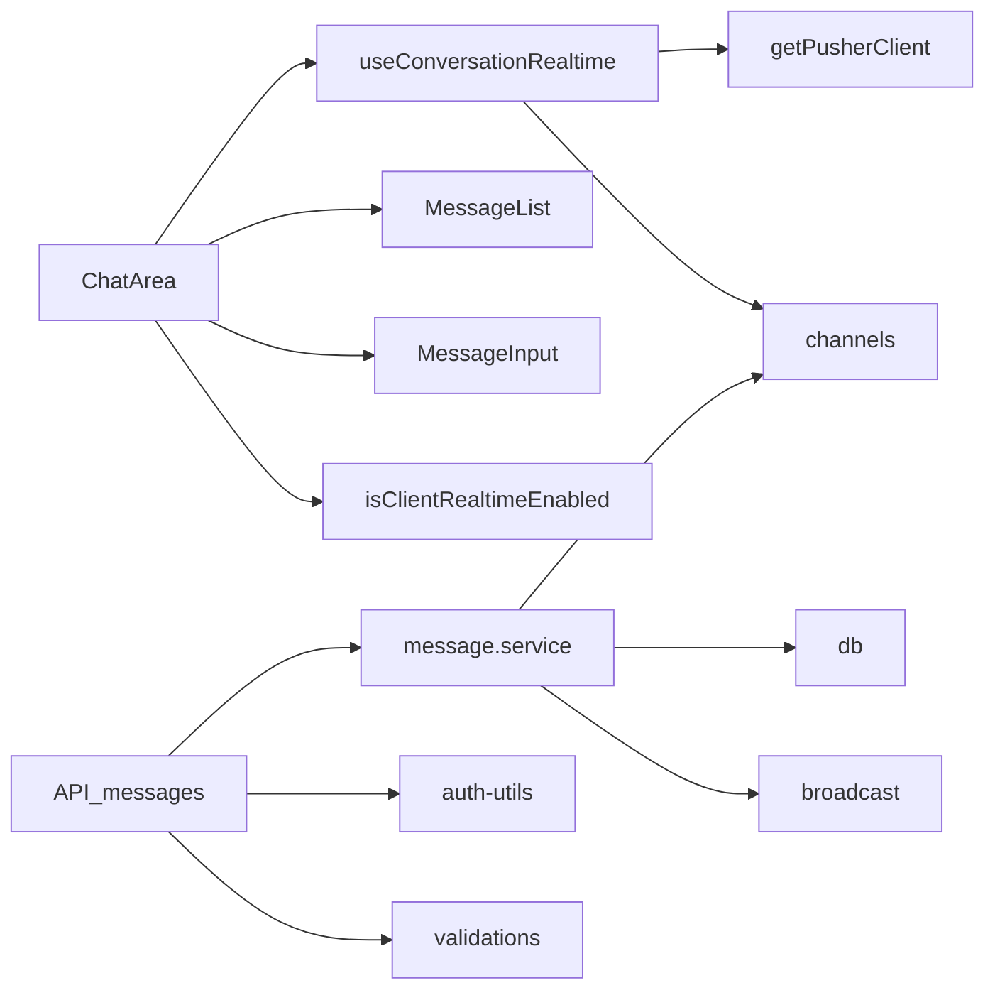

# Message Events

<cite>
**Referenced Files in This Document**
- [useRealtime.ts](file://hooks/useRealtime.ts)
- [MessageList.tsx](file://components/chat/MessageList.tsx)
- [route.ts (messages)](file://app/api/messages/route.ts)
- [index.ts (types)](file://types/index.ts)
- [message.service.ts](file://lib/services/message.service.ts)
- [client.ts](file://lib/realtime/client.ts)
- [index.ts (realtime server)](file://lib/realtime/index.ts)
- [channels.ts](file://lib/realtime/channels.ts)
- [ChatArea.tsx](file://components/chat/ChatArea.tsx)
- [MessageInput.tsx](file://components/chat/MessageInput.tsx)
- [route.ts (conversation messages)](file://app/api/conversations/[id]/messages/route.ts)
</cite>

## Table of Contents
1. [Introduction](#introduction)
2. [Project Structure](#project-structure)
3. [Core Components](#core-components)
4. [Architecture Overview](#architecture-overview)
5. [Detailed Component Analysis](#detailed-component-analysis)
6. [Dependency Analysis](#dependency-analysis)
7. [Performance Considerations](#performance-considerations)
8. [Troubleshooting Guide](#troubleshooting-guide)
9. [Conclusion](#conclusion)

## Introduction
This document explains the real-time message events used by the application, focusing on how messages flow from client send to recipient receive, the event payloads, and how the UI updates in real time. It covers:
- Event types for new messages and read receipts
- Payload structures including content, timestamps, and sender information
- Server-side processing and broadcasting via Pusher Channels
- Client-side handling in the chat area and message list
- Optimistic UI updates and error recovery strategies
- Examples of implementing listeners, formatting messages, and synchronizing state

## Project Structure
The messaging system spans API routes, a service layer, a realtime transport abstraction, and React components that subscribe to channels and update local state.

**Diagram sources**
- [ChatArea.tsx:134-176](file://components/chat/ChatArea.tsx#L134-L176)
- [useRealtime.ts:26-60](file://hooks/useRealtime.ts#L26-L60)
- [route.ts (messages):12-42](file://app/api/messages/route.ts#L12-L42)
- [message.service.ts:113-117](file://lib/services/message.service.ts#L113-L117)
- [index.ts (realtime server):63-78](file://lib/realtime/index.ts#L63-L78)
- [channels.ts:6-12](file://lib/realtime/channels.ts#L6-L12)

**Section sources**
- [ChatArea.tsx:1-292](file://components/chat/ChatArea.tsx#L1-L292)
- [useRealtime.ts:1-120](file://hooks/useRealtime.ts#L1-L120)
- [route.ts (messages):1-51](file://app/api/messages/route.ts#L1-L51)
- [message.service.ts:1-165](file://lib/services/message.service.ts#L1-L165)
- [index.ts (realtime server):1-78](file://lib/realtime/index.ts#L1-L78)
- [channels.ts:1-27](file://lib/realtime/channels.ts#L1-L27)

## Core Components
- Message event payloads are defined centrally and reused across server and client code.
- The message service orchestrates processing, persistence, and delivery.
- Realtime transport abstracts Pusher Channels and provides broadcast functions.
- Client hooks subscribe to private channels and dispatch handlers to UI state.
- ChatArea implements optimistic sends, merges incoming messages, and handles read receipts and typing indicators.
- MessageList renders grouped messages with date separators and bubble rendering.

Key payload types:
- New message event: includes conversationId and a full message object with id, content, timestamps, and sender info.
- Read receipt event: includes conversationId and an array of messageIds marked as read.
- Typing events: include conversationId, userId, username, and type indicating typing or stop-typing.

**Section sources**
- [index.ts (types):25-36](file://types/index.ts#L25-L36)
- [index.ts (types):91-117](file://types/index.ts#L91-L117)
- [message.service.ts:26-34](file://lib/services/message.service.ts#L26-L34)
- [message.service.ts:90-105](file://lib/services/message.service.ts#L90-L105)
- [useRealtime.ts:17-20](file://hooks/useRealtime.ts#L17-L20)
- [useRealtime.ts:65-69](file://hooks/useRealtime.ts#L65-L69)

## Architecture Overview
End-to-end message flow:
1. Client sends a message via POST /api/messages with conversationId, receiverId, and content.
2. Server validates input and participant permissions, then calls sendMessage.
3. sendMessage processes, persists, and delivers the message.
4. deliverMessage broadcasts a new-message event to:
   - The conversation channel
   - The receiver’s user channel
   - The sender’s user channel
5. Clients subscribed to these channels receive the event and update local state.
6. When recipients open the chat, unread messages are marked as read and a message-read event is broadcast back to update senders’ read status.

**Diagram sources**
- [route.ts (messages):12-42](file://app/api/messages/route.ts#L12-L42)
- [message.service.ts:113-117](file://lib/services/message.service.ts#L113-L117)
- [message.service.ts:90-105](file://lib/services/message.service.ts#L90-L105)
- [index.ts (realtime server):63-78](file://lib/realtime/index.ts#L63-L78)
- [useRealtime.ts:75-118](file://hooks/useRealtime.ts#L75-L118)
- [ChatArea.tsx:134-176](file://components/chat/ChatArea.tsx#L134-L176)

## Detailed Component Analysis

### Message Sending Flow and Optimistic UI
- ChatArea creates an optimistic message with a temporary id and appends it immediately to the UI.
- It posts the message to the server; on success, it replaces the temporary entry with the persisted message and updates the conversation summary.
- On failure, it removes the temporary message and returns false to the input component, which restores user text and shows an error.

**Diagram sources**
- [ChatArea.tsx:182-229](file://components/chat/ChatArea.tsx#L182-L229)
- [MessageInput.tsx:89-114](file://components/chat/MessageInput.tsx#L89-L114)

**Section sources**
- [ChatArea.tsx:182-229](file://components/chat/ChatArea.tsx#L182-L229)
- [MessageInput.tsx:89-114](file://components/chat/MessageInput.tsx#L89-L114)

### Realtime Event Handling in ChatArea
- Subscribes to the conversation channel using useConversationRealtime.
- onNewMessage merges incoming messages into local state, updates conversation metadata, and clears typing if the other user sent a message.
- onMessageRead marks messages as read locally to update read receipts.
- onTyping toggles typing indicator with auto-clear behavior.

**Diagram sources**
- [useRealtime.ts:75-118](file://hooks/useRealtime.ts#L75-L118)
- [ChatArea.tsx:134-176](file://components/chat/ChatArea.tsx#L134-L176)

**Section sources**
- [useRealtime.ts:75-118](file://hooks/useRealtime.ts#L75-L118)
- [ChatArea.tsx:134-176](file://components/chat/ChatArea.tsx#L134-L176)

### Message List Rendering and Grouping
- MessageList groups messages by date using a formatter and renders date separators.
- It determines whether to show avatars based on runs of consecutive messages from the same sender.
- It passes each message to MessageBubble along with ownership flags and run context.

**Diagram sources**
- [MessageList.tsx:49-97](file://components/chat/MessageList.tsx#L49-L97)

**Section sources**
- [MessageList.tsx:1-100](file://components/chat/MessageList.tsx#L1-L100)

### Server-Side Processing and Broadcasting
- The messages API validates input, verifies participant permissions, and delegates to sendMessage.
- sendMessage executes processMessage (passthrough), saveMessage (persist and update conversation timestamp), and deliverMessage (broadcast).
- deliverMessage constructs a new-message event with serialized message fields and broadcasts to conversation and user channels.

**Diagram sources**
- [message.service.ts:113-117](file://lib/services/message.service.ts#L113-L117)
- [message.service.ts:90-105](file://lib/services/message.service.ts#L90-L105)
- [index.ts (realtime server):63-78](file://lib/realtime/index.ts#L63-L78)
- [channels.ts:6-12](file://lib/realtime/channels.ts#L6-L12)

**Section sources**
- [route.ts (messages):12-42](file://app/api/messages/route.ts#L12-L42)
- [message.service.ts:113-117](file://lib/services/message.service.ts#L113-L117)
- [message.service.ts:90-105](file://lib/services/message.service.ts#L90-L105)
- [index.ts (realtime server):63-78](file://lib/realtime/index.ts#L63-L78)

### Polling Fallback When Realtime Is Disabled
- If Pusher keys are not configured, ChatArea falls back to polling for messages and typing state at intervals.
- Polling avoids overwriting optimistic messages by filtering out temporary entries until they appear in server responses.

**Diagram sources**
- [client.ts:7-11](file://lib/realtime/client.ts#L7-L11)
- [ChatArea.tsx:91-132](file://components/chat/ChatArea.tsx#L91-L132)

**Section sources**
- [client.ts:7-11](file://lib/realtime/client.ts#L7-L11)
- [ChatArea.tsx:91-132](file://components/chat/ChatArea.tsx#L91-L132)

### Read Receipts and Sender Updates
- When a user opens a conversation, unread messages are marked as read via the messages endpoint.
- The service broadcasts a message-read event to the conversation channel and to each sender’s user channel.
- ChatArea listens for message-read events and updates local message states to reflect read status.

**Diagram sources**
- [route.ts (conversation messages):11-34](file://app/api/conversations/[id]/messages/route.ts#L11-L34)
- [message.service.ts:139-163](file://lib/services/message.service.ts#L139-L163)
- [useRealtime.ts:95-99](file://hooks/useRealtime.ts#L95-L99)
- [ChatArea.tsx:149-157](file://components/chat/ChatArea.tsx#L149-L157)

**Section sources**
- [route.ts (conversation messages):11-34](file://app/api/conversations/[id]/messages/route.ts#L11-L34)
- [message.service.ts:139-163](file://lib/services/message.service.ts#L139-L163)
- [useRealtime.ts:95-99](file://hooks/useRealtime.ts#L95-L99)
- [ChatArea.tsx:149-157](file://components/chat/ChatArea.tsx#L149-L157)

## Dependency Analysis
- ChatArea depends on:
  - useConversationRealtime for event subscriptions
  - MessageList for rendering
  - MessageInput for sending
  - isClientRealtimeEnabled for fallback logic
- useRealtime depends on:
  - getPusherClient for client-side Pusher instance
  - conversationChannel/userChannel helpers
- message.service depends on:
  - database schema for persistence
  - realtime broadcast for delivery
  - channel helpers for addressing
- API routes depend on:
  - auth utilities for identity
  - validation schemas for input
  - service layer for business logic

**Diagram sources**
- [ChatArea.tsx:1-11](file://components/chat/ChatArea.tsx#L1-L11)
- [useRealtime.ts:1-11](file://hooks/useRealtime.ts#L1-L11)
- [message.service.ts:19-24](file://lib/services/message.service.ts#L19-L24)
- [route.ts (messages):1-5](file://app/api/messages/route.ts#L1-L5)

**Section sources**
- [ChatArea.tsx:1-11](file://components/chat/ChatArea.tsx#L1-L11)
- [useRealtime.ts:1-11](file://hooks/useRealtime.ts#L1-L11)
- [message.service.ts:19-24](file://lib/services/message.service.ts#L19-L24)
- [route.ts (messages):1-5](file://app/api/messages/route.ts#L1-L5)

## Performance Considerations
- Optimistic UI reduces perceived latency by showing messages immediately.
- Merging incoming messages avoids duplicates and preserves ordering.
- Polling intervals are conservative to avoid excessive network requests when realtime is unavailable.
- Broadcast failures are logged but do not block message persistence, ensuring reliability.

[No sources needed since this section provides general guidance]

## Troubleshooting Guide
Common issues and recovery strategies:
- Send failures:
  - Input validation errors return 400; ensure required fields are present and within limits.
  - Permission errors return 403; verify the sender is a participant in the conversation.
  - Network or server errors return 500; retry logic can be added around the fetch call.
- Missing realtime:
  - If Pusher keys are not configured, the app falls back to polling; verify environment variables for enabling realtime.
- Duplicate messages:
  - Ensure mergeIncoming filters out optimistic duplicates before appending server messages.
- Read receipts not updating:
  - Confirm message-read events are broadcast and that ChatArea maps messageIds to update local state.

**Section sources**
- [route.ts (messages):17-32](file://app/api/messages/route.ts#L17-L32)
- [route.ts (messages):43-49](file://app/api/messages/route.ts#L43-L49)
- [client.ts:7-11](file://lib/realtime/client.ts#L7-L11)
- [ChatArea.tsx:15-26](file://components/chat/ChatArea.tsx#L15-L26)
- [message.service.ts:139-163](file://lib/services/message.service.ts#L139-L163)

## Conclusion
The messaging system uses a clear separation of concerns: API routes validate and delegate, the service layer persists and broadcasts, and the client subscribes to channels to update UI in real time. New-message and message-read events carry structured payloads with content, timestamps, and sender information. Optimistic UI ensures responsiveness, while polling provides resilience when realtime is disabled. Error handling is robust, returning appropriate statuses and preserving user data on failures.

[No sources needed since this section summarizes without analyzing specific files]