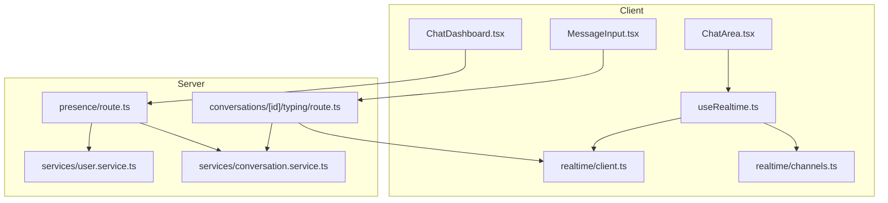
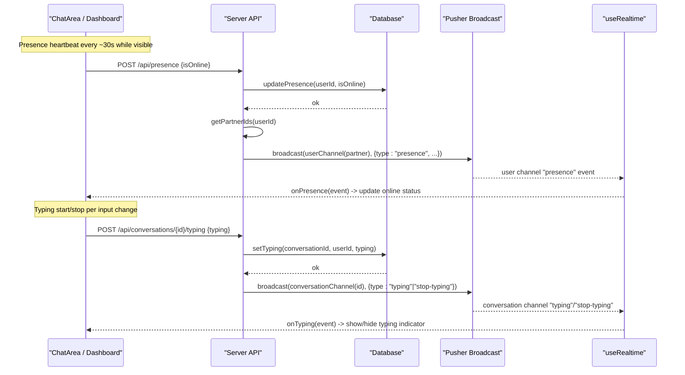
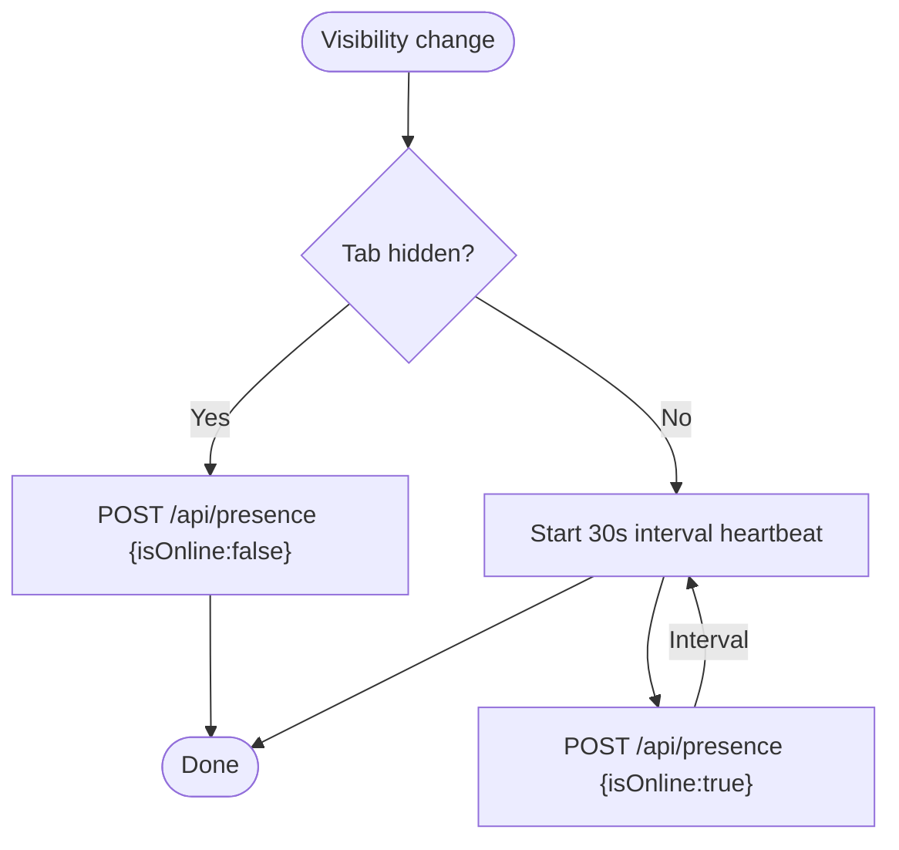
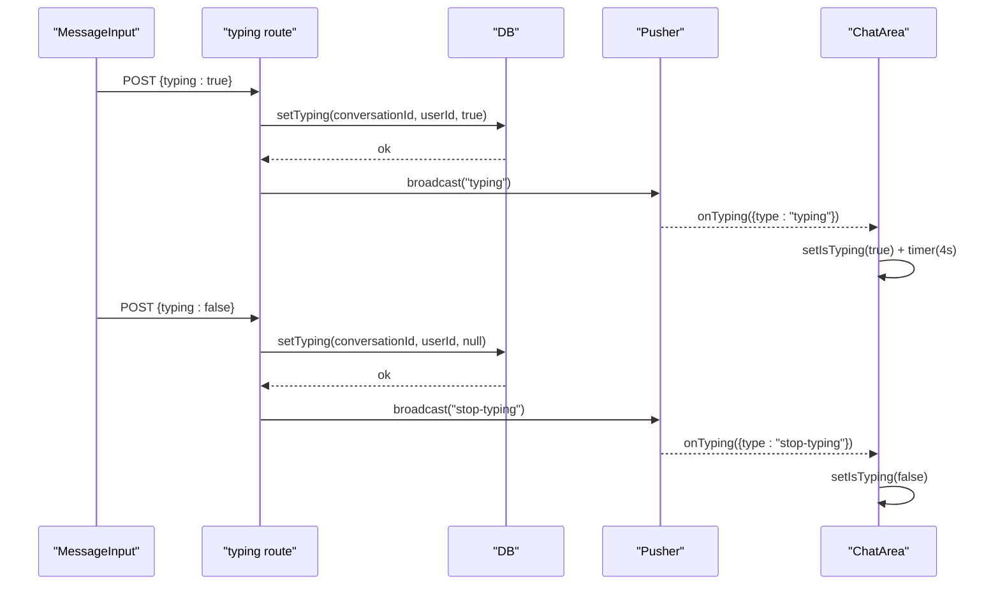
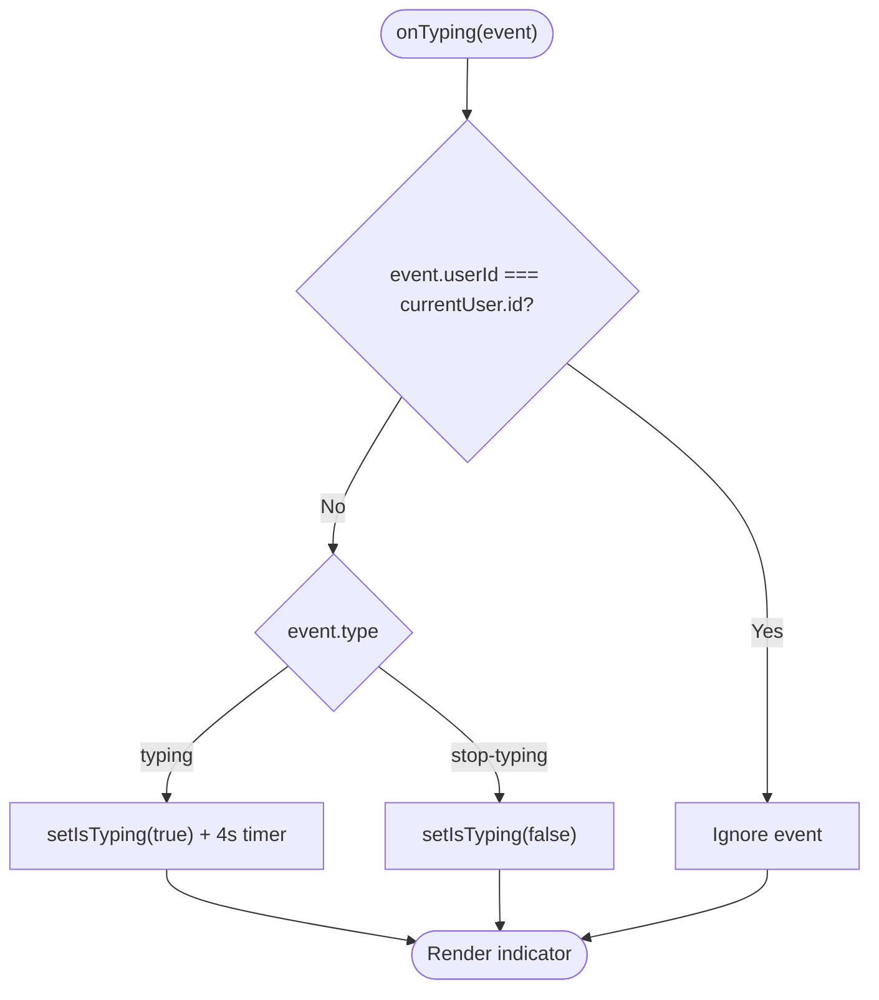
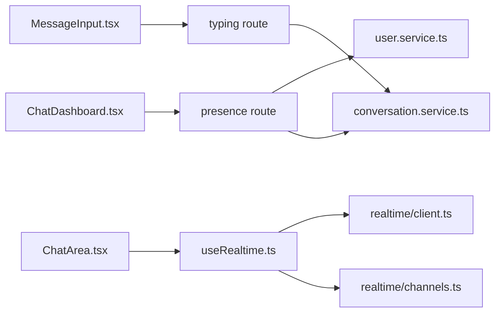

# Presence and Typing Events

<cite>
**Referenced Files in This Document**
- [presence route](file://app/api/presence/route.ts)
- [typing route](file://app/api/conversations/[id]/typing/route.ts)
- [realtime hooks](file://hooks/useRealtime.ts)
- [ChatArea component](file://components/chat/ChatArea.tsx)
- [MessageInput component](file://components/chat/MessageInput.tsx)
- [ChatDashboard component](file://components/chat/ChatDashboard.tsx)
- [types](file://types/index.ts)
- [Pusher client](file://lib/realtime/client.ts)
- [channel helpers](file://lib/realtime/channels.ts)
- [user service](file://lib/services/user.service.ts)
- [conversation service](file://lib/services/conversation.service.ts)
- [utils](file://lib/utils.ts)
</cite>

## Table of Contents
1. Introduction
2. Project Structure
3. Core Components
4. Architecture Overview
5. Detailed Component Analysis
6. Dependency Analysis
7. Performance Considerations
8. Troubleshooting Guide
9. Conclusion

## Introduction
This document explains how presence and typing indicator events work in the application. It covers user presence tracking (online/offline), presence channel subscriptions, availability detection, typing indicator lifecycle, UI integration patterns, event handling in ChatArea, typing state management, and performance considerations for high-frequency typing events. It also includes examples of implementing presence awareness, handling disconnections, and optimizing responsiveness.

## Project Structure
Presence and typing are implemented across API routes, a real-time hook layer, and UI components:
- Server-side APIs update presence and typing state and broadcast events via Pusher.
- Client-side hooks subscribe to private channels for presence and conversation events.
- UI components render online status and typing indicators and manage local timers for debouncing and auto-cleanup.

**Diagram sources**
- [ChatArea component:134-176](file://components/chat/ChatArea.tsx#L134-L176)
- [MessageInput component:33-75](file://components/chat/MessageInput.tsx#L33-L75)
- [ChatDashboard component:206-276](file://components/chat/ChatDashboard.tsx#L206-L276)
- [realtime hooks:26-61](file://hooks/useRealtime.ts#L26-L61)
- [realtime hooks:75-119](file://hooks/useRealtime.ts#L75-L119)
- [Pusher client:7-29](file://lib/realtime/client.ts#L7-L29)
- [channel helpers:6-12](file://lib/realtime/channels.ts#L6-L12)
- [presence route:14-42](file://app/api/presence/route.ts#L14-L42)
- [typing route:42-74](file://app/api/conversations/[id]/typing/route.ts#L42-L74)
- [user service:74-83](file://lib/services/user.service.ts#L74-L83)
- [conversation service:178-200](file://lib/services/conversation.service.ts#L178-L200)
- [conversation service:202-235](file://lib/services/conversation.service.ts#L202-L235)

**Section sources**
- [presence route:14-42](file://app/api/presence/route.ts#L14-L42)
- [typing route:14-36](file://app/api/conversations/[id]/typing/route.ts#L14-L36)
- [typing route:42-74](file://app/api/conversations/[id]/typing/route.ts#L42-L74)
- [realtime hooks:26-61](file://hooks/useRealtime.ts#L26-L61)
- [realtime hooks:75-119](file://hooks/useRealtime.ts#L75-L119)
- [ChatArea component:134-176](file://components/chat/ChatArea.tsx#L134-L176)
- [MessageInput component:33-75](file://components/chat/MessageInput.tsx#L33-L75)
- [ChatDashboard component:206-276](file://components/chat/ChatDashboard.tsx#L206-L276)

## Core Components
- Presence heartbeat and broadcasting: The presence endpoint updates the current user’s online status and last seen time, then broadcasts a presence event to all conversation partners’ private user channels when the status changes.
- Typing endpoints: A GET endpoint returns whether the other participant is currently typing; a POST endpoint sets or clears the typing timestamp and broadcasts typing or stop-typing events on the conversation channel.
- Realtime hooks: useUserRealtime subscribes to the user’s private channel for new messages and presence events; useConversationRealtime subscribes to the conversation channel for messages, read receipts, and typing events.
- UI integration: ChatArea renders online status and typing indicators, manages local timers for typing auto-clear, and merges incoming messages. MessageInput debounces typing updates and sends start/stop signals. ChatDashboard maintains a heartbeat while the dashboard is visible and updates the conversation list with presence changes.

**Section sources**
- [presence route:14-42](file://app/api/presence/route.ts#L14-L42)
- [typing route:14-36](file://app/api/conversations/[id]/typing/route.ts#L14-L36)
- [typing route:42-74](file://app/api/conversations/[id]/typing/route.ts#L42-L74)
- [realtime hooks:26-61](file://hooks/useRealtime.ts#L26-L61)
- [realtime hooks:75-119](file://hooks/useRealtime.ts#L75-L119)
- [ChatArea component:134-176](file://components/chat/ChatArea.tsx#L134-L176)
- [MessageInput component:33-75](file://components/chat/MessageInput.tsx#L33-L75)
- [ChatDashboard component:206-276](file://components/chat/ChatDashboard.tsx#L206-L276)

## Architecture Overview
The system uses Pusher private channels for real-time delivery and falls back to polling when Pusher is not configured. Presence events target each partner’s user channel; typing events target the conversation channel.

**Diagram sources**
- [ChatDashboard component:206-276](file://components/chat/ChatDashboard.tsx#L206-L276)
- [presence route:14-42](file://app/api/presence/route.ts#L14-L42)
- [conversation service:178-200](file://lib/services/conversation.service.ts#L178-L200)
- [typing route:42-74](file://app/api/conversations/[id]/typing/route.ts#L42-L74)
- [realtime hooks:26-61](file://hooks/useRealtime.ts#L26-L61)
- [realtime hooks:75-119](file://hooks/useRealtime.ts#L75-L119)

## Detailed Component Analysis

### Presence Tracking
- Heartbeat: The dashboard posts a presence heartbeat while visible and marks offline when hidden. A 45-second TTL determines “recently online” for display purposes.
- Status change broadcast: When the server detects a transition from online to offline or vice versa, it fans out presence events to all conversation partners’ private user channels.
- UI updates: The dashboard updates the conversation list’s otherUser.isOnline and lastSeen upon receiving presence events. ChatArea reflects the current user’s online status in the header using props and local state.

**Diagram sources**
- [ChatDashboard component:206-276](file://components/chat/ChatDashboard.tsx#L206-L276)
- [presence route:14-42](file://app/api/presence/route.ts#L14-L42)
- [utils:45-56](file://lib/utils.ts#L45-L56)

**Section sources**
- [ChatDashboard component:206-276](file://components/chat/ChatDashboard.tsx#L206-L276)
- [presence route:14-42](file://app/api/presence/route.ts#L14-L42)
- [user service:74-83](file://lib/services/user.service.ts#L74-L83)
- [conversation service:178-200](file://lib/services/conversation.service.ts#L178-L200)
- [utils:45-56](file://lib/utils.ts#L45-L56)

### Typing Indicator Lifecycle
- Input side: On text changes, the input debounces sending typing=true and schedules a stop-typing after a debounce window. On send or unmount, it ensures stop-typing is sent.
- Server side: The typing endpoint persists typingAt timestamps and broadcasts typing or stop-typing events to the conversation channel.
- Consumer side: ChatArea listens for typing events, ignores own events, shows the indicator, and auto-clears after a fixed timeout matching server TTL. Polling fallback updates typing state when Pusher is disabled.

**Diagram sources**
- [MessageInput component:33-75](file://components/chat/MessageInput.tsx#L33-L75)
- [typing route:42-74](file://app/api/conversations/[id]/typing/route.ts#L42-L74)
- [conversation service:202-235](file://lib/services/conversation.service.ts#L202-L235)
- [ChatArea component:158-175](file://components/chat/ChatArea.tsx#L158-L175)

**Section sources**
- [MessageInput component:33-75](file://components/chat/MessageInput.tsx#L33-L75)
- [typing route:42-74](file://app/api/conversations/[id]/typing/route.ts#L42-L74)
- [conversation service:202-235](file://lib/services/conversation.service.ts#L202-L235)
- [ChatArea component:158-175](file://components/chat/ChatArea.tsx#L158-L175)

### ChatArea Event Handling
- Realtime subscription: Binds to conversation channel events for new messages, read receipts, and typing.
- Incoming message merge: Merges new messages into local state and clears typing if the other user sent a message.
- Typing state: Sets typing based on events and clears automatically after a timeout. Also polls typing state when realtime is disabled.

**Diagram sources**
- [ChatArea component:158-175](file://components/chat/ChatArea.tsx#L158-L175)

**Section sources**
- [ChatArea component:134-176](file://components/chat/ChatArea.tsx#L134-L176)
- [ChatArea component:91-132](file://components/chat/ChatArea.tsx#L91-L132)

### User Channel Subscriptions and Presence Awareness
- The dashboard subscribes to the user’s private channel to receive presence events and new messages.
- Presence events update the conversation list’s otherUser fields, reflecting online status and last seen time.

**Section sources**
- [realtime hooks:26-61](file://hooks/useRealtime.ts#L26-L61)
- [ChatDashboard component:147-196](file://components/chat/ChatDashboard.tsx#L147-L196)

### Types and Channels
- Event payloads define types for new-message, message-read, typing/stop-typing, and presence events.
- Channel helpers provide consistent naming for private user and conversation channels used by both client and server.

**Section sources**
- [types:91-117](file://types/index.ts#L91-L117)
- [channel helpers:6-12](file://lib/realtime/channels.ts#L6-L12)

## Dependency Analysis
- Client-to-server dependencies:
  - ChatArea depends on useConversationRealtime for typing and message events.
  - MessageInput depends on the typing API to persist and broadcast typing state.
  - ChatDashboard depends on presence API for heartbeat and useUserRealtime for presence events.
- Server dependencies:
  - Presence route depends on user service to update presence and conversation service to fan out to partners.
  - Typing route depends on conversation service to set/check typing state and broadcast to the conversation channel.
- External dependencies:
  - Pusher client initialization and channel authorization endpoint.

**Diagram sources**
- [MessageInput component:33-75](file://components/chat/MessageInput.tsx#L33-L75)
- [ChatArea component:134-176](file://components/chat/ChatArea.tsx#L134-L176)
- [ChatDashboard component:206-276](file://components/chat/ChatDashboard.tsx#L206-L276)
- [realtime hooks:26-61](file://hooks/useRealtime.ts#L26-L61)
- [realtime hooks:75-119](file://hooks/useRealtime.ts#L75-L119)
- [presence route:14-42](file://app/api/presence/route.ts#L14-L42)
- [typing route:42-74](file://app/api/conversations/[id]/typing/route.ts#L42-L74)
- [user service:74-83](file://lib/services/user.service.ts#L74-L83)
- [conversation service:178-200](file://lib/services/conversation.service.ts#L178-L200)

**Section sources**
- [presence route:14-42](file://app/api/presence/route.ts#L14-L42)
- [typing route:42-74](file://app/api/conversations/[id]/typing/route.ts#L42-L74)
- [realtime hooks:26-61](file://hooks/useRealtime.ts#L26-L61)
- [realtime hooks:75-119](file://hooks/useRealtime.ts#L75-L119)
- [user service:74-83](file://lib/services/user.service.ts#L74-L83)
- [conversation service:178-200](file://lib/services/conversation.service.ts#L178-L200)

## Performance Considerations
- Debounce typing updates: MessageInput uses a debounce window to reduce network calls during rapid typing.
- Auto-clear timers: ChatArea clears typing after a fixed timeout aligned with server TTL to avoid stale indicators.
- Polling fallback: When Pusher is disabled, ChatArea polls messages and typing at intervals to maintain responsiveness without real-time.
- Presence TTL: A 45-second TTL prevents flapping online/offline states due to transient network issues.
- Fan-out batching: Presence broadcast slices partner lists to limit channel batches.

[No sources needed since this section provides general guidance]

## Troubleshooting Guide
- Unauthorized errors: Both presence and typing endpoints return 401 when session validation fails. Ensure authentication is active and tokens are valid.
- Forbidden errors: Typing endpoints validate participation in the conversation; ensure the user is a participant before calling.
- Missing Pusher configuration: If NEXT_PUBLIC_PUSHER_KEY or NEXT_PUBLIC_PUSHER_CLUSTER are not set, the client disables Pusher and falls back to polling. Verify environment variables for real-time features.
- Stale typing indicators: If the indicator remains stuck, verify that stop-typing events are being sent on unmount or send actions and that the server TTL matches client timeouts.
- Presence not updating: Confirm heartbeats are running while the dashboard is visible and that visibilitychange events are firing. Check network requests to /api/presence.

**Section sources**
- [presence route:43-49](file://app/api/presence/route.ts#L43-L49)
- [typing route:29-35](file://app/api/conversations/[id]/typing/route.ts#L29-L35)
- [typing route:75-81](file://app/api/conversations/[id]/typing/route.ts#L75-L81)
- [Pusher client:7-11](file://lib/realtime/client.ts#L7-L11)
- [ChatArea component:91-132](file://components/chat/ChatArea.tsx#L91-L132)
- [ChatDashboard component:206-276](file://components/chat/ChatDashboard.tsx#L206-L276)

## Conclusion
The application implements robust presence and typing features using a combination of server-side persistence, real-time broadcasting, and resilient client logic. Presence heartbeats and TTL-based availability detection keep user status accurate, while debounced typing updates and auto-clear timers ensure responsive UI behavior. The design gracefully falls back to polling when real-time is unavailable and handles common error cases with clear responses.

[No sources needed since this section summarizes without analyzing specific files]