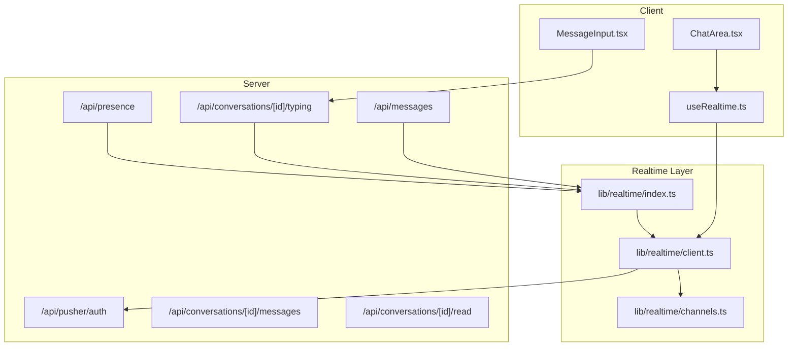
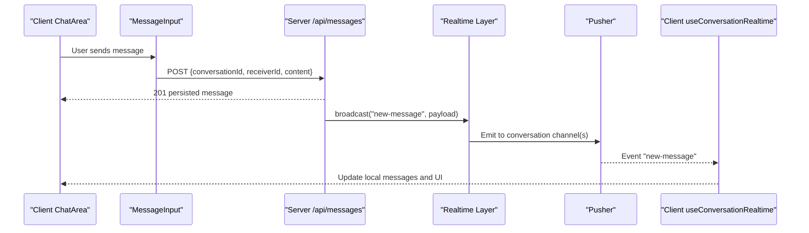
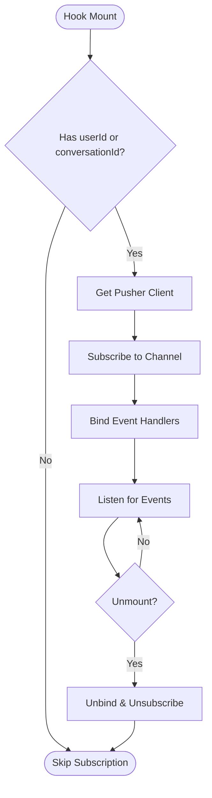
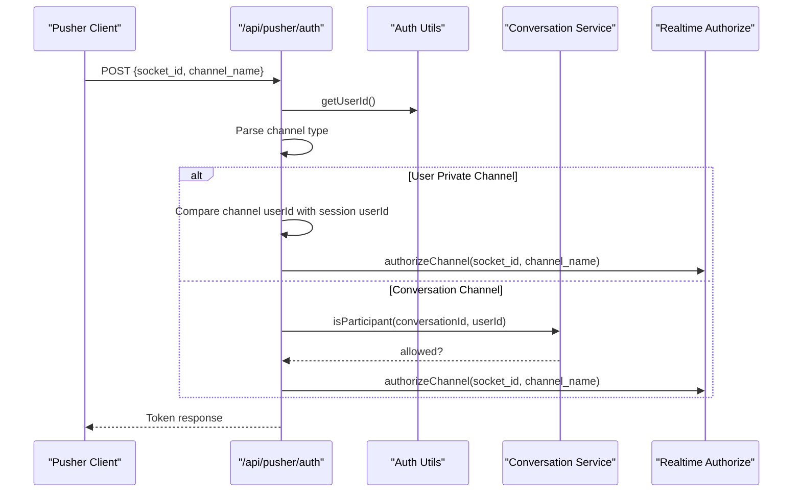
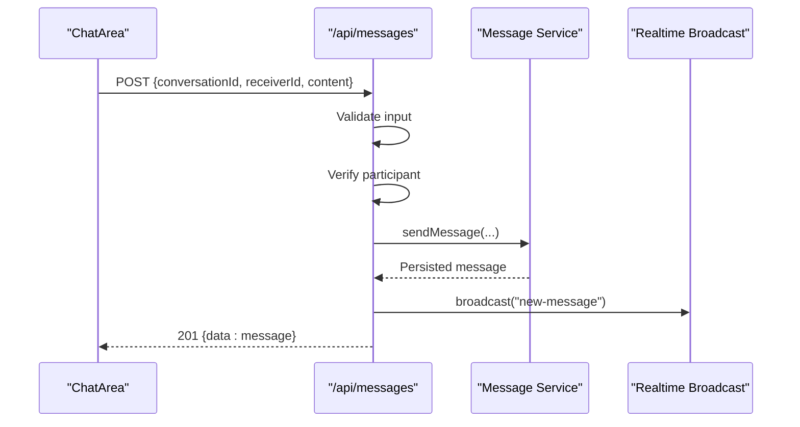
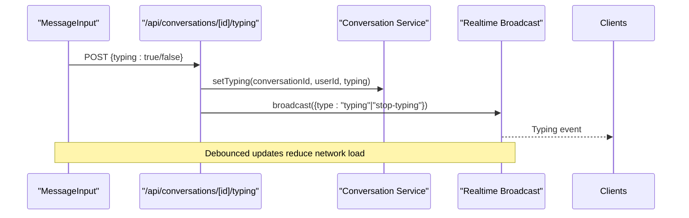
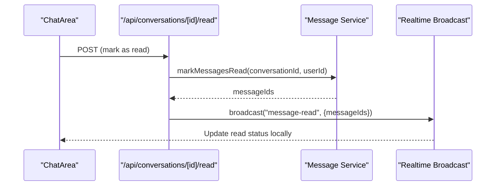
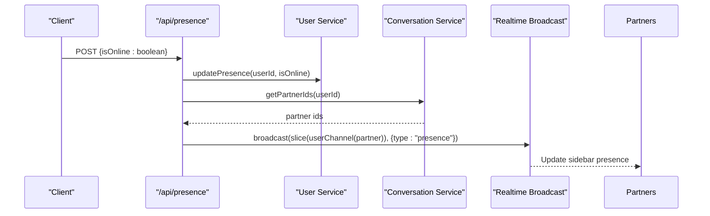
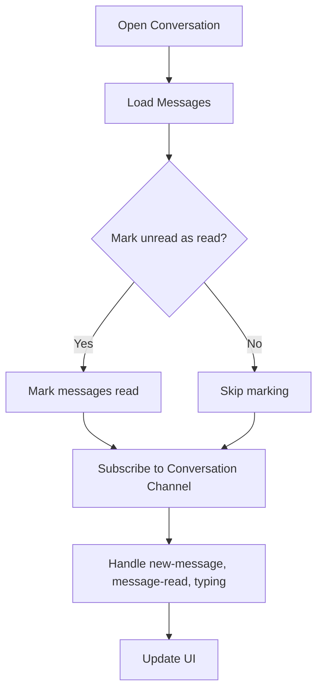
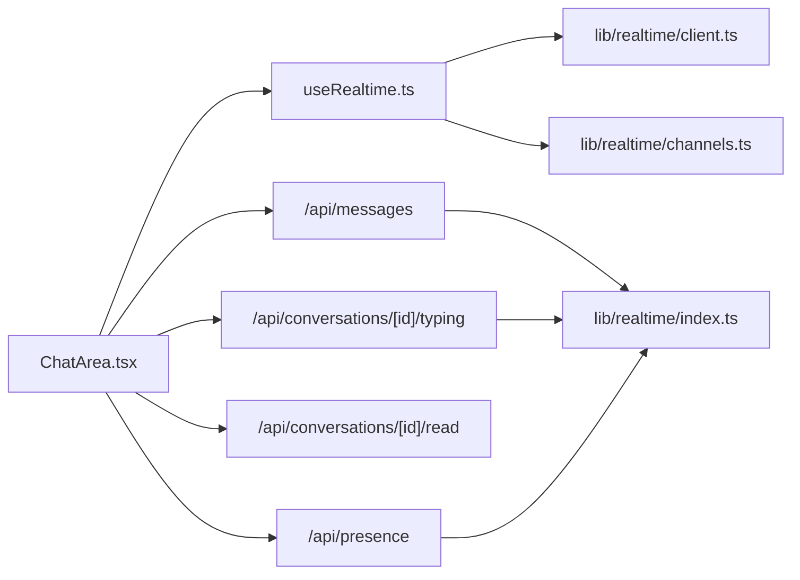

# Real-Time Messaging System

<cite>
**Referenced Files in This Document**
- [useRealtime.ts](file://hooks/useRealtime.ts)
- [route.ts (Pusher auth)](file://app/api/pusher/auth/route.ts)
- [route.ts (messages)](file://app/api/messages/route.ts)
- [route.ts (conversation messages)](file://app/api/conversations/[id]/messages/route.ts)
- [route.ts (typing)](file://app/api/conversations/[id]/typing/route.ts)
- [route.ts (read receipts)](file://app/api/conversations/[id]/read/route.ts)
- [route.ts (presence)](file://app/api/presence/route.ts)
- [ChatArea.tsx](file://components/chat/ChatArea.tsx)
- [MessageInput.tsx](file://components/chat/MessageInput.tsx)
- [index.ts (types)](file://types/index.ts)
- [channels.ts](file://lib/realtime/channels.ts)
- [client.ts](file://lib/realtime/client.ts)
- [index.ts (realtime)](file://lib/realtime/index.ts)
</cite>

## Table of Contents
1. [Introduction](#introduction)
2. [Project Structure](#project-structure)
3. [Core Components](#core-components)
4. [Architecture Overview](#architecture-overview)
5. [Detailed Component Analysis](#detailed-component-analysis)
6. [Dependency Analysis](#dependency-analysis)
7. [Performance Considerations](#performance-considerations)
8. [Troubleshooting Guide](#troubleshooting-guide)
9. [Conclusion](#conclusion)
10. [Appendices](#appendices)

## Introduction
This document explains the real-time messaging system built on Pusher Channels within a Next.js application. It covers WebSocket connection management, channel subscription patterns, event broadcasting for messages and presence updates, and client-side event handling. It also documents the integration between server-side API routes and client-side hooks, including message sending/receiving flows, typing indicators, read receipts, and user presence tracking. Finally, it addresses connection lifecycle management, error handling, reconnection strategies, fallback mechanisms, debugging, performance optimization, scalability, and monitoring for production.

## Project Structure
The real-time features are implemented across:
- Client hooks that manage Pusher subscriptions and bind events to UI state
- Server API routes that authorize channels, persist messages, update presence, and broadcast events
- Shared types defining event payloads and data models
- UI components orchestrating message send/receive, typing indicators, and presence display

**Diagram sources**
- [ChatArea.tsx:134-176](file://components/chat/ChatArea.tsx#L134-L176)
- [MessageInput.tsx:33-47](file://components/chat/MessageInput.tsx#L33-L47)
- [useRealtime.ts:26-61](file://hooks/useRealtime.ts#L26-L61)
- [useRealtime.ts:75-119](file://hooks/useRealtime.ts#L75-L119)
- [route.ts (Pusher auth):11-62](file://app/api/pusher/auth/route.ts#L11-L62)
- [route.ts (messages):12-50](file://app/api/messages/route.ts#L12-L50)
- [route.ts (typing):14-82](file://app/api/conversations/[id]/typing/route.ts#L14-L82)
- [route.ts (read receipts):10-32](file://app/api/conversations/[id]/read/route.ts#L10-L32)
- [route.ts (presence):14-50](file://app/api/presence/route.ts#L14-L50)

**Section sources**
- [ChatArea.tsx:1-292](file://components/chat/ChatArea.tsx#L1-L292)
- [MessageInput.tsx:1-193](file://components/chat/MessageInput.tsx#L1-L193)
- [useRealtime.ts:1-120](file://hooks/useRealtime.ts#L1-L120)
- [route.ts (Pusher auth):1-63](file://app/api/pusher/auth/route.ts#L1-L63)
- [route.ts (messages):1-51](file://app/api/messages/route.ts#L1-L51)
- [route.ts (conversation messages):1-43](file://app/api/conversations/[id]/messages/route.ts#L1-L43)
- [route.ts (typing):1-83](file://app/api/conversations/[id]/typing/route.ts#L1-L83)
- [route.ts (read receipts):1-33](file://app/api/conversations/[id]/read/route.ts#L1-L33)
- [route.ts (presence):1-51](file://app/api/presence/route.ts#L1-L51)

## Core Components
- Client realtime hook: Subscribes to private user and conversation channels, binds events for new messages, read receipts, typing, and presence, and cleans up listeners on unmount.
- Server authorization: Validates channel access for user-private and conversation channels before issuing Pusher tokens.
- Message flow: Client sends via REST; server persists and broadcasts new-message to relevant channels.
- Typing indicators: Client debounces typing events; server stores transient state and broadcasts typing/stop-typing.
- Read receipts: Client marks messages as read via REST; server broadcasts message-read events.
- Presence: Heartbeat updates online status; server broadcasts presence changes to partner user channels.

**Section sources**
- [useRealtime.ts:26-119](file://hooks/useRealtime.ts#L26-L119)
- [route.ts (Pusher auth):11-62](file://app/api/pusher/auth/route.ts#L11-L62)
- [route.ts (messages):12-50](file://app/api/messages/route.ts#L12-L50)
- [route.ts (typing):14-82](file://app/api/conversations/[id]/typing/route.ts#L14-L82)
- [route.ts (read receipts):10-32](file://app/api/conversations/[id]/read/route.ts#L10-L32)
- [route.ts (presence):14-50](file://app/api/presence/route.ts#L14-L50)

## Architecture Overview
The system combines REST APIs for persistence with Pusher Channels for real-time delivery. The client uses React hooks to subscribe to channels and handle events. The server authorizes channel access and broadcasts events after performing side effects.

**Diagram sources**
- [ChatArea.tsx:182-229](file://components/chat/ChatArea.tsx#L182-L229)
- [MessageInput.tsx:89-114](file://components/chat/MessageInput.tsx#L89-L114)
- [route.ts (messages):12-50](file://app/api/messages/route.ts#L12-L50)
- [useRealtime.ts:75-119](file://hooks/useRealtime.ts#L75-L119)

## Detailed Component Analysis

### Client Realtime Hook (useRealtime.ts)
- Subscribes to a private user channel for incoming messages and presence updates.
- Subscribes to a conversation channel for new messages, read receipts, and typing events.
- Binds/unbinds event handlers and unsubscribes on cleanup to prevent memory leaks.
- Uses refs to keep handler functions current without re-subscribing.

**Diagram sources**
- [useRealtime.ts:26-61](file://hooks/useRealtime.ts#L26-L61)
- [useRealtime.ts:75-119](file://hooks/useRealtime.ts#L75-L119)

**Section sources**
- [useRealtime.ts:1-120](file://hooks/useRealtime.ts#L1-L120)

### Pusher Authorization Route (/api/pusher/auth)
- Validates that real-time is enabled.
- Parses socket_id and channel_name from JSON or form data.
- Authorizes user-private channels by matching channel name to session userId.
- Authorizes conversation channels by verifying the current user is a participant.
- Returns Pusher token via shared authorization utility.

**Diagram sources**
- [route.ts (Pusher auth):11-62](file://app/api/pusher/auth/route.ts#L11-L62)

**Section sources**
- [route.ts (Pusher auth):1-63](file://app/api/pusher/auth/route.ts#L1-L63)

### Message Sending Flow (/api/messages)
- Validates request body using schema validation.
- Verifies sender is a participant in the conversation.
- Persists the message via service layer.
- Broadcasts new-message event to the conversation channel(s).

**Diagram sources**
- [route.ts (messages):12-50](file://app/api/messages/route.ts#L12-L50)
- [ChatArea.tsx:182-229](file://components/chat/ChatArea.tsx#L182-L229)

**Section sources**
- [route.ts (messages):1-51](file://app/api/messages/route.ts#L1-L51)

### Typing Indicators (/api/conversations/[id]/typing)
- GET: Polling fallback returns whether the other participant is currently typing.
- POST: Updates transient typing state and broadcasts typing or stop-typing events.
- Client debounces typing updates and stops typing on component unmount.

**Diagram sources**
- [MessageInput.tsx:33-75](file://components/chat/MessageInput.tsx#L33-L75)
- [route.ts (typing):42-82](file://app/api/conversations/[id]/typing/route.ts#L42-L82)

**Section sources**
- [route.ts (typing):1-83](file://app/api/conversations/[id]/typing/route.ts#L1-L83)
- [MessageInput.tsx:1-193](file://components/chat/MessageInput.tsx#L1-L193)

### Read Receipts (/api/conversations/[id]/read)
- Marks incoming messages as read for the current user.
- Broadcasts message-read events so all participants update their UI.

**Diagram sources**
- [route.ts (read receipts):10-32](file://app/api/conversations/[id]/read/route.ts#L10-L32)
- [ChatArea.tsx:149-157](file://components/chat/ChatArea.tsx#L149-L157)

**Section sources**
- [route.ts (read receipts):1-33](file://app/api/conversations/[id]/read/route.ts#L1-L33)

### Presence Tracking (/api/presence)
- Heartbeat endpoint updates online status and last seen timestamp.
- On online/offline transitions, broadcasts presence events to partner user channels.
- Limits broadcast batches to avoid exceeding channel limits.

**Diagram sources**
- [route.ts (presence):14-50](file://app/api/presence/route.ts#L14-L50)

**Section sources**
- [route.ts (presence):1-51](file://app/api/presence/route.ts#L1-L51)

### Chat Area Integration
- Loads message history and marks unread as read when opening a chat.
- Subscribes to conversation channel events for new messages, read receipts, and typing.
- Implements optimistic UI for outgoing messages and merges incoming messages.
- Provides polling fallback when real-time is disabled.

**Diagram sources**
- [ChatArea.tsx:57-89](file://components/chat/ChatArea.tsx#L57-L89)
- [ChatArea.tsx:91-132](file://components/chat/ChatArea.tsx#L91-L132)
- [ChatArea.tsx:134-176](file://components/chat/ChatArea.tsx#L134-L176)

**Section sources**
- [ChatArea.tsx:1-292](file://components/chat/ChatArea.tsx#L1-L292)

## Dependency Analysis
- Client depends on:
  - useRealtime hook for channel subscriptions and event binding
  - lib/realtime modules for client initialization, channel naming, and broadcasting utilities
  - API endpoints for sending messages, updating typing, marking read, and presence heartbeats
- Server depends on:
  - Authentication utilities to resolve current user
  - Services for persistence and business logic
  - Realtime module to broadcast events to Pusher channels

**Diagram sources**
- [ChatArea.tsx:134-176](file://components/chat/ChatArea.tsx#L134-L176)
- [useRealtime.ts:26-119](file://hooks/useRealtime.ts#L26-L119)
- [route.ts (messages):12-50](file://app/api/messages/route.ts#L12-L50)
- [route.ts (typing):42-82](file://app/api/conversations/[id]/typing/route.ts#L42-L82)
- [route.ts (read receipts):10-32](file://app/api/conversations/[id]/read/route.ts#L10-L32)
- [route.ts (presence):14-50](file://app/api/presence/route.ts#L14-L50)

**Section sources**
- [useRealtime.ts:1-120](file://hooks/useRealtime.ts#L1-L120)
- [ChatArea.tsx:1-292](file://components/chat/ChatArea.tsx#L1-L292)
- [route.ts (messages):1-51](file://app/api/messages/route.ts#L1-L51)
- [route.ts (typing):1-83](file://app/api/conversations/[id]/typing/route.ts#L1-L83)
- [route.ts (read receipts):1-33](file://app/api/conversations/[id]/read/route.ts#L1-L33)
- [route.ts (presence):1-51](file://app/api/presence/route.ts#L1-L51)

## Performance Considerations
- Debounce typing updates to reduce unnecessary network calls.
- Use optimistic UI for message sending to improve perceived latency.
- Limit presence broadcast batches to avoid exceeding channel limits.
- Prefer real-time events over polling; fall back to polling only when real-time is disabled.
- Avoid redundant reads by using ?markRead=false during polling intervals.

[No sources needed since this section provides general guidance]

## Troubleshooting Guide
- Authorization failures:
  - Ensure real-time is enabled and configuration is correct.
  - Verify channel names match expected formats and users have permission.
- Missing events:
  - Confirm clients subscribe to the correct channels and bind handlers.
  - Check server logs for broadcast errors and ensure services return success.
- Typing not updating:
  - Verify debouncing logic and that stop-typing is sent on unmount.
  - Confirm GET /typing returns expected state for polling fallback.
- Read receipts not reflecting:
  - Ensure mark-as-read endpoint is called and message-read events are broadcast.
- Presence stale:
  - Confirm heartbeat is sent regularly and transitions trigger broadcasts.

**Section sources**
- [route.ts (Pusher auth):11-62](file://app/api/pusher/auth/route.ts#L11-L62)
- [route.ts (typing):14-82](file://app/api/conversations/[id]/typing/route.ts#L14-L82)
- [route.ts (read receipts):10-32](file://app/api/conversations/[id]/read/route.ts#L10-L32)
- [route.ts (presence):14-50](file://app/api/presence/route.ts#L14-L50)

## Conclusion
The system integrates REST-based persistence with Pusher Channels for real-time messaging. Client hooks manage subscriptions and event handling, while server routes enforce security and broadcast events. Typing indicators, read receipts, and presence updates provide a responsive chat experience. With proper error handling, fallbacks, and scalable broadcasting, the solution supports production deployments.

[No sources needed since this section summarizes without analyzing specific files]

## Appendices

### Data Models and Event Types
- Message, Conversation, PublicUser define core entities.
- Realtime payloads include new-message, message-read, typing/stop-typing, and presence events.

**Section sources**
- [index.ts (types):25-118](file://types/index.ts#L25-L118)

### Connection Lifecycle Management
- Initialize Pusher client once per app context.
- Subscribe to channels when user or conversation context becomes available.
- Unbind handlers and unsubscribe on cleanup to prevent leaks.
- Reconnect automatically via Pusher client; handle offline states gracefully.

**Section sources**
- [useRealtime.ts:26-61](file://hooks/useRealtime.ts#L26-L61)
- [useRealtime.ts:75-119](file://hooks/useRealtime.ts#L75-L119)

### Fallback Mechanisms
- When real-time is disabled, poll for new messages and typing state at intervals.
- Use markRead=false during polling to avoid rewriting rows repeatedly.

**Section sources**
- [ChatArea.tsx:91-132](file://components/chat/ChatArea.tsx#L91-L132)

### Debugging WebSocket Connections
- Inspect Pusher authentication responses and channel subscriptions.
- Log event bindings and unbindings to verify lifecycle.
- Monitor server logs for broadcast errors and authorization failures.

**Section sources**
- [route.ts (Pusher auth):11-62](file://app/api/pusher/auth/route.ts#L11-L62)
- [useRealtime.ts:26-119](file://hooks/useRealtime.ts#L26-L119)

### Scalability and Monitoring
- Batch presence broadcasts to respect channel limits.
- Use efficient channel naming and minimize event payloads.
- Track metrics for message throughput, typing updates, and presence transitions.
- Alert on authorization failures and broadcast errors.

**Section sources**
- [route.ts (presence):14-50](file://app/api/presence/route.ts#L14-L50)