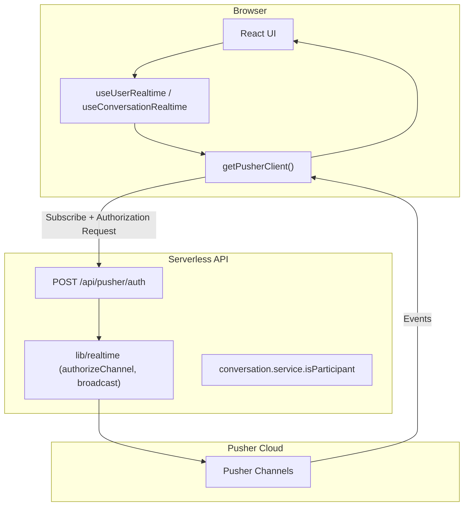
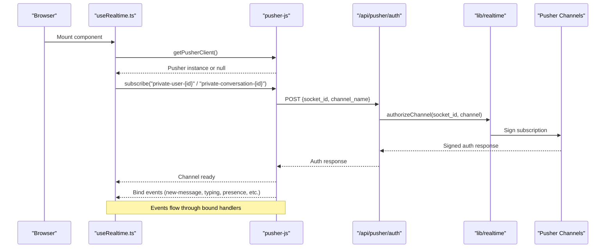
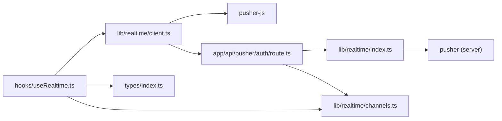

# WebSocket Connection Management

<cite>
**Referenced Files in This Document**
- [client.ts](file://lib/realtime/client.ts)
- [index.ts](file://lib/realtime/index.ts)
- [channels.ts](file://lib/realtime/channels.ts)
- [route.ts](file://app/api/pusher/auth/route.ts)
- [useRealtime.ts](file://hooks/useRealtime.ts)
- [page.tsx](file://app/(chat)/chat/page.tsx)
- [index.ts](file://types/index.ts)
</cite>

## Table of Contents
1. [Introduction](#introduction)
2. [Project Structure](#project-structure)
3. [Core Components](#core-components)
4. [Architecture Overview](#architecture-overview)
5. [Detailed Component Analysis](#detailed-component-analysis)
6. [Dependency Analysis](#dependency-analysis)
7. [Performance Considerations](#performance-considerations)
8. [Troubleshooting Guide](#troubleshooting-guide)
9. [Conclusion](#conclusion)
10. [Appendices](#appendices)

## Introduction
This document explains how the real-time messaging system manages WebSocket connections using Pusher Channels. It covers client initialization, connection lifecycle, authentication via /api/pusher/auth, private channel authorization, socket ID validation, error handling, reconnection behavior, fallback strategies when Pusher is unavailable, and production monitoring guidance. The goal is to help developers understand, extend, and operate the system reliably at scale.

## Project Structure
The real-time layer is split between:
- Client-side Pusher SDK initialization and React hooks for subscribing to channels and handling events
- Server-side Pusher SDK usage for authorizing private channels and broadcasting events
- Shared channel naming utilities used by both sides to keep channel names consistent
- API route that authorizes private channel subscriptions based on user identity and permissions

**Diagram sources**
- [client.ts:17-29](file://lib/realtime/client.ts#L17-L29)
- [route.ts:11-62](file://app/api/pusher/auth/route.ts#L11-L62)
- [index.ts:47-78](file://lib/realtime/index.ts#L47-L78)
- [useRealtime.ts:26-119](file://hooks/useRealtime.ts#L26-L119)

**Section sources**
- [client.ts:1-29](file://lib/realtime/client.ts#L1-L29)
- [index.ts:1-78](file://lib/realtime/index.ts#L1-L78)
- [channels.ts:1-27](file://lib/realtime/channels.ts#L1-L27)
- [route.ts:1-63](file://app/api/pusher/auth/route.ts#L1-L63)
- [useRealtime.ts:1-120](file://hooks/useRealtime.ts#L1-L120)
- [page.tsx:1-27](file://app/(chat)/chat/page.tsx#L1-L27)
- [index.ts:89-118](file://types/index.ts#L89-L118)

## Core Components
- Client Pusher singleton: Initializes a single Pusher instance per browser session when public keys are configured; returns null otherwise to enable fallbacks.
- Channel name helpers: Provide deterministic private channel names for conversations and users, plus parsers for server-side authorization.
- Authorization endpoint: Validates request payload, ensures the current user is authorized for the requested channel, and signs the subscription with Pusher’s server SDK.
- React hooks: Subscribe to private channels, bind/unbind event handlers, and clean up subscriptions on unmount or dependency changes.
- Server broadcast utility: Publishes events to one or more channels safely without throwing, ensuring message persistence is not rolled back due to delivery failures.

Key responsibilities:
- Keep client and server channel naming consistent
- Enforce strict authorization before signing subscriptions
- Isolate event binding and cleanup to prevent memory leaks
- Gracefully degrade when Pusher is unavailable

**Section sources**
- [client.ts:7-29](file://lib/realtime/client.ts#L7-L29)
- [channels.ts:6-26](file://lib/realtime/channels.ts#L6-L26)
- [route.ts:11-62](file://app/api/pusher/auth/route.ts#L11-L62)
- [useRealtime.ts:26-119](file://hooks/useRealtime.ts#L26-L119)
- [index.ts:47-78](file://lib/realtime/index.ts#L47-L78)

## Architecture Overview
The system uses Pusher Channels for real-time messaging. Private channels ensure only authorized users receive events. The client subscribes to private channels; Pusher calls the configured authorization endpoint to validate access and sign the subscription. After successful authorization, events are delivered over secure WebSockets.

**Diagram sources**
- [client.ts:17-29](file://lib/realtime/client.ts#L17-L29)
- [useRealtime.ts:26-119](file://hooks/useRealtime.ts#L26-L119)
- [route.ts:11-62](file://app/api/pusher/auth/route.ts#L11-L62)
- [index.ts:47-78](file://lib/realtime/index.ts#L47-L78)

## Detailed Component Analysis

### Client Pusher Initialization and Fallback
- A singleton Pusher instance is created only if public keys are present. If not, the function returns null so callers can implement polling or other fallback mechanisms.
- The client configures an AJAX authorization endpoint pointing to the server route.

Operational notes:
- Always check whether realtime is enabled before attempting to subscribe.
- When disabled, components should fall back to polling or disable real-time features gracefully.

**Section sources**
- [client.ts:7-29](file://lib/realtime/client.ts#L7-L29)

### Channel Naming and Parsing
- Conversation channels: private-conversation-{conversationId}
- User channels: private-user-{userId}
- Parsers extract IDs from channel names for server-side authorization checks.

Security note:
- Channel names encode sensitive identifiers; never trust client-provided channel names without parsing and validating them server-side.

**Section sources**
- [channels.ts:6-26](file://lib/realtime/channels.ts#L6-L26)

### Authentication Flow Through /api/pusher/auth
- Accepts JSON or form-encoded payloads containing socket_id and channel_name.
- Verifies realtime is enabled.
- Resolves the current user from the session.
- For user channels, ensures the channel belongs to the current user.
- For conversation channels, verifies the user is a participant.
- Signs the subscription using the server Pusher SDK.
- Returns appropriate errors for invalid requests, unauthorized access, or unknown channels.

Error handling:
- Distinguishes unauthorized sessions vs forbidden channel access vs unknown channels.
- Logs unexpected errors and returns a generic failure response.

**Section sources**
- [route.ts:11-62](file://app/api/pusher/auth/route.ts#L11-L62)

### Private Channel Authorization and Socket ID Validation
- The server uses Pusher’s authorizeChannel method to sign the subscription, which validates the provided socket_id against the active connection.
- Authorization is gated by business logic:
  - User channel: must match the authenticated user’s ID
  - Conversation channel: must verify participation via service layer

Security considerations:
- Never rely solely on client-provided channel names; always parse and validate.
- Use session-based user identification to prevent impersonation.
- Ensure the authorization endpoint is protected by your authentication middleware.

**Section sources**
- [route.ts:17-52](file://app/api/pusher/auth/route.ts#L17-L52)
- [index.ts:47-57](file://lib/realtime/index.ts#L47-L57)

### Connection State Handling and Event Binding
- React hooks subscribe to private channels when dependencies change and bind event handlers for new messages, read receipts, typing indicators, and presence updates.
- Cleanup functions unbind all handlers and unsubscribe from channels to avoid memory leaks.
- Handlers filter events by type to ensure correct processing.

Best practices:
- Use refs to capture latest handler callbacks without re-subscribing.
- Guard against missing pusher client to support fallback modes.

**Section sources**
- [useRealtime.ts:26-119](file://hooks/useRealtime.ts#L26-L119)

### Broadcasting Events from the Server
- The broadcast utility triggers events on one or multiple channels.
- It deduplicates channels and ignores empty lists.
- It never throws; delivery failures are logged but do not interrupt message persistence workflows.

Reliability:
- Decouples message saving from delivery success.
- Centralizes error logging for observability.

**Section sources**
- [index.ts:63-78](file://lib/realtime/index.ts#L63-L78)

### Data Models and Event Types
- Well-defined event types include new-message, message-read, typing/stop-typing, and presence.
- These types ensure consistency across client and server code.

Usage:
- Client hooks bind to these event types and pass typed data to application logic.
- Server services emit events using these structures.

**Section sources**
- [index.ts:89-118](file://types/index.ts#L89-L118)

### Page-Level Integration
- The chat page loads the current user session and initial conversations, then renders the dashboard where real-time hooks manage subscriptions.

Integration pattern:
- Pass current user and conversation context into components that use the real-time hooks.

**Section sources**
- [page.tsx:6-24](file://app/(chat)/chat/page.tsx#L6-L24)

## Dependency Analysis
The following diagram shows key module relationships and their roles in WebSocket connection management.

**Diagram sources**
- [client.ts:1-29](file://lib/realtime/client.ts#L1-L29)
- [route.ts:1-63](file://app/api/pusher/auth/route.ts#L1-L63)
- [index.ts:1-78](file://lib/realtime/index.ts#L1-L78)
- [channels.ts:1-27](file://lib/realtime/channels.ts#L1-L27)
- [useRealtime.ts:1-120](file://hooks/useRealtime.ts#L1-L120)
- [index.ts:89-118](file://types/index.ts#L89-L118)

**Section sources**
- [client.ts:1-29](file://lib/realtime/client.ts#L1-L29)
- [route.ts:1-63](file://app/api/pusher/auth/route.ts#L1-L63)
- [index.ts:1-78](file://lib/realtime/index.ts#L1-L78)
- [channels.ts:1-27](file://lib/realtime/channels.ts#L1-L27)
- [useRealtime.ts:1-120](file://hooks/useRealtime.ts#L1-L120)
- [index.ts:89-118](file://types/index.ts#L89-L118)

## Performance Considerations
- Singleton client: Reuses a single Pusher instance per browser session to minimize overhead.
- Conditional initialization: Avoids creating clients when realtime is disabled, enabling efficient fallbacks.
- Event binding granularity: Binds only necessary events per channel and cleans up on unmount to reduce memory usage.
- Broadcast safety: Non-throwing broadcast prevents cascading failures during high load.
- Deduplication: Broadcast deduplicates target channels to avoid redundant network traffic.

Recommendations:
- Monitor channel subscription counts and event throughput in Pusher dashboard.
- Batch operations where possible and throttle frequent events like typing indicators.
- Use environment flags to toggle realtime features for performance testing.

[No sources needed since this section provides general guidance]

## Troubleshooting Guide
Common issues and diagnostics:

- Realtime not configured:
  - Symptom: Client cannot connect; hooks return early.
  - Cause: Missing NEXT_PUBLIC_PUSHER_KEY or cluster variables.
  - Action: Configure environment variables or implement polling fallback.

- Authorization failures:
  - 401 Unauthorized: Session invalid or missing.
  - 403 Forbidden: User not allowed on channel (user mismatch or not a participant).
  - Unknown channel: Channel name does not match expected patterns.
  - Action: Inspect request payload, verify session, and confirm channel naming.

- No events received:
  - Check that hooks bind to correct event types.
  - Verify channel names match server broadcasts.
  - Confirm Pusher app configuration and TLS settings.

- Memory leaks:
  - Ensure unbind and unsubscribe occur on cleanup.
  - Avoid storing stale references to channels or handlers.

Debugging steps:
- Log when realtime is enabled/disabled on the client.
- Add logs around authorization endpoint entry and exit points.
- Validate channel names using shared helpers on both sides.
- Use Pusher debug mode in development to inspect connection state and events.

**Section sources**
- [client.ts:7-29](file://lib/realtime/client.ts#L7-L29)
- [route.ts:11-62](file://app/api/pusher/auth/route.ts#L11-L62)
- [useRealtime.ts:55-119](file://hooks/useRealtime.ts#L55-L119)

## Conclusion
The system implements robust WebSocket connection management using Pusher Channels with clear separation between client and server responsibilities. Private channels are secured via a dedicated authorization endpoint that enforces user identity and participation. React hooks encapsulate subscription lifecycle and event handling, while server-side broadcasting remains resilient to delivery failures. Following the recommended practices and troubleshooting steps will help maintain reliable real-time communication in production environments.

[No sources needed since this section summarizes without analyzing specific files]

## Appendices

### Examples of Establishing Connections and Handling Events
- Initialize client: Call the client getter to obtain a Pusher instance or null; proceed only if enabled.
- Subscribe to channels: Use channel helpers to generate private channel names and subscribe.
- Bind events: Attach handlers for new-message, message-read, typing/stop-typing, and presence.
- Clean up: Unbind handlers and unsubscribe on component unmount or dependency changes.

Reference paths:
- Client initialization: [client.ts:17-29](file://lib/realtime/client.ts#L17-L29)
- Channel helpers: [channels.ts:6-26](file://lib/realtime/channels.ts#L6-L26)
- Event binding and cleanup: [useRealtime.ts:26-119](file://hooks/useRealtime.ts#L26-L119)

### Scalability Considerations
- Stateless authorization: The endpoint performs minimal work and delegates signing to Pusher’s server SDK.
- Service-layer checks: Participation verification scales with database queries; consider caching hot paths.
- Broadcast efficiency: Deduplicate channels and avoid unnecessary triggers.
- Monitoring: Track Pusher metrics such as concurrent connections, peak events per second, and latency.

[No sources needed since this section provides general guidance]

### Monitoring Connection Health in Production
- Enable Pusher debug logs in development; in production, rely on Pusher dashboard metrics.
- Instrument server logs around authorization and broadcast failures.
- Alert on spikes in 401/403 responses indicating potential misuse or misconfiguration.
- Measure time-to-first-event after subscription to detect connectivity issues.

[No sources needed since this section provides general guidance]