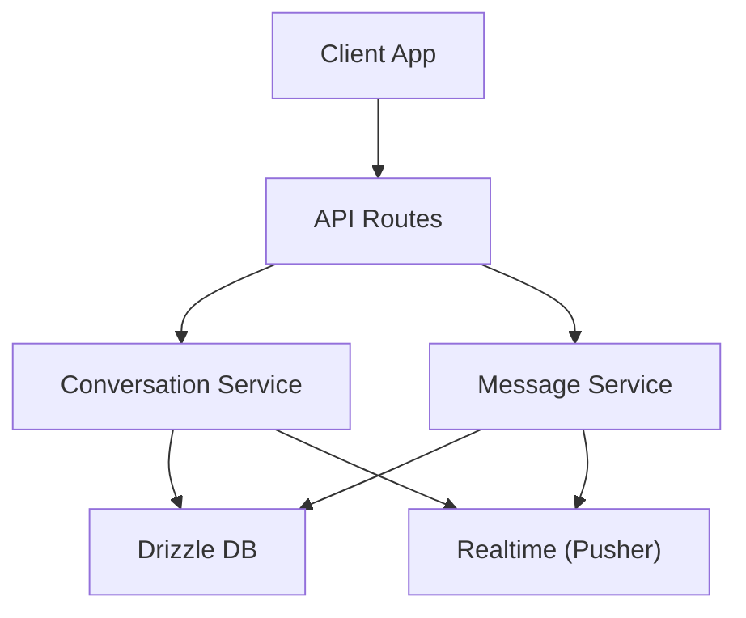
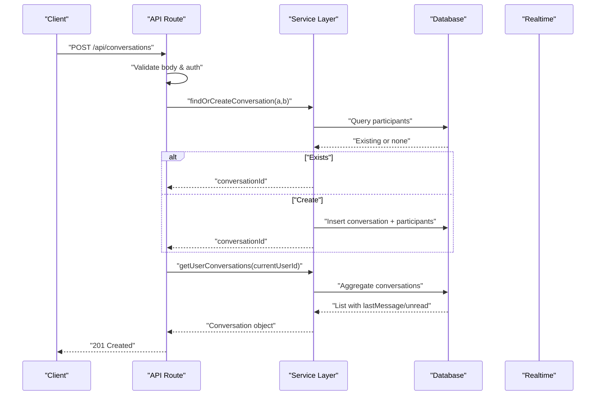
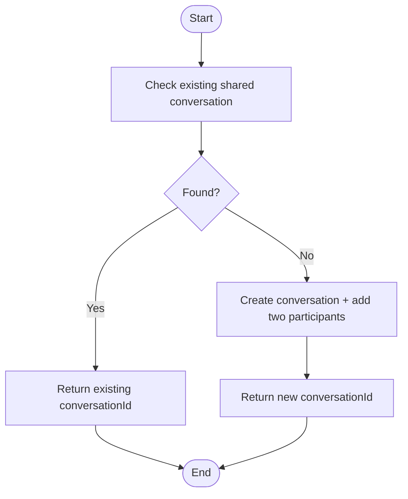
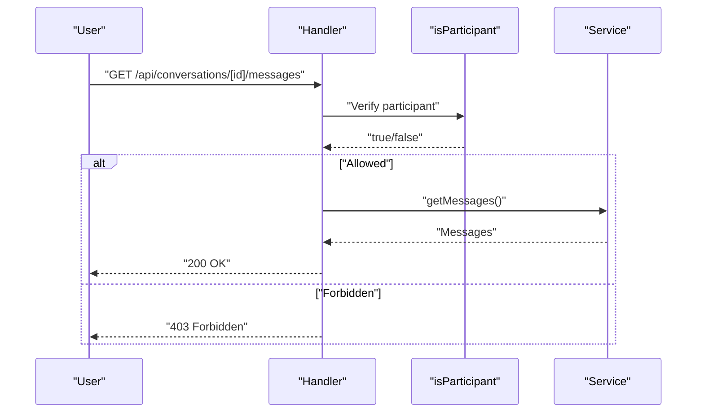
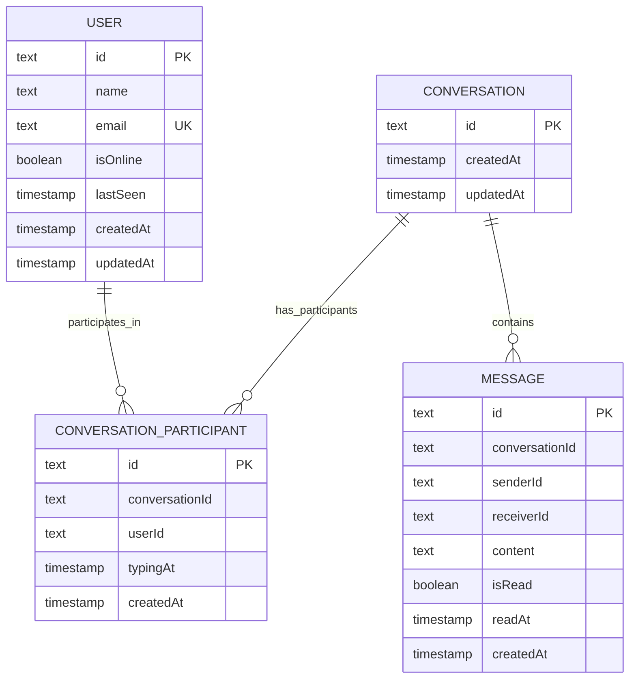
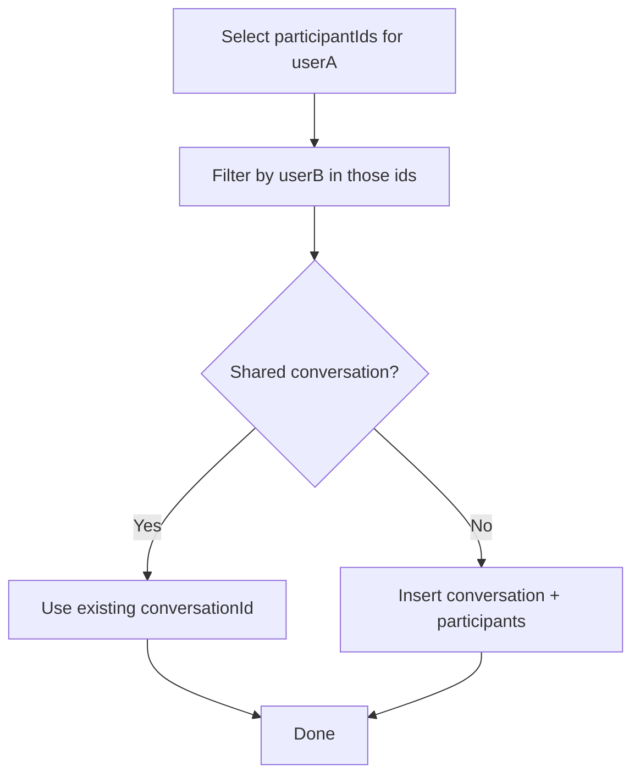
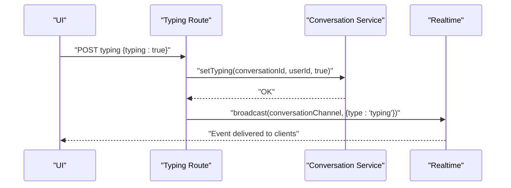
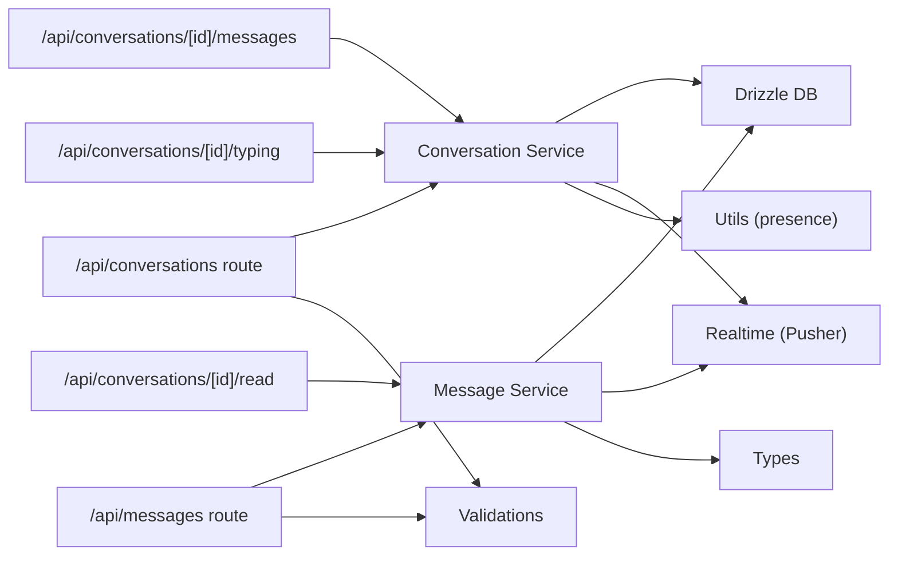

# Conversation Service

<cite>
**Referenced Files in This Document**
- [conversation.service.ts](file://lib/services/conversation.service.ts)
- [route.ts (conversations)](file://app/api/conversations/route.ts)
- [route.ts (messages)](file://app/api/messages/route.ts)
- [route.ts (messages per conversation)](file://app/api/conversations/[id]/messages/route.ts)
- [route.ts (mark read)](file://app/api/conversations/[id]/read/route.ts)
- [route.ts (typing)](file://app/api/conversations/[id]/typing/route.ts)
- [schema.ts](file://lib/db/schema.ts)
- [index.ts (db)](file://lib/db/index.ts)
- [message.service.ts](file://lib/services/message.service.ts)
- [user.service.ts](file://lib/services/user.service.ts)
- [index.ts (types)](file://types/index.ts)
- [index.ts (realtime)](file://lib/realtime/index.ts)
- [utils.ts](file://lib/utils.ts)
- [message.ts (validations)](file://lib/validations/message.ts)
</cite>

## Table of Contents
1. Introduction
2. Project Structure
3. Core Components
4. Architecture Overview
5. Detailed Component Analysis
6. Dependency Analysis
7. Performance Considerations
8. Troubleshooting Guide
9. Conclusion
10. Appendices

## Introduction
This document explains the Conversation Service that powers SecureChat’s conversation-related business logic. It covers how one-to-one conversations are created and reused, how participants are validated, how conversations relate to users and messages, and how real-time updates flow through Pusher Channels. It also documents Drizzle ORM query patterns used for conversation retrieval, error handling strategies across API routes, and performance considerations for large datasets.

## Project Structure
The conversation feature spans API routes, a service layer, database schema, types, validations, and real-time transport:
- API routes expose endpoints to list/create conversations, fetch message history, mark messages as read, and manage typing indicators.
- The Conversation Service encapsulates core logic: find-or-create conversations, list user conversations with last message and unread counts, and participant validation.
- The Message Service handles message persistence and delivery via real-time channels.
- The Database Schema defines tables for users, conversations, participants, and messages.
- Types define shared contracts for API responses and real-time events.
- Realtime module abstracts Pusher Channels integration.

**Diagram sources**
- [route.ts (conversations):1-81](file://app/api/conversations/route.ts#L1-L81)
- [route.ts (messages per conversation):1-43](file://app/api/conversations/[id]/messages/route.ts#L1-L43)
- [route.ts (mark read):1-33](file://app/api/conversations/[id]/read/route.ts#L1-L33)
- [route.ts (typing):1-83](file://app/api/conversations/[id]/typing/route.ts#L1-L83)
- [conversation.service.ts:1-171](file://lib/services/conversation.service.ts#L1-L171)
- [message.service.ts:1-165](file://lib/services/message.service.ts#L1-L165)
- [index.ts (realtime):1-79](file://lib/realtime/index.ts#L1-L79)

**Section sources**
- [route.ts (conversations):1-81](file://app/api/conversations/route.ts#L1-L81)
- [conversation.service.ts:1-171](file://lib/services/conversation.service.ts#L1-L171)
- [schema.ts:62-101](file://lib/db/schema.ts#L62-L101)
- [index.ts (realtime):1-79](file://lib/realtime/index.ts#L1-L79)

## Core Components
- Conversation Service:
  - findOrCreateConversation(userAId, userBId): Ensures exactly one conversation per user pair by reusing existing or creating new.
  - getUserConversations(userId): Returns all conversations for a user with otherUser info, lastMessage, and unreadCount.
  - isParticipant(conversationId, userId): Authorization guard for read/write operations on conversations.
- Message Service:
  - sendMessage(input): Processes, persists, and delivers messages; updates conversation updatedAt.
  - getMessages(conversationId, limit): Fetches recent messages ordered chronologically.
  - markMessagesRead(conversationId, userId): Marks unread messages as read and broadcasts receipts.
- API Routes:
  - GET /api/conversations: List current user’s conversations.
  - POST /api/conversations: Create or reuse a conversation with another user.
  - GET /api/conversations/[id]/messages: Load message history and optionally mark as read.
  - POST /api/conversations/[id]/read: Mark incoming messages as read.
  - GET/POST /api/conversations/[id]/typing: Polling fallback and update typing state with real-time broadcast.
- Realtime:
  - broadcast(channels, event): Publishes events to Pusher Channels; safe no-op when not configured.

**Section sources**
- [conversation.service.ts:21-171](file://lib/services/conversation.service.ts#L21-L171)
- [message.service.ts:36-165](file://lib/services/message.service.ts#L36-L165)
- [route.ts (conversations):10-80](file://app/api/conversations/route.ts#L10-L80)
- [route.ts (messages per conversation):6-43](file://app/api/conversations/[id]/messages/route.ts#L6-L43)
- [route.ts (mark read):6-33](file://app/api/conversations/[id]/read/route.ts#L6-L33)
- [route.ts (typing):10-83](file://app/api/conversations/[id]/typing/route.ts#L10-L83)
- [index.ts (realtime):47-79](file://lib/realtime/index.ts#L47-L79)

## Architecture Overview
The system enforces strict separation between HTTP handlers, service logic, data access, and real-time delivery:
- Handlers validate input, enforce authentication, and delegate to services.
- Services implement domain rules and orchestrate DB queries and real-time events.
- Drizzle ORM queries use precise filters and joins via schema definitions.
- Real-time updates are decoupled from persistence failures.

**Diagram sources**
- [route.ts (conversations):28-80](file://app/api/conversations/route.ts#L28-L80)
- [conversation.service.ts:21-69](file://lib/services/conversation.service.ts#L21-L69)
- [conversation.service.ts:71-151](file://lib/services/conversation.service.ts#L71-L151)

**Section sources**
- [route.ts (conversations):28-80](file://app/api/conversations/route.ts#L28-L80)
- [conversation.service.ts:21-151](file://lib/services/conversation.service.ts#L21-L151)

## Detailed Component Analysis

### Conversation Creation and Retrieval
- One-to-one rule: A single conversation exists per unique pair of users. The service first checks if both users share any conversation; if yes, it returns the existing ID; otherwise, it creates a new conversation and adds both participants.
- Retrieval: For a given user, the service lists their conversations, resolves the other participant, fetches the latest message, and computes unread count for that user.

**Diagram sources**
- [conversation.service.ts:21-69](file://lib/services/conversation.service.ts#L21-L69)

**Section sources**
- [conversation.service.ts:21-69](file://lib/services/conversation.service.ts#L21-L69)

### Participant Validation and Access Control
- All sensitive operations check membership using isParticipant before allowing reads/writes.
- Enforced at:
  - Sending messages (/api/messages)
  - Reading messages (/api/conversations/[id]/messages)
  - Marking as read (/api/conversations/[id]/read)
  - Typing updates (/api/conversations/[id]/typing)

**Diagram sources**
- [route.ts (messages per conversation):11-43](file://app/api/conversations/[id]/messages/route.ts#L11-L43)
- [conversation.service.ts:153-171](file://lib/services/conversation.service.ts#L153-L171)

**Section sources**
- [route.ts (messages per conversation):11-43](file://app/api/conversations/[id]/messages/route.ts#L11-L43)
- [route.ts (mark read):10-33](file://app/api/conversations/[id]/read/route.ts#L10-L33)
- [route.ts (typing):14-36](file://app/api/conversations/[id]/typing/route.ts#L14-L36)
- [conversation.service.ts:153-171](file://lib/services/conversation.service.ts#L153-L171)

### Relationship Handling with Users and Messages
- Users:
  - PublicUser type excludes sensitive fields.
  - Presence computed via isRecentlyOnline(lastSeen).
- Conversations:
  - Each conversation has createdAt/updatedAt timestamps.
  - Participants stored in a join table with uniqueness constraint on (conversationId, userId).
- Messages:
  - Linked to conversation, sender, receiver; includes read status and timestamps.
  - Last message and unread counts are derived per conversation for efficient listing.

**Diagram sources**
- [schema.ts:8-20](file://lib/db/schema.ts#L8-L20)
- [schema.ts:62-101](file://lib/db/schema.ts#L62-L101)

**Section sources**
- [schema.ts:8-20](file://lib/db/schema.ts#L8-L20)
- [schema.ts:62-101](file://lib/db/schema.ts#L62-L101)
- [index.ts (types):41-53](file://types/index.ts#L41-L53)

### Database Query Patterns (Drizzle ORM)
- Reuse vs create:
  - Select participant IDs for user A, then intersect with user B’s participation using inArray to detect shared conversation.
- Aggregation:
  - Count unread messages per conversation using sql`count(*)::int`.
- Ordering:
  - Latest message selected with orderBy(desc(createdAt)).
- Updates:
  - Mark messages read with where clauses filtering by conversationId, receiverId, and isRead=false.

**Diagram sources**
- [conversation.service.ts:25-69](file://lib/services/conversation.service.ts#L25-L69)
- [conversation.service.ts:121-147](file://lib/services/conversation.service.ts#L121-L147)

**Section sources**
- [conversation.service.ts:25-69](file://lib/services/conversation.service.ts#L25-L69)
- [conversation.service.ts:121-147](file://lib/services/conversation.service.ts#L121-L147)
- [message.service.ts:139-165](file://lib/services/message.service.ts#L139-L165)

### Integration with Real-Time Services
- Typing:
  - POST /api/conversations/[id]/typing updates participant typingAt and broadcasts typing/stop-typing events to the conversation channel.
  - GET /api/conversations/[id]/typing provides polling fallback.
- Messages:
  - On send, deliverMessage broadcasts new-message to conversation channel and user channels for sender/receiver.
  - On mark read, broadcasts message-read with messageIds to relevant channels.
- Robustness:
  - broadcast wraps errors and never throws; app continues even if Pusher is unavailable.

**Diagram sources**
- [route.ts (typing):42-83](file://app/api/conversations/[id]/typing/route.ts#L42-L83)
- [index.ts (realtime):63-79](file://lib/realtime/index.ts#L63-L79)

**Section sources**
- [route.ts (typing):42-83](file://app/api/conversations/[id]/typing/route.ts#L42-L83)
- [message.service.ts:90-105](file://lib/services/message.service.ts#L90-L105)
- [message.service.ts:139-165](file://lib/services/message.service.ts#L139-L165)
- [index.ts (realtime):63-79](file://lib/realtime/index.ts#L63-L79)

### Error Handling Strategies
- Authentication:
  - Unauthorized errors are caught and returned as 401 responses across routes.
- Input validation:
  - Zod schemas validate payloads; invalid inputs return 400 with descriptive messages.
- Authorization:
  - Missing participant results in 403 Forbidden.
- User existence:
  - Creating a conversation with a non-existent user returns 404.
- Internal errors:
  - Unexpected exceptions return 500 with generic messages and server logs.

**Section sources**
- [route.ts (conversations):14-26](file://app/api/conversations/route.ts#L14-L26)
- [route.ts (conversations):33-80](file://app/api/conversations/route.ts#L33-L80)
- [route.ts (messages per conversation):11-43](file://app/api/conversations/[id]/messages/route.ts#L11-L43)
- [route.ts (mark read):10-33](file://app/api/conversations/[id]/read/route.ts#L10-L33)
- [route.ts (typing):14-36](file://app/api/conversations/[id]/typing/route.ts#L14-L36)
- [message.ts (validations):1-39](file://lib/validations/message.ts#L1-L39)

### Examples and Usage Scenarios
- Create a new conversation:
  - Call POST /api/conversations with { otherUserId }.
  - Server validates identity, ensures other user exists, finds or creates conversation, and returns full conversation shape including otherUser, lastMessage, and unreadCount.
- Retrieve conversation list:
  - Call GET /api/conversations to receive an array of conversations sorted by most recent activity.
- Manage conversation participants:
  - Use isParticipant before sending messages, reading messages, marking as read, or updating typing.
- Handle lifecycle events:
  - Typing: POST /api/conversations/[id]/typing to broadcast typing/stop-typing; GET for polling fallback.
  - Read receipts: POST /api/conversations/[id]/read to mark messages as read and broadcast updates.

**Section sources**
- [route.ts (conversations):28-80](file://app/api/conversations/route.ts#L28-L80)
- [route.ts (messages per conversation):6-43](file://app/api/conversations/[id]/messages/route.ts#L6-L43)
- [route.ts (mark read):6-33](file://app/api/conversations/[id]/read/route.ts#L6-L33)
- [route.ts (typing):10-83](file://app/api/conversations/[id]/typing/route.ts#L10-L83)

## Dependency Analysis
The following diagram shows key dependencies among modules involved in conversation operations:

**Diagram sources**
- [route.ts (conversations):1-81](file://app/api/conversations/route.ts#L1-L81)
- [route.ts (messages):1-41](file://app/api/messages/route.ts#L1-L41)
- [route.ts (messages per conversation):1-43](file://app/api/conversations/[id]/messages/route.ts#L1-L43)
- [route.ts (mark read):1-33](file://app/api/conversations/[id]/read/route.ts#L1-L33)
- [route.ts (typing):1-83](file://app/api/conversations/[id]/typing/route.ts#L1-L83)
- [conversation.service.ts:1-171](file://lib/services/conversation.service.ts#L1-L171)
- [message.service.ts:1-165](file://lib/services/message.service.ts#L1-L165)
- [index.ts (realtime):1-79](file://lib/realtime/index.ts#L1-L79)
- [utils.ts:45-56](file://lib/utils.ts#L45-L56)
- [message.ts (validations):1-39](file://lib/validations/message.ts#L1-L39)

**Section sources**
- [conversation.service.ts:1-171](file://lib/services/conversation.service.ts#L1-L171)
- [message.service.ts:1-165](file://lib/services/message.service.ts#L1-L165)
- [index.ts (realtime):1-79](file://lib/realtime/index.ts#L1-L79)

## Performance Considerations
- Minimize N+1 queries:
  - When listing conversations, avoid fetching lastMessage and unreadCount per conversation inside tight loops. Consider batching or windowed queries for large datasets.
- Indexing:
  - Ensure indexes on conversationParticipant(userId), conversationParticipant(conversationId), message(conversationId), and message(receiverId, isRead) to speed up lookups and counts.
- Pagination:
  - For message history, support cursor-based pagination beyond the default limit to handle long chats efficiently.
- Caching strategies:
  - Cache conversation lists per user for short TTLs to reduce repeated aggregation.
  - Cache presence and typing states in memory or Redis with expiration aligned to PRESENCE_TTL_MS.
- Real-time efficiency:
  - Debounce typing updates on the client to reduce broadcast frequency.
  - Batch read receipts when possible to minimize updates.

[No sources needed since this section provides general guidance]

## Troubleshooting Guide
- Unauthorized (401):
  - Occurs when session is missing or invalid. Check getUserId() usage and middleware configuration.
- Forbidden (403):
  - Indicates the user is not a participant in the requested conversation. Verify isParticipant checks and ensure correct conversationId.
- Not Found (404):
  - Happens when attempting to start a conversation with a non-existent user. Validate otherUserId before creation.
- Internal Server Error (500):
  - Catch-all for unexpected exceptions. Review server logs and ensure DB connectivity and Pusher configuration.
- Realtime issues:
  - If Pusher env vars are missing, broadcast becomes a no-op; clients should rely on polling fallback for typing and read receipts.

**Section sources**
- [route.ts (conversations):14-26](file://app/api/conversations/route.ts#L14-L26)
- [route.ts (conversations):33-80](file://app/api/conversations/route.ts#L33-L80)
- [route.ts (messages per conversation):11-43](file://app/api/conversations/[id]/messages/route.ts#L11-L43)
- [route.ts (mark read):10-33](file://app/api/conversations/[id]/read/route.ts#L10-L33)
- [route.ts (typing):14-36](file://app/api/conversations/[id]/typing/route.ts#L14-L36)
- [index.ts (realtime):24-31](file://lib/realtime/index.ts#L24-L31)

## Conclusion
The Conversation Service centralizes SecureChat’s conversation logic, enforcing a strict one-conversation-per-user-pair model, robust participant validation, and clear relationships with users and messages. It integrates seamlessly with Drizzle ORM for reliable data access and Pusher Channels for real-time updates. With careful indexing, caching, and pagination, the system can scale to large conversation datasets while maintaining responsiveness and correctness.

[No sources needed since this section summarizes without analyzing specific files]

## Appendices

### API Reference Summary
- GET /api/conversations
  - Purpose: List current user’s conversations with last message and unread counts.
  - Auth: Required.
  - Response: Array of Conversation objects.
- POST /api/conversations
  - Purpose: Create or reuse a conversation with another user.
  - Body: { otherUserId }.
  - Auth: Required.
  - Response: Full Conversation object.
- GET /api/conversations/[id]/messages?markRead=true|false
  - Purpose: Fetch message history; optionally mark unread messages as read.
  - Auth: Required; participant check enforced.
  - Response: Array of Message objects.
- POST /api/conversations/[id]/read
  - Purpose: Mark incoming messages as read and broadcast receipts.
  - Auth: Required; participant check enforced.
  - Response: { messageIds }.
- GET /api/conversations/[id]/typing
  - Purpose: Polling fallback to check if the other participant is typing.
  - Auth: Required; participant check enforced.
  - Response: { typing: boolean }.
- POST /api/conversations/[id]/typing
  - Purpose: Update typing state and broadcast typing/stop-typing events.
  - Body: { typing: boolean }.
  - Auth: Required; participant check enforced.
  - Response: { typing: boolean }.

**Section sources**
- [route.ts (conversations):10-80](file://app/api/conversations/route.ts#L10-L80)
- [route.ts (messages per conversation):6-43](file://app/api/conversations/[id]/messages/route.ts#L6-L43)
- [route.ts (mark read):6-33](file://app/api/conversations/[id]/read/route.ts#L6-L33)
- [route.ts (typing):10-83](file://app/api/conversations/[id]/typing/route.ts#L10-L83)