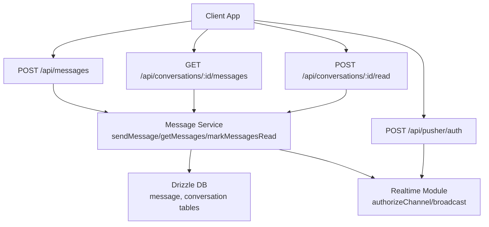
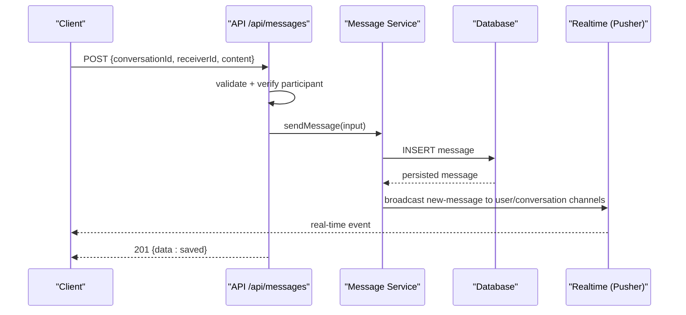
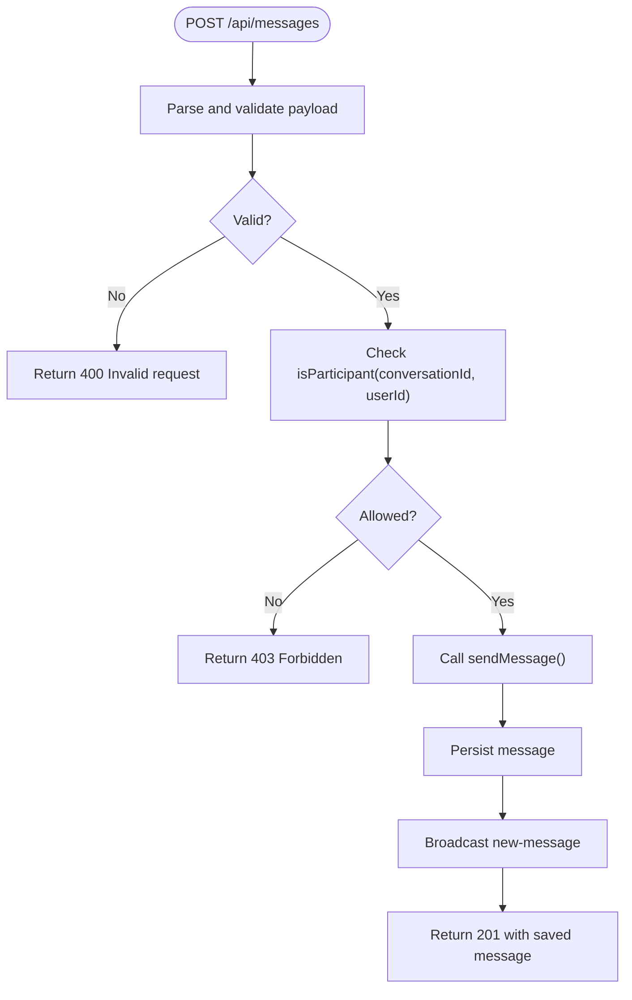
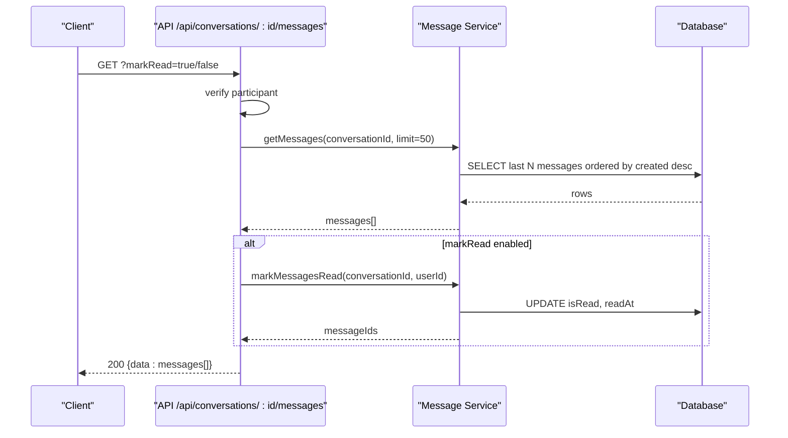
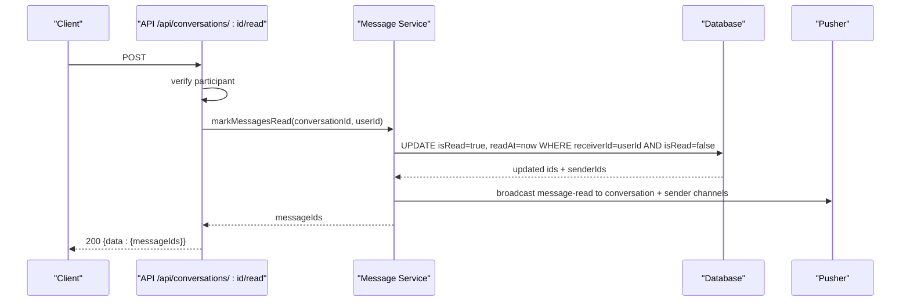
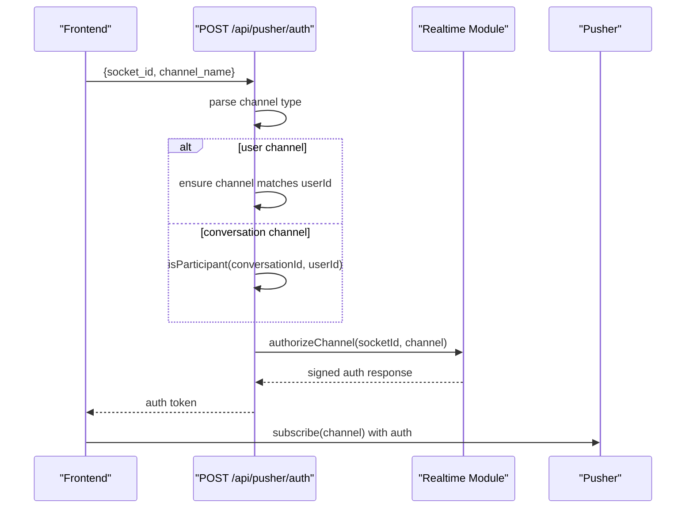
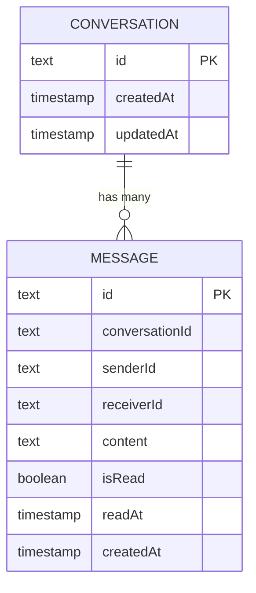
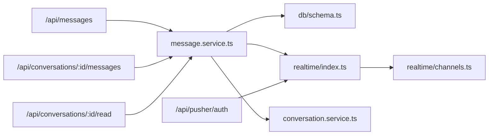

# Message Service

<cite>
**Referenced Files in This Document**
- [route.ts](file://app/api/messages/route.ts)
- [route.ts](file://app/api/conversations/[id]/messages/route.ts)
- [route.ts](file://app/api/conversations/[id]/read/route.ts)
- [route.ts](file://app/api/pusher/auth/route.ts)
- [message.service.ts](file://lib/services/message.service.ts)
- [conversation.service.ts](file://lib/services/conversation.service.ts)
- [schema.ts](file://lib/db/schema.ts)
- [index.ts](file://lib/db/index.ts)
- [channels.ts](file://lib/realtime/channels.ts)
- [index.ts](file://lib/realtime/index.ts)
- [client.ts](file://lib/realtime/client.ts)
- [useRealtime.ts](file://hooks/useRealtime.ts)
- [index.ts](file://types/index.ts)
</cite>

## Table of Contents
1. Introduction
2. Project Structure
3. Core Components
4. Architecture Overview
5. Detailed Component Analysis
6. Dependency Analysis
7. Performance Considerations
8. Troubleshooting Guide
9. Conclusion

## Introduction
This document explains the Message Service that powers SecureChat’s messaging features: creating, retrieving, updating, and delivering messages; managing read receipts; and broadcasting real-time events via Pusher. It covers validation, persistence, pagination, threading, error handling, and performance strategies for high-volume scenarios.

## Project Structure
SecureChat implements a Next.js API layer with service functions for business logic, Drizzle ORM for persistence, and Pusher for real-time delivery. The message flow is intentionally decoupled so future analysis or moderation can be inserted at a single seam without changing other files.

**Diagram sources**
- [route.ts:12-42](file://app/api/messages/route.ts#L12-L42)
- [route.ts:11-34](file://app/api/conversations/[id]/messages/route.ts#L11-L34)
- [route.ts:10-24](file://app/api/conversations/[id]/read/route.ts#L10-L24)
- [route.ts:11-54](file://app/api/pusher/auth/route.ts#L11-L54)
- [message.service.ts:115-164](file://lib/services/message.service.ts#L115-L164)
- [index.ts:63-78](file://lib/realtime/index.ts#L63-L78)

**Section sources**
- [route.ts:12-42](file://app/api/messages/route.ts#L12-L42)
- [route.ts:11-34](file://app/api/conversations/[id]/messages/route.ts#L11-L34)
- [route.ts:10-24](file://app/api/conversations/[id]/read/route.ts#L10-L24)
- [route.ts:11-54](file://app/api/pusher/auth/route.ts#L11-L54)
- [message.service.ts:115-164](file://lib/services/message.service.ts#L115-L164)
- [index.ts:63-78](file://lib/realtime/index.ts#L63-L78)

## Core Components
- Message API routes: send, fetch history, mark as read.
- Message Service: central seam for processing, saving, and delivering messages; also handles read receipts.
- Conversation Service: participant checks and conversation management used by message flows.
- Realtime Module: Pusher authorization and broadcasting.
- Database Schema: message, conversation, and participant tables.
- Types: shared contracts for messages, events, and responses.

Key responsibilities:
- Validate inputs before persistence.
- Enforce participant-only access.
- Persist messages and update read status atomically where appropriate.
- Broadcast real-time events to relevant channels.
- Provide paginated retrieval for message history.

**Section sources**
- [route.ts:12-42](file://app/api/messages/route.ts#L12-L42)
- [route.ts:11-34](file://app/api/conversations/[id]/messages/route.ts#L11-L34)
- [route.ts:10-24](file://app/api/conversations/[id]/read/route.ts#L10-L24)
- [message.service.ts:115-164](file://lib/services/message.service.ts#L115-L164)
- [conversation.service.ts:157-170](file://lib/services/conversation.service.ts#L157-L170)
- [schema.ts:66-100](file://lib/db/schema.ts#L66-L100)
- [index.ts:91-117](file://types/index.ts#L91-L117)

## Architecture Overview
The message pipeline ensures durability first, then real-time delivery. If delivery fails, persistence remains intact.

**Diagram sources**
- [route.ts:12-42](file://app/api/messages/route.ts#L12-L42)
- [message.service.ts:115-117](file://lib/services/message.service.ts#L115-L117)
- [index.ts:63-78](file://lib/realtime/index.ts#L63-L78)

## Detailed Component Analysis

### Sending Messages
- Endpoint: POST /api/messages
- Validates request body using a schema.
- Verifies sender identity from session and participant status.
- Delegates to Message Service to process, save, and deliver.

**Diagram sources**
- [route.ts:12-42](file://app/api/messages/route.ts#L12-L42)
- [message.service.ts:115-117](file://lib/services/message.service.ts#L115-L117)

**Section sources**
- [route.ts:12-42](file://app/api/messages/route.ts#L12-L42)

### Retrieving Conversation History
- Endpoint: GET /api/conversations/[id]/messages
- Ensures participant access.
- Fetches recent messages with a default limit.
- Optionally marks unread messages as read when opening the chat.

**Diagram sources**
- [route.ts:11-34](file://app/api/conversations/[id]/messages/route.ts#L11-L34)
- [message.service.ts:124-133](file://lib/services/message.service.ts#L124-L133)
- [message.service.ts:139-164](file://lib/services/message.service.ts#L139-L164)

**Section sources**
- [route.ts:11-34](file://app/api/conversations/[id]/messages/route.ts#L11-L34)
- [message.service.ts:124-133](file://lib/services/message.service.ts#L124-L133)

### Marking Messages as Read
- Endpoint: POST /api/conversations/[id]/read
- Marks all unread messages for the current user in the conversation.
- Broadcasts read receipts to both the conversation channel and each sender’s private channel so their UI ticks update live.

**Diagram sources**
- [route.ts:10-24](file://app/api/conversations/[id]/read/route.ts#L10-L24)
- [message.service.ts:139-164](file://lib/services/message.service.ts#L139-L164)
- [index.ts:63-78](file://lib/realtime/index.ts#L63-L78)

**Section sources**
- [route.ts:10-24](file://app/api/conversations/[id]/read/route.ts#L10-L24)
- [message.service.ts:139-164](file://lib/services/message.service.ts#L139-L164)

### Real-Time Delivery and Authorization
- Client subscribes to private channels for the user and the active conversation.
- Server authorizes subscriptions via POST /api/pusher/auth, enforcing per-channel permissions.
- Events include new-message, message-read, typing, stop-typing, and presence.

**Diagram sources**
- [route.ts:11-54](file://app/api/pusher/auth/route.ts#L11-L54)
- [index.ts:47-57](file://lib/realtime/index.ts#L47-L57)
- [channels.ts:6-26](file://lib/realtime/channels.ts#L6-L26)

**Section sources**
- [route.ts:11-54](file://app/api/pusher/auth/route.ts#L11-L54)
- [index.ts:47-57](file://lib/realtime/index.ts#L47-L57)
- [channels.ts:6-26](file://lib/realtime/channels.ts#L6-L26)

### Data Model and Persistence
- Messages are stored with conversation scope, sender/receiver, content, read state, and timestamps.
- Conversations group participants; one conversation per user pair is enforced.
- Reading updates isRead and readAt atomically for all matching messages.

**Diagram sources**
- [schema.ts:66-100](file://lib/db/schema.ts#L66-L100)

**Section sources**
- [schema.ts:66-100](file://lib/db/schema.ts#L66-L100)

### Threading and Scope
- Each message belongs to a conversation, which acts as a thread between two users.
- Participant checks prevent cross-thread access.
- Real-time channels are scoped per conversation and per user.

**Section sources**
- [conversation.service.ts:157-170](file://lib/services/conversation.service.ts#L157-L170)
- [channels.ts:6-26](file://lib/realtime/channels.ts#L6-L26)

### Content Validation and Attachments
- Message content is validated on the server before persistence.
- Current implementation stores plain text content; attachments are not implemented in this codebase.
- To add attachments, extend the message schema and service to handle file uploads and references.

**Section sources**
- [route.ts:16-24](file://app/api/messages/route.ts#L16-L24)
- [schema.ts:91-100](file://lib/db/schema.ts#L91-L100)

### Pagination and Search
- Message retrieval uses a default limit to paginate history.
- No full-text search is implemented; filtering is limited to conversation-scoped queries.
- For advanced search, consider adding indexes and a dedicated search endpoint.

**Section sources**
- [message.service.ts:124-133](file://lib/services/message.service.ts#L124-L133)

### Error Handling
- Unauthorized and forbidden errors are returned explicitly for security-sensitive operations.
- Network or service failures return generic server errors while logging details.
- Realtime delivery failures do not roll back persistence.

**Section sources**
- [route.ts:43-49](file://app/api/messages/route.ts#L43-L49)
- [route.ts:35-41](file://app/api/conversations/[id]/messages/route.ts#L35-L41)
- [route.ts:25-31](file://app/api/conversations/[id]/read/route.ts#L25-L31)
- [index.ts:63-78](file://lib/realtime/index.ts#L63-L78)

## Dependency Analysis

**Diagram sources**
- [route.ts:12-42](file://app/api/messages/route.ts#L12-L42)
- [route.ts:11-34](file://app/api/conversations/[id]/messages/route.ts#L11-L34)
- [route.ts:10-24](file://app/api/conversations/[id]/read/route.ts#L10-L24)
- [message.service.ts:115-164](file://lib/services/message.service.ts#L115-L164)
- [conversation.service.ts:157-170](file://lib/services/conversation.service.ts#L157-L170)
- [index.ts:63-78](file://lib/realtime/index.ts#L63-L78)
- [channels.ts:6-26](file://lib/realtime/channels.ts#L6-L26)

**Section sources**
- [message.service.ts:115-164](file://lib/services/message.service.ts#L115-L164)
- [conversation.service.ts:157-170](file://lib/services/conversation.service.ts#L157-L170)
- [index.ts:63-78](file://lib/realtime/index.ts#L63-L78)

## Performance Considerations
- Limit message history to a fixed page size to reduce payload and query time.
- Use database indexes on conversationId, receiverId, and isRead to speed up reads and updates.
- Batch mark-as-read updates to minimize row writes during frequent polling.
- Keep realtime delivery fire-and-forget after persistence to avoid blocking requests.
- Consider connection pooling and query caching for high-throughput scenarios.
- For archival, move older conversations/messages to cold storage and serve only recent data.

[No sources needed since this section provides general guidance]

## Troubleshooting Guide
- 401 Unauthorized: Indicates missing or invalid authentication; check session and getUserId usage.
- 403 Forbidden: Access denied due to non-participant; verify isParticipant checks.
- 400 Bad Request: Validation failure; inspect request payload against schemas.
- 500 Internal Server Error: Unexpected server-side error; review logs and ensure DB connectivity.
- Realtime issues: Ensure Pusher keys are configured and /api/pusher/auth returns valid authorization.

**Section sources**
- [route.ts:43-49](file://app/api/messages/route.ts#L43-L49)
- [route.ts:35-41](file://app/api/conversations/[id]/messages/route.ts#L35-L41)
- [route.ts:25-31](file://app/api/conversations/[id]/read/route.ts#L25-L31)
- [route.ts:13-15](file://app/api/pusher/auth/route.ts#L13-L15)

## Conclusion
The Message Service provides a robust foundation for SecureChat’s messaging: secure creation, reliable persistence, efficient retrieval, and real-time delivery with read receipts. Its design isolates concerns and leaves a clear extension point for future analysis or moderation. With proper indexing, batching, and archival strategies, it scales well for high-volume messaging workloads.