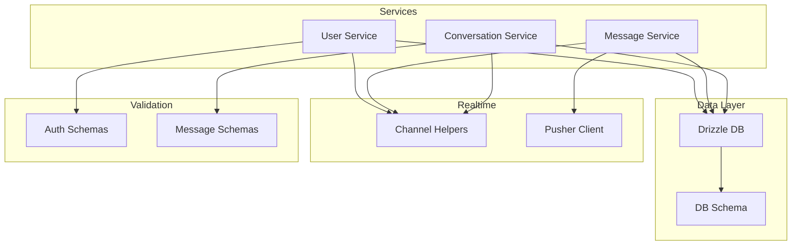
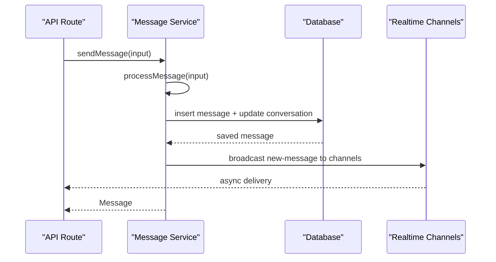
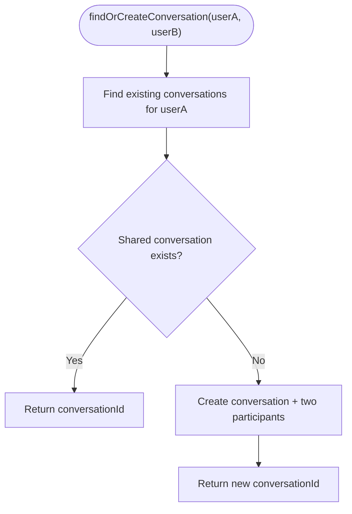
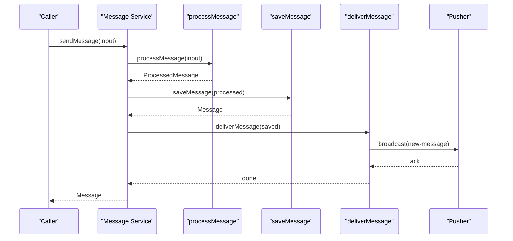
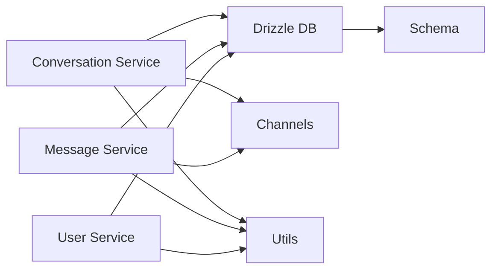

# Service Patterns & Best Practices

<cite>
**Referenced Files in This Document**
- [conversation.service.ts](file://lib/services/conversation.service.ts)
- [message.service.ts](file://lib/services/message.service.ts)
- [user.service.ts](file://lib/services/user.service.ts)
- [auth.ts](file://lib/validations/auth.ts)
- [message.ts](file://lib/validations/message.ts)
- [schema.ts](file://lib/db/schema.ts)
- [channels.ts](file://lib/realtime/channels.ts)
- [client.ts](file://lib/realtime/client.ts)
- [index.ts](file://types/index.ts)
- [utils.ts](file://lib/utils.ts)
</cite>

## Table of Contents
1. Introduction
2. Project Structure
3. Core Components
4. Architecture Overview
5. Detailed Component Analysis
6. Dependency Analysis
7. Performance Considerations
8. Troubleshooting Guide
9. Conclusion
10. Appendices

## Introduction
This document explains the service layer patterns, best practices, and architectural guidelines used across SecureChat’s server-side services. It focuses on dependency injection approaches, error handling strategies, validation with Zod, transaction-like orchestration, logging considerations, service composition techniques, interface design principles, testing strategies, performance optimization (caching, query tuning, real-time events), and guidance for extending and maintaining consistency.

## Project Structure
SecureChat organizes business logic into a dedicated service layer under lib/services, with clear separation from API routes, database schema definitions, validations, and real-time utilities. The services coordinate data access via Drizzle ORM, enforce input validation through shared Zod schemas, and publish real-time events using Pusher channels.

**Diagram sources**
- [conversation.service.ts:1-236](file://lib/services/conversation.service.ts#L1-L236)
- [message.service.ts:1-165](file://lib/services/message.service.ts#L1-L165)
- [user.service.ts:1-108](file://lib/services/user.service.ts#L1-L108)
- [channels.ts:1-27](file://lib/realtime/channels.ts#L1-L27)
- [client.ts:1-30](file://lib/realtime/client.ts#L1-L30)
- [schema.ts:1-101](file://lib/db/schema.ts#L1-L101)
- [auth.ts:1-29](file://lib/validations/auth.ts#L1-L29)
- [message.ts:1-40](file://lib/validations/message.ts#L1-L40)

**Section sources**
- [conversation.service.ts:1-236](file://lib/services/conversation.service.ts#L1-L236)
- [message.service.ts:1-165](file://lib/services/message.service.ts#L1-L165)
- [user.service.ts:1-108](file://lib/services/user.service.ts#L1-L108)
- [schema.ts:1-101](file://lib/db/schema.ts#L1-L101)
- [channels.ts:1-27](file://lib/realtime/channels.ts#L1-L27)
- [client.ts:1-30](file://lib/realtime/client.ts#L1-L30)
- [auth.ts:1-29](file://lib/validations/auth.ts#L1-L29)
- [message.ts:1-40](file://lib/validations/message.ts#L1-L40)

## Core Components
- Conversation Service: Ensures one conversation per user pair, retrieves conversations with last message and unread counts, enforces participant checks, and manages typing presence.
- Message Service: Central pipeline for sending messages with processing, persistence, and delivery; supports fetching messages and marking them read with live updates.
- User Service: Provides user search, profile retrieval, presence updates, and profile updates.

Key patterns observed:
- Single-responsibility functions grouped by domain.
- Shared types define contracts between services and clients.
- Real-time event broadcasting is encapsulated behind channel helpers.
- Validation schemas are centralized and reused at API boundaries.

**Section sources**
- [conversation.service.ts:21-170](file://lib/services/conversation.service.ts#L21-L170)
- [message.service.ts:36-118](file://lib/services/message.service.ts#L36-L118)
- [user.service.ts:20-108](file://lib/services/user.service.ts#L20-L108)
- [index.ts:55-118](file://types/index.ts#L55-L118)

## Architecture Overview
The service layer composes three primary flows:
- Message send flow: validate → process → persist → deliver via real-time channels.
- Conversation management flow: find-or-create, list with enrichment, participant verification, typing state.
- User operations flow: search, get-by-id, presence update, profile update.

**Diagram sources**
- [message.service.ts:113-118](file://lib/services/message.service.ts#L113-L118)
- [message.service.ts:59-105](file://lib/services/message.service.ts#L59-L105)
- [channels.ts:6-12](file://lib/realtime/channels.ts#L6-L12)

**Section sources**
- [message.service.ts:1-165](file://lib/services/message.service.ts#L1-L165)
- [channels.ts:1-27](file://lib/realtime/channels.ts#L1-L27)

## Detailed Component Analysis

### Conversation Service
Responsibilities:
- Ensure exactly one conversation per user pair (find or create).
- Retrieve all conversations for a user with enriched data (other participant, last message, unread count).
- Enforce participant authorization before read/write.
- Manage typing indicators with TTL-based visibility.

Design highlights:
- Deterministic ID generation for conversations and participants.
- Efficient queries using indexed columns where applicable (e.g., conversationId, userId).
- Clear separation between data retrieval and presentation (public user mapping).

**Diagram sources**
- [conversation.service.ts:25-69](file://lib/services/conversation.service.ts#L25-L69)

**Section sources**
- [conversation.service.ts:21-170](file://lib/services/conversation.service.ts#L21-L170)

### Message Service
Responsibilities:
- Orchestrate message lifecycle: process → save → deliver.
- Provide read-only message retrieval and mark-as-read with live updates.

Patterns:
- Pipeline pattern with explicit steps allows future extension points without changing callers.
- Serialization ensures consistent date formats over the wire.
- Broadcasting targets conversation and user channels for real-time UI updates.

**Diagram sources**
- [message.service.ts:113-118](file://lib/services/message.service.ts#L113-L118)
- [message.service.ts:49-105](file://lib/services/message.service.ts#L49-L105)

**Section sources**
- [message.service.ts:1-165](file://lib/services/message.service.ts#L1-L165)

### User Service
Responsibilities:
- Search users by username, email, or name excluding current user.
- Fetch public profiles by ID.
- Update presence (online status and last seen).
- Update basic profile fields safely.

Patterns:
- Public user projection avoids leaking internal fields.
- Presence updates are lightweight writes with timestamps.
- Search uses case-insensitive matching with limits to control load.

**Section sources**
- [user.service.ts:20-108](file://lib/services/user.service.ts#L20-L108)

### Validation with Zod
- Auth schemas enforce registration and login constraints, including password confirmation.
- Message schemas enforce required fields and length limits for messages and conversations.
- Types inferred from schemas ensure end-to-end type safety across API routes and services.

Best practices:
- Keep schemas close to their usage domains (auth vs messaging).
- Reuse constants like MAX_MESSAGE_LENGTH to avoid magic numbers.
- Validate inputs at API boundaries; services assume validated payloads.

**Section sources**
- [auth.ts:1-29](file://lib/validations/auth.ts#L1-L29)
- [message.ts:1-40](file://lib/validations/message.ts#L1-L40)

### Database Schema and Modeling
- Users include presence fields updated by presence endpoints.
- Conversations are independent entities; participants are tracked in a join table with uniqueness constraints to prevent duplicates.
- Messages link sender, receiver, and conversation with read tracking and timestamps.

Implications:
- Queries should leverage indexes on foreign-key-like columns (conversationId, userId) for performance.
- Unique constraints protect data integrity at the schema level.

**Section sources**
- [schema.ts:8-101](file://lib/db/schema.ts#L8-L101)

### Realtime Integration
- Channel helpers provide deterministic naming for private channels per conversation and per user.
- Client-side Pusher client is initialized only when environment variables are present, enabling graceful fallbacks.
- Services broadcast events to relevant channels after successful operations.

**Section sources**
- [channels.ts:1-27](file://lib/realtime/channels.ts#L1-L27)
- [client.ts:1-30](file://lib/realtime/client.ts#L1-L30)
- [message.service.ts:90-105](file://lib/services/message.service.ts#L90-L105)

## Dependency Analysis
- Services depend on:
  - Drizzle ORM for data access.
  - Shared types for contracts.
  - Realtime channel helpers for event broadcasting.
  - Utilities for IDs and presence calculations.
- No direct coupling between services beyond shared types and utilities, promoting cohesion and low coupling.

**Diagram sources**
- [conversation.service.ts:8-13](file://lib/services/conversation.service.ts#L8-L13)
- [message.service.ts:19-24](file://lib/services/message.service.ts#L19-L24)
- [user.service.ts:7-11](file://lib/services/user.service.ts#L7-L11)
- [schema.ts:1-101](file://lib/db/schema.ts#L1-L101)
- [channels.ts:1-27](file://lib/realtime/channels.ts#L1-L27)
- [utils.ts:8-56](file://lib/utils.ts#L8-L56)

**Section sources**
- [conversation.service.ts:1-236](file://lib/services/conversation.service.ts#L1-L236)
- [message.service.ts:1-165](file://lib/services/message.service.ts#L1-L165)
- [user.service.ts:1-108](file://lib/services/user.service.ts#L1-L108)

## Performance Considerations
- Query optimization:
  - Use selective projections to fetch only needed fields.
  - Limit result sets (e.g., search results capped at 20).
  - Order by updatedAt for efficient sorting in lists.
- Real-time efficiency:
  - Broadcast only to necessary channels (conversation + sender/receiver).
  - Use TTL-based presence checks to reduce stale state.
- Caching opportunities:
  - Cache frequently accessed user profiles or conversation metadata in memory or Redis for high traffic.
  - Consider caching last message per conversation if read-heavy.
- Database indexing:
  - Ensure indexes on conversationId and userId columns for fast joins and filters.
  - Index createdAt for message ordering if not already covered.

[No sources needed since this section provides general guidance]

## Troubleshooting Guide
Common issues and resolutions:
- Duplicate conversations:
  - Verify find-or-create logic and unique constraints on participant pairs.
  - Check race conditions; consider transactions around creation paths.
- Missing real-time updates:
  - Confirm channel names match between server broadcast and client subscriptions.
  - Validate Pusher configuration and authentication endpoint availability.
- Stale presence:
  - Ensure heartbeat updates are frequent enough relative to TTL thresholds.
  - Review isRecentlyOnline logic and adjust PRESENCE_TTL_MS if needed.
- Validation errors:
  - Inspect Zod error messages and ensure API routes parse and return structured errors.
- Read receipts not updating:
  - Confirm markMessagesRead broadcasts to both conversation and sender channels.

**Section sources**
- [conversation.service.ts:25-69](file://lib/services/conversation.service.ts#L25-L69)
- [message.service.ts:139-164](file://lib/services/message.service.ts#L139-L164)
- [utils.ts:45-56](file://lib/utils.ts#L45-L56)
- [channels.ts:6-12](file://lib/realtime/channels.ts#L6-L12)

## Conclusion
SecureChat’s service layer follows a clean, extensible architecture with clear responsibilities, strong typing, and robust real-time integration. By centralizing validation, enforcing participant checks, and composing message flows through a pipeline, the system remains maintainable and scalable. Extending the service layer involves adding new steps in the pipeline, introducing new services with well-defined interfaces, and leveraging shared types and utilities to ensure consistency.

[No sources needed since this section summarizes without analyzing specific files]

## Appendices

### Extending the Service Layer
- Add new services:
  - Place logic under lib/services with focused responsibilities.
  - Use shared types from types/index.ts for contracts.
  - Integrate with Drizzle and realtime channels as needed.
- Extend message processing:
  - Modify processMessage to add analysis or transformation steps.
  - Throw appropriate errors to block unsafe content.
- Maintain consistency:
  - Follow existing patterns for projections, serialization, and broadcasting.
  - Reuse validation schemas and utility functions.

[No sources needed since this section provides general guidance]

### Testing Strategies
- Unit tests:
  - Test service functions in isolation with mocked Drizzle calls.
  - Validate Zod schemas against valid and invalid inputs.
- Integration tests:
  - Spin up an in-memory or test database to verify queries and constraints.
  - Mock Pusher client to assert correct broadcasts.
- Contract tests:
  - Ensure API responses conform to ApiResponse shapes.
  - Validate that services return expected types.

[No sources needed since this section provides general guidance]

### Logging and Monitoring
- Add structured logging around key operations (send, mark read, presence updates).
- Capture metrics for latency and error rates in service functions.
- Monitor Pusher connection health and channel subscription success.

[No sources needed since this section provides general guidance]