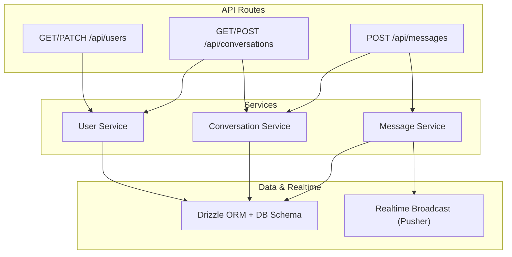
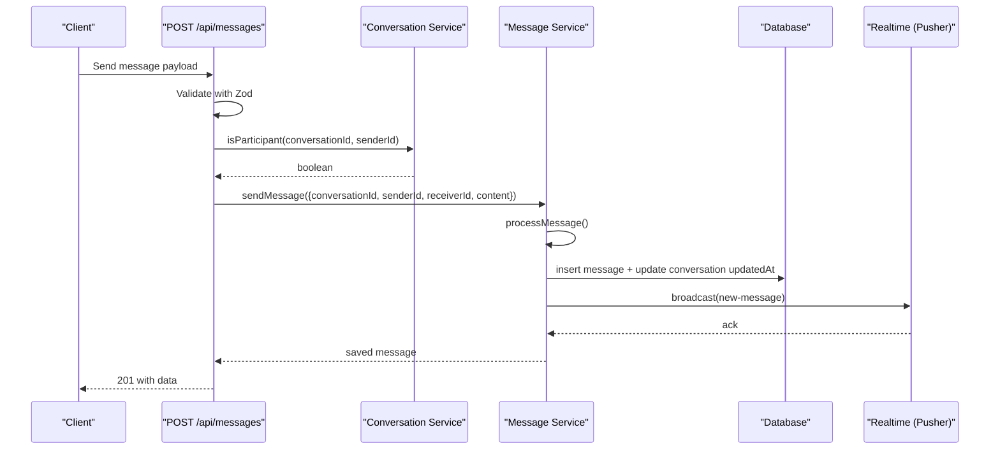
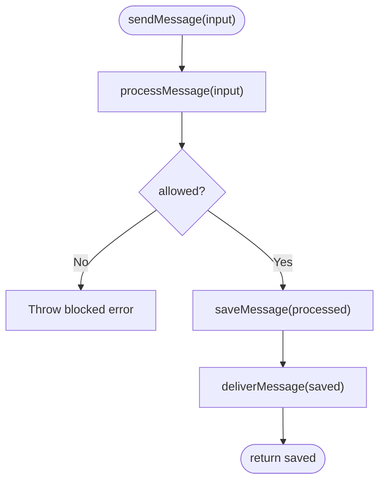
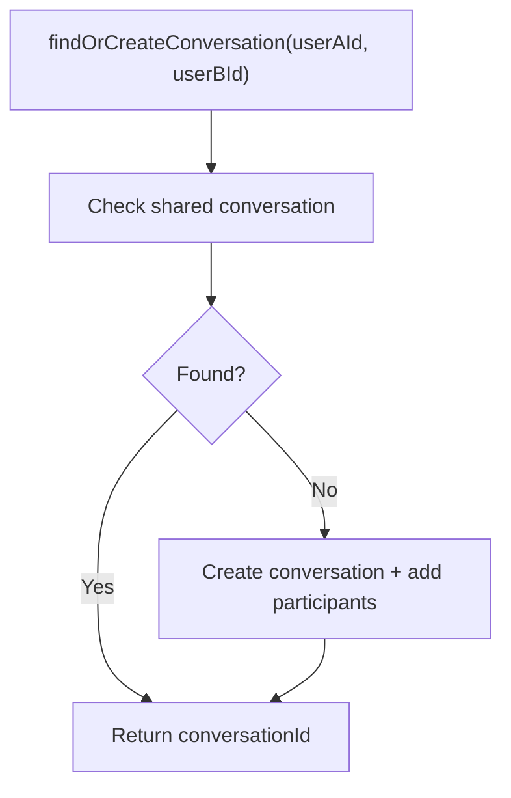
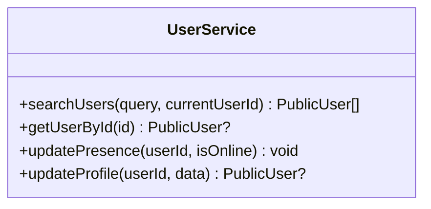
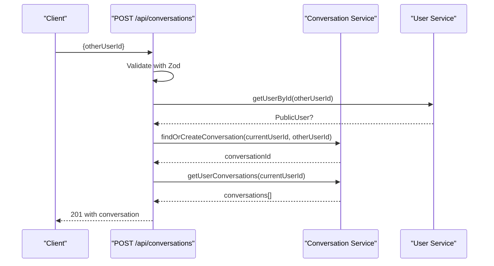
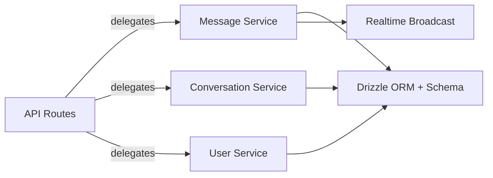

# Services Layer Architecture

<cite>
**Referenced Files in This Document**
- [conversation.service.ts](file://lib/services/conversation.service.ts)
- [message.service.ts](file://lib/services/message.service.ts)
- [user.service.ts](file://lib/services/user.service.ts)
- [auth.ts](file://lib/validations/auth.ts)
- [message.ts](file://lib/validations/message.ts)
- [schema.ts](file://lib/db/schema.ts)
- [index.ts](file://lib/realtime/index.ts)
- [route.ts](file://app/api/messages/route.ts)
- [route.ts](file://app/api/conversations/route.ts)
- [route.ts](file://app/api/users/route.ts)
- [package.json](file://package.json)
</cite>

## Table of Contents
1. [Introduction](#introduction)
2. [Project Structure](#project-structure)
3. [Core Components](#core-components)
4. [Architecture Overview](#architecture-overview)
5. [Detailed Component Analysis](#detailed-component-analysis)
6. [Dependency Analysis](#dependency-analysis)
7. [Performance Considerations](#performance-considerations)
8. [Troubleshooting Guide](#troubleshooting-guide)
9. [Conclusion](#conclusion)
10. [Appendices](#appendices)

## Introduction
This document explains the service layer architecture of SecureChat, focusing on how business logic is encapsulated behind clean API routes and services. It covers separation of concerns, service patterns for conversations, messages, and users, dependency injection via module imports, error handling strategies, validation with Zod, database integration through Drizzle ORM, and real-time delivery using Pusher Channels. It also includes guidance on extending the service layer, maintaining code organization, and testing approaches with mocked dependencies.

## Project Structure
SecureChat follows a layered structure:
- API routes under app/api handle HTTP requests, authentication extraction, input validation, authorization checks, and delegation to services.
- Services under lib/services encapsulate business logic (conversation management, message processing, user operations).
- Validations under lib/validations define Zod schemas used by routes to validate inputs.
- Database schema under lib/db defines tables and relationships; services use Drizzle ORM queries.
- Realtime transport under lib/realtime abstracts Pusher broadcasting; services publish events without knowing provider details.

**Diagram sources**
- [route.ts:12-50](file://app/api/messages/route.ts#L12-L50)
- [route.ts:14-80](file://app/api/conversations/route.ts#L14-L80)
- [route.ts:6-61](file://app/api/users/route.ts#L6-L61)
- [message.service.ts:113-118](file://lib/services/message.service.ts#L113-L118)
- [conversation.service.ts:25-69](file://lib/services/conversation.service.ts#L25-L69)
- [user.service.ts:24-47](file://lib/services/user.service.ts#L24-L47)
- [schema.ts:66-100](file://lib/db/schema.ts#L66-L100)
- [index.ts:63-78](file://lib/realtime/index.ts#L63-L78)

**Section sources**
- [route.ts:12-50](file://app/api/messages/route.ts#L12-L50)
- [route.ts:14-80](file://app/api/conversations/route.ts#L14-L80)
- [route.ts:6-61](file://app/api/users/route.ts#L6-L61)
- [message.service.ts:1-165](file://lib/services/message.service.ts#L1-L165)
- [conversation.service.ts:1-236](file://lib/services/conversation.service.ts#L1-L236)
- [user.service.ts:1-108](file://lib/services/user.service.ts#L1-L108)
- [schema.ts:1-101](file://lib/db/schema.ts#L1-L101)
- [index.ts:1-79](file://lib/realtime/index.ts#L1-L79)

## Core Components
- Message Service: Central pipeline for sending messages, persisting them, and delivering via real-time channels. Includes an extensible processMessage step for future security/AI analysis.
- Conversation Service: Ensures one conversation per user pair, retrieves user conversations with last message and unread counts, verifies participation, and manages typing presence.
- User Service: Searches users, fetches public profiles, updates presence, and updates profile fields.
- Validation Layer: Zod schemas enforce request shape and constraints at the API boundary.
- Realtime Transport: Abstracted broadcast function that publishes events to Pusher channels or becomes a no-op when not configured.
- Database Schema: Defines users, sessions, accounts, verifications, conversations, participants, and messages.

Key responsibilities are isolated so API routes remain thin: they parse, validate, authorize, and delegate to services.

**Section sources**
- [message.service.ts:1-165](file://lib/services/message.service.ts#L1-L165)
- [conversation.service.ts:1-236](file://lib/services/conversation.service.ts#L1-L236)
- [user.service.ts:1-108](file://lib/services/user.service.ts#L1-L108)
- [message.ts:1-40](file://lib/validations/message.ts#L1-L40)
- [auth.ts:1-29](file://lib/validations/auth.ts#L1-L29)
- [index.ts:1-79](file://lib/realtime/index.ts#L1-L79)
- [schema.ts:1-101](file://lib/db/schema.ts#L1-L101)

## Architecture Overview
The system uses a clear separation between HTTP handlers and business logic:
- API routes extract authenticated user IDs, validate payloads with Zod, enforce authorization, then call service functions.
- Services perform domain operations, interact with the database via Drizzle ORM, and publish real-time events via a transport abstraction.
- The message pipeline is intentionally staged to allow future insertion points (e.g., content moderation or AI analysis) without changing route code.

**Diagram sources**
- [route.ts:12-50](file://app/api/messages/route.ts#L12-L50)
- [conversation.service.ts:157-170](file://lib/services/conversation.service.ts#L157-L170)
- [message.service.ts:113-118](file://lib/services/message.service.ts#L113-L118)
- [message.service.ts:59-86](file://lib/services/message.service.ts#L59-L86)
- [message.service.ts:90-105](file://lib/services/message.service.ts#L90-L105)
- [index.ts:63-78](file://lib/realtime/index.ts#L63-L78)

## Detailed Component Analysis

### Message Service
- Pipeline: processMessage → saveMessage → deliverMessage. Currently processMessage is a passthrough but designed for future extensions like cybersecurity or AI analysis.
- Persistence: Inserts message row and updates conversation updatedAt to keep sorting consistent.
- Delivery: Broadcasts new-message event to conversation channel and both user channels (sender and receiver).
- Read receipts: markMessagesRead updates unread messages and broadcasts read receipts to relevant channels.

**Diagram sources**
- [message.service.ts:113-118](file://lib/services/message.service.ts#L113-L118)
- [message.service.ts:49-55](file://lib/services/message.service.ts#L49-L55)
- [message.service.ts:59-86](file://lib/services/message.service.ts#L59-L86)
- [message.service.ts:90-105](file://lib/services/message.service.ts#L90-L105)

**Section sources**
- [message.service.ts:1-165](file://lib/services/message.service.ts#L1-L165)

### Conversation Service
- findOrCreateConversation: Ensures exactly one conversation per user pair by checking existing participations before creating a new conversation and adding both participants.
- getUserConversations: Retrieves all conversations for a user, including other participant info, last message, and unread count, sorted by most recent activity.
- Authorization: isParticipant validates that a user belongs to a conversation before read/write operations.
- Presence: getPartnerIds supports fan-out for presence events; setTyping and isOtherUserTyping manage typing indicators with TTL.

**Diagram sources**
- [conversation.service.ts:25-69](file://lib/services/conversation.service.ts#L25-L69)

**Section sources**
- [conversation.service.ts:1-236](file://lib/services/conversation.service.ts#L1-L236)

### User Service
- searchUsers: Case-insensitive search across username, email, and name, excluding current user.
- getUserById: Returns public profile for a given ID.
- updatePresence: Updates online status and lastSeen timestamp.
- updateProfile: Updates name, username, image with validation handled by routes.

**Diagram sources**
- [user.service.ts:24-107](file://lib/services/user.service.ts#L24-L107)

**Section sources**
- [user.service.ts:1-108](file://lib/services/user.service.ts#L1-L108)

### API Route Integration
- POST /api/messages: Validates input, verifies participant, calls sendMessage, returns created message.
- GET/POST /api/conversations: Lists conversations or creates/finds one with another user; returns enriched conversation object.
- GET/PATCH /api/users: Searches users and updates profile with validated input.

**Diagram sources**
- [route.ts:33-72](file://app/api/conversations/route.ts#L33-L72)
- [conversation.service.ts:25-69](file://lib/services/conversation.service.ts#L25-L69)
- [user.service.ts:52-68](file://lib/services/user.service.ts#L52-L68)

**Section sources**
- [route.ts:12-50](file://app/api/messages/route.ts#L12-L50)
- [route.ts:14-80](file://app/api/conversations/route.ts#L14-L80)
- [route.ts:6-61](file://app/api/users/route.ts#L6-L61)

### Validation with Zod
- Message validation: Enforces required fields and length limits for messages and conversation creation.
- Auth validation: Defines schemas for registration and login flows.
- Profiles: Search and update schemas ensure safe and bounded inputs.

Validation occurs at the API boundary; services receive already validated data, keeping them free of parsing concerns.

**Section sources**
- [message.ts:1-40](file://lib/validations/message.ts#L1-L40)
- [auth.ts:1-29](file://lib/validations/auth.ts#L1-L29)

### Database Integration
- Drizzle ORM queries are used throughout services to read/write entities defined in schema.ts.
- Conversations and participants ensure unique pairs and support efficient lookups.
- Messages include read flags and timestamps for ordering and receipts.

**Section sources**
- [schema.ts:1-101](file://lib/db/schema.ts#L1-L101)
- [conversation.service.ts:75-151](file://lib/services/conversation.service.ts#L75-L151)
- [message.service.ts:124-133](file://lib/services/message.service.ts#L124-L133)

### Realtime Integration
- Broadcast function abstracts Pusher usage; if environment variables are missing, it becomes a no-op, allowing local development without realtime.
- Services publish events to conversation and user channels for live updates (new messages, read receipts).

**Section sources**
- [index.ts:24-78](file://lib/realtime/index.ts#L24-L78)
- [message.service.ts:90-105](file://lib/services/message.service.ts#L90-L105)

## Dependency Analysis
- API routes depend on services for business logic and validations for input shaping.
- Services depend on Drizzle ORM and the database schema for persistence.
- Message service depends on the realtime transport for event delivery.
- Conversation service provides authorization checks used by routes before invoking message operations.

**Diagram sources**
- [route.ts:12-50](file://app/api/messages/route.ts#L12-L50)
- [route.ts:14-80](file://app/api/conversations/route.ts#L14-L80)
- [route.ts:6-61](file://app/api/users/route.ts#L6-L61)
- [message.service.ts:113-118](file://lib/services/message.service.ts#L113-L118)
- [conversation.service.ts:25-69](file://lib/services/conversation.service.ts#L25-L69)
- [user.service.ts:24-47](file://lib/services/user.service.ts#L24-L47)
- [index.ts:63-78](file://lib/realtime/index.ts#L63-L78)
- [schema.ts:66-100](file://lib/db/schema.ts#L66-L100)

**Section sources**
- [package.json:13-33](file://package.json#L13-L33)

## Performance Considerations
- Minimize N+1 queries: getUserConversations performs multiple queries per conversation; consider batching or optimizing joins where appropriate.
- Limit result sets: getMessages uses a limit to cap history retrieval.
- Efficient indexing: Ensure indexes on frequently queried columns such as conversationId, userId, and createdAt for faster reads.
- Realtime fallback: When Pusher is not configured, broadcast becomes a no-op; clients should implement polling fallback gracefully.
- Avoid heavy synchronous work in hot paths: Keep processMessage lightweight until external analysis is integrated; offload long-running tasks asynchronously if needed.

[No sources needed since this section provides general guidance]

## Troubleshooting Guide
- Unauthorized errors: API routes return 401 when session-based user ID cannot be resolved; verify authentication middleware and token handling.
- Forbidden errors: If isParticipant returns false, the sender is not part of the conversation; check participant membership logic.
- Validation failures: Zod issues return 400 with descriptive messages; inspect schema constraints and client payloads.
- Realtime delivery failures: broadcast catches and logs errors; check Pusher configuration and network connectivity.

**Section sources**
- [route.ts:12-50](file://app/api/messages/route.ts#L12-L50)
- [route.ts:14-80](file://app/api/conversations/route.ts#L14-L80)
- [route.ts:6-61](file://app/api/users/route.ts#L6-L61)
- [index.ts:63-78](file://lib/realtime/index.ts#L63-L78)

## Conclusion
SecureChat’s service layer cleanly separates HTTP concerns from business logic, enabling maintainable and testable code. The message pipeline is designed for future extensibility, while conversation and user services provide robust domain operations. Validation with Zod ensures safe inputs, Drizzle ORM handles persistence, and the realtime abstraction enables flexible delivery mechanisms. Following these patterns makes it straightforward to extend functionality and maintain high code quality.

[No sources needed since this section summarizes without analyzing specific files]

## Appendices

### Extending the Service Layer
- Add new business logic: Extend processMessage in the message service to integrate cybersecurity or AI analysis without modifying routes.
- New operations: Implement new functions in the appropriate service (message, conversation, user) and expose them via new API routes following the established pattern.
- Maintain organization: Keep services focused on single domains; place validations near routes; centralize DB schema definitions.

**Section sources**
- [message.service.ts:36-55](file://lib/services/message.service.ts#L36-L55)
- [route.ts:12-50](file://app/api/messages/route.ts#L12-L50)

### Testing Approaches
- Unit tests for services: Test pure logic and DB interactions using mocks for Drizzle ORM queries and realtime broadcast.
- Mock external dependencies: Replace broadcast with a spy to assert events; mock getUserId to simulate authenticated contexts.
- Integration tests: Use an in-memory or test database to validate end-to-end flows for create/find conversation and send message.

[No sources needed since this section provides general guidance]