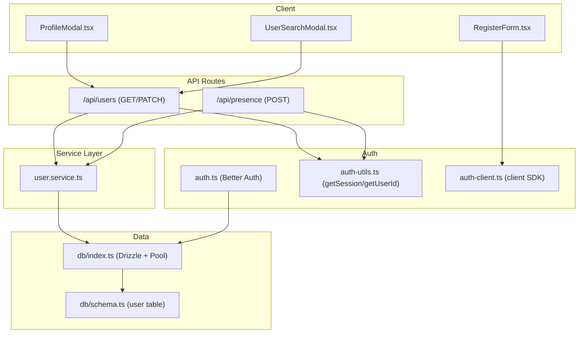
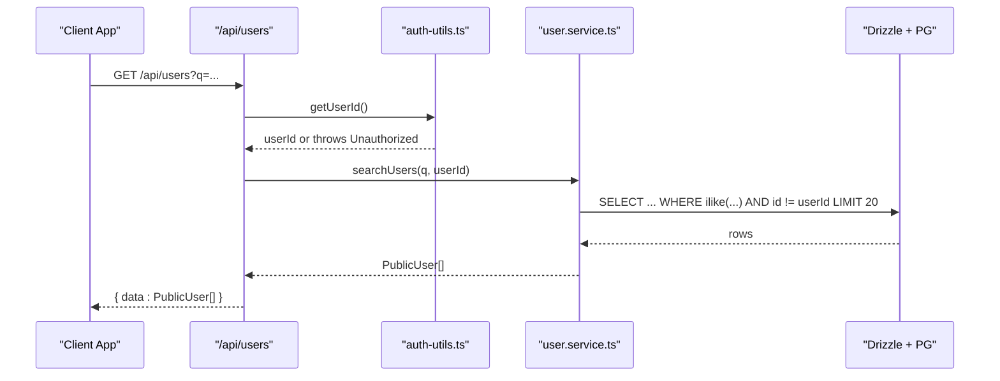
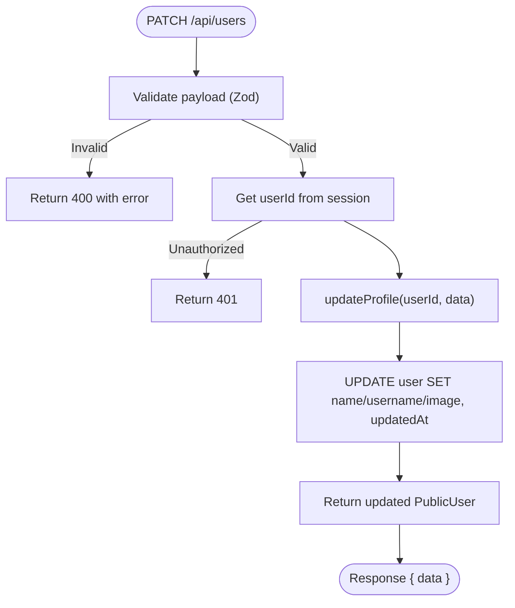
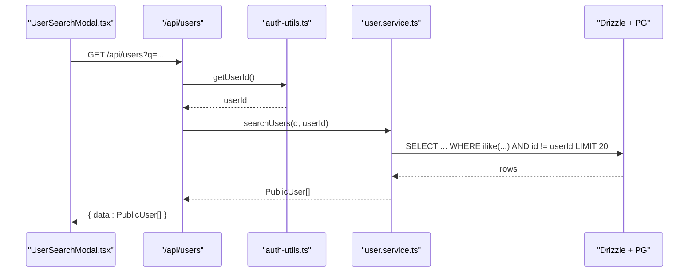
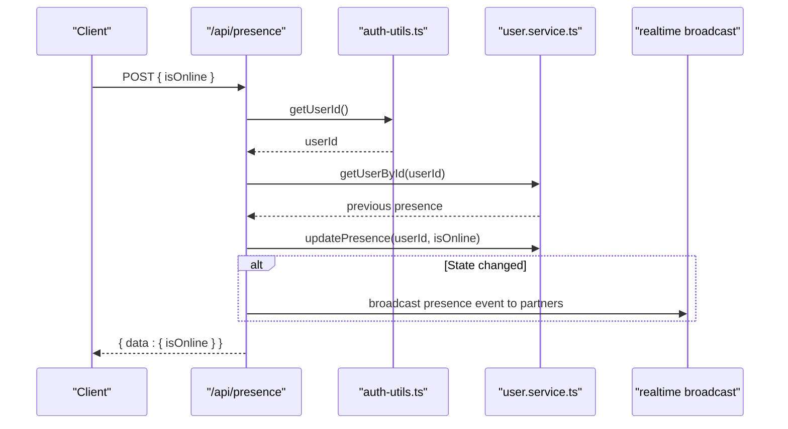
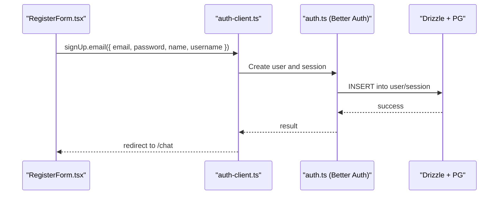
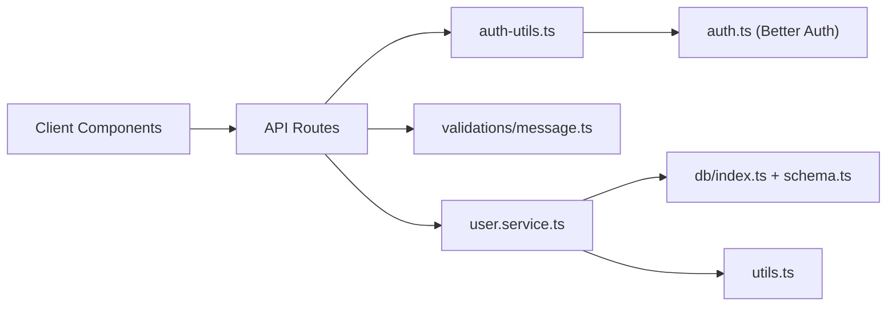

# User Service

<cite>
**Referenced Files in This Document**
- [route.ts](file://app/api/users/route.ts)
- [user.service.ts](file://lib/services/user.service.ts)
- [auth.ts](file://lib/auth.ts)
- [auth-utils.ts](file://lib/auth-utils.ts)
- [auth-client.ts](file://lib/auth-client.ts)
- [schema.ts](file://lib/db/schema.ts)
- [index.ts](file://lib/db/index.ts)
- [message.ts](file://lib/validations/message.ts)
- [utils.ts](file://lib/utils.ts)
- [route.ts](file://app/api/presence/route.ts)
- [RegisterForm.tsx](file://components/auth/RegisterForm.tsx)
- [ProfileModal.tsx](file://components/chat/ProfileModal.tsx)
- [UserSearchModal.tsx](file://components/chat/UserSearchModal.tsx)
- [index.ts](file://types/index.ts)
</cite>

## Table of Contents
1. [Introduction](#introduction)
2. [Project Structure](#project-structure)
3. [Core Components](#core-components)
4. [Architecture Overview](#architecture-overview)
5. [Detailed Component Analysis](#detailed-component-analysis)
6. [Dependency Analysis](#dependency-analysis)
7. [Performance Considerations](#performance-considerations)
8. [Troubleshooting Guide](#troubleshooting-guide)
9. [Conclusion](#conclusion)

## Introduction
This document describes the User Service in SecureChat, focusing on user profile management, authentication integration with Better Auth, presence tracking, user search, and relationship handling for conversation participants. It explains how users register, update profiles (including avatar handling), search for other users, manage online status, and how access control is enforced to protect user data.

## Project Structure
The User Service spans API routes, a service layer, validation schemas, database schema, and client components:
- API routes expose endpoints for user search and profile updates, and presence heartbeat.
- The service layer encapsulates database operations for searching, retrieving, updating profiles, and presence.
- Validation schemas enforce input constraints for search queries and profile updates.
- Authentication is provided by Better Auth with session utilities for server-side identity resolution.
- Client components implement registration, profile editing, and user search UI flows.

**Diagram sources**
- [route.ts:1-62](file://app/api/users/route.ts#L1-L62)
- [route.ts:1-50](file://app/api/presence/route.ts#L1-L50)
- [user.service.ts:1-108](file://lib/services/user.service.ts#L1-L108)
- [auth.ts:1-65](file://lib/auth.ts#L1-L65)
- [auth-utils.ts:1-21](file://lib/auth-utils.ts#L1-L21)
- [auth-client.ts:1-8](file://lib/auth-client.ts#L1-L8)
- [schema.ts:1-33](file://lib/db/schema.ts#L1-L33)
- [index.ts:1-9](file://lib/db/index.ts#L1-L9)

**Section sources**
- [route.ts:1-62](file://app/api/users/route.ts#L1-L62)
- [route.ts:1-50](file://app/api/presence/route.ts#L1-L50)
- [user.service.ts:1-108](file://lib/services/user.service.ts#L1-L108)
- [auth.ts:1-65](file://lib/auth.ts#L1-L65)
- [auth-utils.ts:1-21](file://lib/auth-utils.ts#L1-L21)
- [auth-client.ts:1-8](file://lib/auth-client.ts#L1-L8)
- [schema.ts:1-33](file://lib/db/schema.ts#L1-L33)
- [index.ts:1-9](file://lib/db/index.ts#L1-L9)

## Core Components
- API routes:
  - GET /api/users: Validates search query, authenticates caller, returns matching public user profiles excluding the current user.
  - PATCH /api/users: Validates profile update payload, authenticates caller, updates name/username/image, returns updated public profile.
  - POST /api/presence: Heartbeat to set online/offline status, computes presence change, broadcasts to relevant channels.
- Service layer:
  - searchUsers: Case-insensitive search across username, email, name; excludes current user; limits results.
  - getUserById: Fetches public profile by ID.
  - updatePresence: Sets isOnline and lastSeen timestamps.
  - updateProfile: Updates name/username/image and returns public profile.
- Authentication:
  - Better Auth configured with email/password, additional username field, session settings, trusted origins, and Next.js cookie plugin.
  - Server helpers to get session and authenticated user id.
  - Client SDK exposing signIn, signUp, signOut, useSession.
- Data model:
  - user table includes identity fields, image, presence fields, and timestamps.
  - Shared PublicUser type used across layers to avoid leaking sensitive fields.
- Validation:
  - Search query and profile update payloads validated via Zod schemas.

**Section sources**
- [route.ts:1-62](file://app/api/users/route.ts#L1-L62)
- [route.ts:1-50](file://app/api/presence/route.ts#L1-L50)
- [user.service.ts:1-108](file://lib/services/user.service.ts#L1-L108)
- [auth.ts:1-65](file://lib/auth.ts#L1-L65)
- [auth-utils.ts:1-21](file://lib/auth-utils.ts#L1-L21)
- [auth-client.ts:1-8](file://lib/auth-client.ts#L1-L8)
- [schema.ts:1-33](file://lib/db/schema.ts#L1-L33)
- [message.ts:1-39](file://lib/validations/message.ts#L1-L39)
- [index.ts:1-118](file://types/index.ts#L1-L118)

## Architecture Overview
The User Service follows a layered architecture:
- Client components call API routes for user operations.
- API routes authenticate requests using Better Auth session utilities and delegate to the service layer.
- The service layer performs database operations using Drizzle ORM over a shared PostgreSQL pool.
- Presence changes are broadcast to relevant channels for real-time updates.

**Diagram sources**
- [route.ts:6-28](file://app/api/users/route.ts#L6-L28)
- [auth-utils.ts:16-20](file://lib/auth-utils.ts#L16-L20)
- [user.service.ts:24-47](file://lib/services/user.service.ts#L24-L47)
- [schema.ts:8-20](file://lib/db/schema.ts#L8-L20)

## Detailed Component Analysis

### Profile Management (Update Name, Username, Avatar)
- Input validation:
  - Update profile payload validated for name length and username format/constraints.
- Authentication:
  - Only the authenticated user can update their own profile; userId derived from session.
- Database update:
  - Updates name, username, image, and updatedAt timestamp; returns public profile.
- Client flow:
  - Profile modal collects name and username, sends PATCH request, handles success/error states, and refreshes UI.

**Diagram sources**
- [route.ts:34-61](file://app/api/users/route.ts#L34-L61)
- [message.ts:22-34](file://lib/validations/message.ts#L22-L34)
- [user.service.ts:88-107](file://lib/services/user.service.ts#L88-L107)

**Section sources**
- [route.ts:34-61](file://app/api/users/route.ts#L34-L61)
- [message.ts:22-34](file://lib/validations/message.ts#L22-L34)
- [user.service.ts:88-107](file://lib/services/user.service.ts#L88-L107)
- [ProfileModal.tsx:36-61](file://components/chat/ProfileModal.tsx#L36-L61)

### User Search
- Query validation enforces minimum length and maximum length for search term.
- Search matches username, email, and name case-insensitively, excludes current user, and caps results.
- Online status shown via presence TTL logic.

**Diagram sources**
- [UserSearchModal.tsx:47-65](file://components/chat/UserSearchModal.tsx#L47-L65)
- [route.ts:6-28](file://app/api/users/route.ts#L6-L28)
- [user.service.ts:24-47](file://lib/services/user.service.ts#L24-L47)

**Section sources**
- [route.ts:6-28](file://app/api/users/route.ts#L6-L28)
- [message.ts:18-20](file://lib/validations/message.ts#L18-L20)
- [user.service.ts:24-47](file://lib/services/user.service.ts#L24-L47)
- [UserSearchModal.tsx:47-65](file://components/chat/UserSearchModal.tsx#L47-L65)

### Presence Tracking Integration
- Heartbeat endpoint sets isOnline and lastSeen; computes previous online state using presence TTL.
- If online state changed, broadcasts presence event to partner channels.
- Clients rely on this to show accurate online indicators.

**Diagram sources**
- [route.ts:14-50](file://app/api/presence/route.ts#L14-L50)
- [user.service.ts:74-83](file://lib/services/user.service.ts#L74-L83)
- [utils.ts:45-56](file://lib/utils.ts#L45-L56)

**Section sources**
- [route.ts:14-50](file://app/api/presence/route.ts#L14-L50)
- [user.service.ts:74-83](file://lib/services/user.service.ts#L74-L83)
- [utils.ts:45-56](file://lib/utils.ts#L45-L56)

### User Registration Workflow (Better Auth)
- Client form validates inputs and calls Better Auth client to create an account with email, password, display name, and username.
- On success, redirects to chat area; errors are surfaced to the user.

**Diagram sources**
- [RegisterForm.tsx:29-75](file://components/auth/RegisterForm.tsx#L29-L75)
- [auth-client.ts:1-8](file://lib/auth-client.ts#L1-L8)
- [auth.ts:1-65](file://lib/auth.ts#L1-L65)
- [schema.ts:8-20](file://lib/db/schema.ts#L8-L20)

**Section sources**
- [RegisterForm.tsx:29-75](file://components/auth/RegisterForm.tsx#L29-L75)
- [auth-client.ts:1-8](file://lib/auth-client.ts#L1-L8)
- [auth.ts:1-65](file://lib/auth.ts#L1-L65)
- [schema.ts:8-20](file://lib/db/schema.ts#L8-L20)

### User Relationship Management (Conversation Participants)
- While conversation creation is handled elsewhere, the presence flow uses partner IDs to determine who should receive presence events.
- The service layer’s presence update integrates with conversation relationships to scope real-time broadcasts appropriately.

**Section sources**
- [route.ts:29-39](file://app/api/presence/route.ts#L29-L39)

## Dependency Analysis
- API routes depend on:
  - auth-utils for session and user identity.
  - validations for input sanitization.
  - user.service for business logic and persistence.
- user.service depends on:
  - Drizzle ORM and database schema.
  - utils for presence TTL calculations.
- Better Auth configuration centralizes session behavior and trusted origins.
- Client components depend on auth-client SDK and API routes.

**Diagram sources**
- [route.ts:1-62](file://app/api/users/route.ts#L1-L62)
- [user.service.ts:1-108](file://lib/services/user.service.ts#L1-L108)
- [auth-utils.ts:1-21](file://lib/auth-utils.ts#L1-L21)
- [message.ts:1-39](file://lib/validations/message.ts#L1-L39)
- [auth.ts:1-65](file://lib/auth.ts#L1-L65)
- [schema.ts:1-33](file://lib/db/schema.ts#L1-L33)
- [index.ts:1-9](file://lib/db/index.ts#L1-L9)
- [utils.ts:45-56](file://lib/utils.ts#L45-L56)

**Section sources**
- [route.ts:1-62](file://app/api/users/route.ts#L1-L62)
- [user.service.ts:1-108](file://lib/services/user.service.ts#L1-L108)
- [auth-utils.ts:1-21](file://lib/auth-utils.ts#L1-L21)
- [message.ts:1-39](file://lib/validations/message.ts#L1-L39)
- [auth.ts:1-65](file://lib/auth.ts#L1-L65)
- [schema.ts:1-33](file://lib/db/schema.ts#L1-L33)
- [index.ts:1-9](file://lib/db/index.ts#L1-L9)
- [utils.ts:45-56](file://lib/utils.ts#L45-L56)

## Performance Considerations
- Search queries limit results to reduce payload size and database load.
- Presence TTL avoids unnecessary online toggles and reduces broadcast frequency.
- Shared database pool minimizes connection overhead.
- Debounced client-side search reduces API calls during typing.

[No sources needed since this section provides general guidance]

## Troubleshooting Guide
- Unauthorized errors:
  - Occur when session is missing or invalid; ensure cookies are present and trusted origins are configured correctly.
- Validation errors:
  - Check Zod schema constraints for search queries and profile updates; ensure username meets format requirements.
- Presence not updating:
  - Verify heartbeat calls are made at appropriate intervals and that partner channels are correctly resolved.
- Profile update failures:
  - Confirm the user exists and has permission to update; inspect server logs for database errors.

**Section sources**
- [route.ts:21-27](file://app/api/users/route.ts#L21-L27)
- [route.ts:54-60](file://app/api/users/route.ts#L54-L60)
- [route.ts:43-49](file://app/api/presence/route.ts#L43-L49)
- [message.ts:18-34](file://lib/validations/message.ts#L18-L34)

## Conclusion
The User Service provides secure, validated, and efficient user profile management, integrated with Better Auth for authentication and sessions. It supports robust user search, presence tracking, and safe broadcasting to conversation participants. Access control is enforced via session-based identity checks, and data exposure is limited to public fields. The layered design ensures maintainability and clear separation of concerns across client, API, service, and data layers.