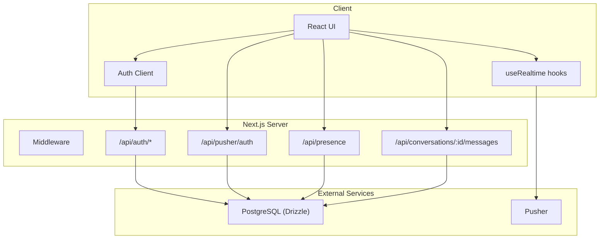
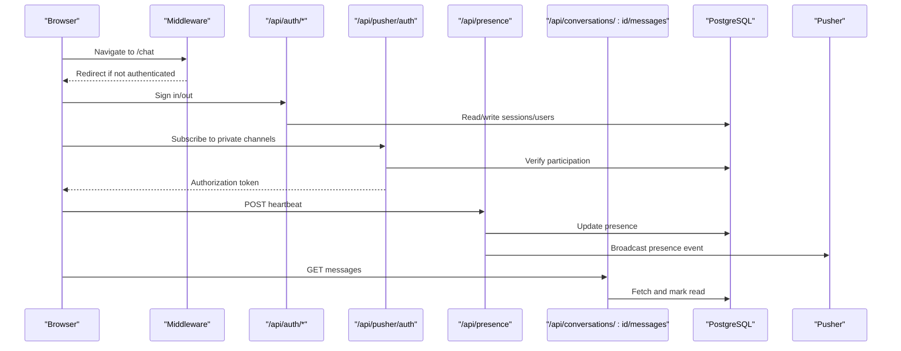
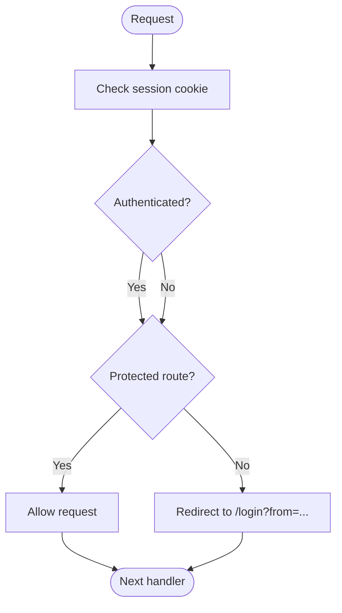
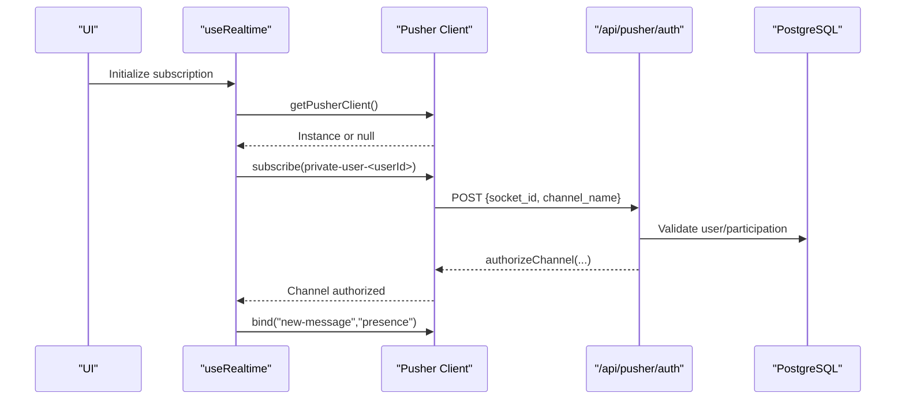
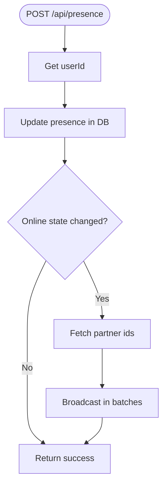
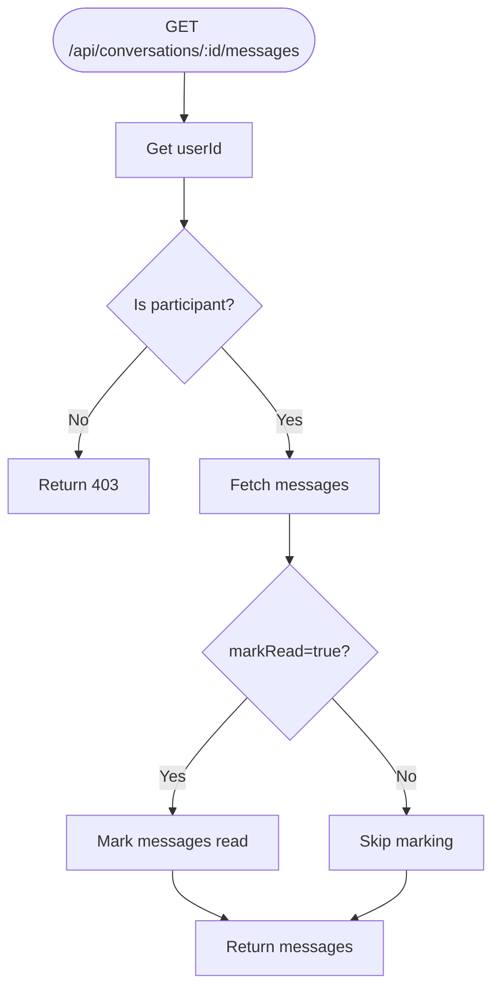
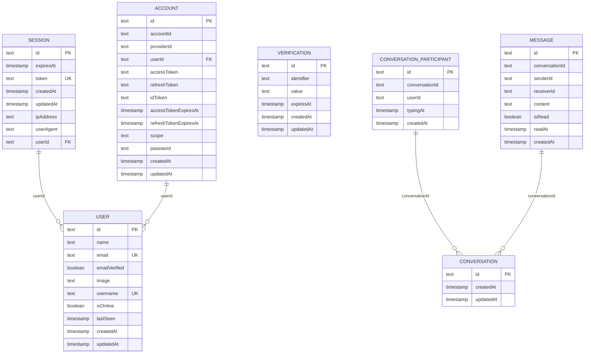
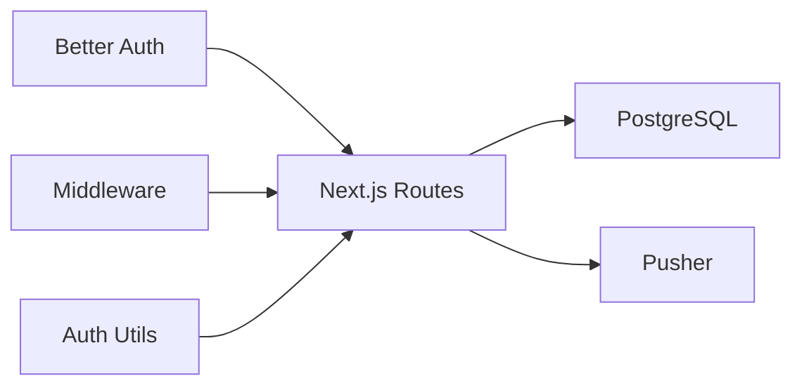

# Troubleshooting & Debugging

<cite>
**Referenced Files in This Document**
- [route.ts](file://app/api/auth/[...all]/route.ts)
- [auth.ts](file://lib/auth.ts)
- [auth-client.ts](file://lib/auth-client.ts)
- [middleware.ts](file://middleware.ts)
- [auth-utils.ts](file://lib/auth-utils.ts)
- [client.ts](file://lib/realtime/client.ts)
- [channels.ts](file://lib/realtime/channels.ts)
- [useRealtime.ts](file://hooks/useRealtime.ts)
- [route.ts](file://app/api/pusher/auth/route.ts)
- [route.ts](file://app/api/presence/route.ts)
- [route.ts](file://app/api/conversations/[id]/messages/route.ts)
- [schema.ts](file://lib/db/schema.ts)
- [drizzle.config.ts](file://drizzle.config.ts)
- [utils.ts](file://lib/utils.ts)
- [ChatDashboard.tsx](file://components/chat/ChatDashboard.tsx)
</cite>

## Table of Contents
1. [Introduction](#introduction)
2. [Project Structure](#project-structure)
3. [Core Components](#core-components)
4. [Architecture Overview](#architecture-overview)
5. [Detailed Component Analysis](#detailed-component-analysis)
6. [Dependency Analysis](#dependency-analysis)
7. [Performance Considerations](#performance-considerations)
8. [Troubleshooting Guide](#troubleshooting-guide)
9. [Conclusion](#conclusion)
10. [Appendices](#appendices)

## Introduction
This document provides a comprehensive troubleshooting and debugging guide for SecureChat. It focuses on common issues encountered during development and production operations, including authentication problems, real-time connection issues, database queries, and API errors. It also covers diagnostic techniques for performance bottlenecks, memory leaks, network issues, logging strategies, error tracking, monitoring approaches, deployment configuration, third-party service integration failures, WebSocket debugging, database migrations, and browser/server-side debugging practices.

## Project Structure
SecureChat is a Next.js application with:
- Authentication via Better Auth (server routes and client SDK)
- Real-time messaging using Pusher (private channels for user and conversation scopes)
- Database schema managed by Drizzle ORM with PostgreSQL
- Middleware protecting routes based on session cookies
- API endpoints for presence, messages, conversations, and Pusher authorization

**Diagram sources**
- [middleware.ts:1-42](file://middleware.ts#L1-L42)
- [route.ts:1-5](file://app/api/auth/[...all]/route.ts#L1-L5)
- [route.ts:1-63](file://app/api/pusher/auth/route.ts#L1-L63)
- [route.ts:1-51](file://app/api/presence/route.ts#L1-L51)
- [route.ts:1-43](file://app/api/conversations/[id]/messages/route.ts#L1-L43)
- [client.ts:1-30](file://lib/realtime/client.ts#L1-L30)
- [useRealtime.ts:1-120](file://hooks/useRealtime.ts#L1-L120)
- [schema.ts:1-101](file://lib/db/schema.ts#L1-L101)

**Section sources**
- [middleware.ts:1-42](file://middleware.ts#L1-L42)
- [route.ts:1-5](file://app/api/auth/[...all]/route.ts#L1-L5)
- [client.ts:1-30](file://lib/realtime/client.ts#L1-L30)
- [schema.ts:1-101](file://lib/db/schema.ts#L1-L101)

## Core Components
- Authentication:
  - Server: Better Auth configured with database pool, base URL resolution, email/password flow, trusted origins, session settings, and Next.js cookie plugin.
  - Client: Auth client exposing signIn, signUp, signOut, and useSession.
  - Middleware: Protects /chat and redirects authenticated users away from login/register.
  - Utilities: getSession and getUserId to enforce per-request authorization.

- Real-time:
  - Client: Pusher singleton creation with channel authorization endpoint; feature flag via environment variables.
  - Channels: Shared helpers for private channel naming and parsing.
  - Hooks: Subscriptions for user and conversation channels, handling new-message, message-read, typing, stop-typing, and presence events.

- Presence:
  - Heartbeat endpoint updates online status and broadcasts presence changes to relevant user channels.

- Messages:
  - Endpoint fetches message history and marks messages as read when appropriate.

- Database:
  - Schema defines user, session, account, verification, conversation, conversation_participant, and message tables.
  - Drizzle config uses an unpooled URL for migrations to avoid DDL blocking.

**Section sources**
- [auth.ts:1-65](file://lib/auth.ts#L1-L65)
- [auth-client.ts:1-8](file://lib/auth-client.ts#L1-L8)
- [middleware.ts:1-42](file://middleware.ts#L1-L42)
- [auth-utils.ts:1-21](file://lib/auth-utils.ts#L1-L21)
- [client.ts:1-30](file://lib/realtime/client.ts#L1-L30)
- [channels.ts:1-26](file://lib/realtime/channels.ts#L1-L26)
- [useRealtime.ts:1-120](file://hooks/useRealtime.ts#L1-L120)
- [route.ts:1-51](file://app/api/presence/route.ts#L1-L51)
- [route.ts:1-43](file://app/api/conversations/[id]/messages/route.ts#L1-L43)
- [schema.ts:1-101](file://lib/db/schema.ts#L1-L101)
- [drizzle.config.ts:1-19](file://drizzle.config.ts#L1-L19)

## Architecture Overview
The system integrates authentication, real-time messaging, and database operations through well-defined boundaries:
- Browser initiates auth flows via the client SDK and server routes.
- Middleware enforces route protection using session cookies.
- Real-time features rely on Pusher private channels authorized by a dedicated endpoint that validates user identity and permissions.
- Presence heartbeats update user state and broadcast changes to peers.
- Message retrieval and marking as read are handled by scoped API endpoints.

**Diagram sources**
- [middleware.ts:1-42](file://middleware.ts#L1-L42)
- [route.ts:1-5](file://app/api/auth/[...all]/route.ts#L1-L5)
- [route.ts:1-63](file://app/api/pusher/auth/route.ts#L1-L63)
- [route.ts:1-51](file://app/api/presence/route.ts#L1-L51)
- [route.ts:1-43](file://app/api/conversations/[id]/messages/route.ts#L1-L43)
- [schema.ts:1-101](file://lib/db/schema.ts#L1-L101)

## Detailed Component Analysis

### Authentication Flow
- Server-side configuration sets up Better Auth with database integration, base URL resolution, email/password support, trusted origins, session lifecycle, and Next.js cookie handling.
- Client-side auth client exposes methods for sign-in, sign-up, sign-out, and session management.
- Middleware protects routes by checking session cookies and redirecting accordingly.
- Utility functions retrieve session and user id for server-side authorization checks.

**Diagram sources**
- [middleware.ts:1-42](file://middleware.ts#L1-L42)
- [auth-utils.ts:1-21](file://lib/auth-utils.ts#L1-L21)

**Section sources**
- [auth.ts:1-65](file://lib/auth.ts#L1-L65)
- [auth-client.ts:1-8](file://lib/auth-client.ts#L1-L8)
- [middleware.ts:1-42](file://middleware.ts#L1-L42)
- [auth-utils.ts:1-21](file://lib/auth-utils.ts#L1-L21)

### Real-time Connection and Channel Authorization
- The client creates a Pusher instance only when public keys are configured; otherwise, it returns null to allow polling fallback.
- Private channel subscriptions require authorization via /api/pusher/auth, which validates user identity and channel membership.
- Channel names follow consistent patterns for user and conversation scopes, enabling safe parsing and validation.

**Diagram sources**
- [client.ts:1-30](file://lib/realtime/client.ts#L1-L30)
- [channels.ts:1-26](file://lib/realtime/channels.ts#L1-L26)
- [useRealtime.ts:1-120](file://hooks/useRealtime.ts#L1-L120)
- [route.ts:1-63](file://app/api/pusher/auth/route.ts#L1-L63)

**Section sources**
- [client.ts:1-30](file://lib/realtime/client.ts#L1-L30)
- [channels.ts:1-26](file://lib/realtime/channels.ts#L1-L26)
- [useRealtime.ts:1-120](file://hooks/useRealtime.ts#L1-L120)
- [route.ts:1-63](file://app/api/pusher/auth/route.ts#L1-L63)

### Presence Heartbeat and Broadcasting
- The presence endpoint updates user online status and broadcasts presence changes to partner user channels in batches.
- It handles unauthorized requests explicitly and logs unexpected errors.

**Diagram sources**
- [route.ts:1-51](file://app/api/presence/route.ts#L1-L51)

**Section sources**
- [route.ts:1-51](file://app/api/presence/route.ts#L1-L51)

### Message Retrieval and Read Marking
- The messages endpoint retrieves conversation history and marks messages as read unless explicitly disabled via query parameter.
- It enforces participant-only access and handles unauthorized errors.

**Diagram sources**
- [route.ts:1-43](file://app/api/conversations/[id]/messages/route.ts#L1-L43)

**Section sources**
- [route.ts:1-43](file://app/api/conversations/[id]/messages/route.ts#L1-L43)

### Database Schema and Migrations
- Schema includes user, session, account, verification, conversation, conversation_participant, and message tables.
- Drizzle configuration specifies schema location, output directory, dialect, and credentials using an unpooled URL for migrations.

**Diagram sources**
- [schema.ts:1-101](file://lib/db/schema.ts#L1-L101)

**Section sources**
- [schema.ts:1-101](file://lib/db/schema.ts#L1-L101)
- [drizzle.config.ts:1-19](file://drizzle.config.ts#L1-L19)

## Dependency Analysis
Key dependencies and their roles:
- Better Auth: Provides authentication APIs, session management, and cookie handling.
- Pusher: Enables real-time private channels with server-side authorization.
- Drizzle ORM: Manages database schema and queries against PostgreSQL.
- Next.js Middleware: Enforces route protection based on session cookies.

**Diagram sources**
- [auth.ts:1-65](file://lib/auth.ts#L1-L65)
- [auth-utils.ts:1-21](file://lib/auth-utils.ts#L1-L21)
- [middleware.ts:1-42](file://middleware.ts#L1-L42)
- [client.ts:1-30](file://lib/realtime/client.ts#L1-L30)
- [schema.ts:1-101](file://lib/db/schema.ts#L1-L101)

**Section sources**
- [auth.ts:1-65](file://lib/auth.ts#L1-L65)
- [auth-utils.ts:1-21](file://lib/auth-utils.ts#L1-L21)
- [middleware.ts:1-42](file://middleware.ts#L1-L42)
- [client.ts:1-30](file://lib/realtime/client.ts#L1-L30)
- [schema.ts:1-101](file://lib/db/schema.ts#L1-L101)

## Performance Considerations
- Real-time enablement: Ensure NEXT_PUBLIC_PUSHER_KEY and NEXT_PUBLIC_PUSHER_CLUSTER are set to activate Pusher; otherwise, the app falls back to polling intervals for refreshing data.
- Presence TTL: Online detection relies on a time window; ensure heartbeats are sent regularly while tabs are visible.
- Batching broadcasts: Presence updates are broadcast in batches to limit channel volume.
- Polling fallback: When realtime is disabled, periodic polling refreshes conversation lists; tune interval to balance freshness and load.

[No sources needed since this section provides general guidance]

## Troubleshooting Guide

### Authentication Issues
Symptoms:
- Users cannot access protected routes or are redirected unexpectedly.
- Session cookies not set or rejected due to cross-site restrictions.

Diagnostics:
- Verify middleware matcher excludes static assets and auth routes.
- Confirm Better Auth base URL resolves correctly across environments.
- Check trusted origins include development URLs when applicable.
- Ensure session cookie attributes are suitable for cross-site contexts in development.

Steps:
- Inspect Network tab for redirects and cookie headers.
- Validate environment variables for base URL and trusted origins.
- Use server-side session retrieval to confirm active sessions.

**Section sources**
- [middleware.ts:1-42](file://middleware.ts#L1-L42)
- [auth.ts:1-65](file://lib/auth.ts#L1-L65)
- [auth-utils.ts:1-21](file://lib/auth-utils.ts#L1-L21)

### Real-time Connection Issues
Symptoms:
- No real-time updates; messages arrive only after page refresh.
- Private channel authorization fails.

Diagnostics:
- Confirm NEXT_PUBLIC_PUSHER_KEY and NEXT_PUBLIC_PUSHER_CLUSTER are set.
- Check Pusher client initialization and channel authorization endpoint responses.
- Validate channel names match expected patterns.

Steps:
- Open browser console to inspect Pusher connection status and errors.
- Test /api/pusher/auth with sample socket_id and channel_name.
- Ensure user is authenticated before subscribing to private channels.

**Section sources**
- [client.ts:1-30](file://lib/realtime/client.ts#L1-L30)
- [channels.ts:1-26](file://lib/realtime/channels.ts#L1-L26)
- [useRealtime.ts:1-120](file://hooks/useRealtime.ts#L1-L120)
- [route.ts:1-63](file://app/api/pusher/auth/route.ts#L1-L63)

### Database Query Issues
Symptoms:
- Migrations fail or hang.
- Queries return unexpected results or throw errors.

Diagnostics:
- Use the unpooled DATABASE_URL for migrations to avoid pooled connection limitations.
- Validate schema definitions align with actual database state.
- Ensure all server actions and route handlers scope queries by current user id.

Steps:
- Run migrations with drizzle-kit using the provided configuration.
- Log query parameters and results in development.
- Verify foreign key relationships and unique constraints where applicable.

**Section sources**
- [drizzle.config.ts:1-19](file://drizzle.config.ts#L1-L19)
- [schema.ts:1-101](file://lib/db/schema.ts#L1-L101)
- [auth-utils.ts:1-21](file://lib/auth-utils.ts#L1-L21)

### API Errors
Symptoms:
- 401 Unauthorized or 403 Forbidden responses.
- 500 Internal server errors on presence or messages endpoints.

Diagnostics:
- Check error handling paths in endpoints for explicit Unauthorized and Forbidden cases.
- Inspect server logs for stack traces and context.

Steps:
- Validate session and user id before accessing protected resources.
- Ensure participant checks pass for conversation-scoped operations.
- Review batch broadcasting logic for presence updates.

**Section sources**
- [route.ts:1-51](file://app/api/presence/route.ts#L1-L51)
- [route.ts:1-43](file://app/api/conversations/[id]/messages/route.ts#L1-L43)
- [route.ts:1-63](file://app/api/pusher/auth/route.ts#L1-L63)

### WebSocket (Pusher) Debugging
Techniques:
- Use browser developer tools to monitor WebSocket connections and frames.
- Inspect channel authorization requests and responses.
- Bind to Pusher events locally to capture incoming messages and presence updates.

Common pitfalls:
- Missing or incorrect environment variables for Pusher.
- Attempting to subscribe to private channels without valid session.
- Incorrect channel names or parsing mismatches.

**Section sources**
- [client.ts:1-30](file://lib/realtime/client.ts#L1-L30)
- [channels.ts:1-26](file://lib/realtime/channels.ts#L1-L26)
- [useRealtime.ts:1-120](file://hooks/useRealtime.ts#L1-L120)

### Database Migration Debugging
Techniques:
- Ensure .env.local is loaded for drizzle-kit outside Next.js runtime.
- Use the unpooled URL to run DDL statements safely.
- Compare schema files with database state to detect drift.

Common pitfalls:
- Using pooled connections for migrations causing DDL blocks.
- Environment variables not available in migration tooling.

**Section sources**
- [drizzle.config.ts:1-19](file://drizzle.config.ts#L1-L19)

### Authentication Flow Debugging
Techniques:
- Verify session cookie presence and attributes.
- Check middleware redirection logic and protected routes.
- Use server-side session retrieval to validate active sessions.

Common pitfalls:
- Cross-site cookie restrictions in development environments.
- Misconfigured base URL or trusted origins.

**Section sources**
- [middleware.ts:1-42](file://middleware.ts#L1-L42)
- [auth.ts:1-65](file://lib/auth.ts#L1-L65)
- [auth-utils.ts:1-21](file://lib/auth-utils.ts#L1-L21)

### Presence and Heartbeat Debugging
Techniques:
- Monitor visibilitychange events and heartbeat intervals.
- Inspect presence endpoint responses and broadcast events.
- Validate online detection using TTL thresholds.

Common pitfalls:
- Heartbeat failures ignored silently; check network errors.
- Stale presence due to missed heartbeats beyond TTL.

**Section sources**
- [route.ts:1-51](file://app/api/presence/route.ts#L1-L51)
- [utils.ts:1-46](file://lib/utils.ts#L1-L46)
- [ChatDashboard.tsx:135-280](file://components/chat/ChatDashboard.tsx#L135-L280)

### Message Handling Debugging
Techniques:
- Inspect message retrieval and mark-as-read behavior.
- Validate participant checks and response payloads.
- Observe real-time updates versus polling fallback.

Common pitfalls:
- Marking messages read too frequently when polling.
- Forgetting to handle unread states in UI.

**Section sources**
- [route.ts:1-43](file://app/api/conversations/[id]/messages/route.ts#L1-L43)
- [useRealtime.ts:1-120](file://hooks/useRealtime.ts#L1-L120)

### Logging Strategies
Recommendations:
- Centralize error logging in API endpoints with contextual information.
- Capture request identifiers and user ids for traceability.
- Differentiate between expected errors (e.g., Unauthorized) and unexpected exceptions.

Implementation notes:
- Use structured logs with timestamps and severity levels.
- Avoid logging sensitive data such as tokens or passwords.

[No sources needed since this section provides general guidance]

### Error Tracking and Monitoring
Recommendations:
- Integrate error tracking services to capture unhandled exceptions.
- Monitor API latency and error rates.
- Track Pusher connection health and authorization failures.

Implementation notes:
- Add metrics for presence heartbeats and message throughput.
- Alert on spikes in 5xx errors or authorization failures.

[No sources needed since this section provides general guidance]

### Deployment and Environment Configuration
Checklist:
- Set NEXT_PUBLIC_PUSHER_KEY and NEXT_PUBLIC_PUSHER_CLUSTER for real-time features.
- Configure BETTER_AUTH_URL appropriately for each environment.
- Ensure trusted origins include production domains.
- Provide DATABASE_URL_UNPOOLED for migrations.

Common issues:
- Base URL misconfiguration causing session cookie domain mismatches.
- Missing environment variables leading to disabled real-time features.

**Section sources**
- [auth.ts:1-65](file://lib/auth.ts#L1-L65)
- [client.ts:1-30](file://lib/realtime/client.ts#L1-L30)
- [drizzle.config.ts:1-19](file://drizzle.config.ts#L1-L19)

### Third-party Service Integration Failures
Pusher:
- Validate channel authorization endpoint availability and correctness.
- Inspect Pusher dashboard for channel activity and errors.
- Confirm client-side environment variables match server expectations.

Database:
- Verify connectivity and credentials.
- Ensure migrations have been applied successfully.
- Monitor query performance and connection pooling behavior.

**Section sources**
- [route.ts:1-63](file://app/api/pusher/auth/route.ts#L1-L63)
- [drizzle.config.ts:1-19](file://drizzle.config.ts#L1-L19)

### Browser Developer Tools Usage
Tips:
- Use Network tab to inspect XHR/fetch calls and WebSocket frames.
- Check Application tab for cookies and storage.
- Use Console to log client-side events and errors.

Focus areas:
- Pusher connection establishment and authorization.
- Presence heartbeat intervals and visibility changes.
- Message send/receive flows and read receipts.

[No sources needed since this section provides general guidance]

### Server-side Debugging
Tips:
- Enable verbose logging in development.
- Reproduce issues with minimal requests and payloads.
- Validate middleware behavior and route matching.

Focus areas:
- Session cookie handling and redirection logic.
- Authorization checks in Pusher auth and presence endpoints.
- Database query scoping and error propagation.

**Section sources**
- [middleware.ts:1-42](file://middleware.ts#L1-L42)
- [route.ts:1-63](file://app/api/pusher/auth/route.ts#L1-L63)
- [route.ts:1-51](file://app/api/presence/route.ts#L1-L51)

### Production Issue Diagnosis
Approach:
- Correlate user-reported issues with error logs and metrics.
- Identify patterns in authorization failures and real-time disconnections.
- Validate environment configurations and third-party service status.

Actions:
- Roll back recent changes if regressions are detected.
- Scale horizontally if performance bottlenecks are identified.
- Implement circuit breakers or fallbacks for critical integrations.

[No sources needed since this section provides general guidance]

## Conclusion
This guide consolidates debugging strategies and troubleshooting steps for SecureChat’s authentication, real-time messaging, database operations, and API endpoints. By leveraging browser developer tools, server-side logging, and structured diagnostics, teams can efficiently identify and resolve issues related to environment configuration, third-party integrations, and performance bottlenecks. Adopting robust logging, error tracking, and monitoring practices will improve reliability and maintainability in both development and production environments.

## Appendices

### Quick Reference: Key Endpoints and Behaviors
- /api/auth/*: Better Auth endpoints for sign-in, sign-up, and session management.
- /api/pusher/auth: Authorizes private Pusher channels based on user identity and participation.
- /api/presence: Updates user presence and broadcasts changes to relevant channels.
- /api/conversations/:id/messages: Retrieves messages and optionally marks them as read.

**Section sources**
- [route.ts:1-5](file://app/api/auth/[...all]/route.ts#L1-L5)
- [route.ts:1-63](file://app/api/pusher/auth/route.ts#L1-L63)
- [route.ts:1-51](file://app/api/presence/route.ts#L1-L51)
- [route.ts:1-43](file://app/api/conversations/[id]/messages/route.ts#L1-L43)